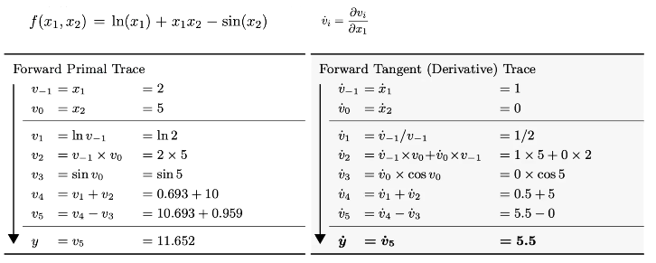
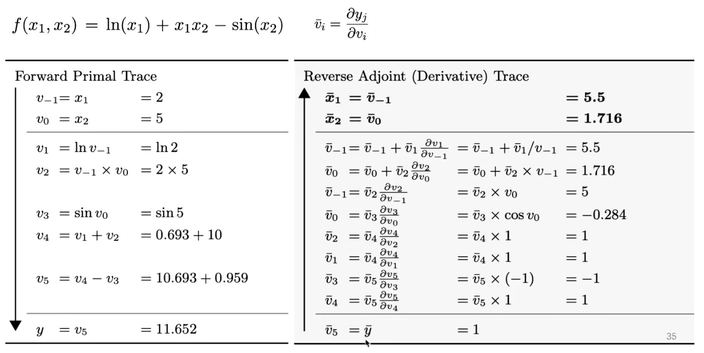
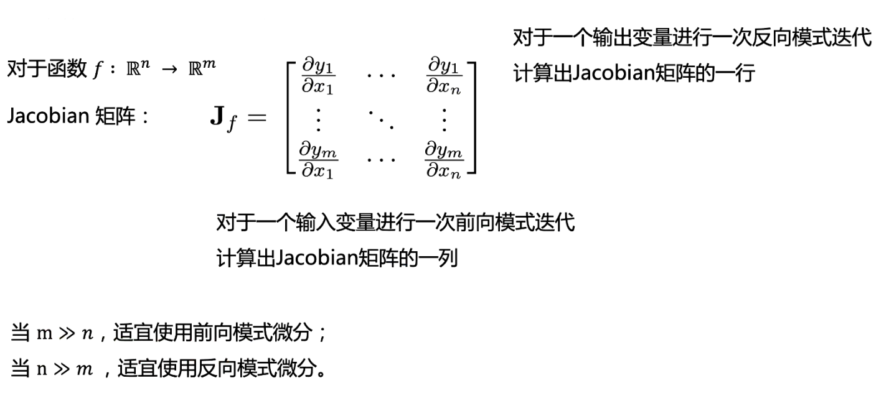
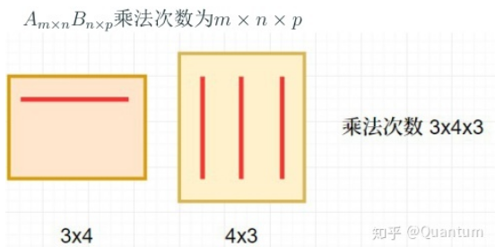
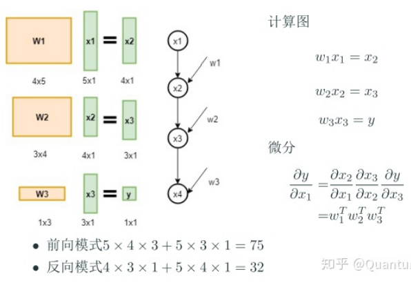

# 再谈自动微分：自动微分中的前向模式与反向模式

## 什么是自动微分

自动微分(Automatic Differentiation)是什么？微分是函数在某一处的导数值，自动微分就是使用计算机程序自动求解函数在某一处的导数值。

## 计算微分的四种方式

常见的求解微分的方式，可分为以下四种：

* 手动求解法(Manual Differentiation)

所谓手动求解法就是手动算出求导公式，然后将公式编写成计算机代码完成计算。比如对于函数  $f(x) = x^2$  求微分，首先根据求导公式表找出其导数函数

$$
f'(x) = 2x
$$

* 数值微分法(Numerical Differentiation)

数值微分法直接根据微分的极限定义形式：

$$
f'(x)=\frac{df}{dx}=\lim_{\\Delta x \to 0}\frac{f(x+ \\Delta x) - f(x)}{\\Delta x}
$$

当然极限的定义里Δx是趋于0的，我们实际数值计算的时候可以找一个很小的数h：

$$
f'(x)=D_+(h)=\frac{f(x+h) - f(x)}{h}
$$

* 符号微分法(Symbolic Differentiation)

符号微分就是我们在大学微积分里学的方法，通过符号（包括分部积分法这种trick）计算直接求出微分的“解析”形式。然后再带入自变量的值去求解导数。

* 自动微分法(Automatic Differentiation)

## 前向模式

这里以图片中的 $f(x_1,x_2)$ 为例

图中求导过程的每一步都是在求 $v_{i}$  对  $v_{-1}$ 的导数，这种方式可以很方便的求得多个输出对单个输入的导数，准则是链式法则。

## 反向模式

这里以图片中的 $f(x_1,x_2)$ 为例

图中求导过程的每一步都是在求 $y$  对  $v_{i}$ 的导数，即单个输出对所有输入的导数，准则也是链式法则。
反向微分的好处是一次可以算出所有输入参数的偏导数。
对于神经网络来说，损失函数的输出值为标量，但是参数矩阵非常多，针对这种情况一般采用反向微分计算较为合适。

## 复杂度分析

如上图所述，针对从n维到m维的映射，采用前向模式微分或反向模式微分要看n和m的大小而定。比如下面的例子

这里y对x1的导数是一个与x1相同形状的向量，前向模式计算微分矩阵乘法从左至右，反向模式计算微分矩阵乘法从右至左，算法复杂度一目了然。

## 总结

任何一个知识点都值得深挖，这里还涉及计算图的并行计算相关内容，比如如何并行的对节点的梯度进行计算，由于这不是本人的专业在此就不在深入研究。
引用马哲中的一个理论：对一个事物的认识往往需要从实践到认识、再由认识到实践的多次反复，才能完成。

## 参考链接

* https://zhuanlan.zhihu.com/p/161635270
* https://zhuanlan.zhihu.com/p/61103504
* https://www.bilibili.com/video/BV1ZA411H7BU
* http://fancyerii.github.io/books/autodiff/
* https://arxiv.org/pdf/1502.05767.pdf

