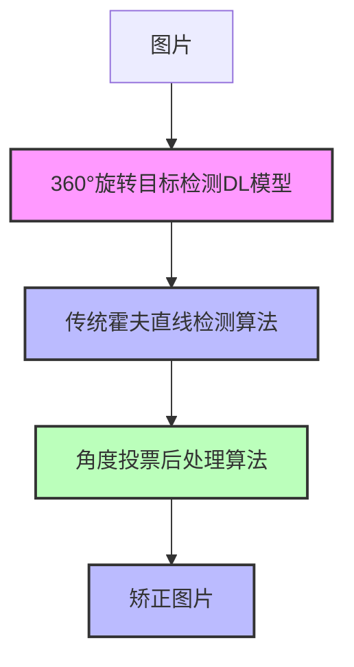
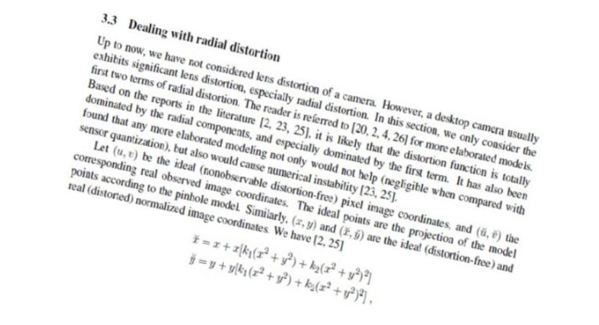
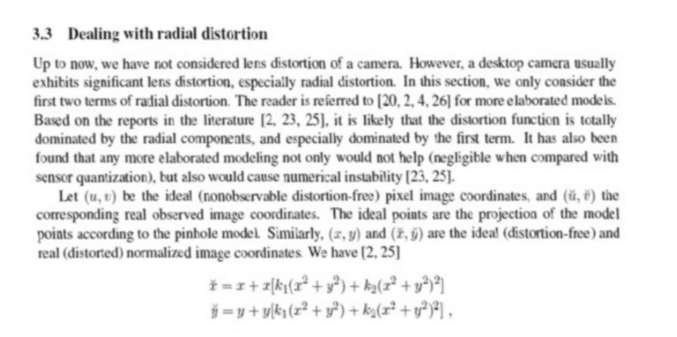
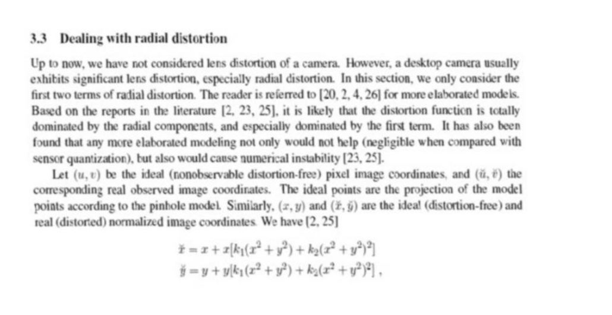

# 360°旋转文字区域检测实战1：全景架构设计与落地思路

> 本文写于 2025年3月31日晚11点和2025年4月6日下午3点

## 一、需求介绍与任务特点分析

### 1.1 现实场景中的旋转文字检测广泛需求

现实场景中的旋转文字检测需求广泛存在于多个领域，其核心挑战在于解决自然场景中文字方向的多样性（如倾斜、倒置、扭曲等）。比如  

1. 监控视频中的倾斜路标、广告牌文字（如无人机航拍场景）  
2. 生产线中旋转工件表面的文字识别（如瓶身标签、金属罐序列号）  
3. 扫描文档中的畸变文字定位（如褶皱发票、弯曲合同）  
4. 手机拍摄的自然场景文字识别（如街景翻译、商品标签识别）  
5. 身份证、发票等证件的OCR识别（如阿里云“无接触”政务服务）  


这些需求需要全角度（0°-360°）旋转框表示，传统的水平检测和0-90°以及0-180°旋转框表示无法满足对于文字旋转方向的精确描述。

### 1.2 本文研究的任务特点

本文研究的任务是某审核平台下的含有文字的表单识别。
任务特点如下：  

1. **纸张旋转角度范围广**：0-360°旋转框表示，涵盖了文字的所有可能方向。
2. **文字表示简单**：文字方向可能倾斜、倒置、但是不会扭曲变形，需要精确识别。
3. **纸张背景单一**：针对包含表格线的文字区域检测场景，背景较为干净，基本为页脚或者印章干扰。

本文采用360°旋转框表示文字区域，目的是为了获取角度后更方便的进行仿射变换，将旋转的文字区域矫正为水平，方便后续的文字识别任务。

### 1.3 360°旋转检测任务的核心挑战

360°旋转检测任务的核心挑战可归纳为以下三点：

1. 方向建模的复杂性  
  周期性角度回归难题: 文字/目标可能以任意角度（0°-360°）存在，传统回归方法易陷入角度周期性歧义（如0°与360°的边界跳跃）。
2. 标注与数据增强的高成本
    - 标注复杂度激增：旋转框需标注4个坐标点+1个旋转角度（vs 水平框4点），标注效率下降30%，且需专业工具支持。
    - 数据增强局限性：随机旋转可能破坏文本语义，需结合几何约束增强策略。
3. 计算效率与硬件适配矛盾  
   旋转框的IoU计算复杂度是水平框的3倍以上，难以直接利用GPU并行加速，导致推理延迟增加37%


## 二、目前业界方案与局限性

### 2.1 常规旋转目标检测任务

​旋转目标检测（Rotated Object Detection）在计算机视觉领域中，主要关注如何检测和定位具有任意方向和姿态的物体。​相较于传统的水平边界框（Horizontal Bounding Box，HBB），带有旋转角度属性的矩形或四边形能够更准确地描述物体的空间位置和方向，特别适用于遥感影像、场景文本和其他需要精确定位的应用场景。


#### 2.1.1 常用的旋转框表示方法


1. 五参数表示法（5-parameter Representation）

    该方法使用五个参数来描述旋转矩形：​

    - (x, y)： 矩形中心点的横纵坐标。​
    - h： 矩形的高度。​
    - w： 矩形的宽度。​
    - θ： 旋转角度(定义方式有所差别)

    ---

    优点：

    - 简洁性： 仅需回归五个参数，计算量相对较小。​
    - 易于理解： 直观地表示了矩形的位置、尺寸和朝向。​

    ---

    缺点：

    角度周期性问题： 旋转角度θ具有周期性，可能导致在训练过程中出现角度回归的歧义性，影响模型的收敛性。​

    !!! note
        按照旋转角度的定义不同，还可以再分类，详情看下面两个链接  
        1. [关于旋转框定义的一些理解和感想](https://zhuanlan.zhihu.com/p/459018810)  
        2. [mmrotate旋转角度定义](https://github.com/open-mmlab/mmrotate/blob/main/docs/zh_cn/intro.md)

2. 四点坐标表示法（Four-Point Coordinate Representation）：  
    该方法直接使用旋转矩形四个顶点的坐标来表示边界框，共八个参数：​ (x₁, y₁), (x₂, y₂), (x₃, y₃), (x₄, y₄)： 矩形四个顶点的坐标，用以表示四边形边界框(Quadrilateral Bounding Box,QBB)。​
    
    ---
    - 优点：  
      高表达能力： 能够精确表示任意旋转角度和形状的矩形。​
    ---
    - 缺点：  
        - 计算复杂度高： 需要回归八个参数，增加了模型的计算负担。​
        - 后处理复杂： 在预测后需要进行额外的处理，如排序顶点，以确保正确的矩形表示。

3. 点集（Point Set）表示法：  
    基于点集的表示方法是通过一组独立的点（Point Set）来表示目标位置和形状的方式。在该方法中，每个点的坐标通常表示目标在空间中的某个具体位置。这种表示方式更细粒度地描述了目标的位置，尤其适用于目标不规则或复杂的情况。它能够提供较为精准的目标信息，特别是在需要精确描述目标形状的场景中。

    ---
    - 优点：
        - **高精度定位**：通过使用一组点集，可以精准地表示目标的几何形状和位置，相较于简单的矩形框（bounding box）能够提供更高的精度。
        - **适应复杂形状**：点集能够表示任意形状的目标，尤其适用于不规则的目标，避免了边界框带来的限制。
        - **细粒度信息**：相比边界框（bounding box），点集能提供更多的细节信息，有助于更复杂的目标分析。
    ---
    - 缺点：
        - **计算量大**：与边界框方法相比，点集需要处理更多的点，因此计算复杂度较高，尤其是在目标较复杂或点集较大的情况下。
        - **容易受到噪声干扰**：点集表示方法对于点的选择和精度要求较高，噪声或误差可能导致目标位置描述不准确。
        - **边界问题**：点集表示法难以描述目标的外部边界，因此在某些情况下可能无法有效捕捉目标的整体轮廓。


本文将纸张文字区域检测问题转化为一个360度旋转目标检测问题，采用五参数表示法，即(x, y, w, h, θ)，其中(x, y)表示矩形的中心点坐标，w和h表示矩形的宽度和高度，θ表示矩形的旋转角度。

文字区域在自然场景下常常呈现出任意方向排列，尺寸和长宽比也可能存在很大变化，而传统的水平矩形框检测方法只能捕捉近似水平的物体，因此难以准确定位这些文字区域。采用360度旋转矩形框检测算法可以有效解决这一问题，原因包括：

1. 适应任意方向    
    通过引入旋转角度参数（例如(x, y, w, h, θ)这种表示），旋转矩形框能够精确表示任意角度的文字区域，消除了由于文字倾斜而导致的边界不匹配问题，从而提高检测精度。  
    
    ---
    
    采用360度表示主要是为了确保文字检测能够覆盖所有可能的方向。在实际场景中，纸张摆放可能以任意角度出现，不仅仅局限于水平或近似水平的状态。如果我们只限定在180°或90°范围内，就可能在角度临界点处遇到不连续性问题，导致回归误差剧增，从而影响检测精度。使用360度的旋转矩形框表示，可以完整地描述文字区域在整个圆周内的任意朝向，从而提高模型的鲁棒性和准确率。


2. 后续识别处理更简便  
    检测出的旋转矩形框可以直接为后续文本识别模块提供更准确的区域输入，简化了文字区域的校正过程，并提升整个OCR系统的鲁棒性。

#### 2.1.2 基于深度学习的旋转目标检测算法面临的问题与挑战

目前旋转目标检测算法面临着多个方面的问题和挑战，主要包括：

1. 角度回归与边界不连续性问题  
    由于角度具有周期性（例如0°和360°在本质上是相同的），当预测值接近边界时，模型往往会出现损失值突然增大的情况，导致回归不稳定。这种“边界不连续”问题在处理长宽比较大或细长目标时尤为突出。
2. 特征提取的旋转不变性  
    传统的卷积神经网络在捕捉旋转不变特征方面存在局限。如何提取既对旋转敏感又对分类鲁棒的特征是当前研究的重要难题，很多方法尝试设计专门的旋转敏感或旋转不变模块，但依然存在精度与效率的权衡问题。​
3. 类方形问题  
    “类方形问题”指的是在旋转目标检测中，当目标的宽高比接近1，也就是目标形状近似正方形时，旋转角度信息会变得模糊和不确定。这是因为正方形在旋转任意角度时，其外观几乎没有明显变化，这就导致两个问题：
    - 角度标注歧义  
        对于类方形目标，即使旋转了不同角度，其形状变化很小，从而使得角度的标注和回归具有歧义性。模型可能会难以学习出稳定的角度特征，导致回归过程中出现较大波动或不一致性。

    - 损失计算不敏感  
        当目标接近正方形时，角度预测的微小偏差对IoU等评价指标的影响较小，从而使得角度损失的梯度较弱，训练过程中模型很难从角度信息中获得足够的优化信号。


#### 2.1.3 旋转目标检测深度学习算法代表性工作

基于深度学习的旋转目标检测技术近年来发展迅速，研究者们提出了多种创新方法，针对旋转目标检测中的挑战，主要有三个发展方向：旋转矩形框检测、周边形状框检测和点集检测。以下是根据这三个方向扩展的相关研究工作及其描述。

1. 旋转矩形框检测分支  
    这一分支的核心思想是利用旋转矩形框来表示目标，通常用五个参数（x, y, w, h, θ）来描述，其中(x, y)表示中心点，w和h表示宽度和高度，θ表示旋转角度。该分支的研究工作主要集中在提高角度回归精度以及优化旋转边界框的表达。  

    - RRPN（2017年）: 首次提出旋转区域提议网络（RRPN），通过旋转边界框来表示目标，使用旋转角度回归来改进区域提议。  
    论文链接：​https://arxiv.org/abs/1703.01086

    - ROI Transformer（2019年）: 该方法在传统的区域提议网络（RPN）基础上，提出了ROI Transformer模块，能够有效地处理目标的旋转和尺度变换，适用于旋转目标检测。  
    论文链接：​https://arxiv.org/abs/1812.00155

    - SCRDet（2019年）: 采用自适应的旋转角度预测机制，利用多尺度特征融合来应对旋转目标和场景文本检测中的复杂情况。  
    论文链接：​https://arxiv.org/abs/1811.07126

    - CSL（2020年）: 提出圆形光滑标签（CSL）技术，将角度预测问题转化为分类问题，从而解决了传统回归方法中角度周期性带来的问题，极大地提高了模型的稳定性。  
    论文链接：​https://arxiv.org/abs/2003.05597

    - GWD（2021年）: Gaussian Wasserstein Distance (GWD) 损失函数的提出进一步提高了旋转目标检测的精度，特别是在长宽比差异较大的目标检测中。  
    论文链接：​https://arxiv.org/abs/2103.06053

    - G-Rep（2022年）: 提出了基于高斯分布的旋转目标检测框架，通过旋转的高斯表示法，改进了旋转矩形框的表达，增强了对大长宽比目标的适应性。  
    论文链接：​https://arxiv.org/abs/2205.13617


2. 周边形状框检测分支  
    该分支的核心思想是使用多边形或更复杂的边界形状来表示目标，适用于形状不规则或者存在弯曲、透视变形的目标。

    - EAST（2017年）: 提出了Efficient and Accurate Scene Text Detection（EAST）方法，通过全卷积神经网络（FCN）直接回归任意方向的旋转矩形框，尤其在场景文本检测中表现出色。  
    论文链接：​https://arxiv.org/abs/1704.00388

    - Gliding Vertex（2019年）: 提出了基于四个顶点的边界框回归方法，能够对复杂形状的目标进行高效且准确的检测，特别是在遥感图像和多方向场景文本检测中表现突出。  
    论文链接：​https://arxiv.org/abs/1911.09358​

    - RSDet（2020年）: 提出了旋转四边形回归的方法，专注于提高大长宽比旋转目标检测的精度。该方法通过引入旋转边界框的高阶几何约束，有效解决了复杂场景中的旋转目标检测问题。  
    论文链接：​https://arxiv.org/abs/2003.02092

    - CFA（2021年）: 通过角点特征聚合（CFA）模块，进一步提升了旋转目标检测的精度。CFA模块能够更好地处理不同形状、大小的目标，尤其是具有较大形变的目标。  
    论文链接：​https://arxiv.org/abs/2103.07815


3. 点集检测分支  
    该分支通过检测关键点、角点或极值点来表示目标边界，适用于不规则形状、弯曲目标或复杂背景下的目标检测。

    - Mask TextSpotter（2018年）: 利用图像中的关键点信息，提出了一种结合语义分割的旋转文本检测方法，增强了对复杂形态和变形文本的检测能力。  
    论文链接：​https://arxiv.org/abs/1807.02242

    - TextField（2018年）: 通过学习深度方向场（Direction Field）来检测不规则场景文本，利用该方向场对文本边界进行有效分割，提高了模型对曲线文本的适应性。  
    论文链接：​https://arxiv.org/abs/1812.01393

    - PointNet（2020年）: 采用PointNet架构，通过提取点云中的关键点信息来表示旋转目标，并结合图形模型进行回归，从而提高了旋转目标的检测精度。  
    论文链接：​https://arxiv.org/abs/2012.08692

    - Oriented RepPoints（2021年）: 提出了将目标表示为若干关键点的形式，并通过回归关键点来描述旋转目标，提供了一种新的旋转目标表示和检测方法。  
    论文链接：https://arxiv.org/abs/2105.11111

### 2.2 常规OBB检测与360°旋转目标检测的关系

常规OBB与360°旋转目标检测的关系在于，两者都涉及目标的旋转角度预测。​常规OBB任务通常关注目标在一个有限角度范围内的旋转（如0°到180°），而360°旋转目标检测需要处理目标在整个360°范围内的旋转角度。因此，360°旋转目标检测在角度回归方法和模型设计上需要考虑全角度的处理，以准确预测目标的旋转方向。

## 三、本文整体方案介绍

本文整理方案流程图如下：  



---

文字解释步骤如下：  
1. 将图片输入360°旋转目标检测DL模型，得到文字区域的5个参数(x, y, w, h, θ)。  
    这里旋转目标检测模型采用mmroate库，由于文字区域一般较大，所以采用一个简单的backbone即可，loss采用iou loss或者GWD Loss。参考PR如下  
    <https://github.com/open-mmlab/mmrotate/discussions/689>  
    <https://github.com/open-mmlab/mmrotate/pull/731>  
2. 进过上述步骤之后，我们可以得到一个文字区域的旋转角度，取值位于[-180, +180]。首先采用该角度采用仿射变换得到粗粒度矫正后的图片。对于矫正后的图片采用传统霍夫直线检测算法，检测图片中的所有直线，参考算法见下文。    
3. 先验知识：经过步骤1矫正后的图片旋转角度属于[-45,45]之间的小角度。  
    首先对直线斜率求arctan，过滤掉绝对值大于45的角度，对检测到的直线进行角度中位数投票，得到文字区域的细粒度角度。  
4. 如果步骤3获取的角度满足某个条件，则采用步骤3的，否则旋转角度采用步骤1获取的。采用计算的旋转角度对于图片进行矫正，得到矫正后的图片。  

步骤2 霍夫直线检测参考代码：
```python
gray = cv2.cvtColor(img, cv2.COLOR_BGR2GRAY)
kernel = np.ones((5, 5), np.uint8)
# 开闭运算
errode_img = cv2.erode(gray, kernel, iterations=1)
dilate_img = cv2.dilate(errode_img, kernel, iterations=1)
# Canny边缘检测
edges = cv2.Canny(dilate_img, 100, 200)
lines = cv2.HoughLinesP(edges, 0.8, np.pi / 180, 90, minLineLength=100, maxLineGap=10)
```

!!! note
    为什么第一步不直接采用传统图像算法呢？   
    1. 传统图像算法一般尽可以判断180度以内的旋转  
    2. 传统图像算法针对背景变化较大的场景，效果不佳。


## 四、最终实现效果

原始图片



粗粒度矫正后图像



经过霍夫直线检测矫正后的图片



## 五、总结

本文提出“深度学习粗检+传统算法精修”的两阶段流程：

1. 360°旋转目标检测模型：  
    采用五参数旋转框（x, y, w, h, θ）表示文字区域，基于MMRotate框架实现。损失函数选用IoU Loss或GWD Loss，提升长宽比差异大的目标检测精度。
2. 霍夫直线检测与角度投票：  
    对粗检后的矫正图像，通过霍夫变换提取直线，过滤无效角度（>45°），利用中位数投票优化细粒度角度。结合先验知识（矫正后角度范围[-45°,45°]），避免传统算法在复杂背景下的误检。
 
本文提出的方法通过深度学习模型解决大角度旋转问题，传统算法修正小角度偏差，兼顾效率与精度，减少对复杂旋转框标注数量的依赖，降低数据增强难度。

## 参考链接

1. <https://zhuanlan.zhihu.com/p/459018810>
2. <https://blog.csdn.net/weixin_36670529/article/details/114553278>
3. <https://cloud.tencent.com/developer/article/1799984>
4. <https://blog.csdn.net/weixin_36670529/article/details/114553278>
5. <https://zhuanlan.zhihu.com/p/679884447>
6. <https://zhuanlan.zhihu.com/p/105881332>
7. <https://github.com/open-mmlab/mmrotate/blob/main/docs/zh_cn/intro.md>
8. <https://www.jb51.net/article/257527.htm>