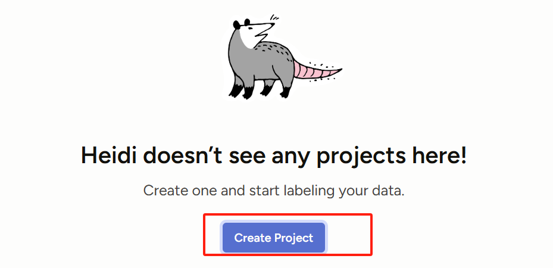
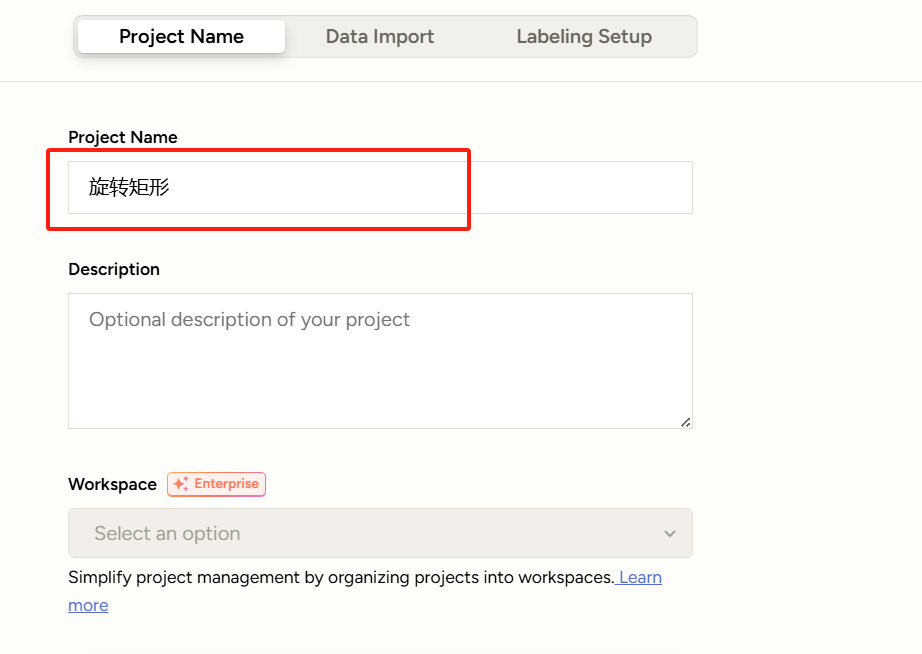
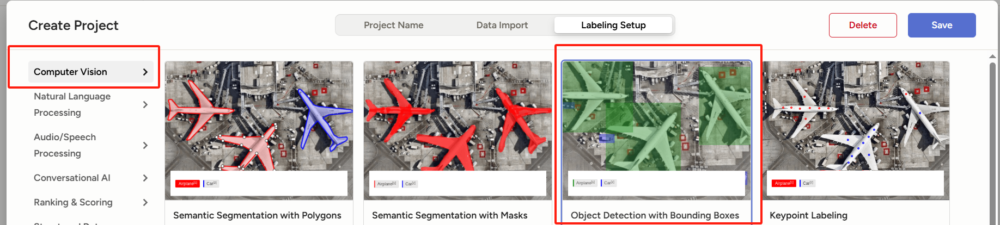
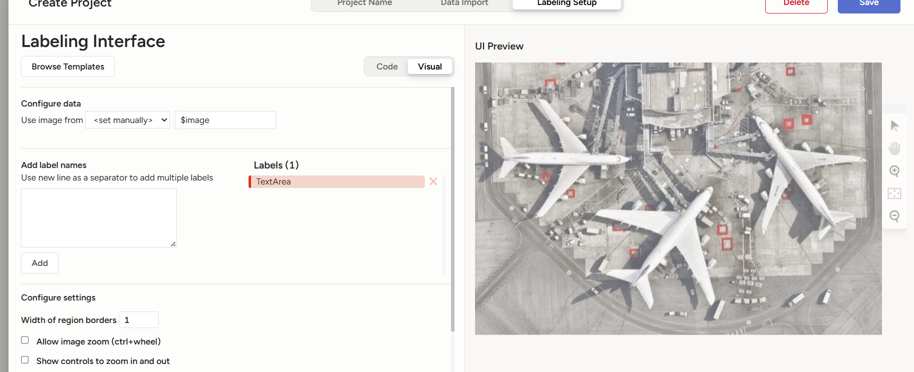
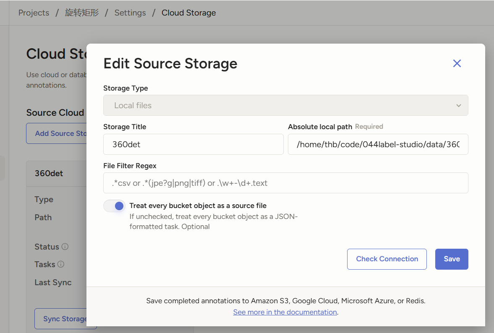
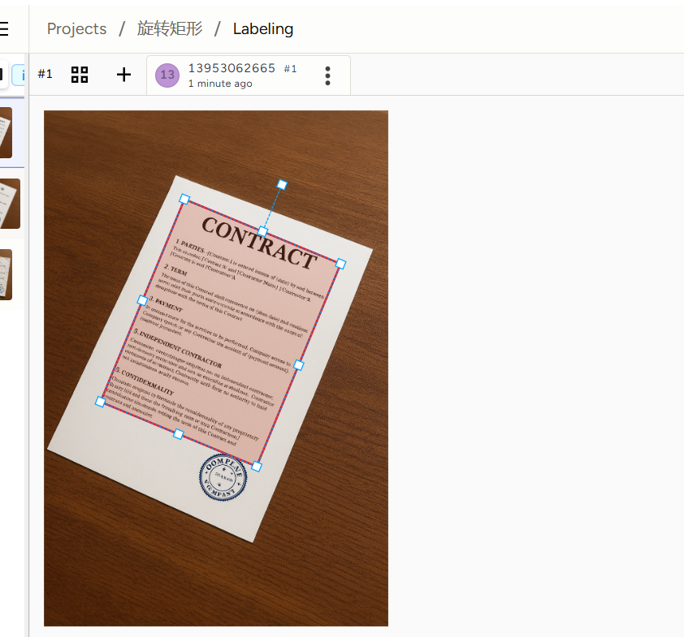
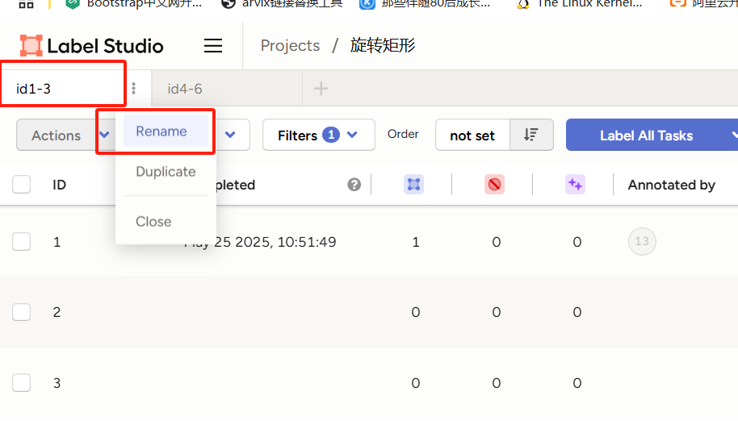
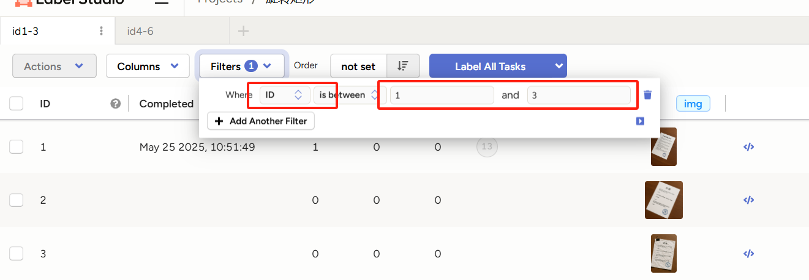

# 360°旋转文字区域检测实战2：高效标注工具与团队协作指南

## 前言

在人工智能技术的快速发展中，旋转文字区域检测作为计算机视觉领域的关键技术，直接影响OCR（光学字符识别）、自动驾驶、工业质检等场景的落地效果。随着技术复杂度的提升，传统的单点式数据处理模式已难以满足高精度模型需求，数据标注、团队协作与算法优化的协同作用愈发凸显。

在当前深度学习驱动的视觉智能时代，数据标注的重要性愈发凸显。尤其是在360°旋转文字区域检测这一复杂任务中，文字可能以任意角度、形态和背景出现，只有通过高质量、精细化的标注，模型才能准确识别多样化的文字区域，从而提升鲁棒性与召回率。无论算法结构多么先进，缺乏丰富且精准的训练数据，模型性能都难以达到预期。

面对海量的标注需求，单人作业不仅效率低下，且难以保证标注质量的一致性。此时，团队协作显得尤为关键。通过明确分工，如标注员负责初步标记，质检员进行抽样审校，项目经理统一反馈与修订规范，团队可以形成高效的协同流程。这种多角色协作不仅加快了标注进度，还确保了数据的一致性和高质量，为后续模型训练提供坚实基础。

然而，数据标注并非一劳永逸。随着模型在实际场景中的部署，新的corner case和未覆盖的场景不断涌现，如特殊排版、模糊文字、遮挡重叠等。此时，持续的数据迭代显得尤为重要。通过对模型“盲区”样本进行补充标注和优化标签集（甚至改变标注规则），团队能够不断丰富数据分布，使模型在更多角度和场景下达到稳定、高效的检测效果。

在众多标注工具中，Label Studio以其灵活的配置、可扩展的插件机制及图形化的团队管理功能，尤其适合360°旋转文字区域检测项目。它支持自定义标签类型、旋转框标注、实时协同审阅与自动质检脚本，无缝集成版本控制与导出格式，使团队能够在同一平台上高效协作、快速迭代。后续章节将基于Label Studio的实战示例，详解如何搭建标注流水线、制定数据标注与迭代策略，加速算法落地。

在最后本文进一步升华主题，在人工智能的发展历程中，“数据为王”与“算法为王”的讨论一直是业界关注的焦点。这两者并非对立，而是相辅相成，共同推动AI技术的进步。“数据为王”强调的是高质量数据在模型训练中的核心作用。另一方面，“算法为王”则强调创新的模型结构和优化方法对于提升AI系统性能的重要性。随着深度学习等技术的发展，新的算法不断涌现，推动了AI在各个领域的应用和突破。


## 一、Label Studio的安装与基本使用

### 1.1 安装与启动
- **环境准备**  
  使用 Anaconda 创建虚拟环境（以 Python 3.8 为例）：  
  
  ```bash
  conda create -n label_studio python=3.8
  conda activate label_studio
  ```
  安装 Label Studio：  
  ```bash
  pip install label-studio==1.13.1
  ```
  启动服务：  
  ```bash
  label-studio start
  ```
  默认会跳转至登录页面，首次使用需注册账号。
  
  
  
- **其他安装方式**  
  若使用 Docker，可通过官方 Docker Desktop（Windows/macOS）或 Linux 包管理器安装。


### 1.2 创建项目
- 进入 Web 界面后点击 **Create Project**，输入项目名称和描述。
- 选择适合的标注任务模板（如图像分类、实体识别、关键点标注等）。  
  例如，人头标注选择 **Keypoint Labeling** 模板 [[4]]。


### 1.3 数据导入
- 进入 **Data Import** 页面，点击 **Upload Files** 上传本地数据（支持图像、音频、文本等格式）。
- 数据上传后，可在任务列表中查看。






上面的方法仅适用于小规模数据，当数据集过大时，比如万级至百万级图片数据需要标注时，就需要用到本地存储。Label Studio 采用本地存储（Local Storage）方式导入数据，主要是为了满足以下需求：

1. **处理大规模数据集**：通过本地存储，可以高效地管理和导入大量数据，避免了通过 Web 界面上传大文件时可能遇到的限制和性能问题。
2. **提高数据访问速度**：本地存储的数据访问速度通常快于远程存储，有助于提升标注效率。
3. **增强数据安全性**：将数据保存在本地，可以更好地控制数据的访问权限，减少数据泄露的风险。
4. **简化数据同步过程**：本地存储使得数据的同步和管理更加直接，尤其适用于不依赖云服务的环境。

Label Studio 通过支持本地存储方式导入数据，提供了更高的灵活性和控制力，特别适合需要处理大量数据且对数据安全性有较高要求的项目。

本文会在下面一章会介绍如何开启Local Storage以及怎么使用它。

### 1.4 标签配置

- 点击 **Labeling Setup**，根据任务需求设置标签：
  - **可视化方式**：通过界面拖拽配置标签（如文本分类、实体边界框等。
  - **代码方式**：直接编辑配置文件（如 JSON 或 XML 格式），定义标签类型和属性。
  - 示例：人头标注需定义关键点标签（如 "person_head"。






这里我们还是选择目标检测用来标注旋转矩形


### 1.5 开始标注
- 配置完成后，点击 **Save** 进入标注界面。
- 对图像、文本等数据进行标注（如点击目标位置添加关键点）。
- 完成单条数据标注后，点击 **Submit** 提交结果，进入下一条数据。


### 1.6 数据导出
- 标注完成后，点击 **Export** 导出结果。
- 支持多种格式（如 JSON、CSV、YOLO 格式等），可根据需求选择。


### 1.7 高级功能 
- **集成机器学习**：通过 `Label Studio ML` 后端连接模型，实现预测与辅助标注（需编写 `predict` 方法处理任务数据）。
- **自定义任务**：根据需求调整标签类型（如分类、实体识别、分割等），或结合代码示例快速集成 [[8]]。

## 二、Label Studio 本地存储方式构建标注数据方法


### 2.1 环境准备

1. 在运行 Label Studio 的机器上，设置以下环境变量：

   - `LABEL_STUDIO_LOCAL_FILES_SERVING_ENABLED=true`
   - `LABEL_STUDIO_LOCAL_FILES_DOCUMENT_ROOT`：指向本地文件根目录，例如 `/home/user`（Linux/macOS）或 `C:\data\media`（Windows）

   > **说明**：
   >
   > - `LOCAL_FILES_SERVING_ENABLED` 打开对本地文件的访问支持；
   > - `DOCUMENT_ROOT` 限制可访问目录，确保安全性。
   >    ([Label Studio](https://labelstud.io/guide/storage.html))

2. 确认 Label Studio 已正确安装并可启动：

   ```bash
   LABEL_STUDIO_LOCAL_FILES_SERVING_ENABLED=true LABEL_STUDIO_LOCAL_FILES_DOCUMENT_ROOT=/data/jinlong/std_data label-studio start
   ```

   `LABEL_STUDIO_LOCAL_FILES_DOCUMENT_ROOT` 中设置的值需要是待加载资源的根目录。比如资源放在 `/data/jinlong/std_data/call_images/images` 下面，就可以设置 `LABEL_STUDIO_LOCAL_FILES_DOCUMENT_ROOT=/data/jinlong/std_data` 
   
   若使用 Docker，请确保在启动时挂载了对应目录，并通过 `-e` 传入上述环境变量。


### 2.2 在 UI 中添加 Local Storage

1. 打开某个项目，进入 **Settings → Cloud Storage**；
2. 点击 **Add Source Storage**；
3. 在弹窗中：
   - **Storage Type** 选择 **Local Files**；
   - **Storage Title** 填写一个易识别的名称；
   - **Absolute local path** 填入一个以 `LABEL_STUDIO_LOCAL_FILES_DOCUMENT_ROOT` 为前缀的绝对路径（例如 `/home/user/dataset1`）；
   - （可选）**File Filter Regex**：用正则过滤文件，默认 `.*` 表示全部；
   - （可选）**Treat every bucket object as a source file**：（一般需要选中）
     - 若开启，Label Studio 会把目录下的每个文件（如 JPG/MP3）自动生成单源任务；
     - 若关闭，则只导入 JSON/JSONL 格式的任务文件，适合复杂多源任务。
4. 点击 **Add Storage** 完成挂载；
5. 挂载后点击 **Sync** 按钮，Label Studio 会递归扫描该目录并将符合条件的文件或任务导入项目中。





### 2.3 导入自定义格式的任务

对于多源或复杂配置的任务（如同时含图像、音频、文本等），通常：

1. 重复上述「添加 Storage」步骤，但：

   - **File Filter Regex** 留空；
   - 关闭 **Treat every bucket object as a source file**；

2. **不执行** 同步操作（不要点 Sync），以免自动按文件生成任务；

3. 在任务 JSON 中，使用以下路径格式引用本地文件：

   ```json
   [
     {
       "id": 1,
       "data": {
         "audio": "/data/local-files/?d=dataset1/audio/1.wav",
         "image": "/data/local-files/?d=dataset1/images/1.jpg"
       }
     },
     …
   ]
   ```

   - `/data/local-files/?d=` 是固定前缀，后面跟项目内相对于 `DOCUMENT_ROOT` 的子路径；

4. 通过 **Data Manager → Import** 界面，拖拽该 JSON 文件并点击 **Import**，完成任务创建。


### 2.4 Docker 化部署注意事项

- 在启动容器时，通过 `-v /宿主机/目录:/data/local-files`（或其他路径）挂载本地数据；

- 设置环境变量：

  ```yaml
  services:
    label-studio:
      image: heartexlabs/label-studio:latest
      volumes:
        - /home/user/dataset1:/data/local-files
      environment:
        - LABEL_STUDIO_LOCAL_FILES_SERVING_ENABLED=true
        - LABEL_STUDIO_LOCAL_FILES_DOCUMENT_ROOT=/data/local-files
  ```

- 容器内路径需与 UI 或 API 中配置的 `directoryPath` 保持一致。


### 2.5 安全与最佳实践

- **最小权限**：仅将需要的目录挂载到 `DOCUMENT_ROOT` 下；
- **正则过滤**：尽量通过 `File Filter Regex` 筛选，避免无关文件干扰；
- **版本管理**：对任务 JSON 及标注结果使用 Git/对象存储等方式持久化；
- **定期清理**：同步失败或过期文件可手动清理，保持存储整洁。


## 三、团队共享标注的方法

Label Studio作为一个web端的标注工具，可以很方便的实现团队协作标注。


使用数据管理器的筛选和标签功能分配任务

大部分人使用的社区办，社区版不支持直接将任务分配给特定的标注者，但可以通过数据管理器的筛选和标签功能，将数据集划分为不同的部分，并由不同的标注者负责各自的部分。

**操作步骤：**

1. 在项目中，使用筛选器根据任务的某些属性（如任务ID范围）创建不同的视图。
2. 为每个视图创建一个标签页，并重命名为特定标注者的名字。
3. 标注者登录后，选择对应的标签页，开始标注其分配的任务。





假设有一个包含300个任务的数据集，团队中有3名标注者，计划每人负责100个任务。

**社区版操作方法：**

1. 在数据管理器中，创建三个筛选器，分别筛选任务ID为1-100、101-200和201-300的任务。
2. 为每个筛选器创建一个标签页，并命名为标注者的名字。
3. 标注者登录后，选择对应的标签页，开始标注任务。


## 四、辅助标注

在计算机视觉（Computer Vision, CV）任务中，数据标注始终是一项耗时且成本高昂的工作，尤其是像目标检测、语义分割等精细任务，标注一张图可能需要几分钟甚至更长时间。为缓解标注压力，“辅助标注（Assisted Labeling）”是工业界的热门技术。

辅助标注并非完全替代人工，而是以模型或工具为“助手”，帮助人工更快速地完成标注。例如，在语义分割任务中，模型可以提供一个初步的分割结果，标注员只需微调边缘或修正错误，工作量大幅减少。

一些现代的数据标注平台（如CVAT、Label Studio等）已经集成了这种智能预标注功能，甚至支持“主动学习”机制：系统会优先挑选模型最不确定的样本给人工标注，从而最大化每一次标注的价值。


这里我们为保证方法的通用性，不局限于某一个数据标注平台，采用一种自定义标注的方法来给出预测。


这里以旋转目标检测mmroate为例，下面是`bad_case.py`，里面即包含模型的预测信息，保存为txt。

```python
import os
import shutil
import numpy as np
import cv2
from mmengine.runner import Runner
from mmdet.apis import inference_detector, init_detector
from mmdet.registry import DATASETS, VISUALIZERS
from projects.RR360.evaluation import eval_rbbox_head_map
from mmengine.config import Config

import os
import os.path as osp

from mmdet.utils import register_all_modules as register_all_modules_mmdet
from projects.RR360.structures.bbox import RotatedBoxes

import mmrotate.structures
from mmrotate.utils import import register_all_modules

# TODO: Refactoring with registry build
mmrotate.structures.bbox.RotatedBoxes = RotatedBoxes

# 参数配置
PALETTE = 'dota'
CONFIG_PATH = "/mmrotate/self_script/work_dirs/360_det/360_det.py"  # 模型配置文件路径
CHECKPOINT_PATH = "/mmrotate/self_script/work_dirs/360_det/best.pth"  # 模型权重路径
IOU_THRESHOLD = 0.95  # IoU 阈值
OUTPUT_DIR = "./train_bad_case"  # 输出目录
DEVICE = "cuda"  # 使用的设备


def copy_image(src_path, dst_folder, filename):
    os.makedirs(dst_folder, exist_ok=True)
    shutil.copy(src_path, os.path.join(dst_folder, filename))


def visualize_detections(img_path, gt_bboxes, pred_bboxes, output_path):
    image = cv2.imread(img_path)

    # 绘制 GT 边界框（绿色）
    for bbox in gt_bboxes:
        bbox = bbox.astype(int)
        cv2.polylines(image, [bbox.reshape(-1, 2)], isClosed=True, color=(0, 255, 0), thickness=2)

    # 绘制预测边界框（红色）
    for bbox in pred_bboxes:
        bbox = bbox.astype(int)
        cv2.polylines(image, [bbox.reshape(-1, 2)], isClosed=True, color=(0, 0, 255), thickness=2)

    os.makedirs(os.path.dirname(output_path), exist_ok=True)
    cv2.imwrite(output_path, image)


def save_bboxes_to_txt(bboxes, output_path, label):
    """
    保存边界框到 txt 文件中。

    Args:
        bboxes (ndarray): 边界框数组，格式为 [x, y, w, h, angle].
        output_path (str): 保存路径。
        label (str): 标签类型，如 "GT" 或 "PRED"。
    """
    os.makedirs(os.path.dirname(output_path), exist_ok=True)
    with open(output_path, 'w') as f:
        for bbox in bboxes:
            bbox_str = " ".join(map(str, bbox))
            f.write(f"{label} {bbox_str}\n")


def main():
    register_all_modules_mmdet(init_default_scope=False)
    register_all_modules(init_default_scope=False)

    # Load config
    cfg = Config.fromfile(CONFIG_PATH)

    # 初始化模型
    model = init_detector(CONFIG_PATH, CHECKPOINT_PATH, palette=PALETTE, device=DEVICE)

    # 加载测试数据集
    model.cfg.test_dataloader.batch_size = 1
    model.cfg.test_dataloader.num_workers = 1
    model.cfg.test_dataloader.persistent_workers = True
    model.cfg.test_dataloader.dataset.data_root = model.cfg.train_dataloader.dataset.data_root
    dirname = os.path.basename(OUTPUT_DIR)
    mode = dirname.split("_")[0]
    model.cfg.test_dataloader.dataset.ann_file = f"{mode}/"
    model.cfg.test_dataloader.dataset.data_prefix.img_path = f"{mode}/"

    dataset = DATASETS.build(model.cfg.test_dataloader.dataset)

    model.cfg.visualizer.vis_backends = [dict(type='LocalVisBackend')]
    visualizer = VISUALIZERS.build(model.cfg.visualizer)
    visualizer.dataset_meta = dataset.metainfo

    data_loader = Runner.build_dataloader(model.cfg.test_dataloader)

    # 输出文件夹初始化
    low_iou_images = []
    folder_low_iou = os.path.join(OUTPUT_DIR, 'low_iou_images')
    folder_visualizations = os.path.join(OUTPUT_DIR, 'visualizations')
    folder_bboxes = os.path.join(OUTPUT_DIR, 'bboxes_txt')

    # 遍历数据集并处理
    for i, data in enumerate(data_loader):
        # 获取图片信息
        img_metas = data['data_samples'][0].metainfo
        img_path = img_metas['img_path']
        img_name = os.path.basename(img_path)

        # 推理
        result = inference_detector(model, img_path)

        # 提取 GT 和预测框
        gt_bboxes = {
            'bboxes': data['data_samples'][0].gt_instances.bboxes.numpy(),
            'labels': data['data_samples'][0].gt_instances.labels.numpy(),
            'bboxes_ignore': data['data_samples'][0].ignored_instances.bboxes.numpy(),
            'labels_ignore': data['data_samples'][0].ignored_instances.labels.numpy(),
        }
        pred_bboxes = result.pred_instances.cpu().bboxes.numpy()

        # 计算 IoU 并筛选
        mAP, eval_results = eval_rbbox_head_map(
            [pred_bboxes],
            [gt_bboxes],
            scale_ranges=None,
            iou_thr=IOU_THRESHOLD,
            # dataset=model.CLASSES,
            logger=None
        )
        ap = eval_results[0]['ap']
        if ap < 1.0:
            low_iou_images.append(img_name)
            copy_image(img_path, folder_low_iou, img_name)

        # 可视化 GT 和预测框
        vis_output_path = os.path.join(folder_visualizations, img_name)
        from projects.RR360.structures.bbox_rotated_boxes import rbbox2qbbox
        gt_corners = rbbox2qbbox(RotatedBoxes(gt_bboxes['bboxes']).regularize_boxes(pattern='r360')).numpy()
        pred_corners = rbbox2qbbox(RotatedBoxes(pred_bboxes).regularize_boxes(pattern='r360')).numpy()

        visualize_detections(img_path, gt_corners, pred_corners, vis_output_path)

        # 保存 GT 和预测框到 txt 文件
        save_bboxes_to_txt(
            gt_bboxes['bboxes'],
            os.path.join(folder_bboxes, f"{os.path.splitext(img_name)[0]}_gt.txt"),
            label="GT"
        )
        save_bboxes_to_txt(
            pred_bboxes,
            os.path.join(folder_bboxes, f"{os.path.splitext(img_name)[0]}_pred.txt"),
            label="PRED"
        )

    # 保存低 IoU 图像列表
    os.makedirs(folder_low_iou, exist_ok=True)
    with open(os.path.join(folder_low_iou, 'low_iou_images.txt'), 'w') as f:
        for img in low_iou_images:
            f.write(f"{img}\n")

    print(f"低 IoU 图像数量：{len(low_iou_images)}")
    print(f"低 IoU 图像列表：{folder_low_iou}")
    print(f"可视化结果已保存到：{folder_visualizations}")


if __name__ == "__main__":
    main()
```


下面需要将上面的预测的txt信息转换为目标平台的标注信息，这里以label studio为例

```python
import matplotlib.pyplot as plt
import numpy as np
import os
import glob
import json
import math

from projects.RR360.structures.bbox import RotatedBoxes
from projects.RR360.structures.bbox_rotated_boxes import rbbox2qbbox
import torch
from PIL import Image

# 输入和输出路径
INPUT_TXT_FOLDER = "/mmrotate/train_bad_case/bboxes_txt"  # 保存 GT 和 PRED 的 txt 文件夹
OUTPUT_JSON_PATH = "./train_label_studio_data.json"  # 转换后的 JSON 文件路径
IMAGE_FOLDER = "./low_iou_images"  # 对应图片文件夹，用于生成 JSON 中的 image URL


def center_to_topleft(x, y, width, height, rotation):
    """
    将中心坐标格式转换为左上角坐标格式。

    Args:
        x (float): 中心 x 坐标。
        y (float): 中心 y 坐标。
        width (float): 矩形的宽。
        height (float): 矩形的高。
        rotation (float): 旋转角度，范围为 -180 到 180，负值为逆时针。

    Returns:
        dict: 包含左上角坐标和角度的字典。
    """
    # 计算左上角坐标
    tensor = RotatedBoxes(torch.as_tensor([[x, y, width, height, rotation]], dtype=torch.float32))
    corners = rbbox2qbbox(tensor.regularize_boxes(pattern='r360')).numpy()[0].reshape(4, 2)
    left_x, left_y = list(map(float, corners[0]))

    # 处理旋转角度
    rotation = float(tensor.tensor[0, -1]) / math.pi * 180
    if rotation < 0:
        rotation = 360 + rotation

    return {
        "xywh": (x, y, width, height),
        "xlylx2y2x3y3x4y4": corners.tolist(),
        "x": left_x,
        "y": left_y,
        "width": width,
        "height": height,
        "rotation": rotation
    }


def parse_txt_file(txt_path):
    """
    解析 GT 或 PRED 的 txt 文件内容，并将中心坐标转换为左上角坐标。

    Args:
        txt_path (str): txt 文件路径。

    Returns:
        list[dict]: 返回解析后的标注框列表。
    """
    bboxes = []
    with open(txt_path, 'r') as f:
        for line in f:
            parts = line.strip().split()
            label, coords = parts[0], list(map(float, parts[1:]))
            transformed = center_to_topleft(*coords)
            transformed["label"] = label
            bboxes.append(transformed)
    return bboxes


def get_image_size(image_path):
    """
    获取图像的宽度和高度。

    参数:
        image_path (str): 图像文件的路径。

    返回:
        tuple: 包含图像宽度和高度的元组。
    """
    try:
        # 打开图像文件
        with Image.open(image_path) as img:
            # 获取图像的宽和高
            width, height = img.size
            return width, height
    except IOError:
        print(f"无法打开图像文件：{image_path}")
        return None, None


def create_label_studio_json(image_name, gt_bboxes, pred_bboxes, image_folder):
    """
    创建 Label Studio 格式的 JSON 数据。

    Args:
        image_name (str): 图片文件名。
        gt_bboxes (list[dict]): GT 边界框列表。
        pred_bboxes (list[dict]): PRED 边界框列表。
        image_folder (str): 图片文件夹路径。

    Returns:
        dict: 单个图片的 Label Studio JSON 数据。
    """
    image_path = os.path.join(image_folder, image_name)
    image_width, image_height = get_image_size(image_path)
    if image_width is None:
        return None

    task_data = {
        "data": {
            "image": image_path.replace("/root/data/code/mmrotate/", "/data/local-files/?d=").replace(".jpg", ".png")  # 可调整为服务器 URL
        },
        "annotations": [
            {
                "result": []
            }
        ]
    }

    for bbox in gt_bboxes:
        task_data["annotations"][0]["result"].append({
            "type": "rectanglelabels",
            "original_width": image_width,
            "original_height": image_height,
            "value": {
                "xywh": bbox["xywh"],
                "xlylx2y2x3y3x4y4": bbox["xlylx2y2x3y3x4y4"],
                "x": bbox["x"] / image_width * 100,
                "y": bbox["y"] / image_height * 100,
                "width": bbox["width"] / image_width * 100,
                "height": bbox["height"] / image_height * 100,
                "rotation": bbox["rotation"],
                "rectanglelabels": [bbox["label"]]
            },
            "to_name": "image",
            "from_name": "label",
            "id": f"gt_{bbox['x']:.2f}_{bbox['y']:.2f}",
            "origin": 'manual'
        })

    for bbox in pred_bboxes:
        task_data["annotations"][0]["result"].append({
            "type": "rectanglelabels",
            "original_width": image_width,
            "original_height": image_height,
            "value": {
                "x": bbox["x"] / image_width * 100,
                "y": bbox["y"] / image_height * 100,
                "width": bbox["width"] / image_width * 100,
                "height": bbox["height"] / image_height * 100,
                "rotation": bbox["rotation"],
                "rectanglelabels": [bbox["label"]]
            },
            "to_name": "image",
            "from_name": "label",
            "id": f"pred_{bbox['x']:.2f}_{bbox['y']:.2f}",
            "origin": 'manual'
        })

    return task_data


def gen_labelstudio_file():
    # 初始化
    all_tasks = []

    # 遍历文件夹中的 txt 文件
    txt_files = [f for f in os.listdir(INPUT_TXT_FOLDER) if f.endswith("_gt.txt")]

    for gt_file in txt_files:
        base_name = os.path.splitext(gt_file)[0].replace("_gt", "")
        pred_file = f"{base_name}_pred.txt"

        # 获取对应的 GT 和 PRED 文件路径
        gt_path = os.path.join(INPUT_TXT_FOLDER, gt_file)
        pred_path = os.path.join(INPUT_TXT_FOLDER, pred_file)

        # 检查对应的 PRED 文件是否存在
        if not os.path.exists(pred_path):
            print(f"Warning: Prediction file not found for {gt_file}")
            continue

        # 解析 GT 和 PRED 的 bbox
        gt_bboxes = parse_txt_file(gt_path)
        pred_bboxes = parse_txt_file(pred_path)

        # 图片名推测
        image_name = f"{base_name}.png"

        # 创建 Label Studio JSON 数据
        task = create_label_studio_json(image_name, gt_bboxes, pred_bboxes, IMAGE_FOLDER)
        if task:
            all_tasks.append(task)

    # 保存为 JSON 文件
    with open(OUTPUT_JSON_PATH, 'w') as f:
        json.dump(all_tasks, f, indent=4)

    print(f"转换完成！Label Studio 数据保存到 {OUTPUT_JSON_PATH}.")


# 运行主函数
gen_labelstudio_file()
```

按照第三章导入数据之后，保证数据的base name与上面脚本处理的一致，之后清空目前的数据或者导出。

将`./train_label_studio_data.json` 点击“Import”即可导入模型的预测结果标注。


## 五、标注结果的导出与转换

标注完成后，点击 **Export** 导出结果。导出的结果只会包含标注过的样本，而不是包含所有样本。

导出之后一般需要执行两个步骤

### 5.1 可视化标注结果

采用如下代码可视化标注结果

```python
import matplotlib.pyplot as plt
import matplotlib.patches as patches
import matplotlib.image as mpimg
import numpy as np
import json
import os
from PIL import Image

# ======================
# 数据处理部分
# ======================

annotation_dict = {}

# 处理导出json文件
with open("./rotated_image/export.json", encoding='utf-8') as f:
    rotated_image_labels = json.load(f)

for rotated_image_label in rotated_image_labels:
    annotation_list = []
    image_filepath = rotated_image_label['data']['image']
    
    try:
        for annotation in rotated_image_label['annotations']:
            result = annotation['result']
            for annotation_result in result:
                original_width = annotation_result['original_width']
                original_height = annotation_result['original_height']
                
                value = annotation_result['value']
                annotation_list.append({
                    'left_corner_x': value['x'] / 100 * original_width,
                    'left_corner_y': value['y'] / 100 * original_height,
                    'width': value['width'] / 100 * original_width,
                    'height': value['height'] / 100 * original_height,
                    'rotation': value['rotation'],
                })
    except Exception as e:
        print(f"Error processing {image_filepath}: {str(e)}")
        continue

    annotation_dict[image_filepath] = {
        'url': image_filepath,
        'annotation_list': annotation_list,
        'image_path': os.path.abspath(os.path.join('./rotated_image/dst_png_files2', os.path.basename(image_filepath)))
    }

# ======================
# 核心功能函数
# ======================

def plot_local_image_with_bounding_boxes(image_path, bounding_boxes):
    """
    显示本地图片并在图片上绘制旋转矩形框标注
    参数:
        image_path -- 本地图片的文件路径
        bounding_boxes -- 包含旋转矩形框标注的列表，每个矩形框定义为：
                          [中心点x坐标, 中心点y坐标, 宽度, 高度, 旋转角度]
    """
    img = mpimg.imread(image_path)
    
    if len(img.shape) == 2:  # 灰度图像
        height, width = img.shape
    else:  # 彩色图像
        height, width, _ = img.shape

    fig, ax = plt.subplots(figsize=(width/100, height/100), dpi=100)
    ax.imshow(img)
    
    for bbox in bounding_boxes:
        center_x, center_y, width, height, angle = bbox
        rect = patches.Rectangle(
            (center_x - width/2, center_y - height/2),
            width, height,
            angle=angle,
            linewidth=1,
            edgecolor='r',
            facecolor='none'
        )
        ax.add_patch(rect)
    
    ax.axis('off')
    plt.show()

def rotate_rectangle_to_vertices(center_x, center_y, width, height, angle):
    """
    将旋转矩形参数转换为四个顶点坐标
    参数:
        center_x -- 矩形中心x坐标
        center_y -- 矩形中心y坐标
        width    -- 矩形宽度
        height   -- 矩形高度
        angle    -- 顺时针旋转角度（度）
    返回:
        包含四个顶点坐标的列表 [[x1,y1], [x2,y2], [x3,y3], [x4,y4]]
    """
    theta = np.radians(angle)
    rotation_matrix = np.array([
        [np.cos(theta), np.sin(theta)],
        [-np.sin(theta), np.cos(theta)]
    ])
    
    half_width = width / 2
    half_height = height / 2
    
    # 计算四个顶点的相对坐标
    points = np.array([
        [-half_width, -half_height],
        [half_width, -half_height],
        [half_width, half_height],
        [-half_width, half_height]
    ])
    
    # 应用旋转矩阵
    rotated_points = np.dot(points, rotation_matrix.T).T
    
    # 转换为绝对坐标
    rotated_points = rotated_points + np.array([center_x, center_y])
    return rotated_points.tolist()

# ======================
# 可视化处理部分
# ======================

for key, item in annotation_dict.items():
    annotations = []
    for subitem in item['annotation_list']:
        # 转换标注格式
        center_x = subitem['left_corner_x'] + subitem['width']/2
        center_y = subitem['left_corner_y'] + subitem['height']/2
        width = subitem['width']
        height = subitem['height']
        rotation = subitem['rotation']
        
        # 获取顶点坐标
        vertices = rotate_rectangle_to_vertices(center_x, center_y, width, height, rotation)
        annotations.append(vertices.tolist())
    
    # 筛选45-90度旋转的标注
    is_rotate = any(45 <= ann[-1] <= 90 for ann in annotations)
    
    if is_rotate:
        print(f"Found rotated annotation in {key}")
        print(item['image_path'])
        
        # 绘制图像标注
        try:
            img = Image.open(item['image_path'])
            fig, ax = plt.subplots(figsize=(img.width/100, img.height/100), dpi=100)
            ax.imshow(img)
            
            for vertices in annotations:
                polygon = patches.Polygon(
                    vertices,
                    closed=True,
                    edgecolor='red',
                    fill=False
                )
                ax.add_patch(polygon)
            
            ax.axis('off')
            plt.show()
            
            # 保存结果
            output_path = os.path.join('./output', os.path.basename(item['image_path']))
            plt.savefig(output_path)

            annotations = [
                [
                    subitem['left_corner_x'] + subitem['width'] / 2,  # 中心点X
                    subitem['left_corner_y'] + subitem['height'] / 2,  # 中心点Y
                    subitem['width'],          # 宽度
                    subitem['height'],         # 高度
                    subitem['rotation']        # 旋转角度
                ] for subitem in item['annotation_list']
            ]
            
            # 调用绘图函数（注意参数顺序）
            plot_local_image_with_bounding_boxes(
                image_path=item['image_path'],
                bounding_boxes=annotations
            )
            
        except Exception as e:
            print(f"Error processing {key}: {str(e)}")
```

这里需要注意的是标注格式是绕图片左上角定点旋转

导出的标注是绕图片中心点旋转

旋转角度是相同的，这个读者可以自行画个图利用“两直线平行，内错角相等”等原理来证明。

### 5.2 转换为训练格式

一般而言，导出的格式与训练所需要的格式可能不匹配，这里就需要格式转换功能，下面以mmroate 360°要求的格式给出示例脚本。

```python
import os
import shutil
import json
import numpy as np


annotation_dict = {}

# 处理导出json文件
with open("./rotated_image/export.json", encoding='utf-8') as f:
    rotated_image_labels = json.load(f)

for rotated_image_label in rotated_image_labels:
    annotation_list = []
    image_filepath = rotated_image_label['data']['image']
    
    try:
        for annotation in rotated_image_label['annotations']:
            result = annotation['result']
            for annotation_result in result:
                original_width = annotation_result['original_width']
                original_height = annotation_result['original_height']
                
                value = annotation_result['value']
                annotation_list.append({
                    'left_corner_x': value['x'] / 100 * original_width,
                    'left_corner_y': value['y'] / 100 * original_height,
                    'width': value['width'] / 100 * original_width,
                    'height': value['height'] / 100 * original_height,
                    'rotation': value['rotation'],
                })
    except Exception as e:
        print(f"Error processing {image_filepath}: {str(e)}")
        continue

    annotation_dict[image_filepath] = {
        'url': image_filepath,
        'annotation_list': annotation_list,
        'image_path': os.path.abspath(os.path.join('./rotated_image/dst_png_files2', os.path.basename(image_filepath)))
    }


def rotate_rectangle_to_vertices(center_x, center_y, width, height, angle):
    """
    将旋转矩形参数转换为四个顶点坐标
    参数:
        center_x -- 矩形中心x坐标
        center_y -- 矩形中心y坐标
        width    -- 矩形宽度
        height   -- 矩形高度
        angle    -- 顺时针旋转角度（度）
    返回:
        包含四个顶点坐标的列表 [[x1,y1], [x2,y2], [x3,y3], [x4,y4]]
    """
    theta = np.radians(angle)
    rotation_matrix = np.array([
        [np.cos(theta), np.sin(theta)],
        [-np.sin(theta), np.cos(theta)]
    ])
    
    half_width = width / 2
    half_height = height / 2
    
    # 计算四个顶点的相对坐标
    points = np.array([
        [-half_width, -half_height],
        [half_width, -half_height],
        [half_width, half_height],
        [-half_width, half_height]
    ])
    
    # 应用旋转矩阵
    rotated_points = np.dot(points, rotation_matrix.T).T
    
    # 转换为绝对坐标
    rotated_points = rotated_points + np.array([center_x, center_y])
    return rotated_points.tolist()


new_annotation_dict = {}
for key, item in annotation_dict.items():
    annotations = []
    for subitem in item['annotation_list']:
        # 转换标注格式
        center_x = subitem['left_corner_x'] + subitem['width']/2
        center_y = subitem['left_corner_y'] + subitem['height']/2
        width = subitem['width']
        height = subitem['height']
        rotation = subitem['rotation']
        
        # 获取顶点坐标
        vertices = rotate_rectangle_to_vertices(center_x, center_y, width, height, rotation)
        annotations.append(vertices.tolist())
    new_annotation_dict[key] = {
        'image_path': item['image_path'],
        'vertices_list': annotations
    }

# 定义目标目录
dst_dir = './new_annotation_dir'

# 删除已存在的目录并重新创建
shutil.rmtree(dst_dir)
os.makedirs(dst_dir, exist_ok=True)

# 创建索引列表并打乱顺序
train_indexes = list(range(len(new_annotation_dict)))
import random
random.shuffle(train_indexes)

# 计算训练集和测试集长度
train_dataset_length = len(new_annotation_dict) // 5 * 4
test_dataset_length = len(new_annotation_dict) - train_dataset_length

# 分割索引
train_indexes = train_indexes[:train_dataset_length]
test_indexes = train_indexes[train_dataset_length:]
import shutil

# 处理每个数据项
for i, (key, info_dict) in enumerate(new_annotation_dict.items()):
    image_path = info_dict['image_path']
    tmp_dst_dir = os.path.join(dst_dir, 'train') if i in train_indexes else os.path.join(dst_dir, 'test')
    os.makedirs(tmp_dst_dir, exist_ok=True)
    ext = os.path.splitext(image_path)[-1]
    new_image_path = os.path.join(tmp_dst_dir, f'{i}{ext}')
    shutil.copy(image_path, new_image_path)
    new_txt_path = os.path.join(tmp_dst_dir, f'{i}.txt')
    vertices_list = info_dict['vertices_list']
    
    # 写入文本文件
    with open(new_txt_path, 'w', encoding='utf-8') as f:
        for j, vertices in enumerate(vertices_list):
            vertices_str = " ".join(map(lambda x: f"{x:.02f}", np.asarray(vertices).reshape(-1)))
            if j != len(vertices_list) - 1:
                vertices_str += "\n"
            f.write(vertices_str)
```

## 六、标注规则的构建与数据迭代

在计算机视觉（CV）领域，高质量的数据标注是模型性能的基石。然而，随着任务复杂度的提升和应用场景的多样化，如何构建科学的标注规则并实现高效的数据迭代，成为CV项目成功的关键因素。


标注规则的制定不仅关乎数据的一致性和准确性，更直接影响模型的学习效果。在实际操作中，标注规则的构建通常经历以下几个阶段：

1. **需求分析与任务定义**：明确模型的应用场景和目标。例如，在自动驾驶中，需要识别行人、车辆、交通标志等对象，标注规则需涵盖这些类别的定义和边界。
2. **制定详细的标注手册**：包括标注类别的定义、标注方法（如矩形框、多边形、关键点等）、边缘案例的处理方式等。例如，在服饰风格识别任务中，不同标注者对“欧美风”与“高贵风”的理解可能存在差异，需通过具体示例和说明减少主观性。
3. **标注人员培训与测试**：对标注人员进行系统培训，确保其理解并遵循标注规则。通过测试任务评估其标注一致性和准确性，必要时进行反馈和再培训。
4. **质量控制与持续优化**：采用双重标注、交叉验证等方式进行质量控制。引入一致性评估指标（如Cohen’s Kappa系数）监控标注质量，发现问题及时调整标注规则。


数据迭代是提升模型性能和数据质量的有效手段。通过模型的反馈，识别数据中的问题，指导数据的采集和标注，实现闭环优化。

1. **小批量标注与模型训练**：初始阶段，选择代表性的数据进行标注，训练初步模型。该模型用于评估标注质量，发现明显错误或不一致的标注，指导标注规则的修订。
2. **模型预测与人工校正**：利用模型对未标注数据进行预测，人工校正模型的错误预测，生成新的标注数据。这种方式可以显著减少人工标注的工作量，提高效率。
3. **识别数据盲区与补充采集**：通过分析模型在特定场景下的性能，识别数据的盲区或不足之处，针对性地采集和标注相关数据，提升模型的泛化能力。
4. **持续迭代与规则优化**：在每一轮迭代中，结合模型的表现和标注质量，持续优化标注规则和数据分布，形成良性的优化循环。


> 在实际的业务中，需求是动态变化的，甚至方案都是可变的，有时为了适配算法，
>
> 也可能出现对某一个类别的标注规则。


## 七、数据、算法与伦理道德的讨论

在计算机视觉（CV）领域，技术发展始终围绕**数据、算法与伦理** 三者的动态平衡展开。无论是图像分类、目标检测还是生成式模型的应用，这三者的关系都深刻影响着技术的落地效果与社会价值。以下从核心矛盾出发，探讨三者在CV实践中的角色定位与协同路径。


“数据是AI的氧气”这一比喻在CV领域尤为贴切。以ImageNet等大规模标注数据集为基础，深度学习模型才得以实现从像素到语义的跨越。研究表明，**80%的模型性能提升依赖于数据质量** ，而非算法优化。例如，在自动驾驶场景中，若训练数据缺乏夜间或极端天气的标注样本，模型可能因“看不见长尾场景”而引发安全隐患。这种“数据决定论”推动了CV领域的标准化进程——数据清洗、标注规范、数据增强等环节成为工业界的必修课。

然而，数据的“王权”也面临挑战。一方面，数据标注成本高昂（如3D点云标注需专业工具与人力投入）；另一方面，数据偏见可能导致系统性风险。例如，人脸识别模型若过度依赖肤色、性别等关联特征，可能放大社会歧视。这揭示出“数据为王”的前提：必须建立质量评估与伦理审查的双重机制。


算法与模型的突破是CV发展的核心动力。从传统CNN到Transformer架构的迁移，模型对数据的利用效率持续提升。例如，ResNet通过残差连接解决了深度网络的梯度消失问题，使模型能在有限数据下达到更高精度；而扩散模型（Diffusion Models）则通过逆向去噪机制，实现了生成图像的细节可控性。这些创新表明，**算法设计能部分弥补数据缺陷** ，例如通过注意力机制挖掘小样本中的关键特征。

但算法的“优先性”也存在局限。2021年OpenAI的DALL-E实验显示，即使采用超大规模参数量，生成结果仍可能因训练数据的隐含偏见而偏离预期。这说明，算法的“魔法”无法完全脱离数据土壤，二者需形成动态适配关系。


随着CV技术渗透到医疗、司法等敏感领域，伦理与规则的重要性日益凸显。欧盟《人工智能法案》将CV应用划入高风险类别，要求通过数据可追溯性、算法透明度等标准降低滥用风险。例如，在公共监控场景中，需通过数据匿名化处理平衡安全与隐私；在医疗影像诊断中，模型决策需提供可解释性依据以避免“黑箱审判”。

伦理框架还推动技术范式转变。联邦学习（Federated Learning）通过分布式训练减少数据集中化风险；因果推理模型尝试剥离数据中的虚假关联，从根源上缓解偏见。这些实践表明，伦理不仅是约束，更是技术演进的催化剂。


CV领域的终极目标并非“数据-算法-伦理”三者的零和博弈，而是构建一个协同生态：

1. 数据层面  
   推动标注工具自动化（如半监督学习辅助标注），降低质量成本

2. 算法层面  
   开发鲁棒性更强的模型架构，减少对特定数据分布的依赖；

3. 伦理层面  
   将公平性、隐私保护等指标内嵌到模型评估体系中


在计算机视觉的征途中，“数据为王”提醒我们敬畏现实复杂性，“算法为先”激励我们突破认知边界，而“伦理为本”则警示我们技术必须服务人类福祉。


## 总结

本文全面探讨了360°旋转文字区域检测任务中的关键环节，从数据标注工具的选择、团队协作流程的构建到模型辅助标注与数据迭代策略的实践。以Label Studio为核心工具，详细介绍了其安装、配置及本地存储支持的实现方法，为处理大规模图像数据提供了高效解决方案。同时，文章强调了团队协作在提升标注效率和一致性上的重要性，并提出了基于筛选器的任务分配机制，使社区版Label Studio也能支持多人协同标注。

在技术层面，文章展示了如何通过自定义脚本实现模型预测结果的可视化与转换，从而将深度学习模型（如mmrotate）的输出无缝集成至标注平台。此外，针对标注结果的导出与训练格式转换，给出了完整的后处理流程，确保数据能够直接服务于模型训练。最后，文章深入剖析了标注规则构建、数据迭代优化以及CV领域中“数据为王”、“算法为先”与“伦理为本”的协同发展路径，为构建高质量、可持续演进的视觉智能系统提供了理论指导与实践经验。


## 参考链接

- [https://zhuanlan.zhihu.com/p/666885910](https://zhuanlan.zhihu.com/p/666885910)
- [https://labelstud.io/guide/storage.html#Local-storage](https://labelstud.io/guide/storage.html#Local-storage)
- [https://www.breezedeus.com/article/label-studio-20230621](https://www.breezedeus.com/article/label-studio-20230621)
- [https://blog.csdn.net/SL1029_/article/details/134190583](https://blog.csdn.net/SL1029_/article/details/134190583)
- [https://www.breezedeus.com/article/label-studio-20230621](https://www.breezedeus.com/article/label-studio-20230621)
