# 凸四边形IoU的计算

> 本文写于2023年12月04日 晚上八点

在目标检测任务中，相比于矩形，任意四边形可以将不规则形状物体描述的更为精确。

在四边形范围内，有一类凸四边形在现实世界中较为常见。凸四边形是指没有角度数大于180°的四边形，主要包含平行四边形（矩形、菱形）、梯形等。

“凸”这个实际上对应的是凸优化中的“凸集”的概念：

> 如果集合  $C \subseteq \mathbb{R}^n$  中的任意两点 $x$ ， $y$ ，对 $\lambda \in [0, 1]$ 满足 $\lambda x + (1-\lambda)y \in C$ ，则称集合 $C$ 为凸集

直观上，如果一个集合是凸集，则集合内任意两点的连线仍在该集合内。

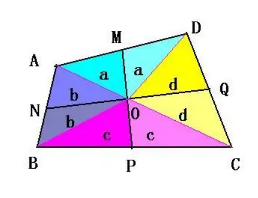

既然有凸四边形，也会有凹四边形，如下图所示。

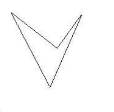

显然其不属于凸集合。

在OCR领域，文档识别作为重要的预处理步骤，采用四边形表示文字区域，然后通过透视变换转换为矩形表示。这类的文字区域往往可以通过凸四边形来表达。表示此类的四边形可以采用四个角点的坐标表示，四个点按照顺时针或者逆时针排列。

下面我们从一类特殊矩形-----旋转矩形入手，看看如何将其转换为凸四边形，紧接着求取这两个四边形的IOU。

## 一、旋转矩形的坐标转换

### 1.1 旋转向量的表示

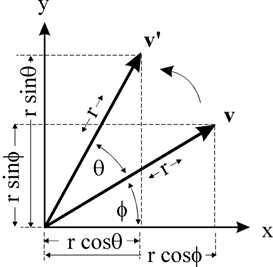

如上图所示，向量 $v$ 绕原点逆时针旋转 $\theta$ 角，得到点 $v'$ ，假设 $v$ 点的坐标是 $(x,y)$ ，那么可以推导得到 $v'$ 点的坐标(x', y')(设原点到v的距离是r，原点到v点的向量与x轴的夹角是 $\Phi$ )。

$$
x = r \cos \Phi \\
y = r sin \Phi
$$

$$
x' = r \cos (\theta + \phi) \\
y' = r \sin (\theta + \phi)
$$

通过三角函数展开得到

$$
x' = r \cos (\theta + \phi) = r \cos \theta \cos \phi - r \sin \theta \sin \phi \\
y' = r \sin (\theta + \phi) = r \sin \theta \cos \phi + r \cos \theta \sin \phi
$$

带入 $x$ 和 $y$ 的表达式可以得到

$$
x' = x \cos \theta - y \sin \theta \\
y' = x \sin \theta + y \cos \theta
$$

写成矩阵的形式为：

$$
\begin{bmatrix}
x' \\
y'
\end{bmatrix} = \begin{bmatrix} 
\cos \theta  & -\sin \theta \\
\sin \theta  & cos \theta
\end{bmatrix} * \begin{bmatrix} 
x \\
y
\end{bmatrix}
$$
### 1.2 旋转矩形的表示

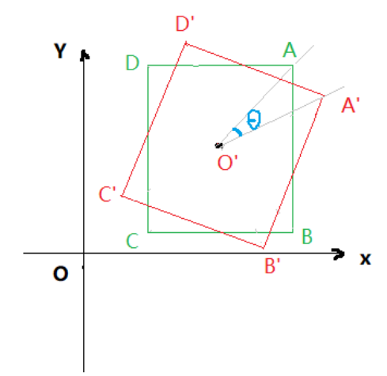

如上图所示，红色框A'B'C'D'为目标斜框，绿色框ABCD表示轴向框，轴向框顺时针旋转 $\theta$ 后得到目标斜框，现需要求出斜框各顶点A′,B′,C',D'的坐标。

以(x,y,w,h, $\theta$ )表示上述矩形，x和y代表中心点的坐标， $\theta$ 为顺时针的角度，按照1.1节所述（逆时针），顺时针旋转矩阵为

$$
\begin{bmatrix} 
\cos \theta  & \sin \theta \\
-\sin \theta  & cos \theta
\end{bmatrix}
$$

所以向量O'A' = T  $\cdot$  O'A， O'B' = T  $\cdot$  O'B，O'C' = T  $\cdot$  O'C，O'D' = T  $\cdot$  O'D

以向量O'A'求解为例，其横坐标为 $X_{O'A'} = \cos \theta * \frac{w}{2} + \sin \theta * \frac{h}{2}$ ，纵坐标 $Y_{O'A'} = - \sin \theta * \frac{w}{2} + \cos \theta * \frac{h}{2}$ 

所以

$$
O'A'(w * \cos \theta * 0.5 + h * \sin \theta * 0.5, - w * \sin \theta * 0.5 + h * cos \theta * 0.5)
$$

因此，顶点A'的坐标为：

$$
A'(x + w * \cos \theta * 0.5 + h * \sin\theta * 0.5, y - w * \sin \theta * 0.5 + h * \cos \theta * 0.5)
$$

同理：

$$
\begin{align*}
& O'B'(w * \cos \theta * 0.5 - h * \sin \theta * 0.5, - w * \sin \theta * 0.5 - h * cos \theta * 0.5) \\
& O'C'(-w * \cos \theta * 0.5 - h * \sin \theta * 0.5, w * \sin \theta * 0.5 - h * cos \theta * 0.5) \\
& O'D'(-w * \cos \theta * 0.5 + h * \sin \theta * 0.5, w * \sin \theta * 0.5 + h * cos \theta * 0.5)
\end{align*}
$$

所以有：

$$
\begin{align*}
& B'(x + w * \cos \theta * 0.5 - h * \sin\theta * 0.5, y - w * \sin \theta * 0.5 - h * \cos \theta * 0.5) \\
& C'(x - w * \cos \theta * 0.5 - h * \sin\theta * 0.5, y + w * \sin \theta * 0.5 - h * \cos \theta * 0.5) \\
& D'(x - w * \cos \theta * 0.5 + h * \sin\theta * 0.5, y + w * \sin \theta * 0.5 + h * \cos \theta * 0.5) \\
& C'(2x - X_{A'}, 2y - Y_{A'}) \\
& D'(2x - X_{B'}, 2y - Y_{B'})
\end{align*}
$$

代码实现


```python
import numpy as np
import math
import matplotlib.pyplot as plt
import matplotlib.patches as mptch


class RotatedBox:

    def __init__(self, x, y, w, h, theta):
        self.x = x
        self.y = y
        self.w = w
        self.h = h
        self.theta = theta


class Point:

    def __init__(self, x, y):
        self.x = x
        self.y = y

    def __add__(self, other: 'Point'):
        return Point(other.x + self.x, other.y + self.y)


def main():
    x = -5
    y = -5
    w = 15
    h = 20
    theta = 45
    theta = theta / 180 * math.pi
    det_box = RotatedBox(x, y, w, h, theta)

    points = [Point(0, 0) for _ in range(4)]
    cos_theta = math.cos(theta) * 0.5
    sin_theta = math.sin(theta) * 0.5

    points[0].x = det_box.x + sin_theta * det_box.h + cos_theta * det_box.w
    points[0].y = det_box.y + cos_theta * det_box.h - sin_theta * det_box.w

    points[1].x = det_box.x - sin_theta * det_box.h + cos_theta * det_box.w
    points[1].y = det_box.y - cos_theta * det_box.h - sin_theta * det_box.w

    points[2].x = 2 * det_box.x - points[0].x
    points[2].y = 2 * det_box.y - points[0].y

    points[3].x = 2 * det_box.x - points[1].x
    points[3].y = 2 * det_box.y - points[1].y

    for point in points:
        print('point', point.x, point.y)

    # 用matplotlib绘制出来

    fig, ax = plt.subplots()
    fig.set_figheight(6)
    fig.set_figwidth(6)
    # 绘制矩形
    # 第一个参数为左下角坐标 第二个参数为width 第三个参数为height
    x_center, y_center, width, height = det_box.x, det_box.y, det_box.w, det_box.h
    x1 = x_center - det_box.w / 2
    y1 = y_center - det_box.h / 2
    x2 = x_center + det_box.w / 2
    y2 = y_center + det_box.h / 2

    # print(x1, y1)

    rect = plt.Rectangle((x1, y1), det_box.w, det_box.h, angle=0, fill=False, color="blue")
    ax.add_patch(rect)

    # 绕 center (x,y) 旋转45度
    polygon = mptch.Polygon(xy=[(points[i].x, points[i].y) for i in range(4)], closed=True, color="red", fill=False)
    ax.add_patch(polygon)

    # 设置坐标轴
    ax.set_xlim(-30, 30)
    ax.set_ylim(-30, 30)
    # 定义坐标
    x = np.arange(-30, 31, 5)
    y = np.arange(-30, 31, 5)
    ax.set_xticks(x)
    ax.set_yticks(y)
    ax.grid(True)
    # 显示图象
    plt.show()


if __name__ == "__main__":
    main()

"""
point 7.374368670764582 -3.232233047033631
point -6.767766952966369 -17.374368670764582
point -17.374368670764582 -6.767766952966369
point -3.232233047033631 7.374368670764582
"""
```


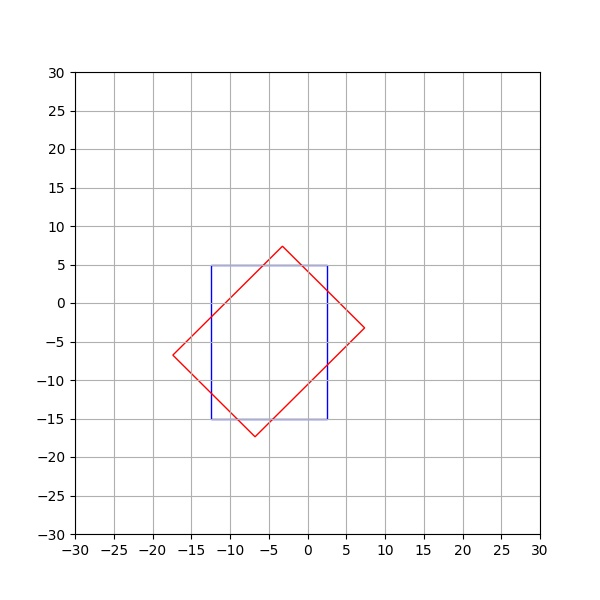

## 二、线段相交

记两线段为AB与CD

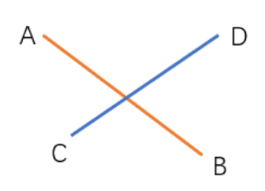

### 2.1 法一

1. 先判断线段是否共线

依据共线向量叉乘为零向量来判断

 $\vec{AB} 与 \vec{CD}$ 叉乘是否为0，如果为0则共线

1. 在不共线情况下判断是否相交

依据 $0 \leq t \leq 1$ 且 $0 \leq u \leq 1$ 来判断，其中 $t$ 和 $u$ 的推导过程如下：

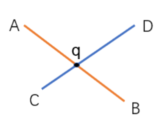

假设交点为P，则有P=A+ $\vec{AB} * t$ ， $t \in [0, 1]$ 且 $P = C + \vec{CD} * u$ ，  $u \in [0,1]$ ，即

$$
\vec{OA} + \vec{AB} * t = \vec{OC} + \vec{CD} * u ===> \\
\vec{AB} * t = \vec{AC} + \vec{CD} * u
$$

由于向量自身的叉乘为0，所以上式两边同时叉乘 $\vec{CD}$ 可得：

$$
\vec{CD} \times \vec{AB} * t = \vec{CD} \times \vec{AC}
$$

求得t得：

$$
t = \frac{\vec{CD} \times \vec{AC}}{\vec{CD} \times \vec{AB}}, t \in [0, 1]
$$

同理，两边同时叉乘 $\vec{AB}$ 可得： $- \vec{AB} \times \vec{CD} * u = \vec{AB} \times \vec{AC}$ ，所以：

$$
u = \frac{\vec{AB} \times \vec{AC}}{\vec{CD} \times \vec{AB}}, u \in [0, 1]
$$
> 这里需要说明的是向量是不支持除法的，这里由于平面向量叉乘后结果是垂直于平面的向量，其一定方向相同，都位于Z轴，所以除法代表的含义是与z轴共线的两个向量的z轴方向的坐标值相除。

1. 在相交的情况下计算交点

依据第2步计算的t和u，代入： $P = A + \vec {AB} * t$ ， $t \in [0, 1]$ 且 $P = C +\vec{CD} * u$ ， $u \in [0, 1]$ 即可求出交点P的坐标。

**代码实现**


```python
import numpy as np
import math
import matplotlib.pyplot as plt
import matplotlib.patches as mptch


class Point:

    def __init__(self, x, y):
        self.x = x
        self.y = y

    def __add__(self, other: 'Point'):
        return Point(other.x + self.x, other.y + self.y)

    def __sub__(self, other: 'Point'):
        return Point(self.x - other.x, self.y - other.y)

    def __mul__(self, other_scaler):
        return Point(self.x * other_scaler, self.y * other_scaler)

    def __str__(self):
        return f"Point({self.x}, {self.y})"

    __repr__ = __str__


class Line:

    def __init__(self, start_point, end_point):
        self.start_point = start_point
        self.end_point = end_point

    def get_vector_point(self):
        return Point(self.end_point.x - self.start_point.x, self.end_point.y - self.start_point.y)


def cross2d(A: Point, B: Point):
    return A.x * B.y - B.x * A.y


def get_intersection_points(line1: Line, line2: Line):

    line1_vec = line1.get_vector_point()
    line2_vec = line2.get_vector_point()

    det_value = cross2d(line2_vec, line1_vec)

    if abs(det_value) < 1e-14:
        return False, Point(0, 0)

    ac_line_vec = line2.start_point - line1.start_point

    t = cross2d(line2_vec, ac_line_vec) / det_value
    u = cross2d(line1_vec, ac_line_vec) / det_value

    eps = 1e-14

    if -eps <= t <= 1.0 + eps and -eps <= u <= 1.0 + eps:
        return True, line1.start_point + line1_vec * t

    return False, Point(0, 0)


def main():

    A = Point(0, 0)
    B = Point(2, 0)
    C = Point(2, 2)
    D = Point(0, 2)
    E = Point(1, 3)

    plt.plot([A.x, B.x], [A.y, B.y])
    plt.plot([C.x, D.x], [C.y, D.y])
    plt.plot([A.x, E.x], [A.y, E.y])

    plt.scatter(A.x, A.y)
    plt.scatter(B.x, B.y)
    plt.scatter(C.x, C.y)
    plt.scatter(D.x, D.y)
    plt.scatter(E.x, E.y)

    plt.text(A.x, A.y, 'A')
    plt.text(B.x, B.y, 'B')
    plt.text(C.x, C.y, 'C')
    plt.text(D.x, D.y, 'D')
    plt.text(E.x, E.y, 'E')

    # 判断 AB 是否与 CD相交 如果相交求出交点
    is_intersect, intersection_point = get_intersection_points(Line(A, B), Line(C, D))
    if is_intersect:
        print(f'AB 与 CD 交点为 {intersection_point}')
        plt.scatter(intersection_point.x, intersection_point.y)
        plt.text(intersection_point.x, intersection_point.y, 'ABxCD')
    else:
        print('AB 与 CD 没有相交')

    # 判断 AE 是否与 CD相交 如果相交求出交点
    is_intersect, intersection_point = get_intersection_points(Line(A, E), Line(C, D))
    if is_intersect:
        print(f'AE 与 CD 交点为 {intersection_point}')
        plt.scatter(intersection_point.x, intersection_point.y)
        plt.text(intersection_point.x, intersection_point.y, 'AExCD')
    else:
        print('AE 与 CD 没有相交')

    plt.show()


if __name__ == "__main__":
    main()
```


绘制结果

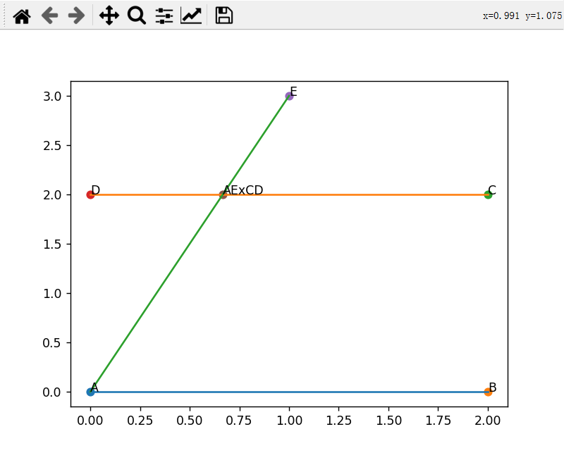

### 2.2 法二

法二是利用线段相交则一条线段两端点位于另一线段两侧来判断

**1. 先判断线段是否共线**

同方法一

**2. 在不共线情况下判断是否相交**

**依据线段相交则一条线段两端点位于另一线段两侧来判断**
相交情况下有如下两种情形：

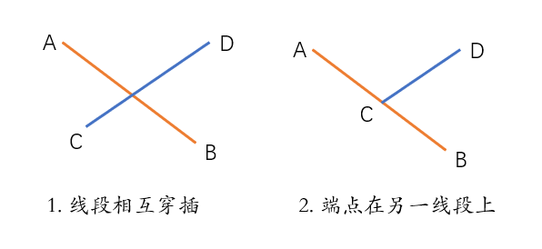

判断是否在两侧可以依据两个向量的叉乘(右手法则)，如下：

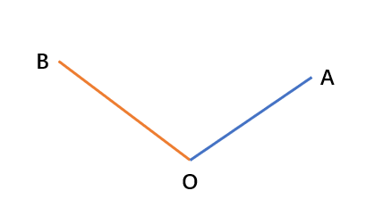

 $\vec{OA} \times \vec{OB} > 0$ ，则 $\vec{OB}$ 在 $\vec{OA}$ 的逆时针方向

 $\vec{OB} \times \vec{OA} < 0$ ，则 $\vec{OA}$ 在 $\vec{OB}$ 的顺时针方向

所以，相交的两种情况下有：

* 情况1

点C和D在AB两侧，则有：

 $(\vec{AC} \times \vec{AB}) \cdot (\vec{AD} \times \vec{AB}) <0$ 

点A和B在CD两侧，则有：

 $(\vec{CA} \times \vec{CD}) \cdot (\vec{CB} \times \vec{CD}) <0$ 

* 情况2

由于端点在线段上，所有有一个叉乘为0，因此

$$
(\vec{AC} \times \vec{AB}) \cdot (\vec{AD} \times \vec{AB}) = 0
$$

且

$$
(\vec{CA} \times \vec{CD}) \cdot (\vec{CB} \times \vec{CD}) = 0
$$

那么如何计算交点呢？首先叉积可以算面积，根据面积之比，算得交点O在线段CD上的比例位置。然后用这个比例插值得到坐标。

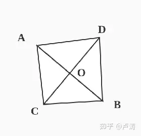

$$
\lambda = \frac{OC}{OD} = \frac{area(ABC)}{area(ABD)} = \frac{\frac{1}{2} ||\vec{AB} \times \vec{AC}|| }{ \frac{1}{2} ||\vec{AB} \times \vec{AD}|| }
$$

$$
O_x = C_x + \frac{\lambda}{\lambda + 1}(D_x - C_x) \\
O_y = C_y + \frac{\lambda}{\lambda + 1}(D_y - C_y)
$$


```python
import numpy as np
import math
import matplotlib.pyplot as plt
import matplotlib.patches as mptch


class Point:

    def __init__(self, x, y):
        self.x = x
        self.y = y

    def __add__(self, other: 'Point'):
        return Point(other.x + self.x, other.y + self.y)

    def __sub__(self, other: 'Point'):
        return Point(self.x - other.x, self.y - other.y)

    def __mul__(self, other_scaler):
        return Point(self.x * other_scaler, self.y * other_scaler)

    def __str__(self):
        return f"Point({self.x}, {self.y})"

    __repr__ = __str__


class Line:

    def __init__(self, start_point, end_point):
        self.start_point = start_point
        self.end_point = end_point

    def get_vector_point(self):
        return Point(self.end_point.x - self.start_point.x, self.end_point.y - self.start_point.y)


def cross2d(A: Point, B: Point):
    return A.x * B.y - B.x * A.y


def get_intersection_points(line1: Line, line2: Line):

    AB = line1.get_vector_point()
    CD = line2.get_vector_point()
    AC = line2.start_point - line1.start_point
    AD = line2.end_point - line1.start_point
    CB = line1.end_point - line2.start_point
    CA = line1.start_point - line2.start_point

    det_value = cross2d(CD, AB)

    if abs(det_value) < 1e-14:
        return False, Point(0, 0)

    eps = 1e-14
    cross_AC_AB = cross2d(AC, AB)
    cross_AD_AB = cross2d(AD, AB)
    cross_CA_CD = cross2d(CA, CD)
    cross_CB_CD = cross2d(CB, CD)

    print('cross_AC_AB * cross_AD_AB', cross_AC_AB * cross_AD_AB)
    print('cross_CA_CD * cross_CB_CD', cross_CA_CD * cross_CB_CD)
    if cross_AC_AB * cross_AD_AB <= eps and cross_CA_CD * cross_CB_CD <= eps:
        lambda_k = abs(cross_AC_AB / cross_AD_AB)
        x = line2.start_point.x + (lambda_k / (lambda_k + 1)) * (line2.end_point.x - line2.start_point.x)
        y = line2.start_point.y + (lambda_k / (lambda_k + 1)) * (line2.end_point.y - line2.start_point.y)
        return True, Point(x, y)


    return False, Point(0, 0)


def main():

    A = Point(0, 0)
    B = Point(2, 0)
    C = Point(2, 2)
    D = Point(0, 2)
    E = Point(1, 3)

    plt.plot([A.x, B.x], [A.y, B.y])
    plt.plot([C.x, D.x], [C.y, D.y])
    plt.plot([A.x, E.x], [A.y, E.y])

    plt.scatter(A.x, A.y)
    plt.scatter(B.x, B.y)
    plt.scatter(C.x, C.y)
    plt.scatter(D.x, D.y)
    plt.scatter(E.x, E.y)

    plt.text(A.x, A.y, 'A')
    plt.text(B.x, B.y, 'B')
    plt.text(C.x, C.y, 'C')
    plt.text(D.x, D.y, 'D')
    plt.text(E.x, E.y, 'E')

    # 判断 AB 是否与 CD相交 如果相交求出交点
    is_intersect, intersection_point = get_intersection_points(Line(A, B), Line(C, D))
    if is_intersect:
        print(f'AB 与 CD 交点为 {intersection_point}')
        plt.scatter(intersection_point.x, intersection_point.y)
        plt.text(intersection_point.x, intersection_point.y, 'ABxCD')
    else:
        print('AB 与 CD 没有相交')

    # 判断 AE 是否与 CD相交 如果相交求出交点
    is_intersect, intersection_point = get_intersection_points(Line(A, E), Line(C, D))
    if is_intersect:
        print(f'AE 与 CD 交点为 {intersection_point}')
        plt.scatter(intersection_point.x, intersection_point.y)
        plt.text(intersection_point.x, intersection_point.y, 'AExCD')
    else:
        print('AE 与 CD 没有相交')

    plt.show()


if __name__ == "__main__":
    main()
```


可视化结果为


## 三、判断点是否在凸多边形内部

为什么要有这一步呢？因为当凸四边形相交的情况会出现有一个四边形的角点在另外一个四边形内部的情况，这样求其相交区域就需要知道相交区域的多个点。

下图节选自RRPN文章

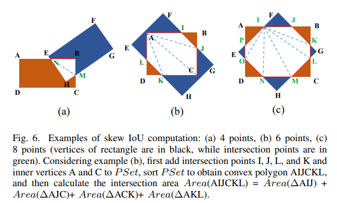

如上图所示，情况b，矩形A的角点落在的矩形B的内部区域内，两矩形相交的多边形区域的角点就包含矩形A的角点。

根据参考链接，判断一个点是否在多边形内部的常见方法有如下几种

* 面积和判别法：判断目标点与多边形的每条边组成的三角形面积和是否等于该多边形，相等则在多边形内部。
* 夹角和判别法：判断目标点与所有边的夹角和是否为360度，为360度则在多边形内部。
* 引射线法：从目标点出发引一条射线，看这条射线和多边形所有边的交点数目。如果有奇数个交点，则说明在内部，如果有偶数个交点，则说明在外部

下面我们详细介绍一下射线法

1. 情况1：显示了具有 14 条边的严重凹陷多边形的典型情况

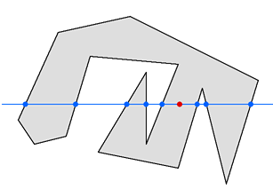

* 上图 显示了具有 14 条边的凹多边形的典型情况
* **红点是需要测试的点**，以确定它是否位于多边形内。解法方案是从测试点Y沿着水平方向向外引出一条直线，数一下直线与多边形边的交点个数。
* 在此示例中，多边形的八条边穿过蓝色直线，如果测试点的每一侧都有奇数个节点，则它位于多边形内部;如果测试点的每一侧都有偶数个节点，则它位于多边形之外。在我们的示例中，测试点的左侧有五个节点，右侧有三个节点。由于 5 和 3 是奇数，因此我们的测试点位于多边形内部。
* 情况2:，显示了多边形自身交叉时发生的情况

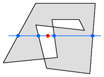

在此示例中，十边形的线彼此相交。多边形中重叠的部分相互抵消。因此，测试点位于多边形之外，如其两侧的偶数个节点（两个和两个）所示。

1. 情况3：六边形本身不重叠，但它确实有交叉的线

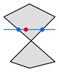

1. 显示了多边形的情况，其中一条边完全位于多边形边的端点上

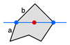

既然边a和边 b共享端点，恰好引出直线又刚好碰到该端点，那么该端点是否可以被统计两次呢？不，因为这样测试点的每一侧都会有两个节点，因此测试会说它在多边形之外，而显然不是！

解决方案：两个边的两个端点位于该直线两侧，仅选择一侧作为交点。假设我们将该端点假定为属于a不属于b的（即在线段两端点有一个位于直线下方的产生交点），那么该直线与两侧边相交点的个数都是1，满足要求。

1. 显示了多边形的情况，其中一条边完全位于直线上

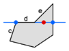

**只需遵循有关情况四所述的规则即可**，线段c会产生一个交点，线段d不会产生交点，因为它的两个终点都位于直线上或直线上面。而端e也不会生成节点，因为它的两个端点都位于直线上或之上。

1. 一个特殊情况

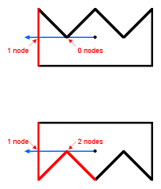

* 多边形的一个内部角点正好触及直线。在上图中，只有一侧（以红色隐藏）在测试点的左侧生成一个节点，而在底部的示例中，三条边可以。无论哪种方式，该数字都是奇数，并且测试点将被视为在多边形内。
* 如果测试点位于多边形的边界上，则此算法将提供不可预知的结果;

我们回顾下直线方程：

平面直线的表达方式有四种

1. 点斜式（用于已知斜率和一点坐标）

$$
y - y_1 = k(x - x_1)
$$

1. 斜截式（用于已知斜率和y轴截距）

$$
y = kx + b
$$

1. 两点式（用于已知两点坐标）

$$
\frac{x - x_1} {x_2 - x_1} = \frac{y - y_1} {y_2 - y_1}
$$

1. 截距式（用于已知所有截距）

$$
\frac{x}{a} + \frac{y}{b} = 1
$$

我们这里对多边形边的线段描述采用两点式方程，假设测试点坐标为 $(x_p, y_p)$ ，做直线 $y = y_p$ 代表从交点引出的射线。

假设线段两个端点分别为 $(x_1, y_1)$ ， $(x_2, y_2)$ ， $y_1 < y_2$ 。如果直线 $y=y_p$ 与该线段相交，则满足

$$
y_1 \le y_p \le y_2
$$

再加上射线约束条件，假定我们的射线取直线的左侧，则射线方程为

$$
\begin{align*}
& y = y_p \\
& x <= x_p
\end{align*}
$$

则线段如果与该射线相交，还需要满足

$$
\min(x_1, x_2) <= x_p
$$

再加上情况四的限制条件，修正相交限制条件为

$$
\begin{align*}
& y_1 \lt y_p \le y_2 \\
& \min(x_1, x_2) <= x_p
\end{align*}
$$

此外，将 $y=y_p$ 带入线段方程后，求得的x值要小于 $x_p$ ，即该交点需要位于该射线上，公式如下

$$
\frac{y_p - y_1} {y_2 - y_1} (x_2 - x_1) + x_1 < x_p
$$

不加等于号，是为了排除测试点在线段上的情况。

代码实现如下


```python
import numpy as np
import math
import matplotlib.pyplot as plt
import matplotlib.patches as mptch
from typing import List


class RotatedBox:

    def __init__(self, x, y, w, h, theta):
        self.x = x
        self.y = y
        self.w = w
        self.h = h
        self.theta = theta


class Point:

    def __init__(self, x, y):
        self.x = x
        self.y = y

    def __add__(self, other: 'Point'):
        return Point(other.x + self.x, other.y + self.y)

    def __sub__(self, other: 'Point'):
        return Point(self.x - other.x, self.y - other.y)

    def __mul__(self, other_scaler):
        return Point(self.x * other_scaler, self.y * other_scaler)

    def __str__(self):
        return f"Point({self.x}, {self.y})"

    __repr__ = __str__


class Line:

    def __init__(self, start_point:Point, end_point:Point):
        self.start_point:Point = start_point
        self.end_point:Point = end_point

    def get_vector_point(self):
        return Point(self.end_point.x - self.start_point.x, self.end_point.y - self.start_point.y)


def in_polygon(lines: List[Line], point: Point):

    odd_nodes = False

    x = point.x
    y = point.y

    for line in lines:
        y1 = line.start_point.y
        y2 = line.end_point.y
        x1 = line.start_point.x
        x2 = line.end_point.x
        if ((y1 < y <= y2) or (y2 < y <= y1)) and min(x1, x2) <= x:
            x_pred = (y - y1) / (y2 - y1) * (x2 - x1) + x1
            if x_pred < x:
                odd_nodes = not odd_nodes

    return odd_nodes


def main():

    x = -5
    y = -5
    w = 15
    h = 20
    theta = 45
    theta = theta / 180 * math.pi
    det_box = RotatedBox(x, y, w, h, theta)

    points = [Point(0, 0) for _ in range(4)]
    cos_theta = math.cos(theta) * 0.5
    sin_theta = math.sin(theta) * 0.5

    points[0].x = det_box.x + sin_theta * det_box.h + cos_theta * det_box.w
    points[0].y = det_box.y + cos_theta * det_box.h - sin_theta * det_box.w

    points[1].x = det_box.x - sin_theta * det_box.h + cos_theta * det_box.w
    points[1].y = det_box.y - cos_theta * det_box.h - sin_theta * det_box.w

    points[2].x = 2 * det_box.x - points[0].x
    points[2].y = 2 * det_box.y - points[0].y

    points[3].x = 2 * det_box.x - points[1].x
    points[3].y = 2 * det_box.y - points[1].y

    points_1 = points + points[0:1]
    lines = [Line(points_1[i], points_1[i+1]) for i in range(4)]

    fig, ax = plt.subplots()
    fig.set_figheight(6)
    fig.set_figwidth(6)
    # 绘制矩形

    # 绕 center (x,y) 旋转45度
    polygon = mptch.Polygon(xy=[(points[i].x, points[i].y) for i in range(4)], closed=True, color="red", fill=False)
    ax.add_patch(polygon)
    np.random.seed(20)
    test_points = [Point(np.random.uniform(-30, 30), np.random.uniform(-30, 30)) for i in range(30)]
    for test_point in test_points:

        if in_polygon(lines, test_point):
            print(f'{test_point} 在多边形中')
            plt.scatter(test_point.x, test_point.y, color="red")
        else:
            print(f'{test_point} 不在多边形中')
            plt.scatter(test_point.x, test_point.y, color="blue")

    # 设置坐标轴
    ax.set_xlim(-30, 30)
    ax.set_ylim(-30, 30)
    # 定义坐标
    x = np.arange(-30, 31, 5)
    y = np.arange(-30, 31, 5)
    ax.set_xticks(x)
    ax.set_yticks(y)
    ax.grid(True)
    # 显示图象
    plt.show()


if __name__ == "__main__":
    main()
```


可视化结果如下

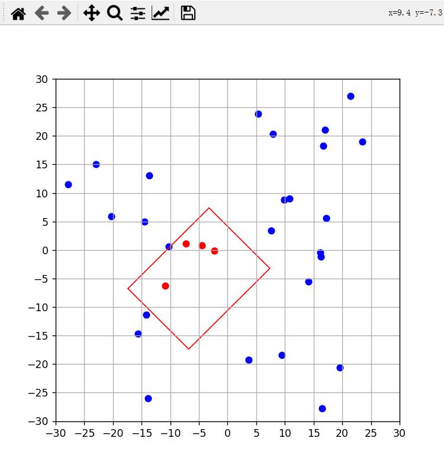

## 四、凸包算法

### 4.1 求取凸四边形相交后的多边形的角点

我们将两个凸四边形的四个点按照顺序排列，然后写一个两重循环，分别取凸四边形A中的边和凸四边形B中的边来计算交点交点，最终拿到的交点的集合再加上**两个四边形角点在另外一个四边形区域内的角点集合** 即为两个凸四边形相交后多边形的所有的点。

下图节选自RRPN文章

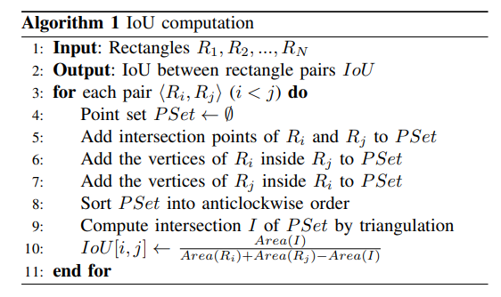

代码即为整合前两章的内容


```python
import numpy as np
import math
import matplotlib.pyplot as plt
import matplotlib.patches as mptch
from typing import List
import math


class RotatedBox:

    def __init__(self, x, y, w, h, theta):
        self.x = x
        self.y = y
        self.w = w
        self.h = h
        self.theta = theta


class Point:

    def __init__(self, x, y):
        self.x = x
        self.y = y

    def __add__(self, other: 'Point'):
        return Point(other.x + self.x, other.y + self.y)

    def __sub__(self, other: 'Point'):
        return Point(self.x - other.x, self.y - other.y)

    def __mul__(self, other_scaler):
        return Point(self.x * other_scaler, self.y * other_scaler)

    def __truediv__(self, other_scaler):
        return Point(self.x / other_scaler, self.y / other_scaler)

    def __str__(self):
        return f"Point({self.x}, {self.y})"

    __repr__ = __str__


class Line:

    def __init__(self, start_point, end_point):
        self.start_point = start_point
        self.end_point = end_point

    def get_vector_point(self):
        return Point(self.end_point.x - self.start_point.x, self.end_point.y - self.start_point.y)


def cross2d(A: Point, B: Point):
    return A.x * B.y - B.x * A.y


def get_intersection_points(line1: Line, line2: Line):

    line1_vec = line1.get_vector_point()
    line2_vec = line2.get_vector_point()

    det_value = cross2d(line2_vec, line1_vec)

    if abs(det_value) < 1e-14:
        return False, Point(0, 0)

    ac_line_vec = line2.start_point - line1.start_point

    t = cross2d(line2_vec, ac_line_vec) / det_value
    u = cross2d(line1_vec, ac_line_vec) / det_value

    eps = 1e-14

    if -eps <= t <= 1.0 + eps and -eps <= u <= 1.0 + eps:
        return True, line1.start_point + line1_vec * t

    return False, Point(0, 0)


def in_polygon(lines: List[Line], point: Point):

    odd_nodes = False

    x = point.x
    y = point.y

    for line in lines:
        y1 = line.start_point.y
        y2 = line.end_point.y
        x1 = line.start_point.x
        x2 = line.end_point.x
        if ((y1 < y <= y2) or (y2 < y <= y1)) and min(x1, x2) <= x:
            x_pred = (y - y1) / (y2 - y1) * (x2 - x1) + x1
            print(y, x, x_pred, x1, y1, x2, y2)
            if x_pred < x:
                odd_nodes = not odd_nodes

    return odd_nodes


def main():

    x = -5
    y = -5
    w = 15
    h = 20
    theta = 45
    theta = theta / 180 * math.pi
    det_box = RotatedBox(x, y, w, h, theta)

    points = [Point(0, 0) for _ in range(4)]
    cos_theta = math.cos(theta) * 0.5
    sin_theta = math.sin(theta) * 0.5

    points[0].x = det_box.x + sin_theta * det_box.h + cos_theta * det_box.w
    points[0].y = det_box.y + cos_theta * det_box.h - sin_theta * det_box.w

    points[1].x = det_box.x - sin_theta * det_box.h + cos_theta * det_box.w
    points[1].y = det_box.y - cos_theta * det_box.h - sin_theta * det_box.w

    points[2].x = 2 * det_box.x - points[0].x
    points[2].y = 2 * det_box.y - points[0].y

    points[3].x = 2 * det_box.x - points[1].x
    points[3].y = 2 * det_box.y - points[1].y


    x1 = x - w / 2
    y1 = y - h / 2

    x2 = x + w / 2
    y2 = y - h / 2

    x3 = x + w / 2
    y3 = y + h / 2

    x4 = x - w / 2
    y4 = y + h / 2

    # 判断 各个直线之间是否有交点
    A = Point(x1, y1)
    B = Point(x2, y2)
    C = Point(x3, y3)
    D = Point(x4, y4)

    points_1 = points + points[0:1]
    points_2 = [A, B, C, D] + [A]
    print('points_2', points_2)

    fig, ax = plt.subplots()
    fig.set_figheight(6)
    fig.set_figwidth(6)

    # 绘制矩形
    # 第一个参数为左下角坐标 第二个参数为width 第三个参数为height
    x_center, y_center, width, height = det_box.x, det_box.y, det_box.w, det_box.h
    x1 = x_center - det_box.w / 2
    y1 = y_center - det_box.h / 2
    x2 = x_center + det_box.w / 2
    y2 = y_center + det_box.h / 2

    rect = plt.Rectangle((x1, y1), det_box.w, det_box.h, angle=0, fill=False, color="blue")
    ax.add_patch(rect)

    # 绕 center (x,y) 旋转45度
    polygon = mptch.Polygon(xy=[(points[i].x, points[i].y) for i in range(4)], closed=True, color="red", fill=False)
    ax.add_patch(polygon)

    insection_points = []

    for i in range(4):
        for j in range(4):
            line1 = points_1[i:i+2]
            line2 = points_2[j:j+2]

            is_intersect, intersection_point = get_intersection_points(Line(line1[0], line1[1]), Line(line2[0], line2[1]))

            if is_intersect:
                plt.scatter(intersection_point.x, intersection_point.y)
                insection_points.append(intersection_point)

    lines_1 = [Line(points_1[i], points_1[i+1]) for i in range(4)]
    lines_2 = [Line(points_2[i], points_2[i+1]) for i in range(4)]

    for i in range(4):
        point = points_1[i]
        if in_polygon(lines_2, point):
            print(f'{point} 在多边形中')
            insection_points.append(point)
        else:
            print(f'{point} 不在多边形中')

    for i in range(4):
        point = points_2[i]
        if in_polygon(lines_1, point):
            print(f'{point} 在多边形中')
            insection_points.append(point)
        else:
            print(f'{point} 不在多边形中')


    center_point = Point(0, 0)
    for point in insection_points:
        center_point += point
    center_point /= len(insection_points)

    vectors = [point - center_point for point in insection_points]
    vectors_degree = [math.atan2(vector.y, vector.x) for vector in vectors]
    vectors = list(zip(vectors, insection_points, vectors_degree))
    vectors.sort(key=lambda x: x[-1])

    for i, (_, point, _) in enumerate(vectors):
        plt.scatter(point.x, point.y, color="red")
        plt.text(point.x, point.y, f'{i}')

    # 设置坐标轴
    ax.set_xlim(-30, 30)
    ax.set_ylim(-30, 30)
    # 定义坐标
    x = np.arange(-30, 31, 5)
    y = np.arange(-30, 31, 5)
    ax.set_xticks(x)
    ax.set_yticks(y)
    ax.grid(True)
    # 显示图象
    plt.show()


if __name__ == "__main__":
    main()
```


可视化结果如下：

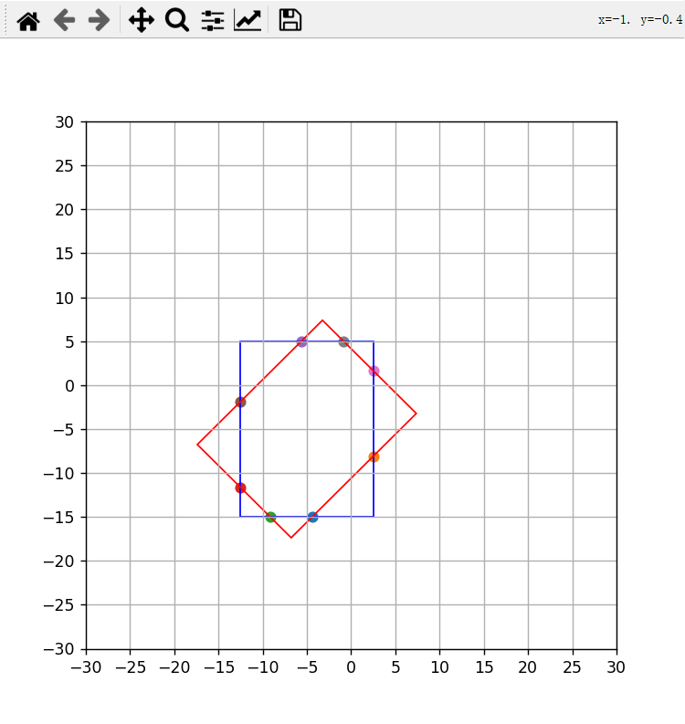

### 4.2 构造点集构造凸多边形

拿到内凸多边形的所有点后，我们需要针对这些点按照顺时针或者逆时针的顺序做一个排序。

根据前面的介绍，整理顺序可以直接想到的思路是求取中心点，然后计算中心点指向每个角点的向量，固定其中某一个向量，按照向量间顺时针角度或者逆时针角度进行排序。

此时我们可以按照前面说的叉乘来判断两个向量的旋向顺序，不过这个时候我想介绍另外一种方法，这是我在商汤实习的时候想出来的，即向量之间的夹角采用方位角来表示。

编程中有一个与之对应的`atan2`函数

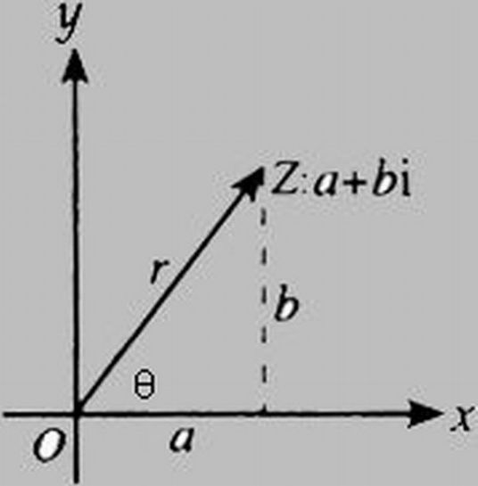

`atan2`函数返回的是原点至点(x, y)的方位角，即与x轴的夹角，单位是弧度，范围 $[-\pi, \pi]$ 

1. y = x = 0 取值范围为常数0
2. y = 0, x > 0 取值范围为常数0
3. x > 0, y > 0 取值范围 $(0, \frac{\pi}{2})$
4. x = 0, y > 0 取值范围为常数 $\frac{\pi}{2}$
5. x < 0, y > 0 取值范围为 $(\frac{\pi}{2}, \pi)$
6. y = 0, x < 0 取值范围为常数 $\pi$
7. x < 0, y < 0 取值范围为 $(-\pi, -\frac{\pi}{2})$
8. x = 0, y < 0 取值范围为常数 $\frac{\pi}{2}$
9. x > 0 y < 0 取值范围为 $(\frac{\pi}{2}, 0)$

我们可以利用该函数求得每个向量与x轴的方向角，然后按照方向角进行排序。

实现代码


```python
import numpy as np
import math
import matplotlib.pyplot as plt
import matplotlib.patches as mptch
from typing import List
import math


class RotatedBox:

    def __init__(self, x, y, w, h, theta):
        self.x = x
        self.y = y
        self.w = w
        self.h = h
        self.theta = theta


class Point:

    def __init__(self, x, y):
        self.x = x
        self.y = y

    def __add__(self, other: 'Point'):
        return Point(other.x + self.x, other.y + self.y)

    def __sub__(self, other: 'Point'):
        return Point(self.x - other.x, self.y - other.y)

    def __mul__(self, other_scaler):
        return Point(self.x * other_scaler, self.y * other_scaler)

    def __truediv__(self, other_scaler):
        return Point(self.x / other_scaler, self.y / other_scaler)

    def __str__(self):
        return f"Point({self.x}, {self.y})"

    __repr__ = __str__


class Line:

    def __init__(self, start_point, end_point):
        self.start_point = start_point
        self.end_point = end_point

    def get_vector_point(self):
        return Point(self.end_point.x - self.start_point.x, self.end_point.y - self.start_point.y)


def cross2d(A: Point, B: Point):
    return A.x * B.y - B.x * A.y


def get_intersection_points(line1: Line, line2: Line):

    line1_vec = line1.get_vector_point()
    line2_vec = line2.get_vector_point()
    det_value = cross2d(line1_vec, line2_vec)

    if abs(det_value) < 1e-14:
        return False, Point(0, 0)

    ac_line_vec = line2.end_point - line1.start_point

    t = abs(cross2d(line2_vec, ac_line_vec)) / abs(det_value)
    u = abs(cross2d(line1_vec, ac_line_vec)) / abs(det_value)

    eps = 1e-14

    if -eps <= t <= 1.0 + eps and -eps <= u <= 1.0 + eps:
        return True, line1.start_point + line1_vec * t

    return False, Point(0, 0)


def in_polygon(lines: List[Line], point: Point):

    odd_nodes = False

    x = point.x
    y = point.y

    for line in lines:
        y1 = line.start_point.y
        y2 = line.end_point.y
        x1 = line.start_point.x
        x2 = line.end_point.x
        if ((y1 < y <= y2) or (y2 < y <= y1)) and min(x1, x2) <= x:
            x_pred = (y - y1) / (y2 - y1) * (x2 - x1) + x1
            print(y, x, x_pred, x1, y1, x2, y2)
            if x_pred < x:
                odd_nodes = not odd_nodes

    return odd_nodes


def main():

    x = -5
    y = -5
    w = 15
    h = 20
    theta = 45
    theta = theta / 180 * math.pi
    det_box = RotatedBox(x, y, w, h, theta)

    points = [Point(0, 0) for _ in range(4)]
    cos_theta = math.cos(theta) * 0.5
    sin_theta = math.sin(theta) * 0.5

    points[0].x = det_box.x + sin_theta * det_box.h + cos_theta * det_box.w
    points[0].y = det_box.y + cos_theta * det_box.h - sin_theta * det_box.w

    points[1].x = det_box.x - sin_theta * det_box.h + cos_theta * det_box.w
    points[1].y = det_box.y - cos_theta * det_box.h - sin_theta * det_box.w

    points[2].x = 2 * det_box.x - points[0].x
    points[2].y = 2 * det_box.y - points[0].y

    points[3].x = 2 * det_box.x - points[1].x
    points[3].y = 2 * det_box.y - points[1].y


    x1 = x - w / 2
    y1 = y - h / 2

    x2 = x + w / 2
    y2 = y - h / 2

    x3 = x + w / 2
    y3 = y + h / 2

    x4 = x - w / 2
    y4 = y + h / 2

    # 判断 各个直线之间是否有交点
    A = Point(x1, y1)
    B = Point(x2, y2)
    C = Point(x3, y3)
    D = Point(x4, y4)

    points_1 = points + points[0:1]
    points_2 = [A, B, C, D] + [A]
    print('points_2', points_2)

    fig, ax = plt.subplots()
    fig.set_figheight(6)
    fig.set_figwidth(6)

    # 绘制矩形
    # 第一个参数为左下角坐标 第二个参数为width 第三个参数为height
    x_center, y_center, width, height = det_box.x, det_box.y, det_box.w, det_box.h
    x1 = x_center - det_box.w / 2
    y1 = y_center - det_box.h / 2
    x2 = x_center + det_box.w / 2
    y2 = y_center + det_box.h / 2

    rect = plt.Rectangle((x1, y1), det_box.w, det_box.h, angle=0, fill=False, color="blue")
    ax.add_patch(rect)

    # 绕 center (x,y) 旋转45度
    polygon = mptch.Polygon(xy=[(points[i].x, points[i].y) for i in range(4)], closed=True, color="red", fill=False)
    ax.add_patch(polygon)

    insection_points = []

    for i in range(4):
        for j in range(4):
            line1 = points_1[i:i+2]
            line2 = points_2[j:j+2]

            is_intersect, intersection_point = get_intersection_points(Line(line1[0], line1[1]), Line(line2[0], line2[1]))

            if is_intersect:
                plt.scatter(intersection_point.x, intersection_point.y)
                insection_points.append(intersection_point)

    lines_1 = [Line(points_1[i], points_1[i+1]) for i in range(4)]
    lines_2 = [Line(points_2[i], points_2[i+1]) for i in range(4)]

    for i in range(4):
        point = points_1[i]
        if in_polygon(lines_2, point):
            print(f'{point} 在多边形中')
            insection_points.append(point)
        else:
            print(f'{point} 不在多边形中')

    for i in range(4):
        point = points_2[i]
        if in_polygon(lines_1, point):
            print(f'{point} 在多边形中')
            insection_points.append(point)
        else:
            print(f'{point} 不在多边形中')


    center_point = Point(0, 0)
    for point in insection_points:
        center_point += point
    center_point /= len(insection_points)

    vectors = [point - center_point for point in insection_points]
    vectors_degree = [math.atan2(vector.y, vector.x) for vector in vectors]
    vectors = list(zip(vectors, insection_points, vectors_degree))
    vectors.sort(key=lambda x: x[-1])

    for i, (_, point, _) in enumerate(vectors):
        plt.scatter(point.x, point.y, color="red")
        plt.text(point.x, point.y, f'{i}')

    # 设置坐标轴
    ax.set_xlim(-30, 30)
    ax.set_ylim(-30, 30)
    # 定义坐标
    x = np.arange(-30, 31, 5)
    y = np.arange(-30, 31, 5)
    ax.set_xticks(x)
    ax.set_yticks(y)
    ax.grid(True)
    # 显示图象
    plt.show()


if __name__ == "__main__":
    main()
```


可视化结果

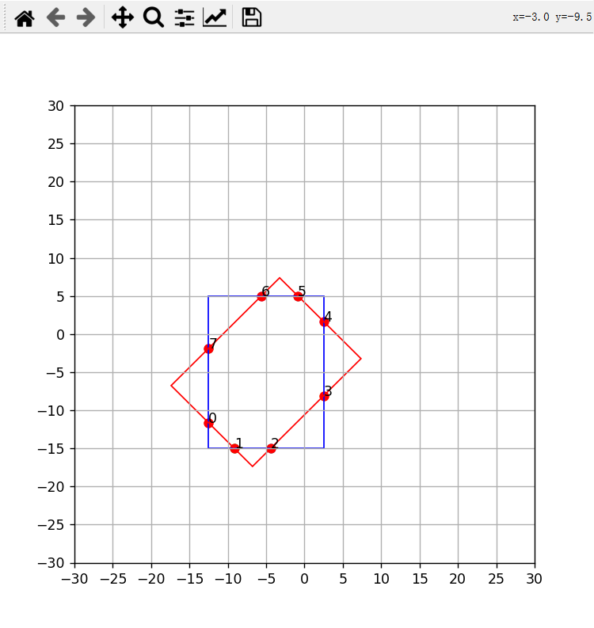

上面基于一个假设，即交点集合中的点都为多边形的点，实际两个多边形相交时，有可能一些点存在于多边形区域的内部，这个时候就需要找到这些点中的子集可以包络这些点。

> 需要注意的是，针对凸四边形相交的情况，采用上述排序算法做好排序就够了。

在凸包算法中，这采用Graham（格拉翰）扫描法

算法步骤：

1. 先找出y值最小的点，如果存在y值相等，则优先选择x值最小的作为起始点 $P_0$ ，该点一定处于凸包上
2. 以 $P_0$ 作为原点，其他所有点减去 $P_0$ 得到对应的向量

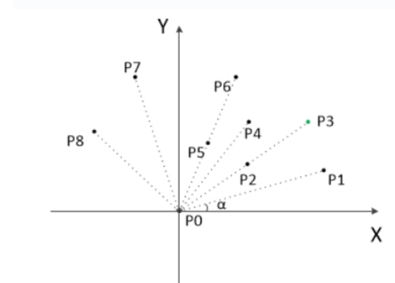

1. 计算所有向量与 $X$ 轴正向的夹角 $\alpha$ ，按从小到大进行排列，遇到 $\alpha$ 相同的情况，则向量较短（即离 $P_0$ 较近的点）的排在前面，得到初始点序 $P_1,P_2, ..., P_n$ ，由几何关系可知点序中第一个点 $P_1$ 和最后一个点 $P_n$ 一定在凸包上；
2. 将 $P_0$ 和 $P_1$ 压入栈中，将后续点 $P_2$ 作为当前点，跳转第8步。
3. 栈中最上面两个元素形成向量 $P_{ij}, i < j$ ， 利用叉乘判断当前点是否在该向量的左边还是右边或者向量上
4. 如果在左边或者向量上，则将当前点压入栈中，下一个点作为当前点，跳转第8步
5. 如果当前点在向量右边，则表明栈顶元素不在凸包上，将栈顶元素弹出，跳转第5步
6. 判断当前点是否是最后一个元素，如果是则将其压缩栈中，栈中所有元素即是凸包上所有点，算法结束，否则跳到第5步。

代码实现如下：


```python
import numpy as np
import math
import matplotlib.pyplot as plt
import matplotlib.patches as mptch
from typing import List
import math
from copy import deepcopy


class RotatedBox:

    def __init__(self, x, y, w, h, theta):
        self.x = x
        self.y = y
        self.w = w
        self.h = h
        self.theta = theta


class Point:

    def __init__(self, x, y):
        self.x = x
        self.y = y

    def __add__(self, other: 'Point'):
        return Point(other.x + self.x, other.y + self.y)

    def __sub__(self, other: 'Point'):
        return Point(self.x - other.x, self.y - other.y)

    def __mul__(self, other_scaler):
        return Point(self.x * other_scaler, self.y * other_scaler)

    def __truediv__(self, other_scaler):
        return Point(self.x / other_scaler, self.y / other_scaler)

    def __str__(self):
        return f"Point({self.x}, {self.y})"

    __repr__ = __str__


class Line:

    def __init__(self, start_point, end_point):
        self.start_point = start_point
        self.end_point = end_point

    def get_vector_point(self):
        return Point(self.end_point.x - self.start_point.x, self.end_point.y - self.start_point.y)


def cross2d(A: Point, B: Point):
    return A.x * B.y - B.x * A.y

def dot2d(A: Point, B: Point):
    return A.x * B.x + A.y * B.y


def convex_hull_graham(points: List[Point]):

    ret_points = []

    copy_points = deepcopy(points)
    # 1. 先找出y值最小的点，如果存在y值相等，则优先选择x值最小的作为起始点$P_0$，该点一定处于凸包上
    copy_points.sort(key=lambda point:(point.y, point.x))

    start_point = copy_points[0]


    # 2. 以$P_0$作为原点，其他所有点减去$P_0$得到对应的向量
    vectors = []
    len_copy_point = len(copy_points)
    for i in range(0, len_copy_point, 1):
        vector = copy_points[i] - start_point
        vectors.append(vector)

    # 3. 计算所有向量与$X$轴正向的夹角$\alpha$，按从小到大进行排列，
    # 遇到$\alpha$相同的情况，则向量较短（即离$P_0$较近的点）的排在前面，
    # 得到初始点序$P_1,P_2, ..., P_n$，
    # 由几何关系可知点序中第一个点$P_1$和最后一个点$P_n$一定在凸包上；
    def cmp_function(point_a: Point):
        # 先根据方位角，方位角相同再根据模长
        return math.atan2(point_a.y, point_a.x), dot2d(point_a, point_a)

    vectors.sort(key=cmp_function)
    dists = [dot2d(vector, vector) for vector in vectors]

    # 4. 将$P_0$和$P_1$压入栈中，将后续点$P_2$作为当前点，跳转第8步。
    ret_points.append(vectors[0])
    k = 1
    while k < len_copy_point:
        if dists[k] > 1e-8:
            break
        k += 1

    if k >= len_copy_point:
        return ret_points

    ret_points.append(vectors[k])

    m = len(ret_points)

    # 5.栈中最上面两个元素形成向量$P_{ij}, i < j$
    # 利用叉乘判断当前点是否在该向量的左边还是右边或者向量上
    # 6. 如果在左边或者向量上，则将当前点压入栈中，下一个点作为当前点，跳转第8步
    # 7. 如果当前点在向量右边，则表明栈顶元素不在凸包上，将栈顶元素弹出，跳转第5步
    # 8. 判断当前点是否是最后一个元素，如果是则将其压缩栈中，栈中所有元素即是凸包上所有点，算法结束，否则跳到第5步。
    for i in range(k + 1, len_copy_point, 1):
        while m >= 2:
            # 查看当前点在向量左边还是右边
            q1 = vectors[i] - ret_points[-2]
            q2 = ret_points[-1] - ret_points[-2]
            if q1.x * q2.y >= q2.x * q1.y:
                m -= 1
                ret_points.pop()
            else:
                break

        ret_points.append(vectors[i])
        m = len(ret_points)

    for point in ret_points:
        point.x += start_point.x
        point.y += start_point.y

    return ret_points


def main():

    fig, ax = plt.subplots()
    fig.set_figheight(6)
    fig.set_figwidth(6)

    np.random.seed(10)

    points = [Point(np.random.uniform(-30, 30), np.random.uniform(-30, 30)) for i in range(30)]

    for i, point in enumerate(points):
        plt.scatter(point.x, point.y, color="red")
        plt.text(point.x, point.y, f'{i}')

    convex_hull_points = convex_hull_graham(points)

    for i, point in enumerate(convex_hull_points):
        plt.scatter(point.x, point.y, color="blue")
        # plt.text(point.x, point.y, f'{i}')

    polygon = mptch.Polygon(xy=[(convex_hull_point.x, convex_hull_point.y) for convex_hull_point in convex_hull_points], closed=True, color="red", fill=False)
    ax.add_patch(polygon)

    # 设置坐标轴
    ax.set_xlim(-30, 30)
    ax.set_ylim(-30, 30)
    # 定义坐标
    x = np.arange(-30, 31, 5)
    y = np.arange(-30, 31, 5)
    ax.set_xticks(x)
    ax.set_yticks(y)
    ax.grid(True)
    # 显示图象
    plt.show()


if __name__ == "__main__":
    main()
```


可视化结果

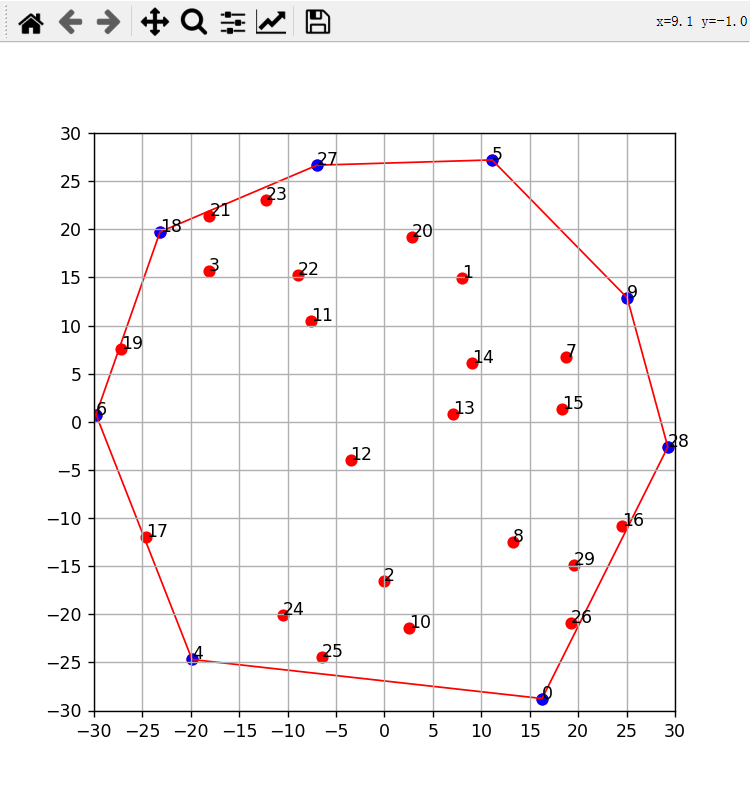

## 五、计算多边形面积

利用向量积（叉积）计算多边形的面积，要求多边形所有点按顺序排列即可，不要求非得是凸多边形。

具体证明请看[参考链接](https://www.cnblogs.com/xiexinxinlove/p/3708147.html)

代码如下：


```python
def polygon_area(points):
    copy_points = points + [points[0]]
    lines = [Line(copy_points[i], copy_points[i + 1]) for i in range(len(copy_points))]

    s_polygon = 0.0
    for line in lines:
        A, B = line.start_point, line.end_point
        s_tri = cross2d(A, B)
        s_polygon += s_tri
    return abs(s_polygon / 2)
```


## 六、IoU的计算

我们前面铺垫了那么多，终于到了整合全部方案的时刻了。

求iou可以转换为求取两个图四边形的面积，和相交凸多边形的面积，我们需要做的就是将上面的方案进行组装。最终代码如下：


```python
import numpy as np
import math
import matplotlib.pyplot as plt
import matplotlib.patches as mptch
from typing import List
import math
from copy import deepcopy
import cv2


class RotatedBox:

    def __init__(self, x, y, w, h, theta):
        self.x = x
        self.y = y
        self.w = w
        self.h = h
        self.theta = theta


class Point:

    def __init__(self, x, y):
        self.x = x
        self.y = y

    def __add__(self, other: 'Point'):
        return Point(other.x + self.x, other.y + self.y)

    def __sub__(self, other: 'Point'):
        return Point(self.x - other.x, self.y - other.y)

    def __mul__(self, other_scaler):
        return Point(self.x * other_scaler, self.y * other_scaler)

    def __truediv__(self, other_scaler):
        return Point(self.x / other_scaler, self.y / other_scaler)

    def __str__(self):
        return f"Point({self.x}, {self.y})"

    __repr__ = __str__


class Line:

    def __init__(self, start_point, end_point):
        self.start_point = start_point
        self.end_point = end_point

    def get_vector_point(self):
        return Point(self.end_point.x - self.start_point.x, self.end_point.y - self.start_point.y)

    def __str__(self):
        return f"start_point: Point({self.start_point.x}, {self.start_point.y}), end_point:Point({self.end_point.x}, {self.end_point.y})"


def cross2d(A: Point, B: Point):
    return A.x * B.y - B.x * A.y

def dot2d(A: Point, B: Point):
    return A.x * B.x + A.y * B.y

def get_intersection_points(line1: Line, line2: Line):

    line1_vec = line1.get_vector_point()
    line2_vec = line2.get_vector_point()

    det_value = cross2d(line2_vec, line1_vec)

    if abs(det_value) < 1e-14:
        return False, Point(0, 0)

    ac_line_vec = line2.start_point - line1.start_point

    t = cross2d(line2_vec, ac_line_vec) / det_value
    u = cross2d(line1_vec, ac_line_vec) / det_value

    eps = 1e-14

    if -eps <= t <= 1.0 + eps and -eps <= u <= 1.0 + eps:
        return True, line1.start_point + line1_vec * t

    return False, Point(0, 0)


def in_polygon(lines: List[Line], point: Point):

    odd_nodes = False

    x = point.x
    y = point.y

    for line in lines:
        y1 = line.start_point.y
        y2 = line.end_point.y
        x1 = line.start_point.x
        x2 = line.end_point.x
        if ((y1 < y <= y2) or (y2 < y <= y1)) and min(x1, x2) <= x:
            x_pred = (y - y1) / (y2 - y1) * (x2 - x1) + x1
            if x_pred < x:
                odd_nodes = not odd_nodes

    return odd_nodes


def polygon_area(points):
    copy_points = points + [points[0]]
    lines = [Line(copy_points[i], copy_points[i + 1]) for i in range(len(copy_points) - 1)]

    s_polygon = 0.0
    for line in lines:
        A, B = line.start_point, line.end_point
        s_tri = cross2d(A, B)
        s_polygon += s_tri
    return abs(s_polygon / 2)


def convex_hull_graham(points: List[Point]):

    ret_points = []

    copy_points = deepcopy(points)
    # 1. 先找出y值最小的点，如果存在y值相等，则优先选择x值最小的作为起始点$P_0$，该点一定处于凸包上
    copy_points.sort(key=lambda point:(point.y, point.x))

    start_point = copy_points[0]

    # 2. 以$P_0$作为原点，其他所有点减去$P_0$得到对应的向量
    vectors = []
    len_copy_point = len(copy_points)
    for i in range(0, len_copy_point, 1):
        vector = copy_points[i] - start_point
        vectors.append(vector)

    # 3. 计算所有向量与$X$轴正向的夹角$\alpha$，按从小到大进行排列，
    # 遇到$\alpha$相同的情况，则向量较短（即离$P_0$较近的点）的排在前面，
    # 得到初始点序$P_1,P_2, ..., P_n$，
    # 由几何关系可知点序中第一个点$P_1$和最后一个点$P_n$一定在凸包上；
    def cmp_function(point_a: Point):
        # 先根据方位角，方位角相同再根据模长
        return math.atan2(point_a.y, point_a.x), dot2d(point_a, point_a)

    vectors.sort(key=cmp_function)
    dists = [dot2d(vector, vector) for vector in vectors]

    # 4. 将$P_0$和$P_1$压入栈中，将后续点$P_2$作为当前点，跳转第8步。
    ret_points.append(vectors[0])
    k = 1
    while k < len_copy_point:
        if dists[k] > 1e-8:
            break
        k += 1

    if k >= len_copy_point:
        return ret_points

    ret_points.append(vectors[k])

    m = len(ret_points)

    # 5.栈中最上面两个元素形成向量$P_{ij}, i < j$
    # 利用叉乘判断当前点是否在该向量的左边还是右边或者向量上
    # 6. 如果在左边或者向量上，则将当前点压入栈中，下一个点作为当前点，跳转第8步
    # 7. 如果当前点在向量右边，则表明栈顶元素不在凸包上，将栈顶元素弹出，跳转第5步
    # 8. 判断当前点是否是最后一个元素，如果是则将其压缩栈中，栈中所有元素即是凸包上所有点，算法结束，否则跳到第5步。
    for i in range(k + 1, len_copy_point, 1):
        while m >= 2:
            # 查看当前点在向量左边还是右边
            q1 = vectors[i] - ret_points[-2]
            q2 = ret_points[-1] - ret_points[-2]
            if q1.x * q2.y >= q2.x * q1.y:
                m -= 1
                ret_points.pop()
            else:
                break

        ret_points.append(vectors[i])
        m = len(ret_points)

    for point in ret_points:
        point.x += start_point.x
        point.y += start_point.y

    return ret_points


def iou_polygon(points_1: List[Point], points_2: List[Point]):

    points_1 = convex_hull_graham(points_1)
    points_2 = convex_hull_graham(points_2)

    insection_points = []

    len_points_1 = len(points_1)
    len_points_2 = len(points_2)

    points_1 = points_1 + [points_1[0]]
    points_2 = points_2 + [points_2[0]]

    for i in range(len_points_1):
        for j in range(len_points_2):
            line1 = points_1[i:i+2]
            line2 = points_2[j:j+2]

            is_intersect, intersection_point = get_intersection_points(Line(line1[0], line1[1]), Line(line2[0], line2[1]))

            if is_intersect:
                insection_points.append(intersection_point)

    lines_1 = [Line(points_1[i], points_1[i+1]) for i in range(len_points_1)]
    lines_2 = [Line(points_2[i], points_2[i+1]) for i in range(len_points_2)]

    for i in range(len_points_1):
        point = points_1[i]
        if in_polygon(lines_2, point):
            insection_points.append(point)

    for i in range(len_points_2):
        point = points_2[i]
        if in_polygon(lines_1, point):
            insection_points.append(point)

    insection_points = convex_hull_graham(insection_points)

    if len(insection_points) <= 2:
        return 0

    insection_area = polygon_area(insection_points)

    points_1_area = polygon_area(points_1)
    points_2_area = polygon_area(points_2)

    return insection_area / (points_1_area + points_2_area - insection_area)


def iou_polygon_cv2(contour1, contour2):
    # opencv 版本为 4.5

    # 计算交集面积
    contour1 = np.array([(point.x, point.y) for point in contour1]).astype(np.float32)
    contour2 = np.array([(point.x, point.y) for point in contour2]).astype(np.float32)
    _, intersection = cv2.intersectConvexConvex(contour1, contour2)
    intersection_area = cv2.contourArea(intersection)

    # 计算并集面积
    union_area = cv2.contourArea(contour1) + cv2.contourArea(contour2) - intersection_area

    # 计算IOU
    iou = intersection_area / union_area
    return iou

def main():
    # return 
    x = -5
    y = -5
    w = 15
    h = 20
    theta = 45
    theta = theta / 180 * math.pi
    det_box = RotatedBox(x, y, w, h, theta)

    points = [Point(0, 0) for _ in range(4)]
    cos_theta = math.cos(theta) * 0.5
    sin_theta = math.sin(theta) * 0.5

    points[0].x = det_box.x + sin_theta * det_box.h + cos_theta * det_box.w
    points[0].y = det_box.y + cos_theta * det_box.h - sin_theta * det_box.w

    points[1].x = det_box.x - sin_theta * det_box.h + cos_theta * det_box.w
    points[1].y = det_box.y - cos_theta * det_box.h - sin_theta * det_box.w

    points[2].x = 2 * det_box.x - points[0].x
    points[2].y = 2 * det_box.y - points[0].y

    points[3].x = 2 * det_box.x - points[1].x
    points[3].y = 2 * det_box.y - points[1].y

    # # points 整体向下移动5
    for point in points:
        point.y -= 5

    x1 = x - w / 2
    y1 = y - h / 2

    x2 = x + w / 2
    y2 = y - h / 2

    x3 = x + w / 2
    y3 = y + h / 2

    x4 = x - w / 2
    y4 = y + h / 2

    # 判断 各个直线之间是否有交点
    A = Point(x1, y1)
    B = Point(x2, y2)
    C = Point(x3, y3)
    D = Point(x4, y4)


    fig, ax = plt.subplots()
    fig.set_figheight(6)
    fig.set_figwidth(6)

    # 绘制矩形
    # 第一个参数为左下角坐标 第二个参数为width 第三个参数为height
    x_center, y_center, width, height = det_box.x, det_box.y, det_box.w, det_box.h
    x1 = x_center - det_box.w / 2
    y1 = y_center - det_box.h / 2

    rect = plt.Rectangle((x1, y1), det_box.w, det_box.h, angle=0, fill=False, color="blue")
    ax.add_patch(rect)

    # 绕 center (x,y) 旋转45度
    polygon = mptch.Polygon(xy=[(points[i].x, points[i].y) for i in range(4)], closed=True, color="red", fill=False)
    ax.add_patch(polygon)

    insection_points = []

    points_1 = points
    points_2 = [A, B, C, D]

    # 与opencv结果对比
    iou = iou_polygon(points_1, points_2)
    iou_cv2 = iou_polygon_cv2(points_1, points_2)
    print('iou', iou)
    print('iou_cv2', iou_cv2)


    # 设置坐标轴
    ax.set_xlim(-30, 30)
    ax.set_ylim(-30, 30)
    # 定义坐标
    x = np.arange(-30, 31, 5)
    y = np.arange(-30, 31, 5)
    ax.set_xticks(x)
    ax.set_yticks(y)
    ax.grid(True)
    # 显示图象
    plt.show()


if __name__ == "__main__":
    main()
```


结果如下：


```yaml
iou 0.49793304538337396
iou_cv2 0.4979330453833741
```


如上，我们手写的计算结果与opencv的计算结果完全一致。

## 七、cuda版本代码解读

解读一下mmcv中倾斜四边形iou计算的实现，我们选择`1.7.1`这个版本解读。

[single_box_iou_rotated github参考链接](https://github.com/open-mmlab/mmcv/blob/2e44eaeba36b3f4c304e830053fc2660d8407afb/mmcv/ops/csrc/common/cuda/box_iou_rotated_cuda.cuh#L21)

[rotated 工具函数github参考链接](https://github.com/open-mmlab/mmcv/blob/2e44eaeba36b3f4c304e830053fc2660d8407afb/mmcv/ops/csrc/common/box_iou_rotated_utils.hpp#L344)

上述代码指向最关键的`single_box_iou_rotated`函数

`single_box_iou_rotated`展开如下


```c#
template <typename T>
HOST_DEVICE_INLINE T single_box_iou_rotated(T const* const box1_raw,
                                            T const* const box2_raw,
                                            const int mode_flag) {
  // shift center to the middle point to achieve higher precision in result
  RotatedBox<T> box1, box2;
  auto center_shift_x = (box1_raw[0] + box2_raw[0]) / 2.0;
  auto center_shift_y = (box1_raw[1] + box2_raw[1]) / 2.0;
  box1.x_ctr = box1_raw[0] - center_shift_x;
  box1.y_ctr = box1_raw[1] - center_shift_y;
  box1.w = box1_raw[2];
  box1.h = box1_raw[3];
  box1.a = box1_raw[4];
  box2.x_ctr = box2_raw[0] - center_shift_x;
  box2.y_ctr = box2_raw[1] - center_shift_y;
  box2.w = box2_raw[2];
  box2.h = box2_raw[3];
  box2.a = box2_raw[4];

  // 求取两个旋转框的面积，如果有一个面积很小则直接返回iou=0
  const T area1 = box1.w * box1.h;
  const T area2 = box2.w * box2.h;
  if (area1 < 1e-14 || area2 < 1e-14) {
    return 0.f;
  }
  // 求取 insection 面积
  const T intersection = rotated_boxes_intersection<T>(box1, box2);
  T baseS = 1.0;
  if (mode_flag == 0) {
    baseS = (area1 + area2 - intersection);
  } else if (mode_flag == 1) {
    baseS = area1;
  }
  const T iou = intersection / baseS;
  return iou;
}
```


计算iou函数`rotated_boxes_intersection`


```dart
template <typename T>
HOST_DEVICE_INLINE T rotated_boxes_intersection(const RotatedBox<T>& box1,
                                                const RotatedBox<T>& box2) {
  // There are up to 4 x 4 + 4 + 4 = 24 intersections (including dups) returned
  // from rotated_rect_intersection_pts
  Point<T> intersectPts[24], orderedPts[24];

  Point<T> pts1[4];
  Point<T> pts2[4];
  // 获取旋转矩形的四个点的坐标放到points数组中
  get_rotated_vertices<T>(box1, pts1);
  get_rotated_vertices<T>(box2, pts2);
  // 计算焦点
  int num = get_intersection_points<T>(pts1, pts2, intersectPts);

  if (num <= 2) {
    return 0.0;
  }

  // Convex Hull to order the intersection points in clockwise order and find
  // the contour area.
  // 凸包算法
  int num_convex = convex_hull_graham<T>(intersectPts, num, orderedPts, true);
  return polygon_area<T>(orderedPts, num_convex);
}
```


`get_rotated_vertices`函数


```cpp
template <typename T>
HOST_DEVICE_INLINE void get_rotated_vertices(const RotatedBox<T>& box,
                                             Point<T> (&pts)[4]) {
  // M_PI / 180. == 0.01745329251
  // double theta = box.a * 0.01745329251;
  // MODIFIED
  double theta = box.a;
  T cosTheta2 = (T)cos(theta) * 0.5f;
  T sinTheta2 = (T)sin(theta) * 0.5f;

  // y: top --> down; x: left --> right
  pts[0].x = box.x_ctr - sinTheta2 * box.h - cosTheta2 * box.w;
  pts[0].y = box.y_ctr + cosTheta2 * box.h - sinTheta2 * box.w;
  pts[1].x = box.x_ctr + sinTheta2 * box.h - cosTheta2 * box.w;
  pts[1].y = box.y_ctr - cosTheta2 * box.h - sinTheta2 * box.w;
  pts[2].x = 2 * box.x_ctr - pts[0].x;
  pts[2].y = 2 * box.y_ctr - pts[0].y;
  pts[3].x = 2 * box.x_ctr - pts[1].x;
  pts[3].y = 2 * box.y_ctr - pts[1].y;
}
```


`get_intersection_points`函数用于获取相交的点


```c
template <typename T>
HOST_DEVICE_INLINE int get_intersection_points(const Point<T> (&pts1)[4],
                                               const Point<T> (&pts2)[4],
                                               Point<T> (&intersections)[24]) {
  // Line vector
  // A line from p1 to p2 is: p1 + (p2-p1)*t, t=[0,1]
  Point<T> vec1[4], vec2[4];
  for (int i = 0; i < 4; i++) {
    vec1[i] = pts1[(i + 1) % 4] - pts1[i];
    vec2[i] = pts2[(i + 1) % 4] - pts2[i];
  }

  // 求取所有边的交点，跟本文介绍的法一相同
  // Line test - test all line combos for intersection
  int num = 0;  // number of intersections
  for (int i = 0; i < 4; i++) {
    for (int j = 0; j < 4; j++) {
      // Solve for 2x2 Ax=b
      T det = cross_2d<T>(vec2[j], vec1[i]);

      // This takes care of parallel lines
      if (fabs(det) <= 1e-14) {
        continue;
      }

      auto vec12 = pts2[j] - pts1[i];

      T t1 = cross_2d<T>(vec2[j], vec12) / det;
      T t2 = cross_2d<T>(vec1[i], vec12) / det;

      if (t1 >= 0.0f && t1 <= 1.0f && t2 >= 0.0f && t2 <= 1.0f) {
        intersections[num++] = pts1[i] + vec1[i] * t1;
      }
    }
  }

  // 查看矩形角点是否在矩形中，这里用到了一个简单的方法在下面有解释

  // Check for vertices of rect1 inside rect2
  {
    const auto& AB = vec2[0];
    const auto& DA = vec2[3];
    // 求取AB模长的平方
    auto ABdotAB = dot_2d<T>(AB, AB);
    // 求取AD模长的平方
    auto ADdotAD = dot_2d<T>(DA, DA);
    for (int i = 0; i < 4; i++) {
      // assume ABCD is the rectangle, and P is the point to be judged
      // P is inside ABCD iff. P's projection on AB lies within AB
      // and P's projection on AD lies within AD

      // pts1[i]即为P点 pts2[0]为A点
      auto AP = pts1[i] - pts2[0];

      // 求取AP与AB的内积 AP在AB上的投影乘以AB的模长
      auto APdotAB = dot_2d<T>(AP, AB);
      // 求取AP与AD的内积 AP在AD上的投影乘以AD的模长
      auto APdotAD = -dot_2d<T>(AP, DA);

      // 满足点在矩形的内部条件
      if ((APdotAB >= 0) && (APdotAD >= 0) && (APdotAB <= ABdotAB) &&
          (APdotAD <= ADdotAD)) {
        intersections[num++] = pts1[i];
      }
    }
  }

  // Reverse the check - check for vertices of rect2 inside rect1
  {
    const auto& AB = vec1[0];
    const auto& DA = vec1[3];
    auto ABdotAB = dot_2d<T>(AB, AB);
    auto ADdotAD = dot_2d<T>(DA, DA);
    for (int i = 0; i < 4; i++) {
      auto AP = pts2[i] - pts1[0];

      auto APdotAB = dot_2d<T>(AP, AB);
      auto APdotAD = -dot_2d<T>(AP, DA);

      if ((APdotAB >= 0) && (APdotAD >= 0) && (APdotAB <= ABdotAB) &&
          (APdotAD <= ADdotAD)) {
        intersections[num++] = pts2[i];
      }
    }
  }

  return num;
}
```


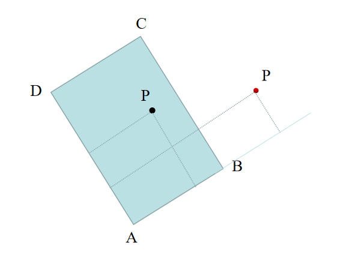

如上图所示，如果点P在矩形内部，则：
 $\vec{AP}$  到  $\vec{AB}$  的投影长度小于或等于  $\vec{AB}$  的长度且  $\vec{AP}$  到  $\vec{AD}$  的投影长度小于或等于 $\vec{AD}$ ，
其中投影可以采用向量点乘计算

相反如果点P在矩形外部，则：
 $\vec{AP}$  到  $\vec{AB}$  的投影长度大于  $\vec{AB}$  的长度或  $\vec{AP}$  到  $\vec{AD}$  的投影长度大于 $\vec{AD}$ ，

接下来就是凸包算法`convex_hull_graham`，这里用的是Graham（格拉翰）扫描法，跟Python版本实现一致，就不赘述了。


```cpp
template <typename T>
HOST_DEVICE_INLINE int convex_hull_graham(const Point<T> (&p)[24],
                                          const int& num_in, Point<T> (&q)[24],
                                          bool shift_to_zero = false) {
  assert(num_in >= 2);

  // Step 1:
  // Find point with minimum y
  // if more than 1 points have the same minimum y,
  // pick the one with the minimum x.
  int t = 0;
  for (int i = 1; i < num_in; i++) {
    if (p[i].y < p[t].y || (p[i].y == p[t].y && p[i].x < p[t].x)) {
      t = i;
    }
  }
  auto& start = p[t];  // starting point

  // Step 2:
  // Subtract starting point from every points (for sorting in the next step)
  for (int i = 0; i < num_in; i++) {
    q[i] = p[i] - start;
  }

  // Swap the starting point to position 0
  auto tmp = q[0];
  q[0] = q[t];
  q[t] = tmp;

  // Step 3:
  // Sort point 1 ~ num_in according to their relative cross-product values
  // (essentially sorting according to angles)
  // If the angles are the same, sort according to their distance to origin
  T dist[24];
  for (int i = 0; i < num_in; i++) {
    dist[i] = dot_2d<T>(q[i], q[i]);
  }

#ifdef __CUDACC__
  // CUDA version
  // In the future, we can potentially use thrust
  // for sorting here to improve speed (though not guaranteed)
  for (int i = 1; i < num_in - 1; i++) {
    for (int j = i + 1; j < num_in; j++) {
      T crossProduct = cross_2d<T>(q[i], q[j]);
      if ((crossProduct < -1e-6) ||
          (fabs(crossProduct) < 1e-6 && dist[i] > dist[j])) {
        auto q_tmp = q[i];
        q[i] = q[j];
        q[j] = q_tmp;
        auto dist_tmp = dist[i];
        dist[i] = dist[j];
        dist[j] = dist_tmp;
      }
    }
  }
#else
  // CPU version
  std::sort(q + 1, q + num_in,
            [](const Point<T>& A, const Point<T>& B) -> bool {
              T temp = cross_2d<T>(A, B);
              if (fabs(temp) < 1e-6) {
                return dot_2d<T>(A, A) < dot_2d<T>(B, B);
              } else {
                return temp > 0;
              }
            });
  // compute distance to origin after sort, since the points are now different.
  for (int i = 0; i < num_in; i++) {
    dist[i] = dot_2d<T>(q[i], q[i]);
  }
#endif

  // Step 4:
  // Make sure there are at least 2 points (that don't overlap with each other)
  // in the stack
  int k;  // index of the non-overlapped second point
  for (k = 1; k < num_in; k++) {
    if (dist[k] > 1e-8) {
      break;
    }
  }
  if (k == num_in) {
    // We reach the end, which means the convex hull is just one point
    q[0] = p[t];
    return 1;
  }
  q[1] = q[k];
  int m = 2;  // 2 points in the stack
  // Step 5:
  // Finally we can start the scanning process.
  // When a non-convex relationship between the 3 points is found
  // (either concave shape or duplicated points),
  // we pop the previous point from the stack
  // until the 3-point relationship is convex again, or
  // until the stack only contains two points
  for (int i = k + 1; i < num_in; i++) {
    while (m > 1 && cross_2d<T>(q[i] - q[m - 2], q[m - 1] - q[m - 2]) >= 0) {
      m--;
    }
    q[m++] = q[i];
  }

  // Step 6 (Optional):
  // In general sense we need the original coordinates, so we
  // need to shift the points back (reverting Step 2)
  // But if we're only interested in getting the area/perimeter of the shape
  // We can simply return.
  if (!shift_to_zero) {
    for (int i = 0; i < m; i++) {
      q[i] += start;
    }
  }

  return m;
}
```


## 参考链接

* <https://www.cnblogs.com/xiaxuexiaoab/p/16801580.html>
* <https://www.cnblogs.com/xiaxuexiaoab/p/16801579.html>
* <https://www.jianshu.com/p/64534f8eecc6>
* <https://blog.csdn.net/yzf279533105/article/details/131029773>
* <https://arxiv.org/pdf/1703.01086.pdf>
* <https://mdnice.com/writing/02c11b814ac7403cbb8587fa09d48e8e>
* <https://blog.csdn.net/lemonxiaoxiao/article/details/108619552>
* <https://www.cnblogs.com/xiexinxinlove/p/3708147.html>

