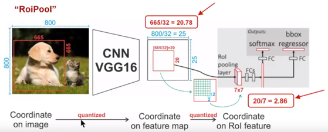
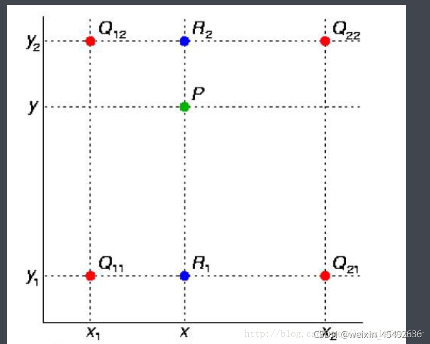
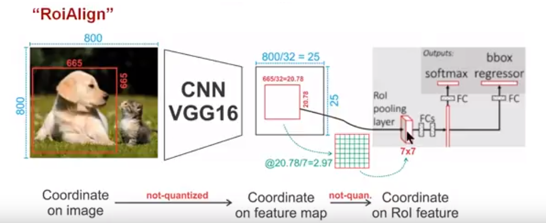
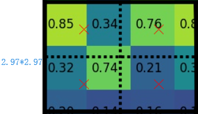

# RoiAlign算子的前向传播与反向传播解读

> 本文写于2024-01-20/21下午

## 一、前言

忙活了一个多月，终于腾出手来将这篇文章安排进了TODO List，借着一个周末两个慵懒的下午梳理一下RoiAlign的具体实现步骤和原理。

只要是入门了目标检测的朋友就一定知道RoiAlign，只是了解程度不一样，曾经的我看源码都看的头疼，现在总算可以沉下心来深入研究一下。

为什么研究它呢？实际上是我在看Grounding DINO的时候，一直向前追溯相关文献，从DINO、DETR、DCN系列再到RoiAlign，我不禁问自己：RoiAlign前向计算比较好理解，那么RoiAlign的反向传播过程是什么样子呢？

于是，就有了这篇文章。

## 二、RoiAlign基本原理

### 2.1 Roi Pooling

说起`RoiAlign`就不得不提`RoiPooling`，原始版本FasterRCNN标准配置。在two-stage检测器中，有一个需要从根据候选框坐标提取输入图像特征的操作，这个操作的输入需要满足输入一个目标框和一个特征图，输出一个从特征图上抠出目标框位置的子特征图。

同时，为了便于后续批处理，输出的特征图只有batch维度可以变化，H和W维度不能变化，所以就有了RoiPooling算子的设计。

RoiPooling 就是输入Roi目标区域的坐标框描述，输出目标框对应的`Roi feature`，且所有输出的feature在`C、H、W`三个方向上保持一致。

先贴出一张图，通过下面这幅图像解释RoiPooling的工作原理.



针对上图

1. Conv layers使用的是VGG16，feat_stride=32(即表示，经过网络层后图片缩小为原图的1/32),原图800\*800,最后一层特征图feature map大小:25\*25
2. 假定原图中有一region proposal，大小为 $665\times665$ ，这样映射到特征图中的大小：665/32=20.78，即 $20.78\times20.78$ ，如果你看过Caffe的RoiPooling的C++源码，在计算的时候会进行取整操作，于是进行所谓的第一次量化，即映射的特征图大小为20\*20。
3. 假定`pooled_w=7,pooled_h=7`,即pooling后固定成 $7 \times7$ 大小的特征图。将上面在 feature map上映射的 $20 \times 20$ 的`region proposal`划分成49个同等大小的小区域，每个小区域的大小20/7=2.86,即 $2.86 \times 2.86$ ，所以进行第二次量化，故小区域大小变成 $2 \times 2$ 。
4. 每个 $2 \times 2$ 的小区域里，取出其中最大的像素值，作为这个区域的"代表"。这样49个小区域就输出49个像素值，组成 $7 \times 7$ 大小的feature map。

通过上面可以看出，经过两次量化，即将浮点数取整，原本在特征图上映射的 $20\times20$ 大小的region proposal，经过自适应Pooling操作变为 $7 \times 7$ ，这样的像素偏差势必会对后层的回归定位产生影响。

为了避免量化带来的位置表征偏差，于是就有了RoiAlign。

### 2.2 RoiAlign

为了解决Roi Pooling两次量化问题，Roi Align不再采用取整量化操作，而是保留了浮点数的运算，并使用双线性插值的方式求取像素值。

先说一下什么是双线性插值。

双线性插值是有两个变量的插值函数的线性插值扩展，其核心思想是在两个方向分别进行一次线性插值。



假如我们想得到未知函数  $f(z)$ 在点 $P = (x, y)$  的值，已知函数 $f(z)$ 在 $Q_{11} = (x_1, y_1)$ 、 $Q_{12}=(x_1, y_2)$ ， $Q_{21}=(x_2,y_1)$  以及  $Q_{22}=(x_2,y_2)$  四个点的值。最常见的情况， $f(z)$ 就是一个像素点的像素值。首先在 $X$ 方向进行线性插值，得到

$$
\begin{align*}
& f(R_1) \approx \frac{x_2 - x}{x_2 - x_1} f(Q_{11}) + \frac{x - x_1}{x_2 - x_1} f(Q_{21})\ where\ R_1 = (x, y_1) \\
& f(R_2) \approx \frac{x_2 - x}{x_2 - x_1} f(Q_{12}) + \frac{x - x_1}{x_2 - x_1} f(Q_{22})\ where\ R_2 = (x, y_2)
\end{align*}
$$

然后在y方向进行线性插值，得到

$$
f(P) \approx \frac{y_2 - y}{y_2 - y_1} f(R_1) + \frac{y - y_1}{y_2 - y_1} f(R_2)
$$

综合起来就是双线性插值的结果：

$$
\begin{align*}
f(x, y) &\approx \frac{(x_2 - x)(y_2 - y)}{(x_2 - x_1)(y_2 - y_1)}f(Q_{11})  \\ 
&+ \frac{(x - x_1)(y_2 - y)}{(x_2 - x_1)(y_2 - y_1)}f(Q_{21}) \\
&+ \frac{(x_2 - x)(y - y_1)}{(x_2 - x_1)(y_2 - y_1)}f(Q_{12})  \\
&+ \frac{(x - x_1)(y - y_1)}{(x_2 - x_1)(y_2 - y_1)}f(Q_{22})
\end{align*}
$$

因此双线性插值的计算结果与八个值有关系，四个函数值和四个与之对应的系数值。

回过头我们看一下RoiAlign算子的计算过程，通过这图解释RoiAlign的工作原理



针对上图

1. `Conv layers`使用的是VGG16，feat_stride=32(即表示，经过网络层后图片缩小为原图的1/32),原图 $800 \times 800$ ,最后一层特征图feature map大小： $25 \times 25$
2. 假定原图中有一region proposal，大小为 $665 \times 665$ ，映射到特征图中的大小：665/32=20.78,即 $20.78 \times 20.78$ ，此时，没有像RoiPooling那样就行取整操作，保留浮点数
3. 假定`pooled_w=7,pooled_h=7`，即pooling后固定成 $7 \times 7$ 大小的特征图，所以将在feature map上映射的 $20.78 \times 20.78$ 的region proposal划分成49个同等大小的小区域，每个小区域的大小20.78/7=2.97,即区域大小为 $2.97 \times 2.97$
4. 假定采样点数为4，即表示对于每个 $2.97 \times 2.97$ 的小区域，平分四份，每一份取其中心点位置，而中心点位置的像素，采用双线性插值法进行计算，这样，就会得到四个点的像素值，如下图



上图中，四个红色叉叉‘×’的像素值是通过双线性插值算法计算得到的。

最后，取四个像素值中最大值或者平均值(有参数可以设定该操作)作为这个小区域(即： $2.97 \times 2.97$ 大小的区域)的像素值，如此类推同样是49个小区域得到49个像素值，组成 $7 \times 7$ 大小的feature map。

接下来我们通过解读mmcv中`RoiAlign`算子的前向和反向传播过程的代码来理解具体操作细节。

## 三、RoiAlign算子CPU版本解读

mmcv中代码地址：

<https://github.com/open-mmlab/mmcv/blob/v2.1.0/mmcv/ops/csrc/pytorch/cpu/roi_align.cpp>

首先`Line 11-21`定义用于存储双线性插值的四个自变量和四个权重系数的结构体`PreCalc`


```cpp
// implementation taken from Caffe2
template <typename T>
struct PreCalc {
  // 用于记录存放四个点的像素值的索引值
  int pos1;
  int pos2;
  int pos3;
  int pos4;
  // 对应四个点的权重值
  T w1;
  T w2;
  T w3;
  T w4;
};
```


然后我们先看看调用关系，在`Line 384-403`行，定义：


```cpp
void ROIAlignForwardCPULauncher(Tensor input, Tensor rois, Tensor output,
                                Tensor argmax_y, Tensor argmax_x,
                                int aligned_height, int aligned_width,
                                float spatial_scale, int sampling_ratio,
                                int pool_mode, bool aligned) {
  /*
  input：输入特征图
  rois：输入roi坐标，维度 [N,5] 第一列表示roi坐标的batch index
  output：输出tensor。维度[B, C, aligned_height, aligned_width]
  argmax_y：输出tensor，维度与output相同，用于记录当为单个网格的值为max pooling操作取值时，每个输出的feature的位置用到的原输入tensor的位置的y坐标
  argmax_x：输出tensor，维度与output相同，用于记录记录当为单个网格的值为max pooling操作取值时，每个输出的feature的位置用到的原输入tensor的位置的x坐标
  aligned_height：输出FeatureMap的H
  aligned_width：输出FeatureMap的W
  spatial_scale：当前特征图 / 原图大小 的值
  sampling_ratio：划分好 aligned_height x aligned_width 个网格后，单个网格用sampling_ratio个点表示
  pool_mode：1 表示 描述单个网格的点是对所有采样点去平均 0 表示取最大
  aligned：双线性插值的模式控制参数 表示是否采用坐标对齐模式
  */
  int output_size = output.numel();
  int channels = input.size(1);
  int height = input.size(2);
  int width = input.size(3);

  AT_DISPATCH_FLOATING_TYPES_AND_HALF(
      input.scalar_type(), "ROIAlign_forward", [&] {
        ROIAlignForward<scalar_t>(
            output_size, input.data_ptr<scalar_t>(), rois.data_ptr<scalar_t>(),
            output.data_ptr<scalar_t>(), argmax_y.data_ptr<scalar_t>(),
            argmax_x.data_ptr<scalar_t>(), aligned_height, aligned_width,
            static_cast<scalar_t>(spatial_scale), sampling_ratio, pool_mode,
            aligned, channels, height, width);
      });
}
```


接下来我们看一下`ROIAlignForward`函数，`Line110-214`


```cpp
template <typename T>
void ROIAlignForward(const int nthreads, const T* input, const T* rois,
                     T* output, T* argmax_y, T* argmax_x,
                     const int pooled_height, const int pooled_width,
                     const T spatial_scale, const int sampling_ratio,
                     const int pool_mode,  // 0 - max pool, 1 - avg pool
                     const bool aligned, const int channels, const int height,
                     const int width) {
  /*
  nthreads：表面意思是线程个数，实际上是输出的元素总个数，即N x C x pooled_height x pooled_width
  input：输入feature map的内存指针
  rois：输入rois的内存指针
  output：输出feature map的内存指针
  argmax_y：输出tensor，维度与output相同，用于记录当为单个网格的值为max pooling操作取值时，每个输出的feature的位置用到的原输入tensor的位置的y坐标
  argmax_x：输出tensor，维度与output相同，用于记录记录当为单个网格的值为max pooling操作取值时，每个输出的feature的位置用到的原输入tensor的位置的x坐标
  pooled_height：输出FeatureMap的H
  pooled_width：输出FeatureMap的W
  spatial_scale：当前输入的input feature map的空间大小 / 原图大小 比如1/16
  sampling_ratio：划分好 aligned_height x aligned_width 个网格后，单个网格用sampling_ratio个点表示
  pool_mode：1 表示 描述单个网格的点是对所有采样点去平均 0 表示取最大
  aligned：双线性插值参数，是角点对齐还是中心对齐，角点对齐设置为0，中心对齐设置为1
  channels：输入channels
  height：输入feature map的高
  width：输入feature map的宽
  */

  // 根据输出总元素个数计算roi的个数
  int n_rois = nthreads / channels / pooled_width / pooled_height;

  // (n, c, ph, pw) is an element in the pooled output
  // can be parallelized using omp
  // #pragma omp parallel for num_threads(32)
  // 遍历每一个roi 计算其对应的feature map
  for (int n = 0; n < n_rois; n++) {
    // 当前roi 对应输出feature 的内存偏移
    int index_n = n * channels * pooled_width * pooled_height;

    // 首地址偏移
    const T* offset_rois = rois + n * 5;
    // 取出roi对应的batch index
    int roi_batch_ind = offset_rois[0];

    // Do not use rounding; this implementation detail is critical
    // 是否是中心对齐 aligned 等于1表示中心对齐 
    T offset = aligned ? (T)0.5 : (T)0.0;
    // roi中存储的是实际坐标，这里转换为在roi上的坐标
    T roi_start_w = offset_rois[1] * spatial_scale - offset;
    T roi_start_h = offset_rois[2] * spatial_scale - offset;
    T roi_end_w = offset_rois[3] * spatial_scale - offset;
    T roi_end_h = offset_rois[4] * spatial_scale - offset;

    // roi的宽和高
    T roi_width = roi_end_w - roi_start_w;
    T roi_height = roi_end_h - roi_start_h;
    if (aligned) {
      AT_ASSERTM(roi_width >= 0 && roi_height >= 0,
                 "ROIs in ROIAlign cannot have non-negative size!");
    } else {  // for backward-compatibility only
      roi_width = std::max(roi_width, (T)1.);
      roi_height = std::max(roi_height, (T)1.);
    }

    // 将roi_height x roi_width 划分成 pooled_height x pooled_width个网格
    // 单个网格的尺寸在输入feature map长度和宽度方向上的大小
    T bin_size_h = static_cast<T>(roi_height) / static_cast<T>(pooled_height);
    T bin_size_w = static_cast<T>(roi_width) / static_cast<T>(pooled_width);

    // We use roi_bin_grid to sample the grid and mimic integral
    // 单个网格采用多少个子网格点采集表示
    // 如果sampling_ratio > 0 就是 sampling_ratio x sampling_ratio 个点
    // 在小于零的情况下 高度方向点的尺度为 ceil(roi_height / pooled_height) 自动计算
    // 即 单个网格的尺寸在输入feature map长度和宽度方向上的大小 ceil之后作为长和宽的大小
    int roi_bin_grid_h = (sampling_ratio > 0)
                             ? sampling_ratio
                             : ceilf(roi_height / pooled_height);  // e.g., = 2

    int roi_bin_grid_w =
        (sampling_ratio > 0) ? sampling_ratio : ceilf(roi_width / pooled_width);

    // 单个网格点被几个点表示
    // When the grid is empty, output zeros == 0/1, instead of NaN.
    const T count = std::max(roi_bin_grid_h * roi_bin_grid_w, 1);  // e.g. = 4

    // 接下来是双线性插值环节
    // 调用pre_calc_for_bilinear_interpolate每一个网格需要的点的个数
    // 一个网格有roi_bin_grid_h * roi_bin_grid_w个点
    // 一共 pooled_width * pooled_height 个网格
    // we want to precalculate indices and weights shared by all channels,
    // this is the key point of optimization
    std::vector<PreCalc<T>> pre_calc(roi_bin_grid_h * roi_bin_grid_w *
                                     pooled_width * pooled_height);
    pre_calc_for_bilinear_interpolate(
        height, width, pooled_height, pooled_width, roi_bin_grid_h,
        roi_bin_grid_w, roi_start_h, roi_start_w, bin_size_h, bin_size_w,
        roi_bin_grid_h, roi_bin_grid_w, pre_calc);

    // 遍历channel 在空间方向上计算feature map
    for (int c = 0; c < channels; c++) {
      // 输入feature map B，C，H，W
      // index_n 是 当前输出feature 的 batch 维度上的偏移
      // index_n = n * channels * pooled_width * pooled_height;

      // index_n_c 是 当前输出feature 在 c通道上的偏移
      int index_n_c = index_n + c * pooled_width * pooled_height;
      // 计算 当前 roi_batch_ind batch位置 c通道 输入feature map指向 的内容地址
      // 即 &input[roi_batch_ind][c]的首地址
      const T* offset_input =
          input + (roi_batch_ind * channels + c) * height * width;
      int pre_calc_index = 0;

      // 遍历每一个网格，进行填充
      for (int ph = 0; ph < pooled_height; ph++) {
        for (int pw = 0; pw < pooled_width; pw++) {
          // 计算输出feature 对应 网格索引
          int index = index_n_c + ph * pooled_width + pw;

          // 定义输出值、最大值、最大值索引
          T output_val = 0.;
          T maxval = -10000;
          T maxidx_y = -1.f, maxidx_x = -1.f;
          // 遍历用于计算当前网格点的所有点
          for (int iy = 0; iy < roi_bin_grid_h; iy++) {
            // 计算 点集中的y坐标
            // roi_start_h 是 roi 起始坐标
            // ph * bin_size_h 是 当前网格y方向偏移
            // (iy + .5f) * bin_size_h / static_cast<T>(roi_bin_grid_h)
            // 是 在 bin中的y方向偏移
            // 即 将一个 bin_size_h 分成了 roi_bin_grid_h 份
            const T y = roi_start_h + ph * bin_size_h +
                        static_cast<T>(iy + .5f) * bin_size_h /
                            static_cast<T>(roi_bin_grid_h);
            for (int ix = 0; ix < roi_bin_grid_w; ix++) {
              const T x = roi_start_w + pw * bin_size_w +
                          static_cast<T>(ix + .5f) * bin_size_w /
                              static_cast<T>(roi_bin_grid_w);
              // 根据预先计算的值进行加权
              PreCalc<T> pc = pre_calc[pre_calc_index];
              T val = pc.w1 * offset_input[pc.pos1] +
                      pc.w2 * offset_input[pc.pos2] +
                      pc.w3 * offset_input[pc.pos3] +
                      pc.w4 * offset_input[pc.pos4];
              // 求取最大值 并记录坐标
              if (val > maxval) {
                maxval = val;
                maxidx_y = y;
                maxidx_x = x;
              }
              // 求和
              output_val += val;
              // 移动索引
              pre_calc_index += 1;
            }
          }
          // 在每个网格中 如果pool_mode为0 则执行对采样点集合执行max pooling
          // 如果 pool_mode 为1 就取平均
          if (pool_mode == 0) {
            // We do max pooling inside a bin
            output[index] = maxval;
            argmax_y[index] = maxidx_y;
            argmax_x[index] = maxidx_x;
          } else if (pool_mode == 1) {
            // We do average (integral) pooling inside a bin
            output[index] = output_val / count;
          }  // if
        }    // for pw
      }      // for ph
    }        // for c
  }          // for n
}
```


下面我们看一下每一个网格需要的点是怎么生成的，功能实现在`pre_calc_for_bilinear_interpolate`函数`Line 23-108`


```cpp
template <typename T>
void pre_calc_for_bilinear_interpolate(
    const int height, const int width, const int pooled_height,
    const int pooled_width, const int iy_upper, const int ix_upper,
    T roi_start_h, T roi_start_w, T bin_size_h, T bin_size_w,
    int roi_bin_grid_h, int roi_bin_grid_w, std::vector<PreCalc<T>>& pre_calc) 
/*
height：输入feature map的height
width：输入feature map的width
pooled_height：输出feature map的pooled_height
pooled_width：输出feature map的pooled_width
iy_upper：一个网格划分成iy_upper * ix_upper个点表示
ix_upper：一个网格划分成iy_upper * ix_upper个点表示
roi_start_h：roi y方向起始坐标
roi_start_w：roi x方向起始坐标
bin_size_h：单个网格的高度
bin_size_w：单个网格的宽度
roi_bin_grid_h：一个网格划分成roi_bin_grid_h * roi_bin_grid_w个点表示
roi_bin_grid_w：一个网格划分成roi_bin_grid_h * roi_bin_grid_w个点表示
pre_calc：输出点的vector
*/

{
  int pre_calc_index = 0;
  // 遍历用于计算当前网格点的所有点
  for (int ph = 0; ph < pooled_height; ph++) {
    for (int pw = 0; pw < pooled_width; pw++) {
      for (int iy = 0; iy < iy_upper; iy++) {
        // 计算 点集 中的y坐标
        // roi_start_h 是 roi 起始坐标
        // ph * bin_size_h 是 当前网格y方向偏移
        // (iy + .5f) * bin_size_h / static_cast<T>(roi_bin_grid_h)
        // 是 在 bin中的y方向偏移
        // 即 将一个 bin_size_h 分成了 roi_bin_grid_h 份
        const T yy = roi_start_h + ph * bin_size_h +
                     static_cast<T>(iy + .5f) * bin_size_h /
                         static_cast<T>(roi_bin_grid_h);  // e.g., 0.5, 1.5
        for (int ix = 0; ix < ix_upper; ix++) {
          // 同理求 点集 中的点的x坐标
          const T xx = roi_start_w + pw * bin_size_w +
                       static_cast<T>(ix + .5f) * bin_size_w /
                           static_cast<T>(roi_bin_grid_w);

          T x = xx;
          T y = yy;
          // 如果坐标不合法就直接返回
          // deal with: inverse elements are out of feature map boundary
          if (y < -1.0 || y > height || x < -1.0 || x > width) {
            // empty
            PreCalc<T> pc;
            pc.pos1 = 0;
            pc.pos2 = 0;
            pc.pos3 = 0;
            pc.pos4 = 0;
            pc.w1 = 0;
            pc.w2 = 0;
            pc.w3 = 0;
            pc.w4 = 0;
            pre_calc[pre_calc_index] = pc;
            pre_calc_index += 1;
            continue;
          }

          if (y <= 0) {
            y = 0;
          }
          if (x <= 0) {
            x = 0;
          }
          // 双线性插值部分
          // 计算离x，y最近的四个点的坐标
          int y_low = (int)y;
          int x_low = (int)x;
          int y_high;
          int x_high;

          if (y_low >= height - 1) {
            y_high = y_low = height - 1;
            y = (T)y_low;
          } else {
            y_high = y_low + 1;
          }

          if (x_low >= width - 1) {
            x_high = x_low = width - 1;
            x = (T)x_low;
          } else {
            x_high = x_low + 1;
          }
          // 计算系数
          T ly = y - y_low;
          T lx = x - x_low;
          T hy = 1. - ly, hx = 1. - lx;
          T w1 = hy * hx, w2 = hy * lx, w3 = ly * hx, w4 = ly * lx;

          // 看公式 分母都是1
          // 因为x_2 - x_1 = 1
          // y_2 - y_1 = 1
          // 反映到代码
          // 即 y_high - y_low = 1
          //    x_high - x_low = 1
          // 计算四个权重值对应的系数对应的索引值
          // save weights and indices
          PreCalc<T> pc;
          pc.pos1 = y_low * width + x_low;
          pc.pos2 = y_low * width + x_high;
          pc.pos3 = y_high * width + x_low;
          pc.pos4 = y_high * width + x_high;
          // 存储 插值 系数
          pc.w1 = w1;
          pc.w2 = w2;
          pc.w3 = w3;
          pc.w4 = w4;
          pre_calc[pre_calc_index] = pc;

          pre_calc_index += 1;
        }
      }
    }
  }
}
```


下面我们看一下**反向传播**是如何执行的。

整体流程发起函数在`ROIAlignBackwardCPULauncher`当中


```cpp
void ROIAlignBackwardCPULauncher(Tensor grad_output, Tensor rois,
                                 Tensor argmax_y, Tensor argmax_x,
                                 Tensor grad_input, int aligned_height,
                                 int aligned_width, float spatial_scale,
                                 int sampling_ratio, int pool_mode,
                                 bool aligned)
/*
grad_output：对roi feature map的梯度累计信息 维度为 [N, C, H, W] H和W为 pooled_height 和 pooled_width
rois：roi输入数据
argmax_y：输出tensor，维度与output相同，用于记录当为单个网格的值为max pooling操作取值时，每个输出的feature的位置用到的原输入tensor的位置的y坐标
argmax_x：输出tensor，维度与output相同，用于记录记录当为单个网格的值为max pooling操作取值时，每个输出的feature的位置用到的原输入tensor的位置的x坐标
grad_input：对输入给Roi Align的feature map的梯度信息，初始化为全0
aligned_height：pooled_height
aligned_width：pooled_width
spatial_scale：当前输入的input feature map的空间大小 / 原图大小 比如1/16
sampling_ratio：划分好 aligned_height x aligned_width 个网格后，单个网格用sampling_ratio个点表示
pool_mode：1 表示 描述单个网格的点是对所有采样点去平均 0 表示取最大
aligned：双线性插值参数，是角点对齐还是中心对齐，角点对齐设置为0，中心对齐设置为1
*/
{
  int output_size = grad_output.numel();
  int channels = grad_input.size(1);
  int height = grad_input.size(2);
  int width = grad_input.size(3);

  // get stride values to ensure indexing into gradients is correct.
  int n_stride = grad_output.stride(0);
  int c_stride = grad_output.stride(1);
  int h_stride = grad_output.stride(2);
  int w_stride = grad_output.stride(3);

  AT_DISPATCH_FLOATING_TYPES_AND_HALF(
      grad_output.scalar_type(), "ROIAlign_backward", [&] {
        ROIAlignBackward<scalar_t>(
            output_size, grad_output.data_ptr<scalar_t>(),
            rois.data_ptr<scalar_t>(), argmax_y.data_ptr<scalar_t>(),
            argmax_x.data_ptr<scalar_t>(), grad_input.data_ptr<scalar_t>(),
            aligned_height, aligned_width, static_cast<scalar_t>(spatial_scale),
            sampling_ratio, pool_mode, aligned, channels, height, width,
            n_stride, c_stride, h_stride, w_stride);
      });
}
```


接下来看`ROIAlignBackward`函数，在`Line 270-382`


```cpp
template <typename T>
void ROIAlignBackward(const int nthreads, const T* grad_output, const T* rois,
                      const T* argmax_y, const T* argmax_x, T* grad_input,
                      const int pooled_height, const int pooled_width,
                      const T spatial_scale, const int sampling_ratio,
                      const int pool_mode,  // 0 - max pool, 1 - avg pool
                      const bool aligned, const int channels, const int height,
                      const int width, const int n_stride, const int c_stride,
                      const int h_stride, const int w_stride)
/*
nthreads：表面意思是线程个数，实际上是roi align算子输出feature map输出的元素总个数，即N x C x pooled_height x pooled_width
grad_output：对roi feature map的梯度累计信息 维度为 [N, C, H, W] H和W为 pooled_height 和 pooled_width
rois：输入rois的内存指针
argmax_y：输入tensor，维度与output相同，用于记录当为单个网格的值为max pooling操作取值时，每个输出的feature的位置用到的原输入tensor的位置的y坐标
argmax_x：输入tensor，维度与output相同，用于记录记录当为单个网格的值为max pooling操作取值时，每个输出的feature的位置用到的原输入tensor的位置的x坐标
grad_input：输出指针，对输入给Roi Align的feature map的梯度信息，初始化为全0
pooled_height：RoiAlign输出FeatureMap的H
pooled_width：RoiAlign输出FeatureMap的W
spatial_scale：当前输入的input feature map的空间大小 / 原图大小 比如1/16
sampling_ratio：划分好 aligned_height x aligned_width 个网格后，单个网格用sampling_ratio个点表示
pool_mode：1 表示 描述单个网格的点是对所有采样点去平均 0 表示取最大
aligned：双线性插值参数，是角点对齐还是中心对齐，角点对齐设置为0，中心对齐设置为1
channels：输入channels
height：输入feature map的高
width：输入feature map的宽
n_stride：记录grad_output指针 batch方向的stride，兼容内存不连续的情况
c_stride：记录grad_output指针 channel方向的stride，兼容内存不连续的情况
h_stride：记录grad_output指针 height方向的stride，兼容内存不连续的情况
w_stride：记录grad_output指针 width方向的stride，兼容内存不连续的情况
*/
{
  // 遍历输出所有输入元素。计算其对输入相关联输入元素的梯度
  for (int index = 0; index < nthreads; index++) {
    // (n, c, ph, pw) is an element in the pooled output
    // 计算出pooled_width维度上的索引
    int pw = index % pooled_width;
    // 计算出pooled_height维度上的索引
    int ph = (index / pooled_width) % pooled_height;
    // 计算出channel维度上的索引
    int c = (index / pooled_width / pooled_height) % channels;
    // 计算出roi batch维度上的索引
    int n = index / pooled_width / pooled_height / channels;

    // 取输入roi的坐标值
    const T* offset_rois = rois + n * 5;
    // 取出当前roi对应的 batch index
    int roi_batch_ind = offset_rois[0];

    // 与前向传播计算相同，计算出roi坐标映射到feature map后的坐标
    // Do not use rounding; this implementation detail is critical
    T offset = aligned ? (T)0.5 : (T)0.0;
    T roi_start_w = offset_rois[1] * spatial_scale - offset;
    T roi_start_h = offset_rois[2] * spatial_scale - offset;
    T roi_end_w = offset_rois[3] * spatial_scale - offset;
    T roi_end_h = offset_rois[4] * spatial_scale - offset;

    T roi_width = roi_end_w - roi_start_w;
    T roi_height = roi_end_h - roi_start_h;
    if (aligned) {
      AT_ASSERTM(roi_width >= 0 && roi_height >= 0,
                 "ROIs in ROIAlign do not have non-negative size!");
    } else {  // for backward-compatibility only
      roi_width = std::max(roi_width, (T)1.);
      roi_height = std::max(roi_height, (T)1.);
    }
    // 单个网格大小
    T bin_size_h = static_cast<T>(roi_height) / static_cast<T>(pooled_height);
    T bin_size_w = static_cast<T>(roi_width) / static_cast<T>(pooled_width);

    // 针对输入 feature map 的偏移首地址，等价于 grad_input[roi_batch_ind][c]
    T* offset_grad_input =
        grad_input + ((roi_batch_ind * channels + c) * height * width);

    // 计算输出 feature map 的偏移首地址
    int output_offset = n * n_stride + c * c_stride;
    // 等价于 &grad_output[n][c]
    const T* offset_grad_output = grad_output + output_offset;
    // 取出当前对roi feature map的梯度值，等价于 grad_output[n][c][ph][pw]
    const T grad_output_this_bin =
        offset_grad_output[ph * h_stride + pw * w_stride];

    // 如果是max pooling模式 那么梯度仅仅回传到 argmax 对应的坐标的点
    // 其余位置为梯度为0，所以grad_input元素调用前要前部初始化为0
    if (pool_mode == 0) {
      // We do max pooling inside a bin
      // 取出最大值是哪个点
      T y = argmax_y[index], x = argmax_x[index];
      if (y != -1.f) {
        T w1, w2, w3, w4;
        int x_low, x_high, y_low, y_high;
        // 计算针对(x,y)坐标处 四个坐标点坐标和对应的权值
        // 权值就是对应坐标点的梯度
        bilinear_interpolate_gradient(height, width, y, x, w1, w2, w3, w4,
                                      x_low, x_high, y_low, y_high, index);
        // 通过链式法则，计算出对四个点的梯度
        T g1 = grad_output_this_bin * w1;
        T g2 = grad_output_this_bin * w2;
        T g3 = grad_output_this_bin * w3;
        T g4 = grad_output_this_bin * w4;

        if (x_low >= 0 && x_high >= 0 && y_low >= 0 && y_high >= 0) {
          // 按照多元函数微分学，将此处梯度进行累加操作
          // 因为同一处位置可能有多个roi做前向计算
          // atomic add is not needed for now since it is single threaded
          add(offset_grad_input + y_low * width + x_low, static_cast<T>(g1));
          add(offset_grad_input + y_low * width + x_high, static_cast<T>(g2));
          add(offset_grad_input + y_high * width + x_low, static_cast<T>(g3));
          add(offset_grad_input + y_high * width + x_high, static_cast<T>(g4));
        }  // if
      }    // mode
    } else if (pool_mode == 1) {
      // avg pooling 模式计算梯度 就需要计算出所有的相关点
      // y = x / n， dy/dx = 1/n
      // We do average (integral) pooling inside a bin
      // We use roi_bin_grid to sample the grid and mimic integral
      // 计算一个网格点用了多少个采样点
      int roi_bin_grid_h =
          (sampling_ratio > 0)
              ? sampling_ratio
              : ceilf(roi_height / pooled_height);  // e.g., = 2
      int roi_bin_grid_w = (sampling_ratio > 0)
                               ? sampling_ratio
                               : ceilf(roi_width / pooled_width);

      const T count = roi_bin_grid_h * roi_bin_grid_w;  // e.g. = 4
      // 两重循环重新计算采样点坐标
      for (int iy = 0; iy < roi_bin_grid_h; iy++) {
        const T y = roi_start_h + ph * bin_size_h +
                    static_cast<T>(iy + .5f) * bin_size_h /
                        static_cast<T>(roi_bin_grid_h);  // e.g., 0.5, 1.5
        for (int ix = 0; ix < roi_bin_grid_w; ix++) {
          const T x = roi_start_w + pw * bin_size_w +
                      static_cast<T>(ix + .5f) * bin_size_w /
                          static_cast<T>(roi_bin_grid_w);

          T w1, w2, w3, w4;
          int x_low, x_high, y_low, y_high;
          // 计算当前采样点下的对应的四个点坐标和对应权值
          bilinear_interpolate_gradient(height, width, y, x, w1, w2, w3, w4,
                                        x_low, x_high, y_low, y_high, index);
          // 计算梯度并回传
          T g1 = grad_output_this_bin * w1 / count;
          T g2 = grad_output_this_bin * w2 / count;
          T g3 = grad_output_this_bin * w3 / count;
          T g4 = grad_output_this_bin * w4 / count;

          if (x_low >= 0 && x_high >= 0 && y_low >= 0 && y_high >= 0) {
            // atomic add is not needed for now since it is single threaded
            add(offset_grad_input + y_low * width + x_low, static_cast<T>(g1));
            add(offset_grad_input + y_low * width + x_high, static_cast<T>(g2));
            add(offset_grad_input + y_high * width + x_low, static_cast<T>(g3));
            add(offset_grad_input + y_high * width + x_high,
                static_cast<T>(g4));
          }  // if
        }    // ix
      }      // iy
    }        // mode
  }          // for
}  // ROIAlignBackward
```


接下来我们再看下`bilinear_interpolate_gradient`函数，`Line 216-263`


```cpp
template <typename T>
void bilinear_interpolate_gradient(const int height, const int width, T y, T x,
                                   T& w1, T& w2, T& w3, T& w4, int& x_low,
                                   int& x_high, int& y_low, int& y_high,
                                   const int index /* index for debug only*/)
/*
height：输入feature map的高度
width：输入feature map的宽度
y：采样点的y坐标
x：采样点的x坐标
w1/w2/w3/w4：(x,y)附近四个点对应的权重值
x_low/x_high/y_low/y_high：四个点对应的坐标值
index：for debug
*/
{
  // 处理不合法的case
  // deal with cases that inverse elements are out of feature map boundary
  if (y < -1.0 || y > height || x < -1.0 || x > width) {
    // empty
    w1 = w2 = w3 = w4 = 0.;
    x_low = x_high = y_low = y_high = -1;
    return;
  }

  if (y <= 0) y = 0;
  if (x <= 0) x = 0;

  // 计算四个点坐标
  y_low = (int)y;
  x_low = (int)x;

  if (y_low >= height - 1) {
    y_high = y_low = height - 1;
    y = (T)y_low;
  } else {
    y_high = y_low + 1;
  }

  if (x_low >= width - 1) {
    x_high = x_low = width - 1;
    x = (T)x_low;
  } else {
    x_high = x_low + 1;
  }

  // 计算四个点的对应的权重
  T ly = y - y_low;
  T lx = x - x_low;
  T hy = 1. - ly, hx = 1. - lx;

  // reference in forward
  // T v1 = input[y_low * width + x_low];
  // T v2 = input[y_low * width + x_high];
  // T v3 = input[y_high * width + x_low];
  // T v4 = input[y_high * width + x_high];
  // T val = (w1 * v1 + w2 * v2 + w3 * v3 + w4 * v4);

  w1 = hy * hx, w2 = hy * lx, w3 = ly * hx, w4 = ly * lx;

  return;
}
```


OK，呼~，长舒一口气，CPU版本解读完毕。

接下来我们看下gpu版本

## 四、RoiAlign算子GPU版本解读

老规矩，先看前向传播过程

在 <https://github.com/open-mmlab/mmcv/blob/v2.1.0/mmcv/ops/csrc/pytorch/cuda/roi_align_cuda.cu>

`ROIAlignForwardCUDAKernelLauncher`函数，`Line 5-30`，这里各个参数我就不解释了，在cpu版本解释了。


```cpp
void ROIAlignForwardCUDAKernelLauncher(Tensor input, Tensor rois, Tensor output,
                                       Tensor argmax_y, Tensor argmax_x,
                                       int aligned_height, int aligned_width,
                                       float spatial_scale, int sampling_ratio,
                                       int pool_mode, bool aligned) {
  int output_size = output.numel();
  int channels = input.size(1);
  int height = input.size(2);
  int width = input.size(3);

  at::cuda::CUDAGuard device_guard(input.device());
  cudaStream_t stream = at::cuda::getCurrentCUDAStream();
  AT_DISPATCH_FLOATING_TYPES_AND_HALF(
      input.scalar_type(), "roi_align_forward_cuda_kernel", [&] {
        roi_align_forward_cuda_kernel<scalar_t>
            <<<GET_BLOCKS(output_size), THREADS_PER_BLOCK, 0, stream>>>(
                output_size, input.data_ptr<scalar_t>(),
                rois.data_ptr<scalar_t>(), output.data_ptr<scalar_t>(),
                argmax_y.data_ptr<scalar_t>(), argmax_x.data_ptr<scalar_t>(),
                aligned_height, aligned_width,
                static_cast<scalar_t>(spatial_scale), sampling_ratio, pool_mode,
                aligned, channels, height, width);
      });

  AT_CUDA_CHECK(cudaGetLastError());
}
```


我们重点看下cuda核函数调用

参考 <https://github.com/open-mmlab/mmcv/blob/v2.1.0/mmcv/ops/csrc/common/cuda/common_cuda_helper.hpp>


```cpp
// 在common.cuh 定义了
// #define THREADS_PER_BLOCK 512

// 第一个参数为 grid 的维度和大小 (grid_size) 单个grid共有 GET_BLOCKS(output_size) 个 block
// 第二个参数为 每个线程块的维度和大小 (block_size) 设置共有 THREADS_PER_BLOCK 个 thread
// 第三个参数为 每个线程块需动态分配的共享内存的字节数，设置为0
// 第四个参数为 指定的相关联的 CUDA 流 设置为输入tensor绑定的stream
roi_align_forward_cuda_kernel<scalar_t>
            <<<GET_BLOCKS(output_size), THREADS_PER_BLOCK, 0, stream>>>
```


```cpp
// GET_BLOCKS定义：等价于 min(4096, ceil(N / num_threads))
inline int GET_BLOCKS(const int N, const int num_threads = THREADS_PER_BLOCK) {
  int optimal_block_num = (N + num_threads - 1) / num_threads;
  int max_block_num = 4096;
  return min(optimal_block_num, max_block_num);
}
```


所以一共启动了`ceil(output_size / THREADS_PER_BLOCK) * THREADS_PER_BLOCK`个cuda thread。

接下来我们看下`roi_align_forward_cuda_kernel`函数，在

<https://github.com/open-mmlab/mmcv/blob/v2.1.0/mmcv/ops/csrc/common/cuda/roi_align_cuda_kernel.cuh>

`Line 17-108`


```cpp
/*** Forward ***/
template <typename T>
__global__ void roi_align_forward_cuda_kernel(
    const int nthreads, const T* input, const T* rois, T* output, T* argmax_y,
    T* argmax_x, const int pooled_height, const int pooled_width,
    const T spatial_scale, const int sampling_ratio,
    const int pool_mode,  // 0 - max pool, 1 - avg pool
    const bool aligned, const int channels, const int height, const int width)
/*
  nthreads：线程个数，实际上是输出的元素总个数，即N x C x pooled_height x pooled_width
  input：输入feature map的内存指针
  rois：输入rois的内存指针
  output：输出feature map的内存指针
  argmax_y：输出tensor，维度与output相同，用于记录当为单个网格的值为max pooling操作取值时，每个输出的feature的位置用到的原输入tensor的位置的y坐标
  argmax_x：输出tensor，维度与output相同，用于记录记录当为单个网格的值为max pooling操作取值时，每个输出的feature的位置用到的原输入tensor的位置的x坐标
  pooled_height：输出FeatureMap的H
  pooled_width：输出FeatureMap的W
  spatial_scale：当前输入的input feature map的空间大小 / 原图大小 比如1/16
  sampling_ratio：划分好 aligned_height x aligned_width 个网格后，单个网格用sampling_ratio个点表示
  pool_mode：1 表示 描述单个网格的点是对所有采样点去平均 0 表示取最大
  aligned：双线性插值参数，是角点对齐还是中心对齐，角点对齐设置为0，中心对齐设置为1
  channels：输入channels
  height：输入feature map的高
  width：输入feature map的宽
  */
{
/*
在common.cuh中有定义
#define CUDA_1D_KERNEL_LOOP(i, n)                              \
  for (int i = blockIdx.x * blockDim.x + threadIdx.x; i < (n); \
       i += blockDim.x * gridDim.x)

上述循环表示
i 初始化为 blockIdx.x * blockDim.x + threadIdx.x
步长为 blockDim.x * gridDim.x

回顾调用过程 blockDim.x 即为 单个block线程的总个数
blockIdx.x 即为grid维度上block的索引
一共启动了 blockDim.x * gridDim.x 个核函数
步长为 blockDim.x * gridDim.x 是为了满足，当nthreads > blockDim.x * gridDim.x 时，依然可以处理剩余元素
*/
  // 需要注意的是，cuda核函数的计算逻辑与cpu版本逻辑不太一样，cpu是遍历roi
  // cuda核是遍历输出feature map的每一个元素，找到对应的计算
  CUDA_1D_KERNEL_LOOP(index, nthreads) {
    // 计算输出层的的索引，输入[N,5] 输出 [N, C, H, W]
    // (n, c, ph, pw) is an element in the pooled output
    int pw = index % pooled_width;
    int ph = (index / pooled_width) % pooled_height;
    int c = (index / pooled_width / pooled_height) % channels;
    int n = index / pooled_width / pooled_height / channels;

    const T* offset_rois = rois + n * 5;
    // 拿到当前输出feature map的值对应的roi中记录的batch index
    int roi_batch_ind = offset_rois[0];

    // 将roi中的大图坐标 转换为 feature map上的坐标
    // Do not using rounding; this implementation detail is critical
    T offset = aligned ? (T)0.5 : (T)0.0;
    T roi_start_w = offset_rois[1] * spatial_scale - offset;
    T roi_start_h = offset_rois[2] * spatial_scale - offset;
    T roi_end_w = offset_rois[3] * spatial_scale - offset;
    T roi_end_h = offset_rois[4] * spatial_scale - offset;

    T roi_width = roi_end_w - roi_start_w;
    T roi_height = roi_end_h - roi_start_h;
    if (!aligned) {  // for backward-compatibility only
      roi_width = max(roi_width, (T)1.);
      roi_height = max(roi_height, (T)1.);
    }

    // 划分网格，并计算单个网格点占feature map上的点数
    T bin_size_h = static_cast<T>(roi_height) / static_cast<T>(pooled_height);
    T bin_size_w = static_cast<T>(roi_width) / static_cast<T>(pooled_width);

    // 计算输入feature map偏移指针 类似于 &input[roi_batch_ind][c]
    const T* offset_input =
        input + (roi_batch_ind * channels + c) * height * width;

    // 定义单个网格采样点个数
    // We use roi_bin_grid to sample the grid and mimic integral
    int roi_bin_grid_h =
        (sampling_ratio > 0)
            ? sampling_ratio
            : static_cast<int>(ceilf(roi_height / pooled_height));
    int roi_bin_grid_w =
        (sampling_ratio > 0)
            ? sampling_ratio
            : static_cast<int>(ceilf(roi_width / pooled_width));

    // max pooling模式
    if (pool_mode == 0) {
      // We do max pooling inside a bin
      T maxval = -FLT_MAX;
      T maxidx_y = -1.f, maxidx_x = -1.f;
      // 两重循环计算采样点的坐标，根据单个网格点的范围继续划分小网格
      // 然后去小网格的中心点作为采样点
      for (int iy = 0; iy < roi_bin_grid_h; iy++) {
        const T y = roi_start_h + ph * bin_size_h +
                    static_cast<T>(iy + .5f) * bin_size_h /
                        static_cast<T>(roi_bin_grid_h);
        for (int ix = 0; ix < roi_bin_grid_w; ix++) {
          const T x = roi_start_w + pw * bin_size_w +
                      static_cast<T>(ix + .5f) * bin_size_w /
                          static_cast<T>(roi_bin_grid_w);
          // 采样双线性插值计算采样点，并保存最大值
          T val =
              bilinear_interpolate(offset_input, height, width, y, x, index);
          if (val > maxval) {
            maxval = val;
            maxidx_y = y;
            maxidx_x = x;
          }
        }
      }
      output[index] = maxval;
      argmax_y[index] = maxidx_y;
      argmax_x[index] = maxidx_x;
    } else if (pool_mode == 1) {
      // 同理 pool_mode == 1 表示 avg pooling 对所有采样点求和后取平均
      // We do average pooling inside a bin
      const T count = max(roi_bin_grid_h * roi_bin_grid_w, 1);
      T output_val = 0.;
      for (int iy = 0; iy < roi_bin_grid_h; iy++) {
        const T y = roi_start_h + ph * bin_size_h +
                    static_cast<T>(iy + .5f) * bin_size_h /
                        static_cast<T>(roi_bin_grid_h);
        for (int ix = 0; ix < roi_bin_grid_w; ix++) {
          const T x = roi_start_w + pw * bin_size_w +
                      static_cast<T>(ix + .5f) * bin_size_w /
                          static_cast<T>(roi_bin_grid_w);
          T val =
              bilinear_interpolate(offset_input, height, width, y, x, index);
          output_val += val;
        }
      }
      output[index] = output_val / count;
    }
  }
}
```


下面我们看一下反向传播，调用`ROIAlignBackwardCUDAKernelLauncher`，在`roi_align_cuda.cu` `Line 32-58`


```cpp
void ROIAlignBackwardCUDAKernelLauncher(Tensor grad_output, Tensor rois,
                                        Tensor argmax_y, Tensor argmax_x,
                                        Tensor grad_input, int aligned_height,
                                        int aligned_width, float spatial_scale,
                                        int sampling_ratio, int pool_mode,
                                        bool aligned) {
  int output_size = grad_output.numel();
  int channels = grad_input.size(1);
  int height = grad_input.size(2);
  int width = grad_input.size(3);

  at::cuda::CUDAGuard device_guard(grad_output.device());
  cudaStream_t stream = at::cuda::getCurrentCUDAStream();
  AT_DISPATCH_FLOATING_TYPES_AND_HALF(
      grad_output.scalar_type(), "roi_align_backward_cuda_kernel", [&] {
        roi_align_backward_cuda_kernel<scalar_t>
            <<<GET_BLOCKS(output_size), THREADS_PER_BLOCK, 0, stream>>>(
                output_size, grad_output.data_ptr<scalar_t>(),
                rois.data_ptr<scalar_t>(), argmax_y.data_ptr<scalar_t>(),
                argmax_x.data_ptr<scalar_t>(), grad_input.data_ptr<scalar_t>(),
                aligned_height, aligned_width,
                static_cast<scalar_t>(spatial_scale), sampling_ratio, pool_mode,
                aligned, channels, height, width);
      });

  AT_CUDA_CHECK(cudaGetLastError());
}
```


调用`roi_align_backward_cuda_kernel`一共启动了 `ceil(output_size / THREADS_PER_BLOCK) * THREADS_PER_BLOCK`个cuda线程

`roi_align_backward_cuda_kernel`在`roi_align_cuda_kernel.cuh` `Line110 - 210`定义


```cpp
/*** Backward ***/
template <typename T>
__global__ void roi_align_backward_cuda_kernel(
    const int nthreads, const T* grad_output, const T* rois, const T* argmax_y,
    const T* argmax_x, T* grad_input, const int pooled_height,
    const int pooled_width, const T spatial_scale, const int sampling_ratio,
    const int pool_mode,  // 0 - max pool, 1 - avg pool
    const bool aligned, const int channels, const int height, const int width) {
/*
nthreads：表面意思是线程个数，实际上是roi align算子输出feature map输出的元素总个数，即N x C x pooled_height x pooled_width
grad_output：对roi feature map的梯度累计信息 维度为 [N, C, H, W] H和W为 pooled_height 和 pooled_width
rois：输入rois的内存指针
argmax_y：输入tensor，维度与output相同，用于记录当为单个网格的值为max pooling操作取值时，每个输出的feature的位置用到的原输入tensor的位置的y坐标
argmax_x：输入tensor，维度与output相同，用于记录记录当为单个网格的值为max pooling操作取值时，每个输出的feature的位置用到的原输入tensor的位置的x坐标
grad_input：输出指针，对输入给Roi Align的feature map的梯度信息，初始化为全0
pooled_height：RoiAlign输出FeatureMap的H
pooled_width：RoiAlign输出FeatureMap的W
spatial_scale：当前输入的input feature map的空间大小 / 原图大小 比如1/16
sampling_ratio：划分好 aligned_height x aligned_width 个网格后，单个网格用sampling_ratio个点表示
pool_mode：1 表示 描述单个网格的点是对所有采样点去平均 0 表示取最大
aligned：双线性插值参数，是角点对齐还是中心对齐，角点对齐设置为0，中心对齐设置为1
channels：输入channels
height：输入feature map的高
width：输入feature map的宽
*/

/*
在common.cuh中有定义
#define CUDA_1D_KERNEL_LOOP(i, n)                              \
  for (int i = blockIdx.x * blockDim.x + threadIdx.x; i < (n); \
       i += blockDim.x * gridDim.x)

上述循环表示
i 初始化为 blockIdx.x * blockDim.x + threadIdx.x
步长为 blockDim.x * gridDim.x

回顾调用过程 blockDim.x 即为 单个block线程的总个数
blockIdx.x 即为grid维度上block的索引
一共启动了 blockDim.x * gridDim.x 个核函数
步长为 blockDim.x * gridDim.x 是为了满足，当nthreads > blockDim.x * gridDim.x 时，依然可以处理剩余元素
*/
  CUDA_1D_KERNEL_LOOP(index, nthreads) {
    // (n, c, ph, pw) is an element in the pooled output
    int pw = index % pooled_width;
    int ph = (index / pooled_width) % pooled_height;
    int c = (index / pooled_width / pooled_height) % channels;
    int n = index / pooled_width / pooled_height / channels;

    const T grad_output_this_bin = grad_output[index];

    const T* offset_rois = rois + n * 5;
    int roi_batch_ind = offset_rois[0];
    T* offset_grad_input =
        grad_input + ((roi_batch_ind * channels + c) * height * width);

    if (pool_mode == 0) {
      T y = argmax_y[index], x = argmax_x[index];
      if (y != -1.f) {
        T w1, w2, w3, w4;
        int x_low, x_high, y_low, y_high;
        bilinear_interpolate_gradient(height, width, y, x, w1, w2, w3, w4,
                                      x_low, x_high, y_low, y_high, index);

        if (x_low >= 0 && x_high >= 0 && y_low >= 0 && y_high >= 0) {
          atomicAdd(offset_grad_input + y_low * width + x_low,
                    grad_output_this_bin * w1);
          atomicAdd(offset_grad_input + y_low * width + x_high,
                    grad_output_this_bin * w2);
          atomicAdd(offset_grad_input + y_high * width + x_low,
                    grad_output_this_bin * w3);
          atomicAdd(offset_grad_input + y_high * width + x_high,
                    grad_output_this_bin * w4);
        }
      }
    } else if (pool_mode == 1) {
      // Do not using rounding; this implementation detail is critical
      T offset = aligned ? (T)0.5 : (T)0.0;
      T roi_start_w = offset_rois[1] * spatial_scale - offset;
      T roi_start_h = offset_rois[2] * spatial_scale - offset;
      T roi_end_w = offset_rois[3] * spatial_scale - offset;
      T roi_end_h = offset_rois[4] * spatial_scale - offset;

      T roi_width = roi_end_w - roi_start_w;
      T roi_height = roi_end_h - roi_start_h;
      if (!aligned) {  // for backward-compatibility only
        roi_width = max(roi_width, (T)1.);
        roi_height = max(roi_height, (T)1.);
      }

      T bin_size_h = static_cast<T>(roi_height) / static_cast<T>(pooled_height);
      T bin_size_w = static_cast<T>(roi_width) / static_cast<T>(pooled_width);

      // We use roi_bin_grid to sample the grid and mimic integral
      int roi_bin_grid_h =
          (sampling_ratio > 0)
              ? sampling_ratio
              : static_cast<int>(ceilf(roi_height / pooled_height));
      int roi_bin_grid_w =
          (sampling_ratio > 0)
              ? sampling_ratio
              : static_cast<int>(ceilf(roi_width / pooled_width));

      // We do average (integral) pooling inside a bin
      const T count = roi_bin_grid_h * roi_bin_grid_w;  // e.g. = 4

      for (int iy = 0; iy < roi_bin_grid_h; iy++) {
        const T y = roi_start_h + ph * bin_size_h +
                    static_cast<T>(iy + .5f) * bin_size_h /
                        static_cast<T>(roi_bin_grid_h);
        for (int ix = 0; ix < roi_bin_grid_w; ix++) {
          const T x = roi_start_w + pw * bin_size_w +
                      static_cast<T>(ix + .5f) * bin_size_w /
                          static_cast<T>(roi_bin_grid_w);

          T w1, w2, w3, w4;
          int x_low, x_high, y_low, y_high;
          bilinear_interpolate_gradient(height, width, y, x, w1, w2, w3, w4,
                                        x_low, x_high, y_low, y_high, index);

          if (x_low >= 0 && x_high >= 0 && y_low >= 0 && y_high >= 0) {
            atomicAdd(offset_grad_input + y_low * width + x_low,
                      grad_output_this_bin * w1 / count);
            atomicAdd(offset_grad_input + y_low * width + x_high,
                      grad_output_this_bin * w2 / count);
            atomicAdd(offset_grad_input + y_high * width + x_low,
                      grad_output_this_bin * w3 / count);
            atomicAdd(offset_grad_input + y_high * width + x_high,
                      grad_output_this_bin * w4 / count);
          }
        }
      }
    }
  }
}
```


上述backward过程与cpu版本基本相同，唯一不同是梯度累加是采用`atomicAdd`保证原子写入。

OK，GPU版本的解读也完事了，真是通透。

## 五、总结

本文详细解释了RoiAlign的原理、技术细节和具体实现，希望能为一些热爱底层实现或者想”知其所以然“的朋友一点点启发，有什么问题欢迎在评论区底下留言。

## 六、参考链接

1. https://www.cnblogs.com/wangyong/p/8523814.html
2. https://blog.csdn.net/weixin_45492636/article/details/120550968
3. https://github.com/open-mmlab/mmcv/blob/v2.1.0/mmcv/ops/csrc/pytorch/cpu/roi_align.cpp
4. https://github.com/open-mmlab/mmcv/blob/v2.1.0/mmcv/ops/csrc/common/cuda/roi_align_cuda_kernel.cuh
5. https://github.com/open-mmlab/mmcv/blob/v2.1.0/mmcv/ops/csrc/pytorch/cuda/roi_align_cuda.cu
6. https://github.com/open-mmlab/mmcv/blob/v2.1.0/mmcv/ops/csrc/common/cuda/common_cuda_helper.hpp

