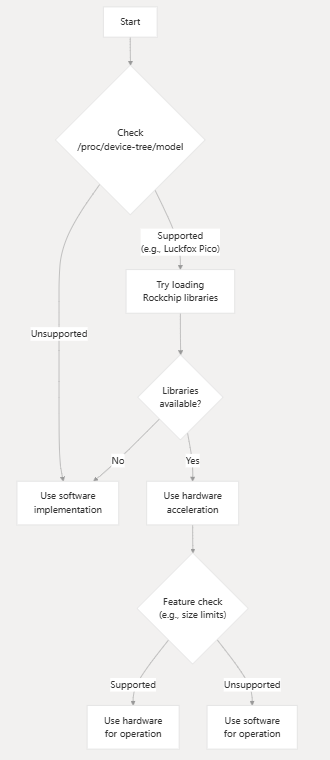

# 嵌入式开发采用so动态加载摆脱buildroot依赖

> 本文写于2025年6月9号腾冲市，整理于2025年6月28号北京市

## 一、问题背景

在嵌入式平台（如基于 Rockchip SoC 的开发板）上集成摄像头功能时，往往需要依赖厂商提供的硬件加速库，如 RGA（硬件加速的图像格式转换）、RK AIQ（图像信号处理 ISP 相关）、MPP（媒体处理平台图像视频硬件编解码等）。  

由于这些库通常只能在目标设备系统上以二进制形式存在，且可能没有针对交叉编译环境的开发包（头文件可能可得，但交叉编译时无法链接到对应的交叉编译版本库），传统做法往往是在 Buildroot 或 OpenEmbedded 等系统中：**将所有驱动、第三方闭源库、ISP 相关 SDK 等整合进一个完整的根文件系统中，并统一交叉编译、链接，生成最终可执行文件或库**。  

然而，这种方式的弊端包括：

- **庞大且复杂的 Buildroot 配置**：需要将厂商提供的加速库的交叉编译版本纳入构建，若厂商不提供或版本频繁更新，维护成本高；
- **可移植性差**：一旦移植到其他硬件平台或更新 SDK，整个 Buildroot 环境需重新调试和编译；
- **编译时间长、失败调试成本高**：任何底层组件更新或改动都可能导致全链路重新编译，每次测试程序烧写整个系统成本实在太高。
- **二进制兼容局限**：在不同系统版本或不同设备上，动态库路径、版本可能不一致，静态链接或交叉编译链接可能无法满足所有运行时环境。

因此，需要一种机制，在嵌入式应用本身仅编译核心逻辑，而将依赖的硬件加速库（如 librkaiq.so、librga.so、librockchip_mpp.so 等）留到目标设备上运行时再加载，减少交叉编译时对闭源库的直接链接依赖，从而简化 Buildroot 配置、加快迭代。


## 二、动态库动态加载的原理与优势

动态加载（runtime dynamic loading）通常基于`POSIX` 的 `dlopen`、`dlsym`、`dlclose` 等接口。在编译期不直接链接目标库，而是在运行时加载并动态解析，其一般步骤如下：

1. **尝试 `dlopen("库名.so", RTLD_LAZY)`**：若成功，即表明当前系统提供了该库，可使用硬件加速功能
2. **使用 `dlsym(handle, "函数名")` 获取函数指针**：将符号映射到本地函数指针，进而调用；
3. **若加载或获取符号失败**：可记录日志并进行回退
4. **无需在交叉编译时提供该库的链接版本**：只需在目标系统运行时提供对应的二进制库文件地址（通常由厂商系统或升级包提供），应用可动态加载。

这种方式的主要优势：

- **减少交叉编译依赖**：无需在 Buildroot 中集成库的交叉编译版本，仅需要对应头文件（若接口定义需编译期可见）或在运行时通过 dlsym 查找符号名；
- **提升可移植性**：同一应用二进制可以在不同系统或设备上运行，运行时根据系统上是否存在硬件加速库决定启用；
- **优雅降级**：若硬件库版本不匹配或不存在，程序自动切回软件实现路径，无需重新编译；
- **缩短编译时间、降低维护成本**：核心应用改动时只需编译自身代码，不必重新编译硬件 SDK；
- **灵活升级**：设备侧可单独升级硬件加速库，应用无需更新；反之亦然。


## 三、动态库动态加载接口

动态加载常用接口定义于 `<dlfcn.h>`，主要包括以下函数：

```c
#include <dlfcn.h>

// 打开（加载）动态库
void *dlopen(const char *filename, int flag);

// 获取符号地址
void *dlsym(void *handle, const char *symbol);

// 关闭（卸载）动态库
int dlclose(void *handle);

// 获取最近一次动态加载错误信息
char* dlerror(void);
```

### 3.1 接口说明

#### 3.1.1 dlopen

- **原型**：`void* dlopen(const char *filename, int flag);`
- **功能**：加载动态库文件，返回一个句柄 (handle)，后续可通过该句柄获取符号或关闭库。
- **参数**：
    - `filename`：要加载的库路径或名称。若只给库名（如 `"libfoo.so"`），系统会在运行时链接器默认的搜索路径中查找（如 `/lib`, `/usr/lib` 等），也可能受环境变量 `LD_LIBRARY_PATH` 影响。在嵌入式场景中，常用完整路径（如 `/usr/lib/librga.so`）或事先设置好搜索路径。若传入 `NULL`，则返回主程序（可执行文件本身）的句柄，允许访问主程序中的符号
    - `flag`：控制符号解析方式和可见性，常见取值有：
        - `RTLD_LAZY`：延迟解析（lazy binding）。只有在实际调用符号地址时，才会解析对应符号。优点是启动时开销小；缺点是如果符号缺失，可能在运行时才出错。
        - `RTLD_NOW`：立即解析所有未决符号（eager binding）。若有符号找不到，则 `dlopen` 返回失败。适合希望尽早发现问题的场景。
        - `RTLD_LOCAL`：本地符号，可与后续其他动态加载库隔离，库内部解析不会影响全局符号表。通常与 `RTLD_LAZY` 或 `RTLD_NOW` 配合使用：例如 `RTLD_LAZY | RTLD_LOCAL`。
        - `RTLD_GLOBAL`：将加载库的符号加入全局符号表，后续 `dlopen` 的其他库可引用这些符号。若希望插件库互相依赖，或插件访问主程序导出的符号，可使用此标志。
        - （Linux 特有）`RTLD_NODELETE`：卸载时不真正释放内存，以便库中静态数据持续存在，但一般不常用。
- **返回值**：成功返回一个非 NULL 的 `void*` 句柄；失败返回 NULL，可通过 `dlerror()` 取得错误信息。
- **注意**：  
    - 如果多次对同一 `filename` 调用 `dlopen`，glibc 默认会返回同一 handle，并增加引用计数。多次 `dlclose` 后，引用计数为 0 时才真正卸载。
    - 若 `filename` 为 NULL，则返回主程序本身的句柄，允许使用 `dlsym(NULL, "符号名")` 获取主程序或已链接库中的符号。

#### 3.1.2 dlsym

- **原型**：`void *dlsym(void *handle, const char *symbol);`
- **功能**：在已加载的动态库（或主程序，若 handle 为 NULL）中查找符号 `symbol`，返回该符号的地址（函数或全局变量地址）。
- **参数**：
    - `handle`：由 `dlopen` 返回的句柄，或 NULL 表示搜索主程序及其已链接库。
    - `symbol`：符号名字符串，例如 `"rk_aiq_uapi2_sysctl_init"`。C++ 函数往往有 name-mangling，需要 extern "C" 或使用已知的 Mangled name(不推荐这种做法，不具有通用性)；通常硬件 SDK 提供的是 C 接口，便于直接用 dlsym。
- **返回值**：成功返回非 NULL 地址；若找不到该符号，则返回 NULL。若返回 NULL，要结合 `dlerror()` 判断是真找不到还是其他原因。
- **注意**：
    - 在调用前最好先清空错误：`dlerror()`；然后调用 `dlsym`；再调用 `char *err = dlerror()`，如果 `err != NULL` 则表示有错误；否则即使 `dlsym` 返回 NULL，也可能意味着符号地址实际为 NULL（较少见），故需按这种顺序检测错误。
    - 需要将返回的 `void*` 强制转换为正确的函数指针类型：例如 `using FnInit = int (*)(int, int); FnInit init = (FnInit)dlsym(handle, "init_func_name");`。不同平台对函数指针转换有要求，但通常 `POSIX` 允许这种转换。

#### 3.1.3 dlclose

- **原型**：`int dlclose(void *handle);`
- **功能**：减少加载库的引用计数；当引用计数降为 0 时，卸载库，释放相关资源（若无 `RTLD_NODELETE`）。
- **参数**：`handle`：`dlopen` 返回的句柄。
- **返回值**：成功返回 0；失败返回非 0，可通过 `dlerror()` 获取错误信息。
- **注意**：
    - 不要在仍有函数在执行或线程正使用库功能时调用 `dlclose`。应在确定不再使用库中任何符号后再卸载。
    - 如果多次 `dlopen` 得到同一 handle，则需对应多次 `dlclose` 才真正卸载。

#### 3.1.4 dlerror

- **原型**：`char *dlerror(void);`
- **功能**：获取最近一次动态加载接口调用的错误信息字符串。每次调用此函数后，错误状态会被清除；在下一次出错前，后续调用返回 NULL。
- **使用方式**：
    1. 调用前先 `dlerror()` 一次以清除旧错误。
    2. 调用 `dlopen`/`dlsym` 等后，立即调用 `char *err = dlerror()`。
    3. 若 `err != NULL`，则打印或记录 `err`，表示有错误；否则加载或查符号成功。

#### 3.1.5 常见 Flag 组合示例

- `dlopen("librkaiq.so", RTLD_LAZY | RTLD_LOCAL);`
- `dlopen("/usr/lib/librga.so", RTLD_NOW | RTLD_LOCAL);`
- 若需要全局可见：`dlopen("libplugin.so", RTLD_LAZY | RTLD_GLOBAL);`

通过灵活组合这些标志，可以控制符号解析时机及可见性，从而满足不同场景需求。


### 3.2 使用 Demo

下面以一个简化的示例演示动态加载的完整流程。假设我们有一个插件库 `libplugin.so`，提供两个接口：

- `const char* plugin_name()`：返回插件名称字符串。
- `int plugin_add(int a, int b)`：返回 a + b。

#### 3.2.1 准备插件库

1. **插件源文件 plugin.c**：

    ```c
    #include <stdio.h>

    // 确保 C 符号导出，无 name-mangling
    const char* plugin_name() {
        return "示例插件";
    }

    int plugin_add(int a, int b) {
        return a + b;
    }
    ```
   
2. **编译为共享库**（在交叉编译环境下，此处示例在主机上编译，仅演示流程；嵌入式项目中可按相同方法交叉编译生成 .so）：

    ```bash
    gcc -fPIC -shared -o libplugin.so plugin.c
    ```
   
    - `-fPIC`：生成位置无关代码（Position Independent Code），必需用于共享库。
    - `-shared -o libplugin.so`：生成动态库文件 libplugin.so。
   
3. 将 `libplugin.so` 放到系统可搜索路径（或指定路径）：

    - 可拷贝到 `/usr/lib/`，或嵌入式系统中某个放置第三方库的目录。
    - 也可同应用放在同一目录，运行时用相对路径 `./libplugin.so` 加载。

#### 3.2.2 主程序 main.c

```c
#include <stdio.h>
#include <stdlib.h>
#include <dlfcn.h>

int main() {
    const char *libpath = "./libplugin.so";  // 根据实际路径调整
    // 清除旧错误
    dlerror();

    // 1. 尝试加载动态库
    void *handle = dlopen(libpath, RTLD_LAZY | RTLD_LOCAL);
    if (!handle) {
        const char *err = dlerror();
        fprintf(stderr, "无法加载库 %s: %s\n", libpath, err ? err : "未知错误");
        return EXIT_FAILURE;
    }
    printf("成功加载库：%s\n", libpath);

    // 2. 查找符号 plugin_name
    dlerror();  // 清除错误
    typedef const char* (*FnPluginName)();
    FnPluginName plugin_name = (FnPluginName)dlsym(handle, "plugin_name");
    const char *err = dlerror();
    if (err != NULL || plugin_name == NULL) {
        fprintf(stderr, "无法找到符号 plugin_name: %s\n", err ? err : "符号地址为空");
        dlclose(handle);
        return EXIT_FAILURE;
    }
    // 调用
    const char *name = plugin_name();
    printf("插件名称: %s\n", name);

    // 3. 查找符号 plugin_add
    dlerror();
    typedef int (*FnPluginAdd)(int, int);
    FnPluginAdd plugin_add = (FnPluginAdd)dlsym(handle, "plugin_add");
    err = dlerror();
    if (err != NULL || plugin_add == NULL) {
        fprintf(stderr, "无法找到符号 plugin_add: %s\n", err ? err : "符号地址为空");
        dlclose(handle);
        return EXIT_FAILURE;
    }
    // 调用
    int a = 3, b = 5;
    int sum = plugin_add(a, b);
    printf("plugin_add(%d, %d) = %d\n", a, b, sum);

    // 4. 关闭库
    if (dlclose(handle) != 0) {
        fprintf(stderr, "dlclose 失败: %s\n", dlerror());
    } else {
        printf("库已卸载\n");
    }

    return EXIT_SUCCESS;
}
```

#### 3.2.3 说明

1. **清除旧错误**
    - 在每次 `dlopen` 或 `dlsym` 前，调用一次 `dlerror()`，确保之前的错误不会干扰当前判断。
2. **加载库**
    - `dlopen(libpath, RTLD_LAZY | RTLD_LOCAL)`：延迟解析、符号本地可见。若加载失败，立即通过 `dlerror()` 获取原因并退出或回退。
3. **获取符号**
    - `dlsym(handle, "symbol_name")`：返回 `void*`，需要强制转换为正确的函数指针类型。为安全起见，调用后立即检查 `dlerror()` 是否返回错误。
4. **调用函数**
    - 将函数指针当普通函数调用。注意，如果符号约定发生变化（如接口签名更新），调用时可能崩溃或产生未定义行为，因此在编译时要保证头文件与运行时库接口一致。
5. **卸载库**
    - `dlclose(handle)`：减少引用计数并在无更多引用时卸载。卸载后，若再次使用该句柄或符号指针将出现未定义行为。
6. **路径和权限**
    - 示例中使用相对路径 `./libplugin.so`，实际嵌入式项目中可用绝对路径或由配置指定；确保运行时进程对该路径有读取权限。


### 3.3 进一步扩展：基于配置的动态加载

在更复杂项目中，可能需要：

- **配置文件或环境变量** 指定库路径或是否强制禁用加载。例如：`export HW_ACCEL_LIB_PATH=/vendor/lib`，在代码中 `dlopen(path_from_config + "/librga.so", ...)`。
- **版本检查**：若库提供版本查询接口（如 `int get_lib_version()`），可先 `dlsym` 版本查询符号，检查版本满足需求后再加载关键接口；否则回退或提示升级。
- **多库依赖**：若某库依赖另一库，可先后按顺序加载并检查。例如：先 `dlopen("libA.so")`；若需要在 libA 中查某符号时，可能需要保证 libB 已加载，可先 `dlopen("libB.so", RTLD_LAZY|RTLD_GLOBAL)`，然后再加载 libA。
- **符号冲突管理**：若不同版本库可能导出同名符号，通过 `RTLD_LOCAL` 将其隔离，或通过 `dlmopen`（Linux 特有）加载到不同命名空间。
- **线程安全**：在多线程场景，若不同线程可能并发触发加载逻辑，需加锁避免重复加载或竞态。


## 四、业界实现—capture_v4l2_rk_aiq.cpp

> 参考链接：https://github.com/nihui/opencv-mobile/blob/v33/highgui/src/capture_v4l2_rk_aiq.cpp

以下结合 OpenCV Mobile 中的 capture_v4l2_rk_aiq.cpp，概述其核心流程和动态加载实现要点。

1. **初始化阶段**
   
    - 检测平台（如读取 `/proc/device-tree/model` 判断是否为 Rockchip）；

    - 动态加载 RK AIQ 库：`dlopen("librkaiq.so", RTLD_LAZY)`；

    - dlsym 获取关键 API：如 `rk_aiq_uapi2_sysctl_preInit_devBufCnt`、`rk_aiq_uapi2_sysctl_init`、`rk_aiq_uapi2_sysctl_prepare`、`rk_aiq_uapi2_sysctl_start` 等；

    - 若任一关键符号缺失，则立即卸载并标记“无硬件加速”；

    - 若成功，则调用预初始化、初始化接口，创建 AIQ 上下文，设置分辨率、帧率、缓冲等。

        参考 [https://github.com/nihui/opencv-mobile/blob/v33/highgui/src/capture_v4l2_rk_aiq.cpp#L390](https://github.com/nihui/opencv-mobile/blob/v33/highgui/src/capture_v4l2_rk_aiq.cpp#L390)

2. **捕获循环**
   
    - 使用 V4L2 接口打开摄像头设备节点，设置 pixel format（NV12/NV21）、分辨率、帧率；

    - 在每帧到来后，若启用 RK AIQ：可能先调用 AIQ “准备”/“执行”接口，让 ISP 对图像做自动白平衡、曝光等处理；若不启用，则直接获取原始帧；
   
    - 将获取到的格式化数据放入缓冲；

        参考：

        1. [https://github.com/nihui/opencv-mobile/blob/v33/highgui/src/capture_v4l2_rk_aiq.cpp#L940](https://github.com/nihui/opencv-mobile/blob/v33/highgui/src/capture_v4l2_rk_aiq.cpp#L940)
        2. [https://github.com/nihui/opencv-mobile/blob/v33/highgui/src/capture_v4l2_rk_aiq.cpp#L1197-L1431](https://github.com/nihui/opencv-mobile/blob/v33/highgui/src/capture_v4l2_rk_aiq.cpp#L1197-L1431)
   
3. **后处理**
    - 若启用了 RGA：动态加载 librga.so，dlsym 获取转换函数，如将 NV12 转 BGR，并可在此阶段执行缩放；

    - 若未启用或加载失败：直接退出系统；

    - 最终填充到 cv::Mat 或 native buffer 中；
      参考：

        1. [https://github.com/nihui/opencv-mobile/blob/v33/highgui/src/capture_v4l2_rk_aiq.cpp#L1446-L1465](https://github.com/nihui/opencv-mobile/blob/v33/highgui/src/capture_v4l2_rk_aiq.cpp#L1446-L1465)
        2. [https://github.com/nihui/opencv-mobile/blob/v33/highgui/src/capture_v4l2_rk_aiq.cpp#L1584-L1614](https://github.com/nihui/opencv-mobile/blob/v33/highgui/src/capture_v4l2_rk_aiq.cpp#L1584-L1614)
   
4. **退出与反初始化**
   
    - 释放 V4L2 缓冲和设备；
    - 若启用了 RK AIQ：调用 stop/deinit 接口，dlclose(handle_rkaiq)；
    - 若加载了 RGA/MPP：对应释放和 dlclose；
    - 清理内部状态，准备下次重启或进程退出；
   
5. **错误处理与回退**
    - 在任意阶段若检测到关键调用失败（如 AIQ 准备失败或 RGA 转换失败），系统退出；
    - 记录日志，便于分析硬件路径为何不可用；


下面这张图片是整个原作者nihui设计的程序框图



## 五、实践要点与注意事项

在实际项目中采用动态加载方式时，需要注意以下几点：

1. **接口声明与头文件管理**

    - 应提前获取硬件 SDK 提供的头文件（声明函数名、数据结构、枚举等），便于在应用中正确调用和编译；
    - 可将头文件纳入应用源码或以单独包形式管理，但不需要链接库；
    - 必须确保符号名称与运行时库一致（C++ 下注意 extern "C" 或命名空间问题）；

2. **路径管理**

    - 在 dlopen 时要考虑库文件在目标系统的实际路径，比如 `/usr/lib/`、`/vendor/lib/`、或自定义路径；
    - 可通过环境变量或配置文件在运行时指定库路径，或使用 `dlopen` 时完整路径；
    - 如果可能存在多版本库，可在加载前检测版本号或使用版本化符号名；

3. **符号获取与兼容性**

    - 对于新增接口或版本变更，要判断关键符号是否存在，若不存在则回退；
    - 在 dlsym 获取函数指针后，建议检查指针有效性；
    - 若某些新功能接口非强依赖，可在运行时判断是否可用，并动态选择是否启用特性；

4. **错误处理与日志记录**

    - dlopen/dlsym 可能失败，需通过 `dlerror()` 获取详细错误信息，便于诊断；
    - 在回退到软件路径时，记录日志以便分析为何硬件加速不可用；
    - 可在启动时打印硬件检测、加载过程摘要，便于远程调试；

5. **性能与资源管理**

    - 虽然动态加载本身开销较小（通常只在启动或首次使用时加载），但要避免频繁 dlopen/dlclose；
    - 对于长时间运行的应用，应保持库句柄打开直到不再需要；
    - 释放资源时须按正确顺序调用反初始化接口并 dlclose，以避免内存泄漏或资源未释放；

6. **安全与权限**

    - 确保目标系统上硬件库可靠、可信；避免加载不受信任的库；
    - 在某些系统上，可能需要调整 SELinux 或权限设置，允许应用访问库文件及底层设备节点；
    - 若应用以非 root 身份运行，需保证具备访问摄像头设备节点和硬件库所需权限；

7. **测试与回归**

    - 在多种目标系统版本、多种硬件型号上进行测试，确保动态加载逻辑健壮；
    - 在硬件库升级后，要验证符号兼容性；如果重大版本升级导致不兼容，应更新应用中对应的头文件或加载逻辑；
    - 提供配置选项以强制禁用硬件加速，便于在问题排查时快速定位；

8. **交叉编译配置简化**

    - 在 Buildroot 或 CMake 中，仅编译应用自身代码和通用库，无需将硬件 SDK 纳入交叉编译；
    - 在 CMake 脚本中，可以使用下面这句话来实现多系统兼容

        ```cmake
        # 链接 dlopen 所在的库（在 Linux 上会自动变成 -ldl；在 macOS/Windows 上什么也不加）
        target_link_libraries(my_app PRIVATE ${CMAKE_DL_LIBS})
        ```
    - 可在生成的 Makefile 或脚本中预留运行时环境变量，以指向动态库路径；
   
   

## 六、参考封装实践

若需在自身嵌入式项目中借鉴该设计，可按以下步骤进行：

1. **获取硬件 SDK 头文件**：从 Rockchip 等厂商获得对应头文件，了解关键 API，或读取系统已安装库的头文件；
2. **在项目中编写动态加载模块**：参考 capture_v4l2_rk_aiq.cpp 的加载逻辑，建立一层 wrapper，封装 dlopen/dlsym 及函数指针管理；可将加载逻辑封装为单独组件，例如 `HardwareAccelLoader`；
3. **编译期仅依赖头文件**：在 CMakeLists.txt 或 Makefile 中，不链接硬件库，仅包含头文件路径；
4. **运行期部署**：确保目标系统安装了对应动态库文件（librkaiq.so、librga.so、librockchip_mpp.so 等），或者通过系统升级包、SDK 安装脚本等方式放置到合适的路径；
5. **日志与配置**：提供运行时配置选项，可手动指定库路径或强制禁用硬件加速；在日志中打印加载结果；
6. **测试多场景**：在有硬件加速且版本正确的系统上测试，使其进入硬件路径；在缺少硬件库或版本不匹配的系统上测试，验证回退到软件路径正常；
7. **更新维护**：若硬件 SDK 升级，需比对符号变化，更新函数指针列表；如果新增特性，动态加载时先检测新符号再决定是否启用；


下面举个例子，比如需要rv1126中一些rkmidia相关函数

1. 首先我们需要引入头文件
   
    ```c
    #include "rkmedia_common.h"
    #include "rkmedia_vi.h"
    #include "rkmedia_api.h"
    ```

2. 定义handle指针

    ```c
    static void *librk_mpi = nullptr;
    ```

3. 使用C++11特性定义函数指针

    ```c++
    #define FUNC_PTR(func_name) decltype(&func_name)


    // 以下函数指针均从 libeasymedia.so 中 dlsym 获取
    static FUNC_PTR(RK_MPI_SYS_Init)               PF_RK_MPI_SYS_Init            = nullptr;
    static FUNC_PTR(RK_MPI_VI_SetChnAttr)          PFN_RK_MPI_VI_SetChnAttr      = nullptr;
    static FUNC_PTR(RK_MPI_VI_EnableChn)           PFN_RK_MPI_VI_EnableChn       = nullptr;
    static FUNC_PTR(RK_MPI_SYS_GetMediaBuffer)     PF_RK_MPI_SYS_GetMediaBuffer  = nullptr;  // 返回 MEDIA_BUFFER
    static FUNC_PTR(RK_MPI_MB_Handle2VirAddr)      PF_RK_MPI_MB_Handle2VirAddr   = nullptr;  // 从 MEDIA_BUFFER 获得虚拟地址
    static FUNC_PTR(RK_MPI_SYS_SendMediaBuffer)    PF_RK_MPI_SYS_SendMediaBuffer = nullptr;  // 把 MEDIA_BUFFER 送给 VO
    static FUNC_PTR(RK_MPI_VI_DisableChn)          PFN_RK_MPI_VI_DisableChn      = nullptr;
    static FUNC_PTR(RK_MPI_SYS_UnBind)             PFN_RK_MPI_SYS_UnBind         = nullptr;
    static FUNC_PTR(RK_MPI_RGA_DestroyChn)         PFN_RK_MPI_RGA_DestroyChn     = nullptr;
    static FUNC_PTR(RK_MPI_RGA_CreateChn)          PFN_RK_MPI_RGA_CreateChn      = nullptr;
    static FUNC_PTR(RK_MPI_VO_CreateChn)           PFN_RK_MPI_VO_CreateChn       = nullptr;
    static FUNC_PTR(RK_MPI_VO_DestroyChn)          PF_RK_MPI_VO_DestroyChn       = nullptr;
    static FUNC_PTR(RK_MPI_VI_RGN_SetCover)        PFN_RK_MPI_VI_RGN_SetCover    = nullptr;
    static FUNC_PTR(RK_MPI_SYS_Bind)               PFN_RK_MPI_SYS_Bind           = nullptr;
    static FUNC_PTR(RK_MPI_MB_ReleaseBuffer)       PFN_RK_MPI_MB_ReleaseBuffer   = nullptr;
    static FUNC_PTR(RK_MPI_MB_GetPtr)              PFN_RK_MPI_MB_GetPtr          = nullptr;
    static FUNC_PTR(RK_MPI_MB_GetSize)             PFN_RK_MPI_MB_GetSize         = nullptr;
    static FUNC_PTR(RK_MPI_MB_CreateBuffer)        PFN_RK_MPI_MB_CreateBuffer    = nullptr;
    static FUNC_PTR(RK_MPI_MB_SetSize)             PFN_RK_MPI_MB_SetSize         = nullptr;
    static FUNC_PTR(RK_MPI_MB_CreateImageBuffer)   PFN_RK_MPI_MB_CreateImageBuffer = nullptr;
    ```

4. 动态加载库函数

    ```c++

    static int load_rk_mpi_library()
    {
        if (librk_mpi) return 0;
        librk_mpi = dlopen("libeasymedia.so", RTLD_GLOBAL | RTLD_LAZY);
        if (!librk_mpi) {
            librk_mpi = dlopen("/oem/usr/lib/libeasymedia.so", RTLD_GLOBAL | RTLD_LAZY);
        }
        if (!librk_mpi) {
            fprintf(stderr, "Error: cannot load libeasymedia.so\n");
            return -1;
        }

        PF_RK_MPI_SYS_Init            = (decltype(PF_RK_MPI_SYS_Init))          dlsym(librk_mpi, "RK_MPI_SYS_Init");
        PFN_RK_MPI_VI_SetChnAttr      = (decltype(PFN_RK_MPI_VI_SetChnAttr))    dlsym(librk_mpi, "RK_MPI_VI_SetChnAttr");
        PFN_RK_MPI_VI_EnableChn       = (decltype(PFN_RK_MPI_VI_EnableChn))     dlsym(librk_mpi, "RK_MPI_VI_EnableChn");
        PF_RK_MPI_SYS_GetMediaBuffer  = (decltype(PF_RK_MPI_SYS_GetMediaBuffer))dlsym(librk_mpi, "RK_MPI_SYS_GetMediaBuffer");
        PF_RK_MPI_MB_Handle2VirAddr   = (decltype(PF_RK_MPI_MB_Handle2VirAddr)) dlsym(librk_mpi, "RK_MPI_MB_Handle2VirAddr");
        PF_RK_MPI_SYS_SendMediaBuffer = (decltype(PF_RK_MPI_SYS_SendMediaBuffer))dlsym(librk_mpi, "RK_MPI_SYS_SendMediaBuffer");
        PFN_RK_MPI_VI_DisableChn      = (decltype(PFN_RK_MPI_VI_DisableChn))    dlsym(librk_mpi, "RK_MPI_VI_DisableChn");
        PFN_RK_MPI_SYS_UnBind         = (decltype(PFN_RK_MPI_SYS_UnBind))       dlsym(librk_mpi, "RK_MPI_SYS_UnBind");
        PFN_RK_MPI_RGA_DestroyChn      = (decltype(PFN_RK_MPI_RGA_DestroyChn))    dlsym(librk_mpi, "RK_MPI_RGA_DestroyChn");
        PFN_RK_MPI_RGA_CreateChn      = (decltype(PFN_RK_MPI_RGA_CreateChn))    dlsym(librk_mpi, "RK_MPI_RGA_CreateChn");
        PFN_RK_MPI_VO_CreateChn       = (decltype(PFN_RK_MPI_VO_CreateChn))     dlsym(librk_mpi, "RK_MPI_VO_CreateChn");
        PF_RK_MPI_VO_DestroyChn       = (decltype(PF_RK_MPI_VO_DestroyChn))     dlsym(librk_mpi, "RK_MPI_VO_DestroyChn");
        PFN_RK_MPI_VI_RGN_SetCover    = (decltype(PFN_RK_MPI_VI_RGN_SetCover))     dlsym(librk_mpi, "RK_MPI_VI_RGN_SetCover");
        PFN_RK_MPI_SYS_Bind           = (decltype(PFN_RK_MPI_SYS_Bind))     dlsym(librk_mpi, "RK_MPI_SYS_Bind");
        PFN_RK_MPI_MB_ReleaseBuffer   = (decltype(PFN_RK_MPI_MB_ReleaseBuffer))     dlsym(librk_mpi, "RK_MPI_MB_ReleaseBuffer");
        PFN_RK_MPI_MB_GetPtr          = (decltype(PFN_RK_MPI_MB_GetPtr))dlsym(librk_mpi, "RK_MPI_MB_GetPtr");
        PFN_RK_MPI_MB_GetSize         = (decltype(PFN_RK_MPI_MB_GetSize))dlsym(librk_mpi, "RK_MPI_MB_GetSize");
        PFN_RK_MPI_MB_CreateBuffer    = (decltype(PFN_RK_MPI_MB_CreateBuffer))dlsym(librk_mpi, "RK_MPI_MB_CreateBuffer");
        PFN_RK_MPI_MB_SetSize         = (decltype(PFN_RK_MPI_MB_SetSize))dlsym(librk_mpi, "RK_MPI_MB_SetSize");
        PFN_RK_MPI_MB_CreateImageBuffer = (decltype(PFN_RK_MPI_MB_CreateImageBuffer))dlsym(librk_mpi, "RK_MPI_MB_CreateImageBuffer");

        // 检查所有必需符号是否加载成功
        if (!PF_RK_MPI_SYS_Init ||
            !PFN_RK_MPI_VI_SetChnAttr ||
            !PFN_RK_MPI_VI_EnableChn ||
            !PF_RK_MPI_SYS_GetMediaBuffer ||
            !PF_RK_MPI_MB_Handle2VirAddr ||
            !PF_RK_MPI_SYS_SendMediaBuffer ||
            !PFN_RK_MPI_VI_DisableChn ||
            !PFN_RK_MPI_SYS_UnBind ||
            !PFN_RK_MPI_RGA_DestroyChn ||
            !PFN_RK_MPI_RGA_CreateChn ||
            !PFN_RK_MPI_VO_CreateChn ||
            !PFN_RK_MPI_VI_RGN_SetCover ||
            !PFN_RK_MPI_SYS_Bind ||
            !PFN_RK_MPI_MB_ReleaseBuffer ||
            !PF_RK_MPI_VO_DestroyChn) {
            fprintf(stderr, "Error: failed to load one or more RK_MPI symbols\n");
            return -1;
        }

        return 0;
    }

    static int unload_rk_mpi_library()
    {
        if (!librk_mpi) return 0;
        dlclose(librk_mpi);
        librk_mpi = nullptr;
        PF_RK_MPI_SYS_Init            = nullptr;
        PFN_RK_MPI_VI_SetChnAttr      = nullptr;
        PFN_RK_MPI_VI_EnableChn       = nullptr;
        PF_RK_MPI_SYS_GetMediaBuffer  = nullptr;
        PF_RK_MPI_MB_Handle2VirAddr   = nullptr;
        PF_RK_MPI_SYS_SendMediaBuffer = nullptr;
        PFN_RK_MPI_VI_DisableChn      = nullptr;
        PFN_RK_MPI_SYS_UnBind         = nullptr;
        PFN_RK_MPI_RGA_DestroyChn     = nullptr;
        PFN_RK_MPI_RGA_CreateChn      = nullptr;
        PFN_RK_MPI_VO_CreateChn       = nullptr;
        PF_RK_MPI_VO_DestroyChn       = nullptr;
        return 0;
    }
    ```

5. 定义RAAI类并初始化

    ```c++
    class rk_mpi_library_loader {
    public:
        bool ready;
        rk_mpi_library_loader()  { ready = (load_rk_mpi_library() == 0); }
        ~rk_mpi_library_loader() { if (ready) unload_rk_mpi_library(); }
    } mpi;
    ```


通过RAII（Resource Acquisition Is Initialization）方式，即rk_mpi_library_loader实例化的对象来管理库的加载与释放。


## 七、总结

通过动态库动态加载方式，可大大减少嵌入式项目对 Buildroot 全局交叉编译库的依赖，将硬件加速库的管理从编译期转移到运行期：

- **编译更轻量**：只需编译自身代码，Buildroot 配置更简洁；
- **部署更灵活**：可在不同系统上部署同一二进制，只要运行时提供或不提供硬件库，即可自动启用或禁用硬件加速；
- **维护成本降低**：硬件 SDK 更新时无需重新编译应用，仅需更新目标系统的库；
- **更好地适应嵌入式场景多变的系统环境**：不同设备、不同系统版本可能存在不同库版本、不同路径，动态加载设计具备更强兼容性和可移植性；
- **优雅回退**：在硬件加速不可用时自动回落到软件实现，保证功能可用性。

在具体项目中，可参考上述设计思路和实践要点，自行编写动态加载 wrapper 层，配合通用的软件实现路径，从而摆脱 Buildroot 对闭源硬件库的静态依赖，提升开发效率与系统兼容能力。

## 参考链接

- [https://github.com/nihui/opencv-mobile/blob/v33/highgui/src/capture_v4l2_rk_aiq.cpp](https://github.com/nihui/opencv-mobile/blob/v33/highgui/src/capture_v4l2_rk_aiq.cpp)
- [https://deepwiki.com/nihui/opencv-mobile/4.3-rockchip-hardware-acceleration](https://deepwiki.com/nihui/opencv-mobile/4.3-rockchip-hardware-acceleration)
