# 增强MLLM的Visual Grounding能力方法调研（一）

> 本文写于2025年9月29号晚10点、2025年9月30号晚九点

## 零、前言

Visual Grounding（视觉定位）是指根据自然语言描述，在图像中定位对应区域（如边界框、掩码或像素级区域）的任务。

本文主要讨论一个问题：“如何增强图像文本多模态生成式大模型的Visual Grounding能力”。

接下来本文将从如下几个方面进行展开：

1. Visual Grounding任务的定义与评估
2. 实现Visual Grounding的几种模型结构
3. 如何提升Visual Grounding能力
    - training-free的方法：prompt
    - sft
        - 数据合成：如何合成高质量的数据
        - 模型结构：比如引入细粒度信息
        - 训练方式：比如引入定位Loss

从23年至今专注于Grounding的文章很多，本文仅选择经典高引用文章和发表时间较新的文章作为参考，难免会有疏漏，还请读者见谅。

由于时间关系，本文暂不涉及强化学习对于Visual Grounding的增强，计划放到下个系列进行讲解。

## 一、Visual Grounding的概念

### 1.1 两种定义与评估方式
Visual Grounding[^1]（VG，视觉定位 / 视觉接地），也常被称为 Referring Expression Comprehension（REC） 或 Phrase Grounding（PG），其核心任务是：

!!!info

    给定一幅图像 I 和一段自然语言描述 T ，模型需在图像 I 中定位出 T 所指称的目标区域，通常以边界框（bounding box）形式表示。 

该任务的本质在于建立“语言 → 视觉”的指称映射，是实现跨模态语义对齐与细粒度理解的关键能力。

当前学界对 VG 的定义可划分为狭义（Classical）与广义（Generalized）两类，二者在任务设定、数据集构建及评估指标上存在显著差异。

1. 狭义定义（Classical / Standard VG）  
    - 任务设定：假设每条语言描述在图像中唯一对应一个目标对象，模型只需输出单个边界框。
    - 典型数据集： RefCOCO / RefCOCO+ / RefCOCOg/ReferItGame、Flickr30k Entities
    - 评估指标：
        - 样本级：计算预测框与真实框（GT）的 IoU（Intersection over Union）。
        - 数据集级：采用 Acc@0.5 ，即 IoU ≥ 0.5 的样本比例（以百分比表示）。
2. 广义定义（Generalized VG / GREC / GVG）
    - 任务设定：语言描述可能对应：  
        - 零个对象（如“图中有一只独角兽”但图像中没有），
        - 单个对象，
        - 多个对象（如“所有红色的苹果”）。  
    - 此定义要求模型需具备动态输出任意数量边界框（包括空集）的能力。
    - 典型数据集：gRefCOCO、Ref-ZOM、D3
    - 评估指标（当前学界初步共识）：
        - 多目标场景：采用 Precision@(F1=1, IoU≥0.5)
            - 对每个样本独立计算：
                - TP（True Positive）：预测框与 GT 框 IoU ≥ 0.5；
                - FP（False Positive）：无匹配 GT 的预测框；
                - FN（False Negative）：无匹配预测的 GT 框。
            仅当该样本的 F1 = 1（即 TP 完全覆盖所有 GT 且无 FP）时，才视为正确。最终报告所有样本中满足 F1=1 的比例。
        - 无目标场景：采用 N-acc（No-target Accuracy）
            - 若 GT 为空且模型预测为空 → TP；
            - 若 GT 非空但模型预测为空 → FN。
        - N-acc = TP / (TP + FN)，衡量模型对“不存在目标”的判断能力。

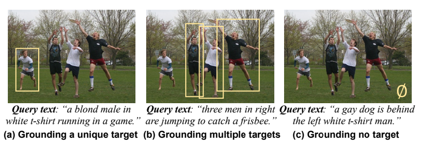

### 1.2 相关概念区分

Visual Grounding 作为多模态理解的核心任务，衍生出多个密切相关但目标各异的子任务。为避免混淆，有必要明确其定义边界、输入输出形式及相互关系。

| 任务缩写 | 任务名称 | 一句话定义 | 输入 → 输出 | 与 REC 的关系 |
|--------|--------|----------|------------|-------------|
| **REC** | Referring Expression Comprehension | 在整幅图像中定位**唯一**被指称物体，输出单个边界框。 | ⟨图像, 完整句子⟩ → 1 个 bbox | 即狭义 VG 的标准形式。 |
| **PG** | Phrase Grounding | 定位**短名词短语**（如 “red car”）对应的单个区域，输出单个 bbox。 | ⟨图像, 短名词短语⟩ → 1 个 bbox | 可视为 REC 的“短文本特例”；Flickr30k Entities 和 ReferItGame 常被归为 PG。 |
| **GREC / GVG** | Generalized REC / Generalized Visual Grounding | 放宽“唯一目标”假设，允许指称 **0 个、1 个或多个**对象。 | ⟨图像, 句子⟩ → 0/1/多个 bbox | REC 的广义扩展，需新评估指标（如 Precision@(F1=1)、N-acc）。 |
| **DOD** | Described Object Detection | 与 GREC **任务等价**，仅命名不同。 | 同 GREC | 无实质差异，属并行术语。 |
| **REG** | Referring Expression Generation | 给定图像中某物体（bbox），生成能**唯一指称它**的自然语言描述。 | ⟨图像, bbox⟩ → 文本句子 | REC 的**逆向任务**（“框→文” vs “文→框”），常用于循环一致性训练或伪标签生成。 |
| **RES** | Referring Expression Segmentation | 定位被指称物体，但输出**像素级掩码**而非边界框。 | ⟨图像, 句子⟩ → 1 个分割掩码 | 与 REC 目标一致，仅输出粒度更细；常与 REC 联合训练（多任务学习）。 |

!!! tips "关键区分点"
    - **REC/PG/RES** 均假设“存在且唯一”；  
    - **GREC/GVG/DOD** 支持开放数量（含零）；  
    - **REG** 是生成式逆任务；  
    - **RES** 强调空间精度，适用于精细交互场景（如机器人抓取）。

**拓展概念**

| 任务缩写 | 任务名称 | 一句话定义 | 输入 → 输出 | 与核心任务的区别要点 |
|--------|--------|----------|------------|------------------|
| **PL** | Phrase Localization | 对整句 caption 中**所有名词短语**进行检测并建立对应关系（多对多）。 | ⟨图像, 完整句子⟩ → {名词短语 ↔ bbox} 集合 | 不同于 PG/REC 仅关注“主指称”，PL 要求**全句语义解析**与密集对齐。 |
| **OVG / OVVG** | Open-Vocabulary Visual Grounding | 在测试阶段可处理**训练未见的词汇或描述**（如新品牌、新组合）。 | ⟨图像, 任意文本⟩ → bbox | 强调**词汇层面的开放性**（非仅类别 zero-shot），依赖大规模视觉-语言预训练（VLP）模型（如 CLIP、GLIP）。 |
| **MCVG** | Multi-Context Visual Grounding | 在**多张图像组成的上下文**中定位文本所指物体。 | ⟨多图, 句子⟩ → bbox（指定图） | 需跨图推理与消歧（如“左边图中的狗”），与单图 VG 形成对比；代表性数据集：MC-Bench。 |
| **TSGV** | Temporal Sentence Grounding in Video | 定位视频中与句子语义匹配的**时间区间**（起止帧），无需空间框。 | ⟨视频, 句子⟩ → [t_start, t_end] | 与 **Video Object Grounding**（VOG）区别：VOG 要求逐帧空间定位，TSGV 仅需时间定位。 |

!!! tips "趋势观察"
    - 从 **单目标 → 多目标/零目标**（GREC）；  
    - 从 **闭集 → 开放词汇**（OVG）；  
    - 从 **单图 → 多图/视频**（MCVG, TSGV）；  
    - 从 **边界框 → 掩码/全句解析**（RES, PL）。  
    这些拓展反映了 VG 任务正逐步逼近真实世界复杂交互需求。

### 1.3 应用领域

Visual Grounding 不仅是多模态理解的基础能力，更是连接语言指令与视觉世界的关键桥梁。其应用已从实验室走向真实场景，广泛渗透至基础视觉任务、垂直行业、智能体系统及跨任务协同等多个层面。

1. 基础视觉任务增强
    - Grounded Object Detection（基于文本的开放词汇检测）   
    利用自然语言描述（如“穿红衣服的人”“带logo的矿泉水瓶”）替代预定义类别标签，实现任意语义目标的检测。典型代表如 GLIP、Grounding DINO，显著提升模型在长尾或动态场景下的泛化能力。
    - Referring Counting（指代表达计数）  
    在定位基础上进一步统计满足语言描述的目标数量（如“图中有几只猫？”）。该任务要求模型兼具精确定位与集合推理能力，常用于零售货架盘点、人群密度分析等场景。
2. 垂直行业落地
    - 遥感视觉定位（Remote-Sensing VG）  
    在卫星或航拍图像中，根据文本指令定位“油罐”“停机坪”“风电场”等关键基础设施。挑战在于目标尺度变化大、背景复杂，且需处理专业术语（如“储油罐群”）。代表性数据集：RSVG、DIOR-VG。
    - 医学视觉定位（Medical VG）  
    在 X 光、CT、MRI 等医学影像中，根据临床描述（如“右肺上叶的磨玻璃结节”）定位病灶或解剖结构。对定位精度与术语一致性要求极高，是辅助诊断与报告生成的关键前置步骤。
3. 机器人与多智能体系统
    - 视觉-语言导航（Vision-and-Language Navigation, VLN）  
    机器人根据自然语言指令（如“去厨房，拿冰箱里的牛奶”）在未知环境中定位目标并规划路径。VG 能力用于指令-场景对齐，是实现具身智能的核心模块。
    - 机器人操作（Robotic Manipulation）  
    机械臂依据细粒度指令（如“拿起左边第二个红色杯子”）完成抓取、放置等操作。依赖高精度的空间指代消解与多目标区分能力，常结合 RES（分割掩码）提升操作鲁棒性。
    - 多模态人机交互代理  
        - 移动端：如 Ferret-UI，用户通过语言指代手机界面上的元素（“点击右下角的购物车”），实现无障碍操作。  
        - 无人机/监控系统：在实时视频流中响应“跟踪穿蓝衣服的人”等动态指令，支持安防、巡检等任务。

4. 跨任务协同与生成增强
    - Grounded VQA（定位增强的视觉问答）  
    在回答复杂问题前，先定位问题所涉区域（如“桌子上的书是什么颜色？”需先定位“桌子上的书”）。研究表明，显式引入 VG 模块可显著提升 VQA 模型在指代类问题上的准确率。
    - 图像/视频字幕生成与编辑  
        - 生成阶段：在生成描述时同步输出目标区域（如“一只狗（bbox: [x1,y1,x2,y2]）在草地上奔跑”），提升 caption 的可解释性。
        - 编辑阶段：用户指令如“把图中穿黑衣服的人换成穿白衣服的”，需先精准定位“穿黑衣服的人”，再进行局部编辑。VG 是可控生成的前提。

## 二、面向REC任务的五种模型结构

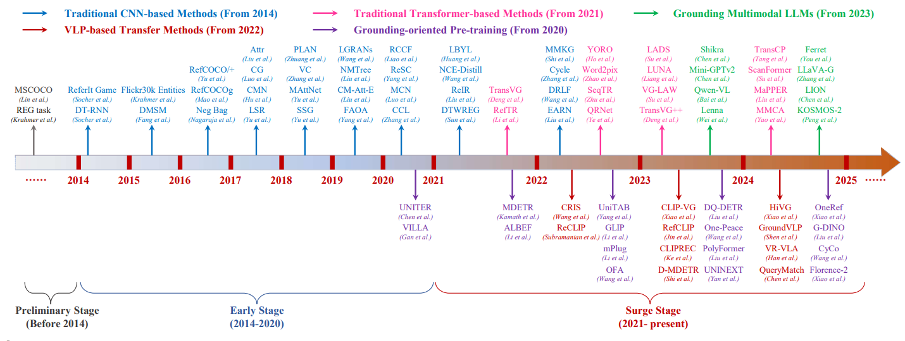
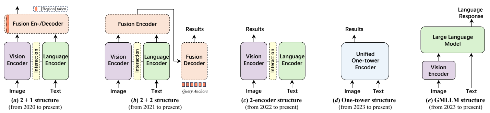

Visual Grounding 的模型架构经历了从 CNN-based 两阶段方法 → Transformer-based 端到端检测 → 多模态大语言模型（GMLLM） 的演进。根据视觉-语言交互方式与计算流程，可将其归纳为以下五类典型框架：

| 结构类型 | 关键创新 | 代表模型 | 适用场景 |
|--------|--------|--------|--------|
| **2+1（双编码器 + 融合模块）** | 区域提议 + 跨模态匹配 | TransVG, ReSC, CLIP-VG | 传统 REC（单目标、闭集） |
| **2+2（编码器-解码器 + 查询机制）** | 端到端检测-语言融合 | MDETR, Grounding DINO, UniTAB | 开放词汇检测、多目标定位 |
| **双编码器（轻量融合）** | 参数高效交互 | TransVG++, VG-LAW | 实时推理、边缘部署 |
| **单塔（统一 Transformer）** | 统一语义空间建模 | OneRef, YORO | 高效单模型、预训练依赖强 |
| **GMLLM（多模态大语言模型）** | 坐标 Token 化 + 自回归生成 | Shikra, Ferret, KOSMOS-2 | 零样本、对话式交互、复杂推理 |

### 2.1 2+1 结构：两阶段区域匹配（Two-Stage Pipeline）

- **代表模型**：TransVG、ReSC、CLIP-VG  
- **核心设计**：
    - **视觉分支**：使用 CNN（如 ResNet）或 ViT 提取图像特征，通常依赖预训练目标检测器（如 Faster R-CNN）生成候选区域（Region Proposals）。
    - **语言分支**：采用 LSTM 或 BERT 对指代表达进行编码。
    - **融合模块**：通过跨模态注意力（Cross-Attention）将语言语义与每个候选区域对齐，最终通过可学习的 `[Region]` token 回归目标框坐标。
- **特点**：
    - **两阶段流程**：先检测后匹配，模块解耦，易于调试。
    - **依赖强先验**：需高质量区域提议与预训练语言模型。
    - **局限性**：难以处理多目标或零目标场景，泛化能力受限于检测器类别集。

### 2.2 2+2 结构：端到端编码器-解码器融合（Encoder-Decoder with Query）

- **代表模型**：MDETR、Grounding DINO、UniTAB  
- **核心设计**：
    - **双编码器**：视觉（如 Swin Transformer）与语言（如 RoBERTa）独立编码。
    - **Transformer 解码器**：引入可学习的 object queries，通过 cross-attention 融合多模态信息，直接输出边界框与类别（或文本描述）。
    - **多任务预训练**：联合训练目标检测、指代表达理解、分割、VQA 等任务，构建统一开放词汇空间。
- **特点**：
    - **端到端训练**：无需区域提议，支持任意文本作为类别标签。
    - **开放词汇能力强**：可定位训练未见类别（如“复古风格的台灯”）。
    - **数据需求高**：依赖大规模标注数据（如 GoldG、GRIT）或弱监督合成数据。

### 2.3 双编码器结构：轻量级交互（Two-Encoder with Efficient Fusion）

- **代表模型**：TransVG++、VG-LAW  
- **核心设计**：
    - 视觉与语言分别通过独立编码器提取特征。
    - 采用轻量融合机制（如 low-rank cross-attention、gating mechanism）进行交互，避免完整 Transformer 解码器的计算开销。
- **特点**：
    - **参数高效**：推理速度显著优于 2+2 结构，适合移动端或实时系统。
    - **性能接近 2+2**：在 RefCOCO 上可达 85%+ Acc@0.5，但多目标支持有限。

### 2.4 单塔结构：统一语义空间（One-Tower Unified Transformer）

- **代表模型**：OneRef、YORO  
- **核心设计**：
    - 使用单一 Transformer（如 BEiT-3、OFA）同时处理图像 patch 与文本 token。
    - 通过共享参数的自注意力机制隐式对齐跨模态语义，直接预测坐标。
    - 训练目标常结合 MLM（Masked Language Modeling）与坐标回归损失。
- **特点**：
    - **极简架构**：无显式融合模块，模型紧凑。
    - **强依赖预训练**：需在超大规模图文对（如 CC3M + SBU）上预训练。

### 2.5 GMLLM 结构：多模态大语言模型（Generative Multimodal LLM）

- **代表模型**：Shikra、Ferret、KOSMOS-2、LLaVA-NeXT-Interact  
- **核心设计**：
    - **LLM 为核心**：以 Vicuna、LLaMA 等大语言模型为 backbone。
    - **视觉对齐**：通过 Q-Former、MLP 或 Perceiver Resampler 将视觉特征投影至文本嵌入空间。
    - **坐标 Token 化**：将连续坐标离散为特殊 token（如 `<x1><y1><x2><y2>`），通过自回归方式生成。
    - **混合任务训练**：联合 REC、RES、VQA、Captioning 等任务，支持指令微调（SFT）。
- **特点**：
    - **零样本定位**：无需微调即可理解新描述（如“独角兽形状的雕塑”）。
    - **复杂推理支持**：可处理嵌套指代（“左边第二个没戴帽子的人”）、否定（“不是红色的苹果”）等。
    - **对话式交互**：天然支持多轮指代与上下文消歧。
    - **挑战**：坐标量化误差、生成稳定性、训练成本高。

### 2.6 架构演进趋势总结

| 维度 | 传统方法（2+1） | 端到端检测（2+2） | GMLLM |
|------|----------------|------------------|--------|
| **任务支持** | 单目标 REC | 多目标 GREC / OVG | 零样本 + 复杂推理 |
| **开放性** | 闭集 | 开放词汇 | 开放语义 + 开放描述 |
| **交互性** | 静态输入 | 静态输入 | 对话式、上下文感知 |
| **部署成本** | 低 | 中 | 高 |
| **数据依赖** | 中（REC 数据） | 高（检测+REC） | 极高（多任务 SFT） |

## 三、评估数据集

### 3.1 REC（狭义VG）任务评估数据集

RefCOCO、RefCOCO+ 和 RefCOCOg 是当前**狭义 Visual Grounding**（即 REC）任务的三大标准基准，均由 COCO 图像构建，但通过不同的**语言采集策略**刻意引入不同类型的语义挑战。它们共同构成了评估模型在**空间关系、外观属性与复杂语言理解**三个维度能力的“黄金三角”。

| 维度 | **RefCOCO** | **RefCOCO+** | **RefCOCOg** |
|------|-------------|---------------|----------------|
| **定位词限制** | 允许使用 **空间位置词**（如 *left, right, top, middle, first*） | **禁用所有位置词**，仅依赖外观、颜色、类别等属性区分目标 | **无限制**，可自由使用位置、属性、上下文等任何自然语言 |
| **描述长度**（平均词数） | 3.61 词（简短、口语化） | 3.53 词（略长，但依然简洁） | **8.5 词**（长句、复杂语法、多从句） |
| **语言特点** | 强调 **空间关系敏感性**（如“左边的人”） | 强调 **外观/属性判别能力**（如“穿红衣服的人”） | 强调 **复杂指代与上下文理解**（如“正在踢球且没戴帽子的男人”） |
| **测试集划分** | - **testA**：仅含 *人* - **testB**：仅含 *非人物体* | 同 RefCOCO（testA: 人；testB: 物体） | **单一 test 集**，无 A/B 分割 |
| **训练集 queries** | 120,624 | 120,191 | 80,512 |
| **验证集 queries** | 10,834 | 10,758 | 4,896 |
| **测试集 queries** | 10,952（testA: 5,657；testB: 5,295） | 10,615（testA: 5,726；testB: 4,889） | 9,602 |
| **核心任务目的** | 评估模型对 **空间关系建模** 的能力 | 评估模型对 **外观/属性判别** 的能力 | 评估模型对 **复杂自然语言理解** 的能力 |

!!!info "相关数据集"

    - **Flickr30k Entities**：基于 Flickr30k 图像，每张图约 5 句 caption，从中提取名词短语进行定位。语言更自然，但标注密度低于 RefCOCO 系列。
    - **ReferItGame**：最早期的 REC 数据集，强调“游戏式”指代（两人协作定位），语言更具交互性，但规模较小（~2 万样本）。

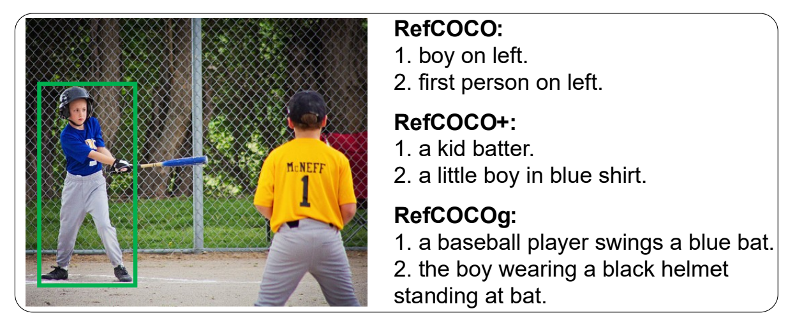

### 3.2 REC任务Benchmark

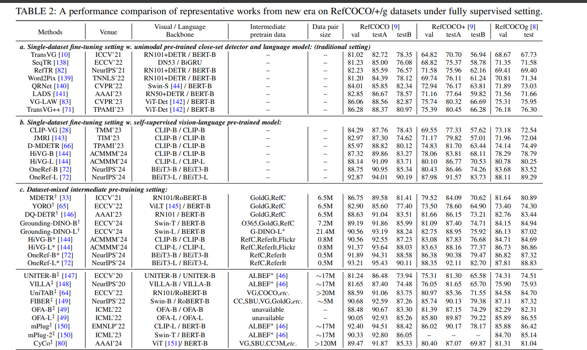  
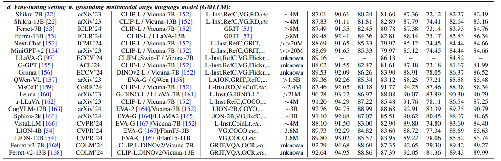

!!!info
    从上表可以看出，多模态大模型架构与传统检测架构，在REC任务精度持平，没有表现出MLLM的优势

依照经验，MLLM无论是从模型大小还是推理速度上都要逊色于专门设计的模型。但MLLM的好处在于，其可以基于Visual Grounding的能力来处理其他高阶的任务，比如以来空间定位能力的VQA。

### 3.3 新型REC数据集

旧基准已逼近极限（参照上图，清洗后的数据评估指标已接近饱和），而新模型（GMLLM， Grounding Multimodal Large Language Model，具备视觉定位能力的多模态大语言模型）的能力边界远超旧任务定义——必须同时‘放大’难度与‘细化’场景，才能继续推动视觉定位研究。

Ref-L4[^2] 把经典 REC 任务拉向“更长更杂”的极限；HC-RefLoCo[^3] 把 REC 拉向“以人为中心的长语境”极限，两者共同构成 GMLLM 时代的新试金石。

| 维度 | **Ref-L4** | **HC-RefLoCo** |
|------|------------|----------------|
| **任务定位** | 为 GMLLM 时代重新清洗、整合的经典 REC 基准 | 面向 LMM 的以人为中心的长语境 REC 基准 |
| **数据来源** | RefCOCO / RefCOCO+ / RefCOCOg（清洗后） + Object365 | COCO、Object365、LVIS、CrowdHuman 等 |
| **总图片数** | 9,735（训练 5,394 / 验证 2,341 / 测试 2,000） | 13,452 |
| **总描述数** | 45,341（训练 25,341 / 验证 10,000 / 测试 10,000） | 44,738 |
| **人均描述占比** | 未统计 | ≈ 100%（所有描述均围绕人） |
| **平均描述长度** | 24.2 tokens | 93.2 tokens（含多轮上下文与长语境） |
| **人-物交互/属性** | 仅少量 | 丰富：外观、动作、交互、OCR 文本、名人身份等 |
| **目标数分布** | 单目标 | 单目标（聚焦人物及其关联对象） |
| **评测指标** | Acc@0.5（IoU ≥ 0.5） | Acc@0.5（IoU ≥ 0.5） |
| **核心特色** | “大规模 + 开放词汇 + 长描述 + 复杂句法”四重挑战 | 首个针对“人”的**长语境、细粒度、交互密集型** REC 基准 |

Ref-L4数据集评测结果  
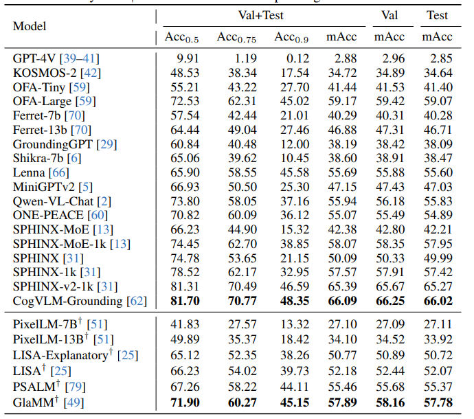

HC-RefLoCo数据集评测结果
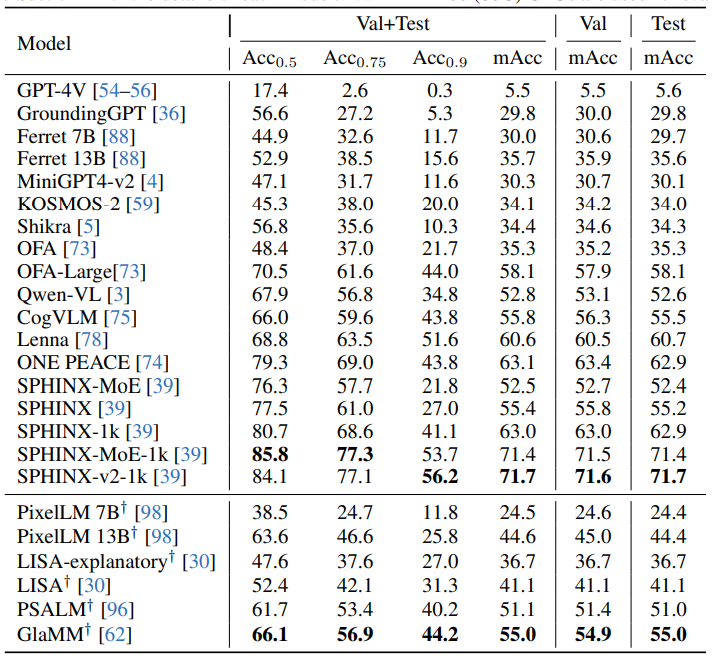

!!!info "结论"
    1. MLLM在RefCOCO数据集上的性能表现已经饱和，评估模型泛化性时不再具有参考意义
    2. CogVLM、GlaMM、SPHINX-v2此类工作值得借鉴

### 3.4 广义VG任务评估数据集

| 数据集 | 来源图像 | 图片数 | 描述总数 | 单目标 | 多目标 | 无目标 | 关键特点 |
|--------|--------|--------|--------|--------|--------|--------|--------|
| **gRefCOCO**[^4] | MS-COCO | 19,994 | 278,232 | 186,008 | 60,287 | 32,202 | 在 RefCOCO 基础上**人工扩标**，覆盖 0/1/N 三种情形，规模最大、标注最全 |
| **Ref-ZOM**[^5] | MS-COCO | 55,078 | 90,199 | 56,972 | 21,290 | 11,937 | “ZOM” = **Zero-One-Many**，官方明确标注三类样本 |
| **D3**[^6] | GRIT/GRD | 10,578 | 422 | 0 | 316 | 106 | 规模极小，专为**多目标 & 无目标快速原型验证**设计 |

广义 VG 数据集标志着 Visual Grounding 评估从“理想实验室”迈向“开放现实世界”。尽管当前尚缺权威模型性能报告，但其设计哲学——**支持任意数量目标、兼容否定与缺失场景**——已为下一代多模态系统指明了能力边界。未来工作需在这些数据集上系统评估 GMLLM 的泛化性、鲁棒性与交互一致性。

## 四、Training-Free 方法：Prompt Engineering

Prompt-based 方法的核心思想是：通过设计输入形式或推理流程，在不修改模型参数的前提下，激发多模态大模型（GMLLM/VLM）潜在的 Visual Grounding 能力。其典型特征是：

1. Training-free：无需微调或重训练；
2. 以推理时间为代价换取精度提升；
3. 依赖模型本身的理解与生成能力；

### 4.1 超分 + 切小图（Super-Resolution + Cropping）
动机：解决小目标在原始图像中像素占比过低、特征模糊的问题。

流程：

1. 将大图按网格或语义区域切分为若干子图；
2. 对每个子图使用超分辨率模型（如 AuraSR）放大 4 倍；
3. 将放大后的子图分别输入 VLM 进行定位。

优点：

1. 显著提升小目标的像素信息与纹理细节；
2. 减少复杂背景干扰；
3. 兼容任意现成 VLM（无需适配）。

缺点：

1. 计算成本激增（图像数量 × 放大倍数）；
2. 大目标被切割后可能上下文断裂，定位性能下降；
3. 超分可能引入伪影或失真，误导模型判断。
4. 整图的上下文信息丢失

### 4.2 SoM（Set-of-Mark Prompting）

出处：“Set-of-Mark Prompting Unleashes Extraordinary Visual Grounding in GPT-4V”（2023）[^7]

核心思想：通过在图像上叠加可言说的视觉标记（如数字/字母），将定位任务转化为符号引用任务，从而释放 GPT-4V 的细粒度理解潜力。

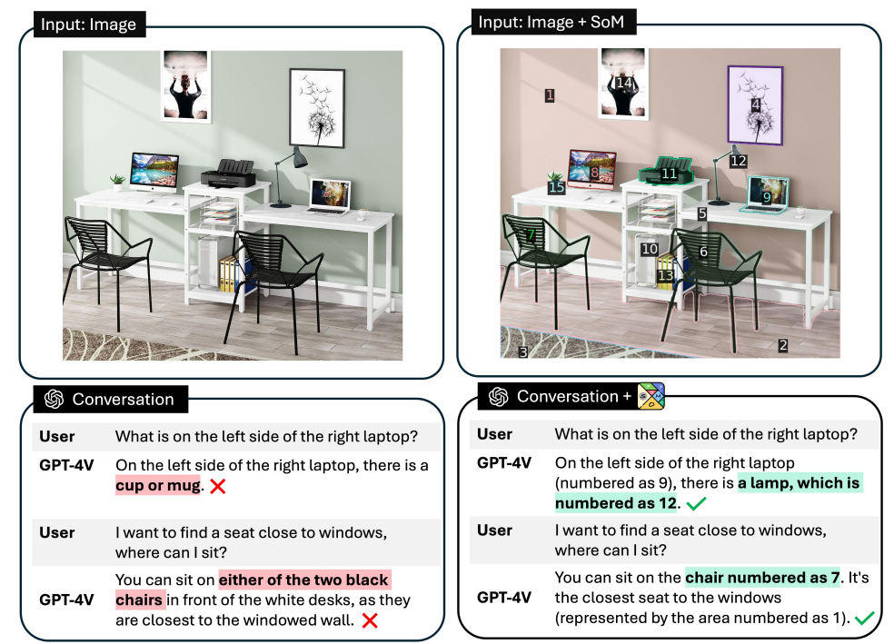

流程：  

1. 图像分区 → 把整图切成可定位的语义区域
2. 标记生成 → 给每个区域贴唯一、可“说”的编号
3. 合成输入 → 原图+标记形成新图喂给 GPT-4V
4. 文本提示 → 让 GPT-4V 直接引用编号对话，精准定位
5. 零样本任务 → 用同一流程完成检测、分割、跟踪、导航等  
    “哪个是‘站在沙发后面的狗’？” → GPT-4V 返回“编号 27” → 用 27 号掩码作为最终分割结果。

!!!warning "局限"
    对开源 VLM（如 LLaVA）效果有限——因其未在带标记图像上训练；  
    LLaVA-Grounding 等专用模型通过微调可适配 SoM，但通用性仍弱于 GPT-4V。

### 4.3 CRG

出处：“Contrastive Region Guidance: Improving Grounding in Vision-Language Models without Training”（2024）[^8]

这篇文章提出了一种名为 Contrastive Region Guidance (CRG) 的新方法，旨在无需训练即可提升开源视觉-语言模型（VLMs）在细粒度视觉理解任务中的性能。CRG通过对比模型在有/无视觉提示（如边界框）时的输出，来引导模型关注图像中的关键区域，从而纠正其先验偏差，提高对特定区域的准确理解。

核心思想：通过屏蔽图像中的关键区域（如物体），观察模型输出的变化，从而弱化模型对无关先验的依赖，强化对目标区域的关注。

局限：

1. 需运行模型两次，推理延迟翻倍；
2. 依赖外部检测器生成候选区域；
3. 仅适用于有限选项问答（如选择题），难以用于开放生成。

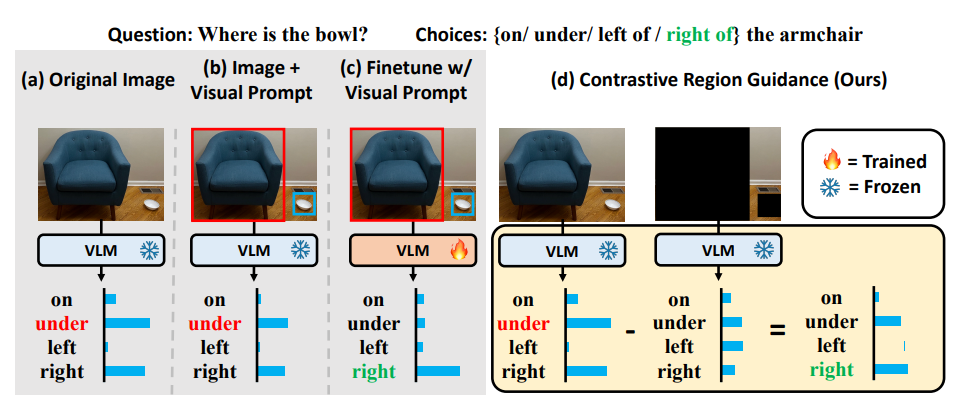

!!!note "注意"
    CRG 本质是后处理验证机制，而非直接提升定位能力。 

### 4.4 CoRGI

出处：CoRGI: Verified Chain-of-Thought Reasoning with Visual Grounding （2025）[^9]

作者指出，目前许多视觉-语言模型（VLM）使用 Chain of Thought（CoT）提示虽生成逻辑性强但可能缺乏视觉依据，存在“脱离图像内容”的幻觉问题  
方法：为克服推理与视觉输入的脱节，提出 CoRGI（Chain of Reasoning with Grounded Insights）——一个模块化框架，在推理过程中引入显式的视觉验证机制，无需端到端重训练即可与现有 VLM 集成

CoRGI 包含以下三个关键阶段：

1. 推理链生成：VLM 根据图像与问题生成多步骤的 CoT 推理链 。
2. 视觉证据验证（VEVM 模块）：对每一步推理，引入视觉验证过程，包含以下三步：
    1. 相关性分类：使用轻量级分类器判断步骤是否需要视觉验证，并给出重要性评分（如“重要性：75%”） 。
    2. RoI 选择：使用 Ground Truth（若数据有标注对象）或 Grounding DINO 检测器定位相关图像区域 。
    3. 视觉证据提取：对选定区域使用 VLM 提供视觉内容描述作为“事实依据”。
3. 答案合成：综合原始问题、推理链与视觉证据，生成更有事实依据、更可信的最终答案

模型整体框架：
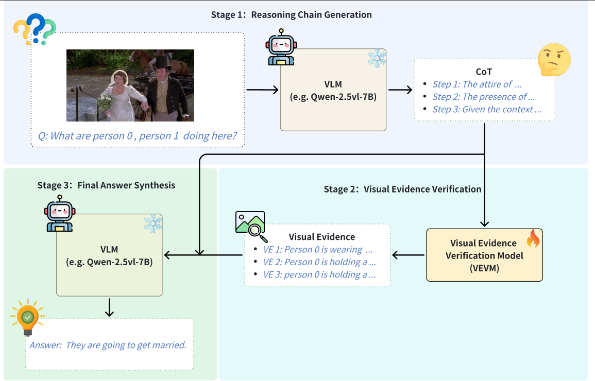

VEVM模块结构图：
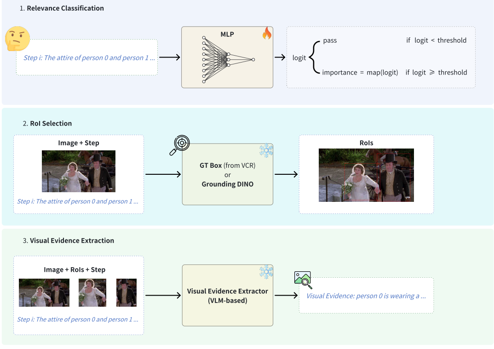

实际上，本文方法依然有更改进空间，比如在Answer中加入局部视觉元素，这样就可以实现带有视觉证据的端到端的Grounding CoT，改进工作在本文的后面会讲到。

### 4.5 Self-Correction

出处：Can Large Vision-Language Models Correct Semantic Grounding Errors By Themselves?（2024）[^10]

该研究以一种全新的思路，探讨是否可以通过“反馈”帮助 VLM（视觉–语言模型）自我改正语义定位（semantic grounding）错误，且不依赖于领域内训练数据、模型微调或结构调整。

论文的核心思路是：把“语义定位任务”转化为一个“预测—验证—修正”的循环，通过反馈机制来增强 VLM 的自我改正能力。

作者发现VLM 可以向自身生成高质量的反馈（作为“验证器”），即把“语义定位”转换成一个二元分类问题：给定图像、文本和预测框 → 询问 VLM：这个预测对吗？

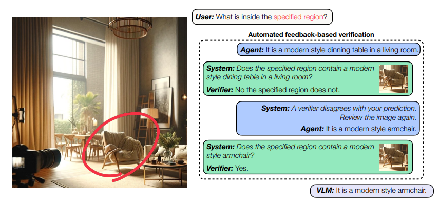

## 五、数据合成：如何合成高质量的Grounding数据

高质量、大规模的标注数据是提升 Visual Grounding 能力的基础。然而，人工标注成本高昂、效率低下，且难以覆盖开放词汇与复杂场景。为此，研究者提出自动化数据合成与多粒度对齐策略，从“量”与“质”两个维度突破数据瓶颈。

### 5.1 GranD：大规模像素级 Grounding 数据的自动构建

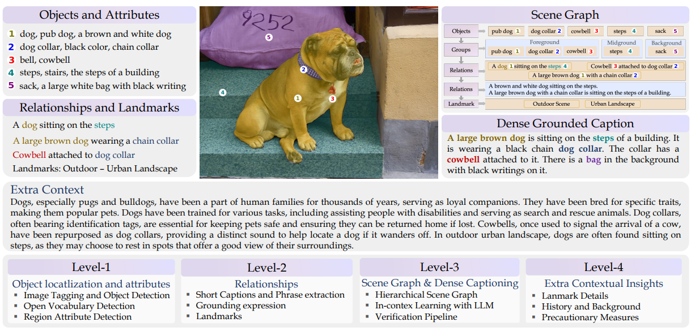

基于 GLaMM: Pixel Grounding Large Multimodal Model, 2023[^11]

GranD 的标注 Pipeline 旨在自动化生成大规模、密集、像素级对齐的图像-文本数据集，解决传统人工标注成本高、规模受限的问题。其核心贡献包括：

1. 7.5M concept 标注在 810M 区域 上，每个区域附带分割掩码（Segmentation Mask）。
2. 多层次语义标注：从物体属性到场景关系，再到上下文推理，覆盖视觉-语言任务的全面需求。
3. GranD 数据集的自动注释流水线分为 四个层级，层层递进，构建出语义丰富、分层次的视觉–语言对齐数据：

**Level 1 — 对象、属性与深度信息**

- 目标：识别图像中的基本语义单元，包括对象（objects）、属性（attributes）、深度特征（depth information）。
- 具体操作：
    - 检测模型：融合多个 SOTA 模型（如 CoDETR、EVA-v02、OWL-ViT），通过 多数投票（IoU≥0.5 且至少2个模型检出） 过滤冗余框。
    = 属性生成：用 GRiT 和 GPT4RoI 为每个物体生成颜色、材质、状态等属性。
    - 深度估计：MiDAS 预测深度，辅助空间关系推理。
- 输出：物体框、分割掩码、属性标签（如“红色汽车”、“破旧轮胎”）。
- 意义：为后续层级提供精细的视觉基础，包括每个区域的像素边界和属性语义。

**Level 2 — 简短 caption 与关系标识**

- 目标：连接 Level 1 中的对象与属性，形成短 caption 并标识对象间关系。

- 具体操作：
    - 场景描述生成：BLIP-2 和 LLaVA 生成短标题（如“狗坐在台阶上”）。
    - 短语提取：SpaCy 解析句子中的主谓宾结构（如“狗-坐-台阶”）。
    - 关系对齐：用 MDETR 将短语中的主体/客体对齐到 Level-1 的物体框，形成结构化三元组（如 <dog-1, sitting on, steps-4>）。
    - 地标分类：LLaVA 将场景归类为粗粒度（如“户外-城市景观”）和细粒度（如“公园长椅”）类别。
- 意义：将视觉区域与语言描述结合，建立基本的视觉–语言关联。

**Level 3 — 构建场景图（Scene Graph）以生成密集 captions**

- 目标：按照语义层级组织信息，形成结构化场景图，进一步生成密集的 grounded captions。
- 具体操作：
    - 场景图构建：整合 Level-1/2 的输出为分层图（物体→属性→关系→地标）。
    - 密集描述生成：用 Vicuna-13B 通过 上下文学习（In-context Learning） 生成自然语言描述。编写Prompt要求模型：
        - 按深度分层（前景/中景/背景）组织物体。
        - 隐式包含所有关系三元组，避免冗余。
    - 质量验证：通过 Chain-of-Thought 提示 自检描述与场景图的一致性，缺失物体会触发重写。
- 意义：结构化视觉信息与语言内容，让 caption 更加全面、深入，具备多对象关系的语境描述。

**Level 4 — 增加历史与社会背景语境**
- 目标：为图像场景赋予更丰富的世界背景，引入背景知识与文化／社会语境。
- 具体操作：
    - 采用 Vicuna-13B 基于场景内容生成背景知识（如“狗链上的铃铛用于防止宠物走失”），避免直接提及物体，聚焦用途、历史或潜在风险
- 意义：让模型不仅理解视觉与语言本身，还能结合背景知识，提升视觉对话生成的丰富性与深度。

**举个通俗的例子**

假设输入是一张“猫坐在桌子上，桌上有一个杯子”的图像：  
Level 1：识别出“猫”、“桌子”、“杯子”，对每个对象生成分割掩码，并记录属性（猫是白色，杯子是玻璃材质等）。  
Level 2：生成多个简短描述，例如 “a cat sitting on a table”; 并标注猫和桌子之间的关系（“on”）；桌子与杯子之间的关系（“on”）等。  
Level 3：构建 scene graph，例如 Cat — on → Table → holds → Cup；然后用 LLM 生成更丰富 的caption，如 “A white cat sits patiently on a wooden table, while a glass cup rests next to it.”  
Level 4：加入背景信息，例如 “The setting resembles a cozy kitchen scene, common in European households,” 或 “The glass cup appears delicate, suggesting a refined setting.”

### 5.2 Advancing Fine-Grained Visual Understanding with Multi-Scale Alignment[^12]

为了描述一个Grounding信息，有坐标、文本、子图三种描述形式，信息密度逐渐上升。
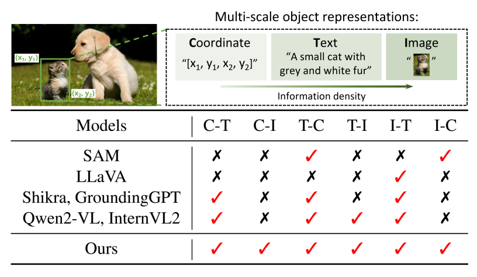

| 符号 | 含义（英文） | 含义（中文） | 说明 |
|------|---------------|---------------|------|
| **C** | Coordinates | 坐标 | 对象的坐标信息，通常用边界框（bounding box）表示，如 \([x_1, y_1, x_2, y_2]\) |
| **T** | Text | 文本 | 对象的文本描述，例如“一只灰色和白色相间的小猫” |
| **I** | Image | 图像 | 对象的图像信息，通常指从原图中裁剪出的对象子图（augmented sub-image） |

在这项工作中，作者定义了6项任务

| 表示 | 含义 | 举例说明 |
|------|------|----------|
| **C → T** | 输入坐标，输出文本 | 给定一个边界框坐标，模型输出对该区域对象的文本描述（如：`[100, 200, 150, 250]` → “一只灰色和白色相间的小猫”） |
| **T → C** | 输入文本，输出坐标 | 给定一个对象的文本描述，模型输出对应对象的边界框坐标（如：“红色苹果” → `[x₁, y₁, x₂, y₂]`） |
| **C → I** | 输入坐标，输出图像 | 给定一个边界框坐标，模型输出对应区域的图像子图（或用于验证该区域内容） |
| **I → C** | 输入图像，输出坐标 | 给定一个对象的图像子图，模型输出该对象在原图中的坐标位置 |
| **T → I** | 输入文本，输出图像 | 给定一个对象的文本描述，模型输出对应的图像子图（或在候选子图中匹配最符合描述的一个） |
| **I → T** | 输入图像，输出文本 | 给定一个对象的图像子图，模型输出对该对象的文本描述（如：子图 → “玻璃材质的水杯”） |

通过上图说明现有模型大多只实现了部分Grounding对象信息对齐（如C-T、T-C），但缺乏对Grounding子图（I）的显式整合与对齐，导致模型无法充分利用对象图像所包含的丰富细节信息。

由此，这篇工作引入子图与坐标之间的对齐数据（重点看下图的标注案例）
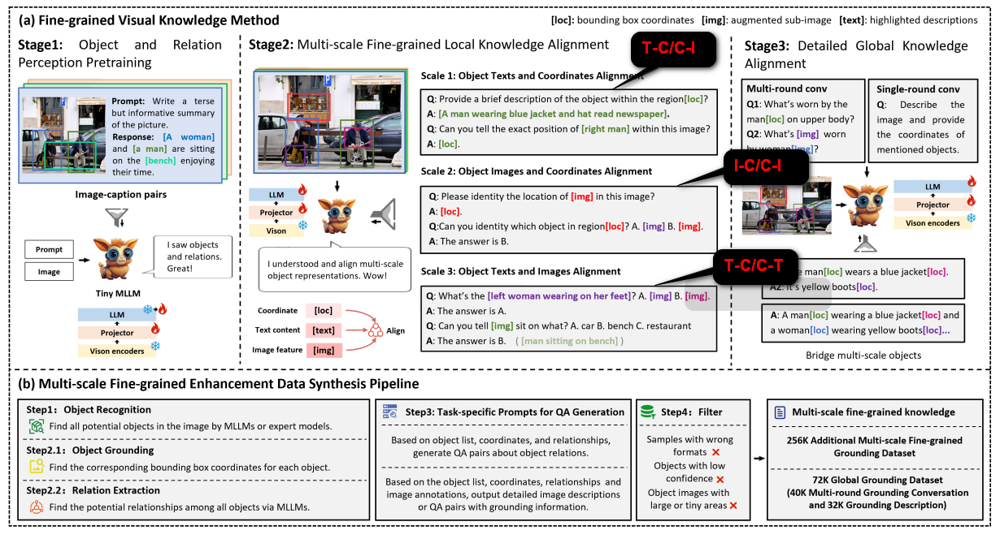

在Visual Grounding任务中，不止REC、REG、RES任务之间可以相互促进，上文中说明的不同粒度任务之间可以相互促进

## 六、监督微调（SFT）

### 6.1 在Question中添加对子图embedding的描述

在 Ferret（2023）[^13]之前，很多 MLLM（如 LLaVA）只能处理整张图像的特征，无法精细地“看”某个具体区域。而 Ferret 的目标是：

- 支持用户指向任意区域（任意形状）（如“这个红色按钮”）
- 让模型理解该区域的语义（如“这是一个紧急停止按钮”）

这就需要一种机制，从图像中提取任意区域的视觉特征，而不是仅仅使用整张图的embedding。  

Ferret 模型中，关键组件之一是 Spatial-Aware Visual Sampler（空间感知视觉采样器），它的作用是提取图像中任意形状区域的连续视觉特征，以支持对点、框、自由形状（如涂鸦、多边形等）的精细理解。

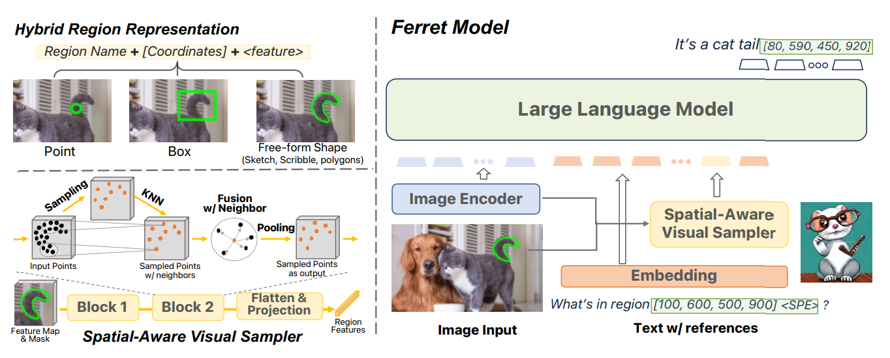

实现方式详解

1. 输入  
    图像特征图 Z ∈ ℝ^{H×W×C}：由 CLIP-ViT 提取。  
    区域掩码 M ∈ ℝ^{H×W}：二值掩码，1 表示目标区域，0 表示背景。
2. 步骤流程
    1. 随机采样正样本点
        1. 在掩码 M 中值为 1 的位置随机采样 N=512 个点。
        2. 每个点的特征通过双线性插值从特征图 Z 中获取。
    2. 空间感知特征提取（级联多个 block）  
    每个 block 包含三步：采样 → 聚合 → 池化
        1. Sampling（采样）  
        使用 Farthest Point Sampling 从 512 个点中选出  = 128 个点，确保空间覆盖性。
        2. Gathering（聚合）  
            - 对每个采样点 ，找到其 K=24 个最近邻点。
            - 对每个邻居 ，计算相对特征和坐标差异
        3. Pooling（池化）  
        对每个点的 24 个邻居特征做 max pooling，得到该点的最终特征表示。
    3. 级联多个 block
        - 默认使用 2 个级联 block，每轮采样点数减少（如 512 → 128 → 32），但特征维度更丰富。
        - 最终输出 32 个点的特征，展平后投影到 LLM 的嵌入维度，用于替换输入中的 `<SPE>` token。

!!!tips
    在读这篇文章时，有这样一个问题，在sft阶段，既然Question中的token是不计算loss的，那么Sampler的梯度哪来的？  
    答：梯度的回传方式  
    cross-entropy loss → answer logits → LLM hidden states（在self-attn阶段anwser的hidden states会与question的hidden states进行交互） → 投影层 → Sampler 输出 → Sampler 可学习参数

!!!note "结论"
    对于REG任务，对于局部区域Embedding的关注更有利于细粒度的感知，比单纯给一个文字化的坐标要好。  

    但是如果子图仅仅是一个矩形，该方案就显得有些多余设计，因为矩形是可以被crop的。

### 6.2 在Answer中添加对子图embedding的描述

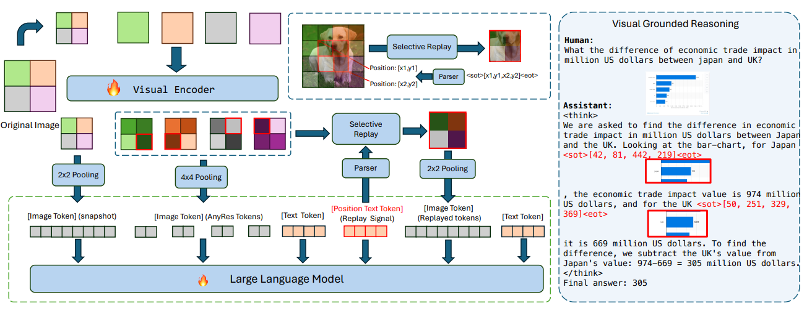

上图为VGR: Visual Grounded Reasoning（2025）[^14]的框架图，这项工作使得答案中带有图像的token，从而可以使得答案中的文字可以拿到局部图像的细粒度信息，从而增强模型的细粒度视觉理解能力。

预先条件：答案中带有 `<sot> [x1, y1, x2, y2] <eot>` 字样，当输出`<eot>`触发局部视觉信息采样

具体步骤如下：

1. 图像预处理与特征池（Visual Feature Pool）构建
    - 图像首先通过 CLIP-ViT 编码器提取视觉特征。
    - 使用 LLaVA 的 AnyRes 策略 将图像切分为多个 patch（最多 16 个），生成高分辨率的视觉 token。
    - 这些 token 被压缩（通过 2×2 或 4×4 的 pooling）后，存入一个统一的 视觉特征池（feature map S），供后续选择性地“重放”。

2. 模型生成“重放信号”

    - 在推理过程中，当模型需要查看图像某个区域时，会生成一个特殊的 重放信号：  
    `<sot>[x1, y1, x2, y2]<eot>`  
    这个信号表示模型希望“重放”图像中某个 bounding box 区域的内容。

3. 动态插入图像 embedding（feature replay）
    - 一旦检测到重放信号，系统从特征池中提取对应区域的视觉 token（以一种类似于ROI Pooling的方式，先将eot前面的坐标缩放到特征图维度，之后采样），并直接插入到当前 token 序列中，紧跟在 `<eot>` 之后。
    - 这些图像 embedding 与文本 token 一起被送入语言模型，参与后续的生成过程。

### 6.3 额外引入DINOv2增加细粒度特征

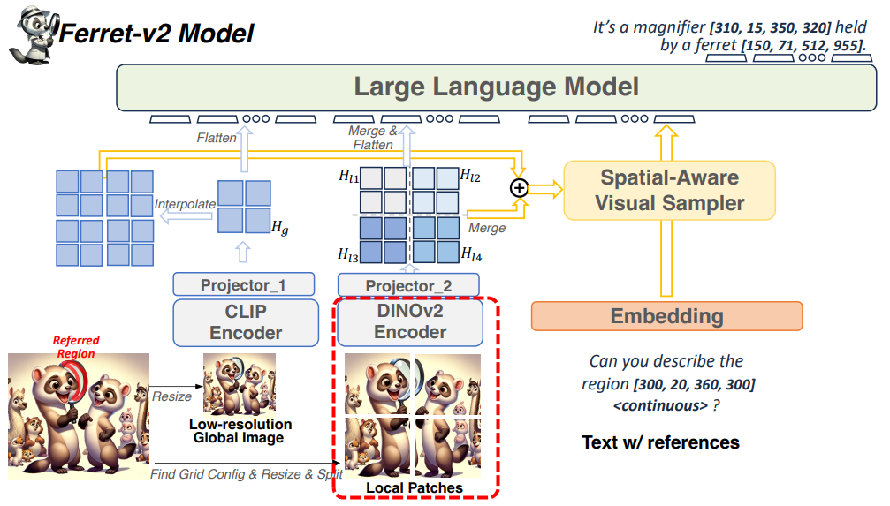

问题引入：在使用“任意分辨率”（Any Resolution， 在LLava-HD中提出）方法时，图像被划分为多个高分辨率局部图像块（local patches），而原始低分辨率图像（global image）则保留全局语义信息。单一的CLIP模型不适合作为局部Patch图像的特征提取器，因为从CLIP的训练方式可以推断出，CLIP更专注于图像的全局语义信息。

在Ferret-v2[^20]中引入 DiNOv2 的主要动机是为了解决高分辨率图像处理中“全局语义”与“局部细节”之间存在粒度差异的问题，从而增强模型对细粒度视觉信息的理解和感知能力。

具体而言：

1. CLIP 的局限性  
CLIP 模型采用图像-文本对比学习策略，擅长捕捉图像级的语义信息，但由于训练过程中缺乏细粒度的像素级监督，导致其对局部细节（如物体的形状、纹理等）感知能力较弱。
2. DiNOv2 的优势  
DiNOv2 采用自监督学习策略，在训练过程中同时考虑图像级和图像块级的特征学习，能够有效地捕捉局部对象的细节信息（如形状、纹理等）。因此，DiNOv2 更适合处理高分辨率局部图像块，能够弥补 CLIP 在细粒度视觉感知上的不足。

!!!note "结论"
    引入额外的视觉编码器输出新的视觉特征可以使得GMLLM获取更多视角或者尺度的信息，但是引入的额外视觉token也会增加计算量。

实际上，在这篇工作之前就有项工作SPHINX（2023）[^15]在多视觉编码器信息融合上做得更为彻底（如下图），其也考虑token量过大的问题，采用一个proj层来压缩token数。

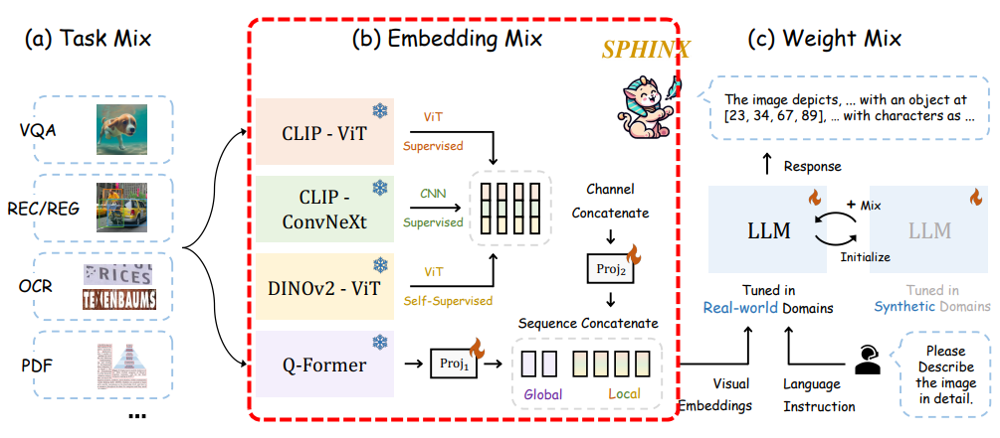

### 6.4 引入额外Grounding Model

LLaVA-Grounding （2023）[^16]引入 单独的 Grounding model分支来处理Grouding任务。

引入 Grounding model 是 功能解耦、精度提升、能力扩展 的关键设计：

- 解耦：让 LLM 专注语义，Grounding model 专注定位。
- 精度：利用专用检测/分割模型的 SOTA 性能。
- 扩展：实现像素级 grounding 与多轮对话的兼容。

LLaVA-Grounding 的推理过程可以拆成 4 个原子步骤：
1. 文本+图像一起送进 LLM
2. LLM 每遇到一个 `<seg>`  token，就把它对应的隐状态抽出来
3. 用可训投影层 把隐状态变成 256-d 的“定位向量”
4. 把定位向量连同原图一起送给冻住的 Grounding Model，得到框/掩码

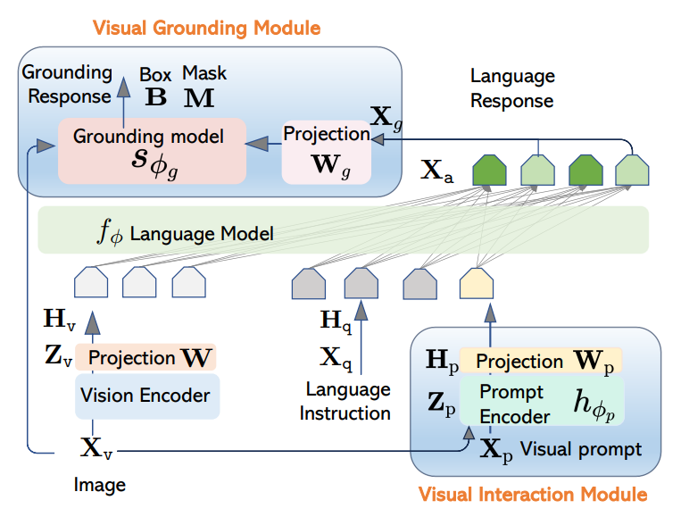

### 6.5 引入额外Segmentation Model

类比于LLaVA-Grounding的工作，GLaMM和HyperSeg[^17]采用额外的分割模型（SAM、Mask2former）来处理分割任务，在推理时，LLM 只负责语义，视觉细节和交给外挂的分割模型。

 LLM 本身 不改任何权重结构，只输出语义符号和 `[SEG]` 隐状态；真正的高分辨率掩码由外挂分割头完成。

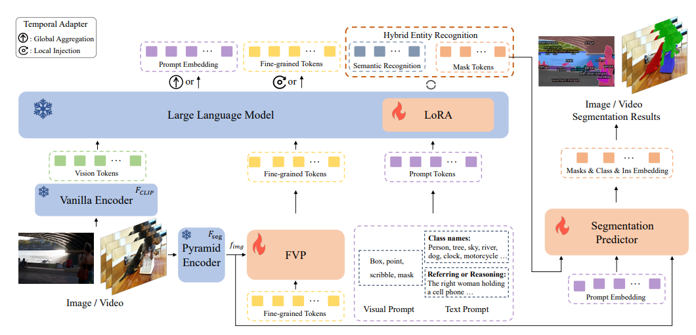

### 6.6 定位Loss

在传统的多模态大模型中，视觉区域的选择往往依赖于文本描述或粗略的注意力机制，容易导致定位不精确。VGR（Visual Grounded Reasoning，2025）框架要求模型在推理过程中自主生成定位区域（bounding boxes），并通过精确的坐标回归来提高视觉定位的准确性。因此，作者引入了额外的检测损失来监督模型对区域的精确预测。

定位损失由两部分组成：
- L1损失：衡量预测框与真实框的中心坐标、宽度和高度的绝对误差。
- GIoU损失（Generalized Intersection over Union）：解决IoU损失在框不重叠时梯度消失的问题，进一步优化框的重叠度。

具体而言，在anwser输出的坐标`<sot> [x1, y1, x2, y2] <eot>` 中，通过一个小型MLP（多层感知机）将`<eot>`的hidden state映射到4维的框坐标（中心坐标、宽高），并用上述损失进行优化。

这样与交叉熵损失（用于文本生成）联合训练，确保模型在生成推理链的同时，能够精确地定位关键视觉区域。

### 6.7 以CoT+Grounding方式在Answer中引入视觉token

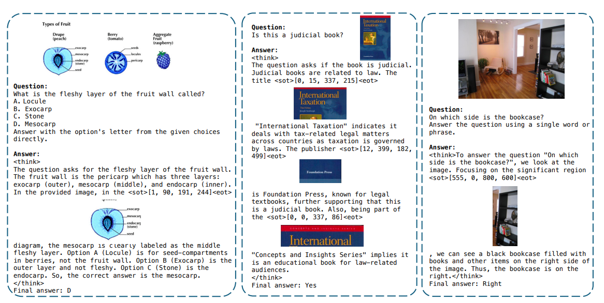

在4.4小节CoRGI埋了个伏笔， 当时提到后续工作可以将COT与视觉信息结合起来。

本文多次提到的VGR（Visual Grounded Reasoning）就完成了上述任务，VGR提出能「边推理边按需回看指定图像区域」的多模态大模型新范式，并首次构建了相应的高质量视觉推理数据集与训练方法，在只使用 30 % 视觉 token 的情况下，就在多个需要精细视觉理解的任务上显著优于现有模型。

1. 打破传统 MLLM 只在语言空间推理的局限，让模型在生成 Chain-of-Thought 的过程中**自主决定何时、何处回看图像**

2. 设计「选择性特征回放」机制：模型输出 `<sot>[x1,y1,x2,y2]<eot>` 信号 → 实时拉取对应区域的压缩视觉 token → 继续推理。

## 七、总结

本文从Visual Grounding的定义出发，给出该任务的评估方式和作用，以及常见的模型结构。同时，面向该任务，在Prompt、数据合成、SFT三个方面归纳学界对于Visual Grounding的典型解决方案。

然而，由于篇幅和时间原因，依然会有部分经典工作遗漏，比如CogVLM[^18] 、KOSMOS-2[^19]等，这部分读者若对此方向感兴趣可以作为拓展阅读。

后续的调研方向将聚焦于增量学习、Function Call、强化学习在Visual Grounding领域的应用。

[^1]: 综述论文：[https://arxiv.org/pdf/2412.20206](https://arxiv.org/pdf/2412.20206)
[^2]: Ref-L4：[https://arxiv.org/pdf/2406.16866](https://arxiv.org/pdf/2406.16866)
[^3]: HC-RefLoCo：[https://proceedings.neurips.cc/paper_files/paper/2024/file/80f0cd0305f7741659304f5325f3bf6d-Paper-Datasets_and_Benchmarks_Track.pdf](https://proceedings.neurips.cc/paper_files/paper/2024/file/80f0cd0305f7741659304f5325f3bf6d-Paper-Datasets_and_Benchmarks_Track.pdf)
[^4]: gRefCOCO：[https://arxiv.org/pdf/2306.00968](https://arxiv.org/pdf/2306.00968)
[^5]: Ref-ZOM：[https://arxiv.org/pdf/2308.13853](https://arxiv.org/pdf/2308.13853)
[^6]: D3：[https://arxiv.org/pdf/2307.12813](https://arxiv.org/pdf/2307.12813)
[^7]: SoM：[https://arxiv.org/abs/2310.11441](https://arxiv.org/abs/2310.11441)
[^8]: CRG：[https://arxiv.org/pdf/2403.02325](https://arxiv.org/pdf/2403.02325)
[^9]: CoRGI：[https://arxiv.org/pdf/2508.00378](https://arxiv.org/pdf/2508.00378)
[^10]: Self-Correction：[https://arxiv.org/pdf/2404.06510](https://arxiv.org/pdf/2404.06510)
[^11]: GLaMM：[https://arxiv.org/pdf/2311.03356](https://arxiv.org/abs/2311.03356)
[^12]: Advancing Fine-Grained Visual Understanding with Multi-Scale Alignment in Multi-Modal Models：[https://arxiv.org/pdf/2411.09691](https://arxiv.org/pdf/2411.09691)
[^13]: Ferret：[https://arxiv.org/pdf/2310.07704](https://arxiv.org/pdf/2310.07704)
[^14]: VGR：[https://arxiv.org/pdf/2506.11991](https://arxiv.org/pdf/2506.11991)
[^15]: SPHINX：[https://arxiv.org/abs/2311.07575](https://arxiv.org/abs/2311.07575)
[^16]: LLaVA-Grounding：[https://arxiv.org/pdf/2312.02949](https://arxiv.org/pdf/2312.02949)
[^17]: HyperSeg：[https://arxiv.org/pdf/2411.17606](https://arxiv.org/pdf/2411.17606)
[^18]: CogVLM：[https://arxiv.org/pdf/2311.03079](https://arxiv.org/pdf/2311.03079)
[^19]: KOSMOS-2：[https://arxiv.org/pdf/2306.14824](https://arxiv.org/pdf/2306.14824)
[^20]: Ferret-v2：[https://arxiv.org/pdf/2404.07973](https://arxiv.org/pdf/2404.07973)

