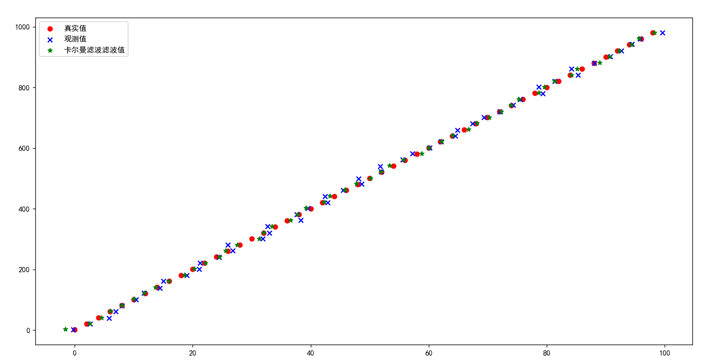
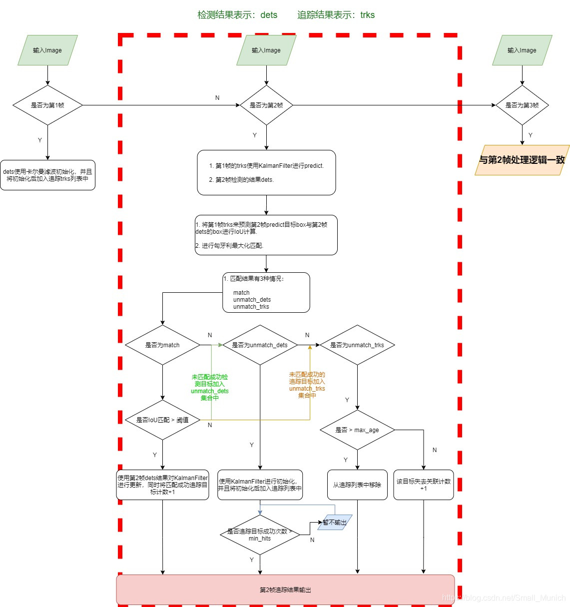

# 卡尔曼滤波的公式推导和应用举例(三)

> 本文写于2024年2月14日上午十点、2024年3月19日晚上十点和2024年3月20日晚上十点

## 零、前言

隔了五个多月，抽出时间完成卡尔曼滤波的应用篇。本来一个月前早就计划好了，这期间有些事优先级比较高就搁置到现在。卡尔曼滤波的应用篇包括两种应用，分别是卡尔曼滤波功能和卡尔曼预测。此外还有卡尔曼平滑本文暂时不涉及。根据需要计算的时间点相对于已知时间点数据的时间先后顺序，分别为卡尔曼滤波器，卡尔曼平滑器和卡尔曼预报器，具体内容参见《卡尔曼滤波的公式推导和应用举例(二》中的假设三。

## 一、卡尔曼滤波的公式回顾

线性系统的状态方程和测量方程伪

$$
\begin{align*}
&x_k = A_{k - 1}x_{k - 1} + B_{k-1}u_{k-1} + w_{k-1} \\
&z_k = H_k x_k + v_k
\end{align*}
$$

其中， $A_{k-1}$ 为状态(转移)矩阵（Transition Matrix）， $x_{k-1}$ 记为 $k-1$ 时刻的状态向量。

 $u_{k-1}$ 为 $k-1$ 时刻输入， $B_{k-1}$ 称为控制矩阵（Control Matrix），反映了系统输入到系统状态的映射关系。

 $w_{k-1}$ 是过程噪声，我们假定其符合均值为0，协方差矩阵为 $Q_{k-1}$ 的高斯噪声。

 $H_k$ 为测量矩阵（Measurement Matrix），描述了从系统状态到测量值的转换关系

 $v_k$ 是测量噪声，我们假定其符合均值为0，协方差为 $R_k$ 的高斯噪声。

**状态预测方程**是取得是每一项的概率最大值处对应的自变量的值，噪声 $w_{k-1}$ 是均值为0的高斯噪声，因此最大概率对应的值为0。

$$
\begin{align*}
&\hat x^-_k = A_{k - 1}\hat x^{+}_{k - 1} + B_{k-1}u_{k-1} + 0\\
\end{align*}
$$

对系统状态向量上面加上一个帽子符号表示这是一个估计量，也就是我们实际输出的量。

 $\hat x^{+}_{k - 1}$ 表示 $k-1$ 时刻时的卡尔曼滤波后的状态向量，也称为状态向量的后验估计。

 $\hat x^-_k$ 表示当前根据系统状态方程计算预测得到的状态向量，也称为状态向量的先验估计。

**测量估计方程**同样忽略噪声项，变成对此时测量量的估计

$$
\hat z_k = H_k \hat x^-_k
$$

递归卡尔曼滤波器所有公式（统一前面卡尔曼滤波的介绍和推导一二中的符号）有

①状态预测方程

$$
\begin{align*}
\hat x^-_k = \hat x(k| k - 1) &= A_{k-1} \hat x(k - 1| k - 1) + B_{k-1} u_{k-1} \\
&= A_{k - 1}\hat x^{+}_{k - 1} + B_{k-1}u_{k-1}
 \end{align*}
$$

②最优状态估计迭代更新公式

$$
\begin{align*}
\hat x^+_k = \hat x(k| k) &= \hat x(k | k - 1) + K_{k} \varepsilon_{k} \\
&= \hat x(k | k - 1) +  K_{k}(z_k - H_k \hat x(k|k-1)) \\
&= \hat x^-_{k} + K_k (z_k - H_k \hat x^-_k)
\end{align*}
$$

③卡尔曼增益计算公式

$$
\begin{align*}
K_k &= P(k|k-1)H_k^T  [H_kP(k|k - 1)H_k^T + R_k]^{-1} \\
&= P_k^- H_k^T (R_k + H_k P_k^- H_k^T)^{-1}
\end{align*}
$$

④先验估计误差协方差更新公式

$$
P_k^- = A_{k - 1}P(k - 1|k - 1)A_{k - 1}^T + Q_{k-1}
$$

⑤最优(后验)估计误差协方差更新公式

$$
\begin{align*}
P_k^+ = P(k|k) &= [I - K_kH_k] P(k|k-1) [I - K_kH_k]^T + K_k R_k K_k^T \\ 
&= [I - K_kH_k] P(k|k-1)
\end{align*}
$$

第一行公式没有代入卡尔曼增益的 $K_k$ 计算公式，是最优估计误差协方差的一般形式，不要求 $K_k$ 必须为卡尔曼增益。

## 二、卡尔曼滤波的实现解读

下面本文对python中注明的滤波库`filterpy`中卡尔曼滤波部分进行解读。

FilterPy是一个实现了各种滤波器的Python模块，它实现著名的卡尔曼滤波和粒子滤波器。我们可以直接调用该库完成卡尔曼滤波器实现。其中的主要模块包括：

* filterpy.kalman
  该模块主要实现了各种卡尔曼滤波器，包括常见的线性卡尔曼滤波器，扩展卡尔曼滤波器等
* filterpy.common
  该模块主要提供支持实现滤波的各种辅助函数，其中计算噪声矩阵的函数，线性方程离散化的函数等。
* filterpy.stats
  该模块提供与滤波相关的统计函数，包括多元高斯算法，对数似然算法，PDF及协方差等。
* filterpy.monte_carlo
  该模块提供了马尔科夫链蒙特卡洛算法，主要用于粒子滤波。

安装


```shell
pip install filterpy==1.4.5
```


或者安装开发版本


```shell
git clone http://github.com/rlabbe/filterpy
python setup.py develop
```


卡尔曼滤波具体实现链接 <https://github.com/rlabbe/filterpy/blob/1.4.5/filterpy/kalman/kalman_filter.py>

`kalman_filter.py` 该文件包括对卡尔曼滤波的面向对象和函数式编程实现，本文仅解读对象式实现。


```python
# -*- coding: utf-8 -*-
# pylint: disable=invalid-name, too-many-arguments, too-many-branches,
# pylint: disable=too-many-locals, too-many-instance-attributes, too-many-lines

"""
This module implements the linear Kalman filter in both an object
oriented and procedural form.
The KalmanFilter class implements the filter by storing the various matrices in instance variables, minimizing the amount of bookkeeping you have to do.

All Kalman filters operate with a predict->update cycle. The
predict step, implemented with the method or function predict(),
uses the state transition matrix F to predict the state in the next
time period (epoch). The state is stored as a gaussian (x, P), where
x is the state (column) vector, and P is its covariance. Covariance
matrix Q specifies the process covariance. In Bayesian terms, this
prediction is called the *prior*, which you can think of colloquially
as the estimate prior to incorporating the measurement.

The update step, implemented with the method or function `update()`,
incorporates the measurement z with covariance R, into the state
estimate (x, P). The class stores the system uncertainty in S,
the innovation (residual between prediction and measurement in
measurement space) in y, and the Kalman gain in k. The procedural
form returns these variables to you. In Bayesian terms this computes
the *posterior* - the estimate after the information from the
measurement is incorporated.

Whether you use the OO form or procedural form is up to you. If
matrices such as H, R, and F are changing each epoch, you'll probably
opt to use the procedural form. If they are unchanging, the OO
form is perhaps easier to use since you won't need to keep track
of these matrices. This is especially useful if you are implementing
banks of filters or comparing various KF designs for performance;
a trivial coding bug could lead to using the wrong sets of matrices.

This module also offers an implementation of the RTS smoother, and
other helper functions, such as log likelihood computations.

The Saver class allows you to easily save the state of the
KalmanFilter class after every update

This module expects NumPy arrays for all values that expect
arrays, although in a few cases, particularly method parameters,
it will accept types that convert to NumPy arrays, such as lists
of lists. These exceptions are documented in the method or function.

Examples
--------
The following example constructs a constant velocity kinematic
filter, filters noisy data, and plots the results. It also demonstrates
using the Saver class to save the state of the filter at each epoch.

.. code-block:: Python

    import matplotlib.pyplot as plt
    import numpy as np
    from filterpy.kalman import KalmanFilter
    from filterpy.common import Q_discrete_white_noise, Saver

    r_std, q_std = 2., 0.003
    cv = KalmanFilter(dim_x=2, dim_z=1)
    cv.x = np.array([[0., 1.]]) # position, velocity
    cv.F = np.array([[1, dt],[ [0, 1]])
    cv.R = np.array([[r_std^^2]])
    f.H = np.array([[1., 0.]])
    f.P = np.diag([.1^^2, .03^^2)
    f.Q = Q_discrete_white_noise(2, dt, q_std**2)

    saver = Saver(cv)
    for z in range(100):
        cv.predict()
        cv.update([z + randn() * r_std])
        saver.save() # save the filter's state

    saver.to_array()
    plt.plot(saver.x[:, 0])

    # plot all of the priors
    plt.plot(saver.x_prior[:, 0])

    # plot mahalanobis distance
    plt.figure()
    plt.plot(saver.mahalanobis)

This code implements the same filter using the procedural form

    x = np.array([[0., 1.]]) # position, velocity
    F = np.array([[1, dt],[ [0, 1]])
    R = np.array([[r_std^^2]])
    H = np.array([[1., 0.]])
    P = np.diag([.1^^2, .03^^2)
    Q = Q_discrete_white_noise(2, dt, q_std**2)

    for z in range(100):
        x, P = predict(x, P, F=F, Q=Q)
        x, P = update(x, P, z=[z + randn() * r_std], R=R, H=H)
        xs.append(x[0, 0])
    plt.plot(xs)


For more examples see the test subdirectory, or refer to the
book cited below. In it I both teach Kalman filtering from basic
principles, and teach the use of this library in great detail.

FilterPy library.
http://github.com/rlabbe/filterpy

Documentation at:
https://filterpy.readthedocs.org

Supporting book at:
https://github.com/rlabbe/Kalman-and-Bayesian-Filters-in-Python

This is licensed under an MIT license. See the readme.MD file
for more information.

Copyright 2014-2018 Roger R Labbe Jr.
"""

from __future__ import absolute_import, division

from copy import deepcopy
from math import log, exp, sqrt
import sys
import warnings
import numpy as np
from numpy import dot, zeros, eye, isscalar, shape
import numpy.linalg as linalg
from filterpy.stats import logpdf
from filterpy.common import pretty_str, reshape_z


class KalmanFilter(object):
    r""" 卡尔曼滤波器的具体实现，你需要设置相关变量为合理的数值，默认值不可以工作。

    简言之，你需要首先创建该对象，明确状态变量的维度 dim_x，以及观测向量z的维度 dim_z 。
    在运行过程中会有很多次矩阵形状检查，比如当你设置dim_z=2，
    然后设置测量矩阵R为3x3的矩阵时，你会得到一个断言错误。

    在构建滤波器后，滤波器有一些默认值。但是你需要设置每一个变量值。
    这很容易，你只需要给所有的值以赋值的形式传递给每一个变量即可。
    所有设置值的类型为numpy.array，下面是一个例子。

    Examples
    --------

    这是一个滤波器，追踪位置和速度，仅使用一个传感器来获取当前的位置

    首先创建一个滤波器对象并指定必要的位置
    .. code::

        from filterpy.kalman import KalmanFilter
        f = KalmanFilter (dim_x=2, dim_z=1)


    然后给每个相关矩阵设置值，下面是定义状态初始值

        .. code::

            f.x = np.array([[2.],    # position
                            [0.]])   # velocity

    或者仅仅采用一维向量

    .. code::

        f.x = np.array([2., 0.])


    定义状态转移矩阵F

        .. code::

            f.F = np.array([[1.,1.],
                            [0.,1.]])

    定义测量矩阵H

        .. code::

        f.H = np.array([[1.,0.]])

    定义协方差矩阵初始值P. 此处我利用P为对角阵的特性，初始化P为np.eye(dim_x), 因此只需要乘以一个值来表示不确定性即可:

    .. code::

        f.P *= 1000.

    也可以这样来定义:

    .. code::

        f.P = np.array([[1000.,    0.],
                        [   0., 1000.] ])

    由用户来定义哪一种比较好理解以及可读性更好

    现在给观测噪声赋值，此时观测噪声是一个1x1的矩阵，所以我可以用一个标量来表示。

    .. code::

        f.R = 5

    也可以通过一下矩阵形式赋值:

    .. code::

        f.R = np.array([[5.]])

    需要注意的是，R需要时1x1的2维矩阵，当其是矩阵形式的时候。

    最后我会给过程噪声Q矩阵赋值，这里我利用了filterpy的另一个函数:

    .. code::

        from filterpy.common import Q_discrete_white_noise
        f.Q = Q_discrete_white_noise(dim=2, dt=0.1, var=0.13)


    接下来我们只需要执行 predict/update 循环:

    while some_condition_is_true:

    .. code::

        z = get_sensor_reading()
        f.predict()
        f.update(z)

        do_something_with_estimate (f.x)


    下面是面向过程式编程方式
    **Procedural Form**

    This module also contains stand alone functions to perform Kalman filtering.
    Use these if you are not a fan of objects.

    **Example**

    .. code::

        while True:
            z, R = read_sensor()
            x, P = predict(x, P, F, Q)
            x, P = update(x, P, z, R, H)

    See my book Kalman and Bayesian Filters in Python [2]_.


    你需要设置如下的属性来构造卡尔曼滤波对象。请注意：在对象实现内部有各种各样的检查来确保你设置了正确的size。然而，仍然有可能发生一些size没有设置好的例子以至于线性代数运行不能正常计算。
    也有可能没有任何动静地报错，你可以最后得到一个能够运行地矩阵结果，但矩阵的形状并不是你所需要解决的问题所设置的那样。

    Parameters
    ----------
    dim_x : int
        状态向量的维度大小。比如你想跟踪一个物体的在二维空间的位置和速度，dim_x就需要设置为4.
        该变量用于设置 P、Q、u矩阵的默认形状。

    dim_z : int
        测量输入值的个数，也可以看做测量向量维度的大小。比如，如果传感器提供位置坐标 （x，y）
        那么 dim_z 将会是2.

    dim_u : int (optional)
        外部输入向量的维度，默认不使用，维度大小为0。

    compute_log_likelihood : bool (default = True)
        默认打开，用来控制是否计算 log likelihood。

    Attributes
    ----------
    x : numpy.array(dim_x, 1)
        状态向量，所有关于 update() 和 predict() 的调用将会更新该变量。

    P : numpy.array(dim_x, dim_x)
        当前状态向量协方差矩阵，所有关于 update() 和 predict() 的调用将会更新该变量。

    x_prior : numpy.array(dim_x, 1)
        只读变量。x的先验估计向量，他们。
        Prior (predicted) state estimate. The *_prior and *_post attributes
        are for convienence; they store the  prior and posterior of the
        current epoch. Read Only.

    P_prior : numpy.array(dim_x, dim_x)
        只读，先验误差P_prior。

    x_post : numpy.array(dim_x, 1)
        只读，后验状态估计（即最优状态估计）

    P_post : numpy.array(dim_x, dim_x)
        只读，后验协方差矩阵

    z : numpy.array
        只读，最后一次调用update函数使用的测量值

    R : numpy.array(dim_z, dim_z)
        测量值噪声矩阵

    Q : numpy.array(dim_x, dim_x)
        过程噪声矩阵

    F : numpy.array()
        状态转移矩阵

    H : numpy.array(dim_z, dim_x)
        观测矩阵

    y : numpy.array
        只读，测量值与预测值之间的误差

    K : numpy.array(dim_x, dim_z)
        只读，更新步骤的卡尔曼增益

    S :  numpy.array
        只读，自动不确定性衡量矩阵，P投影到测量空间下得到，即 S = H @ P @ H^T

    SI :  numpy.array
        只读，自动不确定性衡量矩阵的逆矩阵

    log_likelihood : float
        只读，最后一次测量的对数似然值。

    likelihood : float
        只读，最后一次测量的似然值。

        从 log-likelihood计算得到。 log-likelihood 可以是一个非常小的数，这意味着
        log-likelihood可以是一个非常小的负数，比如-28000. exp(-28000)计算结果将会是0.0
        会破坏采用该值的后续运算，因此默认情况下我们总是返回一个sys.float_info.min

    mahalanobis : float
        只读，新息向量的马氏距离

    inv : function, default numpy.linalg.inv
        求逆函数，默认为numpy.linalg.inv
        如果你喜欢设置其他求逆函数，比如Moore-Penrose pseudo inverse，那么需要设置：
        kf.inv = np.linalg.pinv

        该函数仅用于计算 self.S的逆矩阵，如果你知道self.S是一个对角阵的话，你可能会选择
        filterpy.common.inv_diagonal函数，其比numpy.linalg.inv运算效率更高。

    alpha : float
        衰减机制设置常量，默认为1.0，没有衰减。具体含义看参考[1]
        Fading memory setting. 1.0 gives the normal Kalman filter, and
        values slightly larger than 1.0 (such as 1.02) give a fading
        memory effect - previous measurements have less influence on the
        filter's estimates. This formulation of the Fading memory filter
        (there are many) is due to Dan Simon [1]_.

    参考
    ----------

    .. [1] Dan Simon. "Optimal State Estimation." John Wiley & Sons.
       p. 208-212. (2006)

    .. [2] Roger Labbe. "Kalman and Bayesian Filters in Python"
       https://github.com/rlabbe/Kalman-and-Bayesian-Filters-in-Python

    """

    def __init__(self, dim_x, dim_z, dim_u=0):
        # 控制维度大小
        if dim_x < 1:
            raise ValueError('dim_x must be 1 or greater')
        if dim_z < 1:
            raise ValueError('dim_z must be 1 or greater')
        if dim_u < 0:
            raise ValueError('dim_u must be 0 or greater')

        # 状态向量维度
        self.dim_x = dim_x
        # 测量向量维度
        self.dim_z = dim_z
        # 输入向量维度
        self.dim_u = dim_u

        # 状态向量
        self.x = zeros((dim_x, 1))        # state
        # 不确定性协方差
        self.P = eye(dim_x)               # uncertainty covariance
        # 过程噪声协方差
        self.Q = eye(dim_x)               # process uncertainty
        # 控制矩阵，反映了系统输入到系统状态的映射关系
        self.B = None                     # control transition matrix
        # 状态转移矩阵
        self.F = eye(dim_x)               # state transition matrix
        # 测量矩阵（Measurement Matrix），描述了从系统状态到测量值的转换关系
        self.H = zeros((dim_z, dim_x))    # Measurement function
        # 状态不确定性协方差
        self.R = eye(dim_z)               # state uncertainty
        # 衰减机制控制因子
        self._alpha_sq = 1.               # fading memory control
        # 
        self.M = np.zeros((dim_z, dim_z)) # process-measurement cross correlation
        # 测量向量（不是计算得到的，而是外部传入的传感器获取的测量值）
        self.z = np.array([[None]*self.dim_z]).T

        # 在新息过程中计算增益和误差
        # 这里设置一些变量来保存相关变量
        # gain and residual are computed during the innovation step. We
        # save them so that in case you want to inspect them for various
        # purposes
        # 卡尔曼增益
        self.K = np.zeros((dim_x, dim_z)) # kalman gain
        # 误差变量 y = z - dot(H, self.x)
        self.y = zeros((dim_z, 1))
        # 系统不确定性
        self.S = np.zeros((dim_z, dim_z)) # system uncertainty
        # S的逆
        self.SI = np.zeros((dim_z, dim_z)) # inverse system uncertainty

        # identity matrix. Do not alter this.
        # 单位矩阵
        self._I = np.eye(dim_x)

        # these will always be a copy of x,P after predict() is called
        # x的先验估计
        self.x_prior = self.x.copy()
        # p的先验估计
        self.P_prior = self.P.copy()

        # these will always be a copy of x,P after update() is called
        # x的后验估计
        self.x_post = self.x.copy()
        # P的后验估计
        self.P_post = self.P.copy()

        # Only computed only if requested via property
        # 对数似然值
        self._log_likelihood = log(sys.float_info.min)
        # 似然值
        self._likelihood = sys.float_info.min
        # 马氏距离
        self._mahalanobis = None

        # 求逆函数
        self.inv = np.linalg.inv


    def predict(self, u=None, B=None, F=None, Q=None):
        """
        Predict next state (prior) using the Kalman filter state propagation
        equations.

        Parameters
        ----------

        u : np.array
            可选择输入，外部控制向量，如果不是None，那就是以Bu的输入给系统

        B : np.array(dim_x, dim_z), or None
            可选择输入，控制矩阵

        F : np.array(dim_x, dim_x), or None
            可选择输入，状态转移矩阵

        Q : np.array(dim_x, dim_x), scalar, or None
            可选择输入，控制噪声协方差
        """

        if B is None:
            B = self.B
        if F is None:
            F = self.F
        if Q is None:
            Q = self.Q
        elif isscalar(Q):
            Q = eye(self.dim_x) * Q

        # 计算x的先验估计
        # x = Fx + Bu
        if B is not None and u is not None:
            self.x = dot(F, self.x) + dot(B, u)
        else:
            self.x = dot(F, self.x)

        # 计算P的先验估计
        # P = FPF' + Q
        # self._alpha_sq 即前面的常量
        self.P = self._alpha_sq * dot(dot(F, self.P), F.T) + Q

        # 保存先验
        # save prior
        self.x_prior = self.x.copy()
        self.P_prior = self.P.copy()


    def update(self, z, R=None, H=None):
        """
        添加新的测量值给卡尔曼滤波器

        如果z是None，不会进行任何计算。然而，x_post和P_post会copy 先验，并且z会被设置为None

        Parameters
        ----------
        z : (dim_z, 1): array_like
            测量值用于update函数，z可以是标量如果dim_z是1
            否则它需要能够转换为一个列向量。

        R : np.array, scalar, or None
            可选择输入，测量噪声协方差

        H : np.array, or None
            可选择输入，测量矩阵
        """

        # set to None to force recompute
        # 似然值和马氏距离
        self._log_likelihood = None
        self._likelihood = None
        self._mahalanobis = None

        # 如果z为空，则相关后验就等于先验
        if z is None:
            self.z = np.array([[None]*self.dim_z]).T
            self.x_post = self.x.copy()
            self.P_post = self.P.copy()
            self.y = zeros((self.dim_z, 1))
            return

        # 变换z为(self.dim_z,)的向量
        z = reshape_z(z, self.dim_z, self.x.ndim)

        if R is None:
            R = self.R
        elif isscalar(R):
            R = eye(self.dim_z) * R

        if H is None:
            H = self.H

        # 计算误差y
        # y = z - Hx
        # error (residual) between measurement and prediction
        self.y = z - dot(H, self.x)

        # 计算公共项
        # common subexpression for speed
        PHT = dot(self.P, H.T)

        # 计算系统不确定性
        # S = HPH' + R
        # project system uncertainty into measurement space
        self.S = dot(H, PHT) + R
        self.SI = self.inv(self.S)

        # 计算卡尔曼滤波增益
        # K = PH'inv(S)
        # map system uncertainty into kalman gain
        self.K = dot(PHT, self.SI)

        # 计算x的后验估计（最优估计）
        # x = x + Ky
        # predict new x with residual scaled by the kalman gain
        self.x = self.x + dot(self.K, self.y)

        # 计算P的后验估计 P = (I-KH)P(I-KH)' + KRK' 数值计算更稳定
        # 且 非最优的K一样适用
        # P = (I-KH)P是一般文献中出现的化简的公式

        # P = (I-KH)P(I-KH)' + KRK'
        # This is more numerically stable
        # and works for non-optimal K vs the equation
        # P = (I-KH)P usually seen in the literature.

        # 计算P的后验估计
        I_KH = self._I - dot(self.K, H)
        self.P = dot(dot(I_KH, self.P), I_KH.T) + dot(dot(self.K, R), self.K.T)

        # 存储测量值和相关后验估计
        # save measurement and posterior state
        self.z = deepcopy(z)
        self.x_post = self.x.copy()
        self.P_post = self.P.copy()

    def predict_steadystate(self, u=0, B=None):
        """
        通过卡尔曼滤波计算x的先验估计，仅更新x，P不再更新。

        Parameters
        ----------

        u : np.array
            输入向量

        B : np.array(dim_x, dim_z), or None
            控制转移矩阵
        """

        if B is None:
            B = self.B

        # x = Fx + Bu
        if B is not None:
            self.x = dot(self.F, self.x) + dot(B, u)
        else:
            self.x = dot(self.F, self.x)

        # save prior
        self.x_prior = self.x.copy()
        self.P_prior = self.P.copy()

    def update_steadystate(self, z):
        """
        添加一个新的测量z给卡尔曼滤波器，但是不再重新计算卡尔曼增益K，以及协方差矩阵P和系统不确定S。

        你可以采用该函数用于线性是不变系统，因为卡尔曼增益会收敛到一个固定值。
        提前计算这些值并清晰地给他们赋值，或者运行采用predict/update函数直到他们收敛

        该函数的主要优势是其速度，我们只需要少量的计算，明显降低了矩阵求逆的运算量

        需要和predict_steadystate函数联合使用，否则P值会没有边界的增长

        Parameters
        ----------
        z : (dim_z, 1): array_like
            用于该更新过程的测量值

        Examples
        --------
        >>> cv = kinematic_kf(dim=3, order=2) # 3D const velocity filter
        >>> # let filter converge on representative data, then save k and P
        >>> for i in range(100):
        >>     cv.predict()
        >>     cv.update([i, i, i])
        >>> saved_k = np.copy(cv.K)
        >>> saved_P = np.copy(cv.P)

        later on:

        >>> cv = kinematic_kf(dim=3, order=2) # 3D const velocity filter
        >>> cv.K = np.copy(saved_K)
        >>> cv.P = np.copy(saved_P)
        >>> for i in range(100):
        >>     cv.predict_steadystate()
        >>     cv.update_steadystate([i, i, i])
        """

        # set to None to force recompute
        self._log_likelihood = None
        self._likelihood = None
        self._mahalanobis = None

        if z is None:
            self.z = np.array([[None]*self.dim_z]).T
            self.x_post = self.x.copy()
            self.P_post = self.P.copy()
            self.y = zeros((self.dim_z, 1))
            return

        z = reshape_z(z, self.dim_z, self.x.ndim)

        # y = z - Hx
        # error (residual) between measurement and prediction
        self.y = z - dot(self.H, self.x)

        # 不再更新卡尔曼增益 和 P的后验估计
        # x = x + Ky
        # predict new x with residual scaled by the kalman gain
        self.x = self.x + dot(self.K, self.y)

        self.z = deepcopy(z)
        self.x_post = self.x.copy()
        self.P_post = self.P.copy()

        # set to None to force recompute
        self._log_likelihood = None
        self._likelihood = None
        self._mahalanobis = None

    def get_prediction(self, u=0):
        """
        在不更改滤波器参数的情况下，预测下一个阶段的状态

        Parameters
        ----------

        u : np.array
            optional control input

        Returns
        -------

        (x, P) : tuple
            State vector and covariance array of the prediction.
        """

        x = dot(self.F, self.x) + dot(self.B, u)
        P = self._alpha_sq * dot(dot(self.F, self.P), self.F.T) + self.Q
        return (x, P)

    def get_update(self, z=None):
        """
        不更改滤波器参数的情况下，预测下一个估计值

        Parameters
        ----------

        z : (dim_z, 1): array_like
            measurement for this update. z can be a scalar if dim_z is 1,
            otherwise it must be convertible to a column vector.

        Returns
        -------

        (x, P) : tuple
            State vector and covariance array of the update.
       """

        if z is None:
            return self.x, self.P
        z = reshape_z(z, self.dim_z, self.x.ndim)

        R = self.R
        H = self.H
        P = self.P
        x = self.x

        # error (residual) between measurement and prediction
        y = z - dot(H, x)

        # common subexpression for speed
        PHT = dot(P, H.T)

        # project system uncertainty into measurement space
        S = dot(H, PHT) + R

        # map system uncertainty into kalman gain
        K = dot(PHT, self.inv(S))

        # predict new x with residual scaled by the kalman gain
        x = x + dot(K, y)

        # P = (I-KH)P(I-KH)' + KRK'
        I_KH = self._I - dot(K, H)
        P = dot(dot(I_KH, P), I_KH.T) + dot(dot(K, R), K.T)

        return x, P

    def residual_of(self, z):
        """
        返回z与先验估计值的残差
        """
        return z - dot(self.H, self.x_prior)

    def measurement_of_state(self, x):
        """
        将

        Parameters
        ----------

        x : np.array
            kalman state vector

        Returns
        -------

        z : (dim_z, 1): array_like
            measurement for this update. z can be a scalar if dim_z is 1,
            otherwise it must be convertible to a column vector.
        """

        return dot(self.H, x)

    @property
    def log_likelihood(self):
        """
        返回上一次测量的对数似然值
        """
        if self._log_likelihood is None:
            self._log_likelihood = logpdf(x=self.y, cov=self.S)
        return self._log_likelihood

    @property
    def likelihood(self):
        """
        返回上一次测量的对数似然值
        """
        if self._likelihood is None:
            self._likelihood = exp(self.log_likelihood)
            if self._likelihood == 0:
                self._likelihood = sys.float_info.min
        return self._likelihood

    @property
    def mahalanobis(self):
        """"
        测量的马氏距离，比如3表示距离预测值之间有3个标准差
        Mahalanobis distance of measurement. E.g. 3 means measurement
        was 3 standard deviations away from the predicted value.

        Returns
        -------
        mahalanobis : float
        """
        if self._mahalanobis is None:
            self._mahalanobis = sqrt(float(dot(dot(self.y.T, self.SI), self.y)))
        return self._mahalanobis

    @property
    def alpha(self):
        """
        衰减机制系数，1.0表述不衰减，大于1.的值比如1.02可以表示一个衰减效应，使得之前的估计值
        对于滤波器的当前的估计值有较小的影响。
        """
        return self._alpha_sq**.5

    def log_likelihood_of(self, z):
        """
        log likelihood of the measurement `z`. This should only be called
        after a call to update(). Calling after predict() will yield an
        incorrect result."""

        if z is None:
            return log(sys.float_info.min)
        return logpdf(z, dot(self.H, self.x), self.S)

    @alpha.setter
    def alpha(self, value):
        if not np.isscalar(value) or value < 1:
            raise ValueError('alpha must be a float greater than 1')

        self._alpha_sq = value**2
```


## 三、卡尔曼滤波的应用—滤波

在这个案例中，我们将使用卡尔曼滤波器来跟踪一辆汽车在二维空间中的匀速直线运动。我们假设汽车在 x 轴和 y 轴上以恒定速度移动，假设我们仅能测得当前位置，且位移传感器本身测量误差方差和过程误差方差分别为1和0.01。

建模过程如下：

$$
\begin{align*}
&x_k = A_{k - 1}x_{k - 1} + B_{k-1}u_{k-1} + w_{k-1} \\
&z_k = H_k x_k + v_k
\end{align*}
$$

设 $[x_1, x_2, x_3, x_4]$ 表示系统状态。 $[x_1, x_2]$ 为汽车位移的值， $[x_3, x_4]$ 为汽车运行的两个方向的分速度。

$$
x =\begin{bmatrix}
x_1 \\
x_2 \\
x_3 \\
x_4
\end{bmatrix}
$$

由于是匀速直线运动，状态转移矩阵 $A_{k - 1}$ 是一个常数矩阵， $B_{k-1}$ 是全零矩阵。

$$
A = \begin{bmatrix}
1 & 0 & 1 & 0 \\
0 & 1 & 0 & 1 \\
0 & 0 & 1 & 0 \\
0 & 0 & 0 & 1
\end{bmatrix}
$$

 $[1,0,1,0]$ 中第二个1表示时间间隔是1。

过程噪声协方差矩阵Q为，

$$
Q = \begin{bmatrix}
0.01 & 0 & 0 & 0 \\
0 & 0.01 & 0 & 0 \\
0 & 0 & 0.01 & 0 \\
0 & 0 & 0 & 0.01
\end{bmatrix}
$$

测量噪声协方差R为

$$
R = \begin{bmatrix}
1 & 0  \\
0 & 1  \\
\end{bmatrix}
$$

测量矩阵H表示为

$$
H = \begin{bmatrix}
1 & 0 & 0 & 0 \\
0 & 1 & 0 & 0 
\end{bmatrix}
$$

P是先验估计的协方差，对不可观察的初速度，给予高度不确定性

$$
P = \begin{bmatrix}
10 & 0 & 0 & 0 \\
0 & 10 & 0 & 0 \\
0 & 0 & 1000 & 0 \\
0 & 0 & 0 & 1000
\end{bmatrix}
$$

对于不可观察的 $x_3,x_4$ ，认为它的误差很大。

下面是代码


```python
import numpy as np
import random
import matplotlib.pyplot as plt
from filterpy.kalman import KalmanFilter
from filterpy.common import Q_discrete_white_noise, Saver


x_true = np.arange(0, 100, 0.1)
y_true = x_true * 10 + 1

x_watched = x_true + np.random.normal(0, 1, (len(x_true),))
y_watched = y_true + np.random.normal(0, 1, (len(x_true),))


# 设置初始状态
init_point = np.asarray([x_true[0], y_true[0], 0.1, 1])


kf = KalmanFilter(dim_x=4, dim_z=2)

# position, velocity
kf.x = init_point
kf.F = np.array([
                 [1, 0, 1, 0], 
                 [0, 1, 0, 1],
                 [0, 0, 1, 0],
                 [0, 0, 0, 1],
                ])
kf.R = np.array([
                 [1, 0,], 
                 [0, 1,],
                ])
kf.H = np.array([[1, 0, 0, 0],
                 [0, 1, 0, 0],])

kf.P = np.array([
                 [10, 0, 0, 0], 
                 [0, 10, 0, 0],
                 [0, 0, 1000, 0],
                 [0, 0, 0, 1000],
                ])
kf.Q = np.array([
                 [0.01, 0, 0, 0], 
                 [0, 0.01, 0, 0],
                 [0, 0, 0.01, 0],
                 [0, 0, 0, 0.01],
                ])

x_filtered = []
y_filtered = []

for x,y in zip(x_watched[1:], y_watched[1:]):
    kf.predict()
    kf.update([x, y])
    # 保存滤波后的值
    x_filtered.append(kf.x[0])
    y_filtered.append(kf.x[1])


plt.rcParams['font.sans-serif'] = ['SimHei']
plt.rcParams['axes.unicode_minus'] = False

plt.figure()
plt.scatter(x_true[::20], y_true[::20], c='r', marker='o', label='真实值')
plt.scatter(x_watched[::20], y_watched[::20], c='b', marker='x', label='观测值')
plt.scatter(x_filtered[::20], y_filtered[::20], c='g', marker='*', label='卡尔曼滤波滤波值')
plt.legend()
plt.show()
```




有上图可以看出，尽管观测值会受到误差干扰，但是滤波后的值逐渐收敛于真实值。

## 四、卡尔曼滤波的应用—预测

在预测领域，有一个十分典型的应用----多目标追踪。SORT（Simple Online and Realtime Tracking）算法是一种用于目标跟踪的算法，它被设计为既简单又高效，能够在实时环境中运行。该算法由Charles Szekeres等人于2016年提出，并在多个基准测试中表现出色。SORT算法的核心是采用IOU度量来评价预测目标框与候选检测目标的匹配程度，**这里的预测即采用的卡尔曼滤波的预测功能**。

以下是SORT算法的主要步骤：

1. **初始化**：在视频序列的第一个帧中，算法会为每个目标分配一个唯一的id，并记录它们的位置和大小。
2. **预测**：在处理每一帧之前，卡尔曼滤波会根据上一帧的目标状态（位置和大小）以及运动模型（如高斯分布）来预测当前帧中目标的可能位置。
3. **检测**：在当前帧中，算法会使用检测器来识别目标。对于检测到的每一个目标，算法会生成一个边界框（bounding box）并计算其与现有跟踪目标的IoU。
4. **匹配**：算法会使用IoU来评估新检测到的目标框与现有跟踪目标框的相似度。如果新目标的IoU高于某个阈值（通常为0.5），则认为它是先前跟踪目标的一个延续。
5. **更新**：对于那些成功匹配的目标，算法会更新其位置和大小。对于未匹配的目标，算法会创建新的跟踪条目。此外，如果一个目标在连续几帧中都没有被检测到，它的跟踪条目将被移除。
6. **去重**：算法会检查每一对跟踪目标，并移除那些与其它目标有高iou值的重复项。

SORT算法的特点：

* **简单性**：SORT的算法结构简单，容易实现，不需要复杂的机器学习模型。
* **实时性**：算法设计考虑到了速度，能够在实际应用中满足实时性要求。
* **准确性**：通过iou匹配和去重复处理，SORT能够准确地跟踪目标，尤其是在复杂场景中。

SORT算法在多个领域都有应用，如无人驾驶、机器人导航、视频监控等。由于它的简单性和实时性，SORT成为了目标跟踪领域中一个广泛使用的基线算法。不过，它也有一些局限性，比如在目标密集或遮挡情况下可能表现不佳，需要与其他算法或方法结合使用以提高性能。

从互联网上找到的一个SORT流程图如下：



接下来我们直接解读SORT（Simple Online and Realtime Tracking）源码，本次参考的源码来源于 <https://github.com/abewley/sort> ，作者是赫赫有名的AB大神，`sort.py`单个文件描述了整个算法的全部内容。


```python
"""
    SORT: A Simple, Online and Realtime Tracker
    Copyright (C) 2016-2020 Alex Bewley alex@bewley.ai

    This program is free software: you can redistribute it and/or modify
    it under the terms of the GNU General Public License as published by
    the Free Software Foundation, either version 3 of the License, or
    (at your option) any later version.

    This program is distributed in the hope that it will be useful,
    but WITHOUT ANY WARRANTY; without even the implied warranty of
    MERCHANTABILITY or FITNESS FOR A PARTICULAR PURPOSE.  See the
    GNU General Public License for more details.

    You should have received a copy of the GNU General Public License
    along with this program.  If not, see <http://www.gnu.org/licenses/>.
"""
from __future__ import print_function

import os
import numpy as np
import matplotlib
matplotlib.use('TkAgg')
import matplotlib.pyplot as plt
import matplotlib.patches as patches
from skimage import io

import glob
import time
import argparse
from filterpy.kalman import KalmanFilter

np.random.seed(0)


def linear_assignment(cost_matrix):
  """
  调用lapjv或匈牙利算法解决双边问题/指派问题/最优匹配问题。
  """
  try:
    import lap
    _, x, y = lap.lapjv(cost_matrix, extend_cost=True)
    return np.array([[y[i],i] for i in x if i >= 0]) #
  except ImportError:
    from scipy.optimize import linear_sum_assignment
    x, y = linear_sum_assignment(cost_matrix)
    return np.array(list(zip(x, y)))


def iou_batch(bb_test, bb_gt):
  """
  From SORT: Computes IOU between two bboxes in the form [x1,y1,x2,y2]
  计算IOU
  """
  bb_gt = np.expand_dims(bb_gt, 0)
  bb_test = np.expand_dims(bb_test, 1)

  xx1 = np.maximum(bb_test[..., 0], bb_gt[..., 0])
  yy1 = np.maximum(bb_test[..., 1], bb_gt[..., 1])
  xx2 = np.minimum(bb_test[..., 2], bb_gt[..., 2])
  yy2 = np.minimum(bb_test[..., 3], bb_gt[..., 3])
  w = np.maximum(0., xx2 - xx1)
  h = np.maximum(0., yy2 - yy1)
  wh = w * h
  o = wh / ((bb_test[..., 2] - bb_test[..., 0]) * (bb_test[..., 3] - bb_test[..., 1])                                      
    + (bb_gt[..., 2] - bb_gt[..., 0]) * (bb_gt[..., 3] - bb_gt[..., 1]) - wh)                                              
  return(o)  


def convert_bbox_to_z(bbox):
  """
  Takes a bounding box in the form [x1,y1,x2,y2] and returns z in the form
    [x,y,s,r] where x,y is the centre of the box and s is the scale/area and r is
    the aspect ratio
  将 xyxy 格式 转换为 xysr格式， xy表示中心店 s和r分别表示 面积和宽高比
  """
  w = bbox[2] - bbox[0]
  h = bbox[3] - bbox[1]
  x = bbox[0] + w/2.
  y = bbox[1] + h/2.
  s = w * h    #scale is just area
  r = w / float(h)
  return np.array([x, y, s, r]).reshape((4, 1))


def convert_x_to_bbox(x,score=None):
  """
  Takes a bounding box in the centre form [x,y,s,r] and returns it in the form
    [x1,y1,x2,y2] where x1,y1 is the top left and x2,y2 is the bottom right
  将 xysr格式 转换为 xyxy 格式， xy表示中心点 s 和 r 分别 表示 面积 和 宽高比
  """
  w = np.sqrt(x[2] * x[3])
  h = x[2] / w
  if(score==None):
    return np.array([x[0]-w/2.,x[1]-h/2.,x[0]+w/2.,x[1]+h/2.]).reshape((1,4))
  else:
    return np.array([x[0]-w/2.,x[1]-h/2.,x[0]+w/2.,x[1]+h/2.,score]).reshape((1,5))


class KalmanBoxTracker(object):
  """
  This class represents the internal state of individual tracked objects observed as bbox.
  """
  count = 0
  def __init__(self,bbox):
    """
    初始化一个 tracker 采用最开始的 bbox
    Initialises a tracker using initial bounding box.
    """
    # 定义匀速模型
    # define constant velocity model
    self.kf = KalmanFilter(dim_x=7, dim_z=4) 
    # 状态变量 x = [u, v, s, r, u', v', s']
    # u v 即 bbox的中心点 s 与 r代表 面积和宽高比
    # u' v' 代表x与y方向的速率 s'代表面积变化的速率
    self.kf.F = np.array([[1,0,0,0,1,0,0],[0,1,0,0,0,1,0],[0,0,1,0,0,0,1],[0,0,0,1,0,0,0],  [0,0,0,0,1,0,0],[0,0,0,0,0,1,0],[0,0,0,0,0,0,1]])
    # 测量矩阵 只有 [u,v,s,r] 可以测量
    self.kf.H = np.array([[1,0,0,0,0,0,0],[0,1,0,0,0,0,0],[0,0,1,0,0,0,0],[0,0,0,1,0,0,0]])
    # 设置测量噪声 
    self.kf.R[2:,2:] *= 10.
    #give high uncertainty to the unobservable initial velocities
    # 针对不可测量的部分 误差协方差初始化为较大值
    self.kf.P[4:,4:] *= 1000. 
    self.kf.P *= 10.
    # 设置过程噪声（器件本身误差），限制速率变化受噪声影响较小，因为是假设为匀速运动。
    self.kf.Q[-1,-1] *= 0.01
    self.kf.Q[4:,4:] *= 0.01

    # 定义初始状态
    self.kf.x[:4] = convert_bbox_to_z(bbox)
    self.time_since_update = 0
    # 全局id
    self.id = KalmanBoxTracker.count
    KalmanBoxTracker.count += 1
    self.history = []
    # 记录update执行了多少次
    self.hits = 0
    # 记录 predict/update 交替执行了多少次，若中间连续执行两次 predict ，则
    # hit_streak 就会被置 0
    self.hit_streak = 0
    # 记录predict执行了多少次
    self.age = 0

  def update(self,bbox):
    """
    Updates the state vector with observed bbox.
    """
    self.time_since_update = 0
    self.history = []
    self.hits += 1
    self.hit_streak += 1
    # 卡尔曼滤波器的update步骤，使用观测值更新预测值，得到最优估计
    self.kf.update(convert_bbox_to_z(bbox))

  def predict(self):
    """
    Advances the state vector and returns the predicted bounding box estimate.
    """
    if((self.kf.x[6]+self.kf.x[2])<=0):
      self.kf.x[6] *= 0.0
    # 使用kf的预测功能
    self.kf.predict()
    self.age += 1
    # 这里如果没有执行执行 update 则 time_since_update 不会被清零
    # 则满足条件 hit_streak = 0
    if(self.time_since_update>0):
      self.hit_streak = 0
    self.time_since_update += 1
    self.history.append(convert_x_to_bbox(self.kf.x))
    return self.history[-1]

  def get_state(self):
    """
    Returns the current bounding box estimate.
    返回当前bbox的估计
    """
    return convert_x_to_bbox(self.kf.x)


def associate_detections_to_trackers(detections,trackers,iou_threshold = 0.3):
  """
  Assigns detections to tracked object (both represented as bounding boxes)
  基于检测结果 现有tracker 和iou阈值给detection和tracker分类
  分为 匹配检测、未匹配检测、未匹配tracker
  Returns 3 lists of matches, unmatched_detections and unmatched_trackers
  """
  if(len(trackers)==0):
    return np.empty((0,2),dtype=int), np.arange(len(detections)), np.empty((0,5),dtype=int)

  # 计算 检测结果和 trackers预测结果之间的iou，返回[M, N]形状的矩阵
  # M 为检测结果矩阵的行数，即个数
  # N 为trackers的个数
  iou_matrix = iou_batch(detections, trackers)

  # 如果iou_matrix矩阵不为空
  if min(iou_matrix.shape) > 0:
    a = (iou_matrix > iou_threshold).astype(np.int32)
    # 如果只有每一行或者每一列最多只有一个元素满足iou阈值要求，则直接取该唯一匹配结果即可
    if a.sum(1).max() == 1 and a.sum(0).max() == 1:
      matched_indices = np.stack(np.where(a), axis=1)
    else:
      # 采用匈牙利算法 得到最优匹配，注意这里没有考虑阈值，后面会考虑
      matched_indices = linear_assignment(-iou_matrix)
  else:
    # 没有match的元素
    matched_indices = np.empty(shape=(0,2))

  # 遍历detections和trackers得到未匹配的detections和未匹配的unmatched_trackers
  unmatched_detections = []
  for d, det in enumerate(detections):
    if(d not in matched_indices[:,0]):
      unmatched_detections.append(d)
  unmatched_trackers = []
  for t, trk in enumerate(trackers):
    if(t not in matched_indices[:,1]):
      unmatched_trackers.append(t)

  # 在已有匹配，过滤掉较低的IOU匹配
  # filter out matched with low IOU
  matches = []
  for m in matched_indices:
    if(iou_matrix[m[0], m[1]]<iou_threshold):
      unmatched_detections.append(m[0])
      unmatched_trackers.append(m[1])
    else:
      matches.append(m.reshape(1,2))
  if(len(matches)==0):
    matches = np.empty((0,2),dtype=int)
  else:
    matches = np.concatenate(matches,axis=0)

  return matches, np.array(unmatched_detections), np.array(unmatched_trackers)


class Sort(object):
  def __init__(self, max_age=1, min_hits=3, iou_threshold=0.3):
    """
    Sets key parameters for SORT
    """
    # 当没有det box关联时，tracker 最长 存活周期
    self.max_age = max_age
    # 当有det box时，最少关联次数（关联min_hits次后才设置为tracker）
    self.min_hits = min_hits
    # iou阈值，用于 卡尔曼预测结果 和 检测结果的匹配
    self.iou_threshold = iou_threshold
    self.trackers = []
    # 统计第几帧
    self.frame_count = 0

  def update(self, dets=np.empty((0, 5))):
    """
    Params:
      dets - a numpy array of detections in the format [[x1,y1,x2,y2,score],[x1,y1,x2,y2,score],...]
    Requires: this method must be called once for each frame even with empty detections (use np.empty((0, 5)) for frames without detections).
    Returns the a similar array, where the last column is the object ID.

    NOTE: The number of objects returned may differ from the number of detections provided.
    """
    self.frame_count += 1
    # get predicted locations from existing trackers.
    trks = np.zeros((len(self.trackers), 5))
    to_del = []
    ret = []
    # 去除不合法的预测
    for t, trk in enumerate(trks):
      # 调用卡尔曼滤波的预测功能
      pos = self.trackers[t].predict()[0]
      trk[:] = [pos[0], pos[1], pos[2], pos[3], 0]
      if np.any(np.isnan(pos)):
        to_del.append(t)
    trks = np.ma.compress_rows(np.ma.masked_invalid(trks))
    for t in reversed(to_del):
      self.trackers.pop(t)
    # 将预测结果与detection结果做匹配
    matched, unmatched_dets, unmatched_trks = associate_detections_to_trackers(dets,trks, self.iou_threshold)

    # 对于match的tracker，使用观测结果更新预测结果
    # update matched trackers with assigned detections
    for m in matched:
      self.trackers[m[1]].update(dets[m[0], :])

    # 为没有match的初始化新的tracker
    # create and initialise new trackers for unmatched detections
    for i in unmatched_dets:
        trk = KalmanBoxTracker(dets[i,:])
        self.trackers.append(trk)

    # 遍历现有tracker 去除过期的tracker
    i = len(self.trackers)
    for trk in reversed(self.trackers):
        # 得到最优滤波值（针对新增tracker得到的是初始值）
        d = trk.get_state()[0]
        # 如果当前tracker已经执行了update函数（即是匹配的）或者是刚刚初始化 则满足 trk.time_since_update = 0
        # 并且 的条件有两个 或条件
        # 1. trk.hit_streak >= self.min_hits 表示 连续交替执行次数hit_streak要大于min_hits才算有效轨迹
        # 2. self.frame_count <= self.min_hits 表示最开始的前min_hits可以直接放行
        if (trk.time_since_update < 1) and (trk.hit_streak >= self.min_hits or self.frame_count <= self.min_hits):
          ret.append(np.concatenate((d,[trk.id+1])).reshape(1,-1)) # +1 as MOT benchmark requires positive
        i -= 1
        # 如果一直执行预测predict函数却不执行update，表示该轨迹一直没有匹配过
        # 若该次数大于 max_age 则从tracker中删除
        # remove dead tracklet
        if(trk.time_since_update > self.max_age):
          self.trackers.pop(i)
    if(len(ret)>0):
      return np.concatenate(ret)
    return np.empty((0,5))
```


## 五、总结

在不同的地方和不同时间完成的二三四三章的内容准备，拖了半年今天总算写完了。可是这仅仅是个开始，最优化滤波的大门才刚刚打开，后续比如非线性滤波系列内容必然也需要系统性地学习。加油吧少年，总能挤出一些时间来去专注某件事情。

## 参考链接

* https://github.com/rlabbe/filterpy

