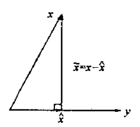
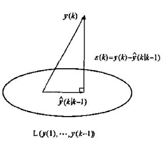

# 卡尔曼滤波的公式推导和应用举例(二)

> 本文写于2023-08-20下午两点、2023-09-09晚上十点、2023-09-10全天

## 一、卡尔曼滤波的另外三类推导方式

上一篇关于卡尔曼滤波的文章给出了直接公式推导的方式，在本篇文章中，我将给出卡尔曼滤波原论文的证明方式（正交投影定理）和极大似然估计法的证明方式。

通过贝叶斯滤波推导卡尔曼滤波和扩展卡尔曼滤波以及粒子滤波等，B站一位up主讲的不错，直接给出链接，推荐大家看一下

<https://www.bilibili.com/video/BV1aE411p7VE/>

## 二、基础知识准备

### 2.1 极大似然估计

在谈极大似然估计之前我想先给出一些统计推断背景知识。

直至当前，关于统计推断的主张和想法，大体可以纳入到两个体系之内，其一叫**频率学派**，其特征是把需要推断的参数θ视作固定且未知的常数，而样本X是随机的，其着眼点在样本空间，有关的概率计算都是针对X的分布。

另一派叫做**贝叶斯学派**，他们把参数θ视作随机变量，而样本X是固定的，其着眼点在参数空间，重视参数θ的分布，固定的操作模式是通过参数的先验分布结合样本信息得到参数的后验分布。

两学派各有其信仰、内在逻辑、解释力和局限性，从20世纪上半页至今，两大学派的辩论从未停歇，但分歧如故。贝叶斯学派的发展在二十世纪滞后于频率学派，甚至现今主流统计学教材仍然以频率学派的理论框架为主，贝叶斯理论通常一笔带过。这或许受到Karl Pearson，Sir Ronald A. Fisher，Egon Pearson（Karl Pearson的儿子）和Jerzy Neyman等二十世纪上半叶的大统计学家的影响，这些当时具有话语权的大统计学家并不认可贝叶斯理论（尽管一些人的文章里被怀疑使用了贝叶斯的思想）。

极大似然估计是频率学派最经典的方法之一，认为真实发生的结果的概率应该是最大的，那么相应的参数，也应该是能让这个状态发生的概率最大的参数。

极大似然估计是一种参数估计的方法。它要解决这样一个问题：给定一组数据和一个参数待定的模型，如何确定模型的参数，使得这个确定参数后的模型在所有模型中产生已知数据的概率最大。

在常见的极大似然估计中，我们常常可以用于估计 $\theta$ 之类的变量，但是在卡尔曼滤波的证明过程中，读者需要注意的是我们需要估计的是 $x$ 的极大似然估计，这一点要牢记。预测 $x$ 的极大似然估计也很简单，即寻找一个 $x$ 值使得关于 $x$ 的极大似然函数最大就好。

### 2.2 正交投影定理

卡尔曼滤波器是历史观测值的线性最小方差估计。在几何上，卡尔曼滤波估值是状态变量在由观测生成的线性空间上的射影。

由  $m \times 1$ 维随机变量  $y \in R^m$ 的线性函数估计  $n \times 1$  维随机变量  $x \in R^n$ ，记估值为

$$
\hat x = Ay + b, b \in R^n,A \in R^{n \times m}, \hat x \in R^{n}
$$

若估值  $\hat{x}$ 极小化性能指标为标为 $J=E[(x-\hat{x})^T(x-\hat{x})]$ ，则称  $\hat{x}$ 为随机变量 $x$ 的线性最小方差估计。

将 $\hat x$ 的具体形式带入极小化性能指标可得

$$
J = E[(x - Ay - b)^{T}(x - Ay - b)]
$$

为求性能指标极小值，分别求关于变量 $b$ 和变量 $A$ 的偏导数(矩阵求导的部分公式可以参考上一篇文章)

$$
\frac {\partial J}{\partial b} = -2E(x-b-Ay) = 0
$$

求得

$$
b = E(x) - A*E(y)
$$

将 $b$ 的值带入到 $J$ 的表达式可得

$$
\begin{align*}
J &= E[(x - Ay - b)^{T}(x - Ay - b)] \\
&= \text{tr} E[(x - Ay - b) (x - Ay - b)^{T}] \\
&= \text{tr} E[(x - Ay - (E(x) - A*E(y)))(x - Ay - (E(x) - A*E(y)))^{T}] \\
&= \text{tr} E[((x - E(x)) - A(y - E(y))) ((x - E(x))^{T} - (y - E(y))^{T}A^T) ] \\
&= \text{tr} E[(x - E(x))(x - E(x))^{T} - A(y - E(y))(x - E(x))^{T} - (x - E(x))(y - E(y))^{T}A^T + A(y - E(y))(y - E(y))^{T}A^T)] \\
\end{align*}
$$

记

$$
\begin{align*}
& P_{xx} = E[(x - Ex)(x - Ex)^T] \\
& P_{xy} = E[(x - Ex)(y - Ey)^T] \\
& P_{yx} = E[(y - Ey)(x - Ex)^T] \\
& P_{yx}^T = P_{xy} \\
& P_{yy} = E[(y - Ey)(y - Ey)^T] \\
& P_{xx}^T = P_{xx}, P_{yy}^T = P_{yy}
\end{align*}
$$

则

$$
\begin{align*}
J &= \text{tr} [P_{xx} - AP_{yx} - P_{xy}A^T + AP_{yy}A^T] \\
&= \text{tr} P_{xx} - \text{tr}(AP_{yx}) - \text{tr} (P_{xy}A^T) + \text{tr} (AP_{yy}A^T)
\end{align*}
$$

求导预备知识

$$
\begin{align*}
&\frac{\partial \text{tr}(ABA^T)}{\partial A} = AB + AB^T \\
&\frac{\partial \text{tr}(A^TB)}{\partial A} = \frac{\partial \text{tr}(B A^T)}{\partial A} = B
\end{align*}
$$

那么

$$
\begin{align*}
\frac{\partial J}{\partial A} &= - P_{yx}^T - P_{xy} + AP_{yy} + AP_{yy}^T \\
&=  - P_{xy} - P_{xy} + AP_{yy} + AP_{yy} \\
&= - 2 (P_{xy} - AP_{yy})
\end{align*}
$$

令上式等于零，可得

$$
A = P_{xy} P_{yy}^{-1}
$$

将 $A$ 和 $b$ 带入 $\hat x$ 可得

$$
\begin{align*}
\hat x &= Ay + b \\
&= Ay + E(x) - A*E(y) \\
&= A(y - E(y)) +  E(x) \\
&= E(x) + P_{xy} P_{yy}^{-1}(y - E(y))
\end{align*}
$$

这里说明下各个变量的形状， $E(x) \in R^{n \times 1}$ ， $P_{xy} \in R^{n \times m}$ ， $P_{yy} \in R^{m \times m}$ ， $E(y) \in R^{m \times 1}$ 

列向量表示为一个矩阵时，可以看做 $row\_number \times 1$ 的矩阵。

> 重要提示：凡是对变量求的期望，都可以看错一个常数或者常数矩阵。
> 在后续求解用到求期望时的运算公式时，还请多加注意这一点

**推论1** 无偏性  $E \hat x = Ex$ 

证明：

$$
E\hat x = E[Ex + P_{xy} P_{yy}^{-1}(y - Ey)] = Ex + P_{xy} P_{yy}^{-1}(Ey - Ey) = Ex
$$

**推论2** 正交性  $E[(x - \hat x) y ^T] = 0$ 

证明（利用 $Ey^T$ 是常数向量这一性质）

由推论1可得， $E(x - \hat x) = 0$ ，则有 $E(x - \hat x) \times Ey^T = E[(x - \hat x)Ey ^T] = 0$ 

$$
\begin{align*}
E[(x - \hat x) y ^T] &= E[(x - \hat x) y ^T] - E[(x - \hat x)Ey ^T] \\
&= E[(x - \hat x) (y - Ey) ^T] \\
&= E[(x - Ex - P_{xy} P_{yy}^{-1}(y - Ey)) (y - Ey) ^T] \\
&= E[(x - Ex)(y - Ey) ^T] - P_{xy} P_{yy}^{-1} E[(y - Ey)(y - Ey)^T] \\
&= P_{xy} - P_{xy} P_{yy}^{-1}P_{yy} \\
&= P_{xy} - P_{xy} \\
&= 0
\end{align*}
$$

**推论3**  $\widetilde x = x - \hat x$ 与 $y$ 不相关

根据不相关定义，可以证明相关系数为0，相关系数为零->可以证明两者协方差为0。

按照协方差定义可以写出（利用了上面的证明过程）

$$
\begin{align*}
cov(\widetilde x , y) &= E[(\widetilde x - E\widetilde x)(y - Ey)^T]  \\
&= E[\widetilde x(y - Ey)^T] \\
&= E[(x - \hat x)(y - Ey)^T] \\
&= 0
\end{align*}
$$

**射影的定义**

将 $x - \hat x$ 与 $y$ 不相关定义为 $x - \hat x$ 与 $y$ 正交（垂直），记为 $(x - \hat x) \perp y$ ，并称 $\hat x$ 为 $x$ 在y上的射影，记为 $\hat x = proj(x | y)$ 

线性最小方差估计 $\hat x$ 的几何意义如下图所示：

**在线性流形上射影的定义**

由随机变量 $y \in R^m$ 张成的线性流形(线性空间)定义为如下形式随机变量 $z \in R^n$ 的集合 $L(y)$ ,

$$
L(y) = \{z | z = Ay + b, \forall A \in R^{n \times m},\forall b \in R^n \}
$$

推论  $(x - \hat x) \perp z, \forall z \in L(y)$ ，记为 $(x - \hat x) \perp L(y)$ .

证明

$$
\begin{align*}
E[(x - \hat x)z^T] &= E[(x - \hat x)(Ay + b) ^ T] \\
&= E[(x - \hat x)y^T]A^T + E[(x - \hat x)]b^T \\
&= 0 + 0 \\
&= 0
\end{align*}
$$

设随机变量 $x \in R^n$ ，随机变量 $y(1), ...,y(k) \in R^m$ ，引入合成随机变量 $w$ 为

$$
w = (y^T(1), ..., y^T(k))^T \in R^{km}
$$

$$
L(w) = \{ y| y = A w + b, \forall b \in R^n, \forall A \in R^{n \times km} \}
$$

引入分块矩阵

$$
A = [A_1, ..., A_k], A_i \in R^{n \times m}
$$

则有

$$
L(w) = \{ y | y = \sum_{i = 1}^{k}A_{i}y(i) + b, \forall A_i \in R^{n \times m}, \forall b \in R^{n} \} = L(y(1), ..., y(k))
$$

定义：基于随机变量 $y(1),...,y(k) \in R^m$ 对随机变量 $x \in R^n$ 的线性最小方差估计 $\hat x$ 定义为

$$
\hat x = proj(x|w) \triangleq proj(x | y(1), ..., y(k))
$$

也称为 $\hat x$ 为 $x$ 在线性流形 $L(w)$ 或 $L(y(1), ..., y(k))$ 上的射影。

**射影的性质1:在线性空间上投影基底的性质**

设 $x \in R^n$ 为零均值随机向量， $y(1), ...,y(k) \in R^m$ 为零均值，互不相关（正交）的随机变量，则有

$$
proj(x | y(1), ..., y(k)) = \sum_{i = 1}^k proj(x | y(i))
$$

即 $x$ 在由 $y(1), ... , y(k)$ 张成的线性流形$ L(y(1), ..., y(k))  $上的射影等于它在由每一个$ y(i) $张成的线性流形上的射影之和，即$ x $在全空间上的射影等于它在相互正交的子空间上的射影之和。这大大简化了射影的计算。因此，若$ y(1), ..., y(k)$是非正交的，问题是如何使它们正交化，这将引入后面的新息的概念。

证明 记合成向量 $w = (y^T(1), ... , y^T(k)) \in R^{km}$ ，注意 $(Ex = \mathbf 0, Ew = \mathbf 0 ， P_{y(i)y(j)} = \mathbf  0(i 
e j), E[y(i)y(j)^T] = \mathbf 0(i 
e j))$ ，则应用射影公式有

$$
\begin{align*}
&proj(x| y(1), ..., y(k))  \\
&= proj(x |w) \\
&= Ex + P_{xw}P_{ww}^{-1}(w - Ew) \\
&= P_{xw}P_{ww}^{-1}w \\
&= E[xw^T]E[ww^T]w \\
&= E[x\begin{bmatrix}
y(1) \\
\vdots \\
y(k) \\
\end{bmatrix}^T]E[\begin{bmatrix}
y(1) \\
\vdots \\
y(k) \\
\end{bmatrix} \begin{bmatrix}
y(1) \\
\vdots \\
y(k) \\
\end{bmatrix}^T] \begin{bmatrix}
y(1) \\
\vdots \\
y(k) \\
\end{bmatrix} \\
&= E[x(y^T(1), ..., y^T(k))] \begin{bmatrix}
E[y(1)y^T(1)] &  & \mathbf 0 \\
 & \ddots & \\
\mathbf 0 & & E[y(k)y^T(k)]
\end{bmatrix}^{-1} \begin{bmatrix}
y(1) \\
\vdots \\
y(k) \\
\end{bmatrix} \\
&= E[x(y^T(1), ..., y^T(k))] \begin{bmatrix}
E^{-1}[y(1)y^T(1)] &  & \mathbf 0 \\
 & \ddots & \\
\mathbf 0 & & E^{-1}[y(k)y^T(k)]
\end{bmatrix} \begin{bmatrix}
y(1) \\
\vdots \\
y(k) \\
\end{bmatrix} \\
&= (E[xy^T(1)], ..., E[xy^T(k)]) \begin{bmatrix}
E^{-1}[y(1)y^T(1)] y(1) \\
\vdots \\
E^{-1}[y(k)y^T(k)] y(k) \\
\end{bmatrix} \\
&= \sum_{i = 1}^{k} E[xy^T(i)] E^{-1}[y(i)y^T(i)] y(i) \\
&= (\sum_{i = 1}^{k} E[(x - Ex)(y(i) - Ey(i))^T] E^{-1}[(y(i) - Ey(i))(y(i) - Ey(i))^T] (y(i) - Ey(i)) + Ex) \\
&= \sum_{i = 1}^{k} (P_{xy(i)} P^{-1}_{y(i)y(i)} (y(i) - Ey(i)) + Ex) \\
&= \sum_{i = 1}^{k} proj(x | y(i))
\end{align*}
$$

**射影的性质2:线性可加性**

设随机变量 $x \in R^p, z \in R^l$ ，随机变量 $Ax + Bz \in R^n, A \in R^{n \times p}, B \in R^{n \times q}$ ，随机变量 $y \in R^m$ ，则有

$$
proj(Ax + Bz | y) = A proj(x | y) + B proj(z | y)
$$

证明（令 $w = Ax + Bz$ ）

$$
\begin{align*}
&proj(Ax + Bz | y) \\
&= E(w) +  P_{wy} P_{yy}^{-1}(y - Ey) \\
&= E(Ax + Bz) +  P_{(Ax + Bz)y} P_{yy}^{-1}(y - Ey) \\
&= AEx + BEz + (AP_{xy} + B P_{zy}) P_{yy}^{-1} (y - Ey) \\
&= AEx + AP_{xy} P_{yy}^{-1} (y - Ey) +  BEz + B P_{zy} P_{yy}^{-1} (y - Ey) \\
&= A(Ex + P_{xy} P_{yy}^{-1} (y - Ey)) + B(Ez + P_{zy} P_{yy}^{-1} (y - Ey)) \\
&= Aproj(x|y) + Bproj(z|y)
\end{align*}
$$

**射影的性质3：分量可拆性**

设随机变量 $x \in R^n$ ，随机变量 $y \in R^m$ ，记 $x$ 的分量形式为

$$
x = \begin{bmatrix}
x_1 \\
\vdots \\
x_n \\
\end{bmatrix}
$$

则有关系

$$
proj(x | y) = \begin{bmatrix}
proj(x_1 | y) \\
\vdots \\
proj(x_n | y) \\
\end{bmatrix}
$$

证明

$$
\begin{align*}
& proj(x | y) \\
&= Ex + P_{xy}P_{yy}^{-1}(y - Ey) \\
&= \begin{bmatrix}
Ex_1 \\
\vdots \\
Ex_n \\
\end{bmatrix} + E\{ \begin{bmatrix}
x_1 - Ex_1 \\
\vdots \\
x_n - Ex_n \\
\end{bmatrix} (y - Ey)^T \} P_{yy}^{-1}(y - Ey) \\
&= \begin{bmatrix}
Ex_1 \\
\vdots \\
Ex_n \\
\end{bmatrix} + E \begin{bmatrix}
(x_1 - Ex_1)(y - Ey)^T \\
\vdots \\
(x_n - Ex_n)(y - Ey)^T \\
\end{bmatrix}  P_{yy}^{-1}(y - Ey) \\
&= \begin{bmatrix}
Ex_1 \\
\vdots \\
Ex_n \\
\end{bmatrix} +  \begin{bmatrix}
E[(x_1 - Ex_1)(y - Ey)^T] P_{yy}^{-1}(y - Ey) \\
\vdots \\
E[(x_n - Ex_n)(y - Ey)^T] P_{yy}^{-1}(y - Ey) \\
\end{bmatrix}   \\
&= \begin{bmatrix}
Ex_1 \\
\vdots \\
Ex_n \\
\end{bmatrix} +  \begin{bmatrix}
P_{x_1y} P_{yy}^{-1}(y - Ey) \\
\vdots \\
P_{x_ny} P_{yy}^{-1}(y - Ey) \\
\end{bmatrix} \\
&= \begin{bmatrix}
Ex_1 + P_{x_1y} P_{yy}^{-1}(y - Ey) \\
\vdots \\
Ex_n + P_{x_ny} P_{yy}^{-1}(y - Ey) \\
\end{bmatrix} \\
&= \begin{bmatrix}
proj(x_1|y) \\
\vdots \\
proj(x_n|y) \\
\end{bmatrix}
\end{align*}
$$

这个性质说明随机变量 $x$ 在线性流行 $L(y)$ 上的射影的每个分量为 $x$ 的相应分量在线性流行 $L(y)$ 上的射影。换言之，随机变量 $x$ 的线性最小方差估计的每个分量等于 $x$ 的相应的分量的线性最小方差估计，即全局最优估计等于局部最优估计。

**新息序列的定义**

设 $y(1),y(2),...,y(k), ... \in R^m$ 是存在二阶矩的随机序列，它的新息序列（新息过程）定义为

$$
\varepsilon(k) = y(k) - proj(y(k) | y(1), ...,y(k-1)), k = 1,2,...
$$

并定义 $y(k)$ 的一步最优预报估值为

$$
\hat y(k | k - 1) = proj(y(k) | y(1), ...,y(k-1))
$$

因而新息序列可定义为

$$
\varepsilon(k) = y(k) - \hat y(k | k - 1), k=1,2,...
$$

其中规定 $\hat y(1 | 0) = Ey(1)$ ，这保证 $E \varepsilon(1) = 0$ .

新息的几何意义如下图所示，可看到 $\varepsilon(k) \perp L(y(1), ..., y(k - 1))$ 

**新息序列的无偏性和互不相关**

新息序列 $\varepsilon(k)$ 是零均值白噪声。

证明 由推论 $Ex = E \hat x$ 可知射影是无偏差的，故有

$$
\begin{align*}
E \varepsilon(k) &= Ey(k) -  E\hat y(k | k - 1) \\
&= Ey(k) - Ey(k) \\
&= 0 (k \ge 1)
\end{align*}
$$

白噪声(两两互不相关)证明：

设 $(i 
eq j)$ ，不妨设 $i > j$ ，因 $\varepsilon(i) \perp L(y(1), ..., y(i - 1))$ ，且有 $L(y(1), ... , y(j)) \subset L(y(1), ..., y(i-1))$ ，故有 $\varepsilon(i) \perp L(y(1), ... , y(j))$ 。

而 $\varepsilon(j) = y(j) - \hat y(j | j - 1) \in L(y(1), ... , y(j))$ , 因而 $\varepsilon(i) \perp  \varepsilon(j)$ , 即 $E[\varepsilon(i)\varepsilon^T(j)] = 0$ ，故 $\varepsilon(i)$ 是白噪声，证毕。

上述证明表明新息序列是正交序列，通过引入新息序列实现了非正交随机序列的正交化。由**射影的性质1:在线性空间上投影基底的性质**可知，在由新息序列张成的线性流行上的射影将大大简化射影的计算。

这样问题就转换为 $L(\varepsilon(1), ..., \varepsilon(k)) = L(y(1), ..., y(k))$ 这个转换是否成立？即新息序列 $\varepsilon(k)$ 与原序列 $y(k)$ 是否含有相同的统计信息？下面我们将回答这个问题

**新息序列张成的空间与原线性空间的等价性**

新息序列 $\varepsilon(k) (与原序列)y(k)$ 含有相同的统计新息，即 $(y(1), ..., y(k))$ 与 $(\varepsilon(1), ..., \varepsilon(k))$ 张成相同的线性流形，即

$$
L(\varepsilon(1), ... , \varepsilon(k)) = L(y(1), ..., y(k)), k = 1,2,..
$$

证明 由射影公式和定义，每个 $\varepsilon(k)$ 是 $y(1),...,y(k)$ 的线性组合，这引出 $\varepsilon(k) \in L(y(1),...,y(k))$ ，从而有 $L(\varepsilon(1),...\varepsilon(k)) \subset L(y(1), ..., y(k))$ 。

下证 $y(k) \in L(\varepsilon(1), ..., \varepsilon(k))$ .

事实上，我们由新息序列的定义和归纳法可知

$$
\begin{align*}
& y(1) = \varepsilon(1) + \hat y(1 | 0) = \varepsilon(1) + Ey(1) \in L(\varepsilon (1)), \\
& y(1) = \varepsilon(2) + \hat y(2 | 1) = \varepsilon(2) + proj(y(2) | y(1)) \in L(y (1), \varepsilon (2)) \subset L(\varepsilon (1), \varepsilon (2)), \\
&\vdots \\\
& y(k) = \varepsilon(k) + proj(y(k) | y(k-1),...,y(1)) \in L(y (1), y(2), ...,y(k-1), \varepsilon (k)) \subset L(\varepsilon (1), \varepsilon (2), ... \varepsilon (k))
\end{align*}
$$

这引出 $L(y(1), ..., y(k)) \subset L(\varepsilon (1), \varepsilon (2), ... \varepsilon (k))$ ，故有 $L(\varepsilon(1), ... , \varepsilon(k)) = L(y(1), ..., y(k))$ 。

推论：

$$
proj(x|y(1), ..., y(k)) = proj(x|L(y(1),...,y(k))) = proj(x|L(\varepsilon (1),...,\varepsilon(k))) = proj(x|\varepsilon(1), ..., \varepsilon(k))
$$

**递推射影公式**

设随机变量 $x \in R^n$ ，随机序列 $y(1), ..., y(k), ... \in R^m$ ，且它们存在二阶炬，则有递推射影公式

$$
proj(x | y(1), ..., y(k)) = proj(x | y(1), ..., y(k - 1)) + E[x \varepsilon^T(k)][E(\varepsilon(k)\varepsilon^T(k))]^{-1} \varepsilon(k)
$$

证明 引入合成向量

$$
\varepsilon = \begin{bmatrix}
\varepsilon_1 \\
\vdots \\
\varepsilon_k \\
\end{bmatrix}
$$

应用和射影公式，并注意 $E\varepsilon(1) = 0$ ，有

$$
\begin{align*}
proj(x | y(1),  \cdots , y(k)) &= proj(x | \varepsilon(1),  \cdots , \varepsilon(k)) \\
&= proj(x | \varepsilon) \\
&= Ex + P_{x\varepsilon} P_{\varepsilon \varepsilon}^{-1} \varepsilon \\
&= Ex + E[(x - Ex) \varepsilon] P_{\varepsilon \varepsilon}^{-1} \varepsilon \\
&= Ex + E[x \varepsilon] P_{\varepsilon \varepsilon}^{-1} \varepsilon -  ExE\varepsilon P_{\varepsilon \varepsilon}^{-1} \varepsilon \\
&= Ex + E[x \varepsilon] P_{\varepsilon \varepsilon}^{-1} \varepsilon \\
&= Ex + E[x[\varepsilon^T_1,  \cdots , \varepsilon^T_k]]
E^{-1}(
\begin{bmatrix}
\varepsilon_1 \\
\vdots \\
\varepsilon_k \\
\end{bmatrix}
[\varepsilon^T_1,  \cdots , \varepsilon^T_k]
)
\begin{bmatrix}
\varepsilon_1 \\
\vdots \\
\varepsilon_k \\
\end{bmatrix} \\
&= Ex + E([x\varepsilon^T_1,  \cdots , x\varepsilon^T_k])
\begin{bmatrix}
E^{-1}[\varepsilon_1 \varepsilon_1^T] &  & \mathbf 0 \\
 & \ddots & \\
\mathbf 0 & & E^{-1}[\varepsilon_k \varepsilon_k^T]
\end{bmatrix}
\begin{bmatrix}
\varepsilon_1 \\
\vdots \\
\varepsilon_k \\
\end{bmatrix} \\
&= Ex + E([x\varepsilon^T_1,  \cdots , x\varepsilon^T_k])
\begin{bmatrix}
E^{-1}[\varepsilon_1 \varepsilon_1^T] \varepsilon_1 \\
\vdots \\
E^{-1}[\varepsilon_k \varepsilon_k^T] \varepsilon_k \\
\end{bmatrix} \\
&= Ex + \sum_{i = 1}^{k} E[x \varepsilon_i^T] E^{-1}[\varepsilon_i \varepsilon_i^T] \varepsilon_i \\
&= Ex + \sum_{i = 1}^{k-1} E(x \varepsilon_i^T) E^{-1}[\varepsilon_i \varepsilon_i^T] \varepsilon_i + E[x \varepsilon_k^T] E^{-1}[\varepsilon_k \varepsilon_k^T] \varepsilon_k \\
&= proj(x | \varepsilon_1, \varepsilon_2,  \cdots , \varepsilon_{k-1}) + E[x \varepsilon_k^T] E^{-1}[\varepsilon_k \varepsilon_k^T] \varepsilon_k \\
&= proj(x | y(1), \cdots , y(k-1)) + E[x \varepsilon_k^T] E^{-1}[\varepsilon_k \varepsilon_k^T] \varepsilon_k 
\end{align*}
$$

递推射影公式即推导卡尔曼滤波的出发点。

### 2.3 前置知识回顾

为了描述系统特性，这里给出系统的状态方程和测量方程

$$
\begin{align*}
&x_k = A_{k - 1}x_{k - 1} + B_{k-1}u_{k-1} + w_{k-1} \\
&z_k = H_k x_k + v_k
\end{align*}
$$

其中， $A_{k-1}$ 为状态(转移)矩阵（Transition Matrix）， $x_{k-1}$ 记为 $k-1$ 时刻的状态向量。

 $u_{k-1}$ 为 $k-1$ 时刻输入， $B_{k-1}$ 称为控制矩阵（Control Matrix），反映了系统输入到系统状态的映射关系。

 $w_{k-1}$ 是过程噪声，我们假定其符合均值为0，协方差矩阵为 $Q_{k-1}$ 的高斯噪声。

 $H_k$ 为测量矩阵（Measurement Matrix），描述了从系统状态到测量值的转换关系（举一个最简单的关系，系统状态是物体的直线距离，测量值是使用激光笔测出来的光从原点到物体的时间，那么 $H_k$ 就是光速的倒数）

 $v_k$ 是测量噪声，我们假定其符合均值为0，协方差为 $R_k$ 的高斯噪声。

我们还需要引出状态预测方程和测量估计方程的概念

**状态预测方程**是取得是每一项的概率最大值处对应的自变量的值，噪声 $w_{k-1}$ 是均值为0的高斯噪声，因此最大概率对应的值为0。

$$
\begin{align*}
&\hat x^-_k = A_{k - 1}\hat x^{+}_{k - 1} + B_{k-1}u_{k-1} + 0\\
\end{align*}
$$

对系统状态向量上面加上一个帽子符号表示这是一个估计量，也就是我们实际输出的量。

 $\hat x^{+}_{k - 1}$ 表示 $k-1$ 时刻时的卡尔曼滤波后的状态向量，也称为状态向量的后验估计。

 $\hat x^-_k$ 表示当前根据系统状态方程计算预测得到的状态向量，也称为状态向量的先验估计。

**测量估计方程**同样忽略噪声项，变成对此时测量量的估计

$$
\hat z_k = H_k \hat x^-_k
$$

由于我们不对 $z_k$ 做最优估计，所以不赋予其右上角的加减上下标。

## 三、极大似然估计法

先验知识：

多维正态分布满足两个规律：

1. 正态分布加减一个固定常数向量，然后在乘以一个固定常数非零矩阵，其分布还是正态分布。且满足

$$
\begin{align*}
&X \sim N(\mu, \Sigma) \\
&AX+b \sim N(b+u, A\Sigma A^{T})
\end{align*}
$$

1. 两个独立的正太分布相加后还是正态分布

$$
\begin{align*}
&X \sim N(\mu_1, \Sigma_1) \\
&Y \sim N(\mu_2, \Sigma_2) \\
&X \pm Y \sim N(\mu_1 \pm \mu_2, \Sigma_1 + \Sigma_2)
\end{align*}
$$

假设随机变量X有D维，则 $X \sim N(\mu, \Sigma)$ 的概率密度函数为

$$
f_{X}(x) = \frac{1}{(2 \pi)^{D/2} \det^{1/2}(\Sigma)} \exp\left ({-\frac{1}{2}}(x - \mu)^T \Sigma^{-1} (x - \mu) \right)
$$

在已知随机变量X的两种可能分布后，我们如何给出X的最可能取值（最优估计）呢？

如果采用极大似然估计，只需要写出似然函数，然后求出使得似然函数最大的X即可。

在两种分布独立的情况下，我们将似然函数定义为两种分布的概率密度函数相乘。

这里我们试着求出状态值先验估计的分布和状态值测量值的分布，这个时候就不能忽略噪声的存在，因为我们求得是一个分布，而不是具体的估计值。

$$
\begin{align*}
&x^{prior}_k = A_{k - 1} \hat x^+_{k - 1} + B_{k-1}u_{k-1} + w_{k-1} = \hat x^-_k + w_{k-1} \\
&x^{measure}_{k} = H_k^{-1}(z_k - v_k)  = H_k^{-1}z_k - H_k^{-1}v_k
\end{align*}
$$

其中 $\hat x^{+}_{k - 1}$ 表示 $k-1$ 时刻时的卡尔曼滤波后的状态向量，也称为状态向量的后验估计值。

 $\hat x^-_k$ 表示当前根据系统状态方程计算预测得到的状态向量，也称为状态向量的先验估计值。

 $x_{measure}$ 是根据测量值反推的状态向量的值

根据

$$
x^{measure}_{k} = H_k^{-1}(z_k - v_k)  = H_k^{-1}z_k - H_k^{-1}v_k
$$

 $H_k^{-1}z_k$ 是一个常数向量，可以看出 $x^{measure}_{k} \sim N(H_k^{-1}z_k, H_k^{-1}R_k{H_k^{-1}}^T)$ 

我们假设初始状态 $x_0^-$ 服从N( $\hat x_0^-, \Theta_0^-$ )， $x_{-1}^+$ 服从N $(\hat x_{-1}^+, D_0^+)$ 分布，根据

$$
x^{prior}_k = A_{k - 1} \hat x^+_{k - 1} + B_{k-1}u_{k-1} + w_{k-1} = \hat x^-_k + w_{k-1}
$$

有如下传递性

$$
\begin{align*}
&x^{prior}_0 = A_{-1} \hat x^+_{-1} + B_{-1}u_{-1} + w_{-1} = \hat x^-_0 + w_{-1} \sim N(\hat x_0^-, D_0^-), D_0^- = \Theta_0^- + Q_{-1} =  A_{-1} D_0^+ A_{-1}^T + Q_{-1}\\
&\hat x^+_0 = \hat x^-_{0} + G_0(x^{measure}_0 - \hat x^-_{0}) \text{作为两个独立正太分布相加的结果，依然是一个正态分布，假设其方差为}P_1^+ \\
&x^{prior}_1 = A_{0} \hat  x^+_{0} + B_{0}u_{0} + w_{0} = \hat x^-_1 + w_{0} \sim N(\hat x_1^-, D_1^-), D_1^- =  A_{0} D_1^+ A_{0}^T + Q_{0} \\
&x^{prior}_2 = \hat x^-_2 + w_{1} \sim N(\hat x_2^-, D_2^-), D_2^- =  A_{1} D_2^+ A_{1}^T + Q_{1} \\
& ...... 
\end{align*}
$$

从上面公式，我们可以得到 $x^{prior}_k$ 的分布

$$
x^{prior}_k = A_{k - 1} \hat x^+_{k - 1} + B_{k-1}u_{k-1} + w_{k-1} = \hat x^-_k + w_{k-1} \sim N(\hat x_k^-, D_k^-)
$$

从上面公式也可以看出卡尔曼滤波的先验状态方差更新方程：

$$
D_k^- = A_{k - 1}D_{k-1}^{+}A_{k - 1}^T + Q_{k-1}
$$

在上一篇文章我们在推导卡尔曼滤波在初始条件满足一定条件的情况下，其具备无偏传递性。

在推导过程中，在无偏性满足条件下，我们可以看到  $E(x_k - \hat x^-_{k}) = 0$ ,则

$$
\begin{align*}
P_k^- = E(| \hat x^-_k - x_k |^2) &= E(| \hat x^-_k - x_k |^2) + E^2(x_k - \hat x^-_{k}) \\
&= D(x^-_k - x_k) (x_k可以看做一个常量) \\
&= D(x^-_k) = D_k^-
\end{align*}
$$

同理我们也可以推导得到 $P_k^+ = D_k^+$ 。

从而我们先给出卡尔曼滤波中先验估计误差协方差更新公式

$$
P_k^- = A_{k - 1}P_{k-1}^{+}A_{k - 1}^T + Q_{k-1}
$$

自此，我们拥有对状态的两个估计 $x^{prior}_k$ 、 $x^{measure}_{k}$ ，下面的问题就可以转换为如何对这两个分布进行融合？

> 如果是单个分布，我们直接令估计值  $\hat x = E(X)$

按照极大似然估计方法，我们首先定义似然函数为

$$
L(x) = f_{prior}(x) \cdot f_{measure}(x)
$$

然后取对数

$$
\log L(x) = \log f_{prior}(x) + \log f_{measure}(x)
$$

目标函数为

$$
maximize\ L(x) = maximize\ \log L(x)
$$

$$
\begin{align*}
\log L(x) &=  \log f_{prior}(x) + \log f_{measure}(x) \\
          &=    \log \frac{1}{(2 \pi)^{D/2} \det^{1/2}(D_{prior})} \exp\left ({-\frac{1}{2}}(x - \mu_{prior})^T D_{prior}^{-1} (x - \mu_{prior}) \right) \\ &+ \log \frac{1}{(2 \pi)^{D/2} \det^{1/2}(D_{prior})} \exp\left ({-\frac{1}{2}}(x - \mu_{measure})^T D_{measure}^{-1} (x - \mu_{measure}) \right) \\
          &= {-\frac{1}{2}}(x - \mu_{prior})^T D_{prior}^{-1} (x - \mu_{prior}) + {-\frac{1}{2}}(x - \mu_{measure})^T D_{measure}^{-1} (x - \mu_{measure}) + C 
\end{align*}
$$

令上述公式最大，对齐求导

$$
\begin{align*}
\frac{\partial \log L(x)}{x} &= {-\frac{1}{2}} 2 (x - \mu_{prior})^T D_{prior}^{-1} {-\frac{1}{2}} 2 (x - \mu_{measure})^T D_{measure}^{-1} \\
&= (\mu_{prior} - x)^T D_{prior}^{-1} + (\mu_{measure} - x)^T D_{measure}^{-1} \\
&= \mu_{prior}^TD_{prior}^{-1} + \mu_{measure}^TD_{measure}^{-1} - x^T(D_{prior}^{-1} + D_{measure}^{-1})
\end{align*}
$$

令上式等于0求得

$$
\begin{align*}
&x^T = (\mu_{prior}^TD_{prior}^{-1} + \mu_{measure}^TD_{measure}^{-1})(D_{prior}^{-1} + D_{measure}^{-1})^{-1} \\
&x = ((\mu_{prior}^TD_{prior}^{-1} + \mu_{measure}^TD_{measure}^{-1})(D_{prior}^{-1} + D_{measure}^{-1})^{-1})^T \\
&x = tranpose ((D_{prior}^{-1} + D_{measure}^{-1})^{-1}) ({D_{prior}^{-1}}^T\mu_{prior} + {D_{measure}^{-1}}^T \mu_{measure}) \\
\end{align*}
$$

根据协方差矩阵的对称性

$$
\begin{align*}
x &= (D_{prior}^{-1} + D_{measure}^{-1})^{-1} ( D_{prior}^{-1} \mu_{prior} +  D_{measure}^{-1}  \mu_{measure}) \\
&= D_{prior} (D_{prior} + D_{measure})^{-1} D_{measure} ({D_{prior}^{-1}} \mu_{prior} + {D_{measure}^{-1}}  \mu_{measure}) \\
&= D_{measure} (D_{prior} + D_{measure})^{-1} D_{prior} ({D_{prior}^{-1}} \mu_{prior} + {D_{measure}^{-1}}  \mu_{measure}) \\
&= D_{measure} (D_{prior} + D_{measure})^{-1}(\mu_{prior} + D_{prior}{D_{measure}^{-1}}  \mu_{measure}) \\
&= D_{measure} (D_{prior} + D_{measure})^{-1} (( (D_{prior} + D_{measure}) D_{measure}^{-1})\mu_{prior} \\ &+ (E- (D_{prior} + D_{measure}) D_{measure}^{-1})\mu_{prior}+ D_{prior}{D_{measure}^{-1}}  \mu_{measure}) \\
&= D_{measure} (D_{prior} + D_{measure})^{-1} ( (D_{prior} + D_{measure}) D_{measure}^{-1}\mu_{prior} \\ & + D_{prior}{D_{measure}^{-1}}^T (\mu_{measure} - \mu_{prior})) \\
&= \mu_{prior} + D_{measure} (D_{prior} + D_{measure})^{-1}D_{prior}{D_{measure}^{-1}}  (\mu_{measure} - \mu_{prior}) \\
&= \mu_{prior} + (D_{prior}^{-1} + D_{measure}^{-1})^{-1}{D_{measure}^{-1}}  (\mu_{measure} - \mu_{prior}) \\
&= \mu_{prior} + (D_{measure} D_{prior}^{-1} + E)^{-1}  (\mu_{measure} - \mu_{prior}) \\
&= \mu_{prior} + (D_{measure} D_{prior}^{-1} + D_{prior} D_{prior}^{-1})^{-1}  (\mu_{measure} - \mu_{prior}) \\
&= \mu_{prior} + D_{prior} (D_{measure} + D_{prior})^{-1}  (\mu_{measure} - \mu_{prior}) \\
\end{align*}
$$

这里需要用到一个简单的求逆公式

$$
(A+B)^{-1} = B^{-1}(B^{-1} + A^{-1}) A^{-1}
$$

根据

$$
D_{measure} = H_k^{-1}R_k{H_k^{-1}}^T \\
D_{prior} = P_{k}^-
$$

则根据上篇文章中的形式，对比可以求得

$$
\begin{align*}
G_k &= D_{prior} (D_{measure} + D_{prior})^{-1} \\
&= P_{k}^-(H_k^{-1}R_k{H_k^{-1}}^T + P_{k}^-)^{-1} \\
&= P_{k}^-((H_k^{-1}H_k)(H_k^{-1}R_k{H_k^{-1}}^T + P_{k}^-)(H_k^{T}{H_k^{T}}^{-1}))^{-1} \\
&= P_{k}^-((H_k^{-1})(R_k + H_kP_{k}^-H_k^{T})({H_k^{T}}^{-1}))^{-1} \\
&= P_{k}^-{H_k^{T}}(R_k + H_kP_{k}^-H_k^{T})^{-1}H_k \\
\end{align*}
$$

$$
K_k = G_kH_k^{-1} = P_{k}^-{H_k^{T}}(R_k + H_kP_{k}^-H_k^{T})^{-1}
$$

至此，我们采用极大似然估计法求得卡尔曼增益的过程推导完毕，剩余参数证明和上篇文章相同这里不再赘述。

## 四、正交投影定理证明法（原版证明方法）

为了防止读者遗忘，这里再给出状态空间模型的表达式

$$
\begin{align*}
&x_k = A_{k - 1}x_{k - 1} + B_{k-1}u_{k-1} + w_{k - 1} \\
&z_k = H_k x_k + v_k
\end{align*}
$$

其中， $A_{k-1} \in R^{n \times n}$ 为状态(转移)矩阵（Transition Matrix）， $x_{k-1}$ 记为 $k-1$ 时刻的状态向量。 $x_{k-1} \in R^n$ 

 $u_{k-1} \in R^n$ 为 $k-1$ 时刻输入， $B_{k-1} \in R^{n \times l}$ 称为控制矩阵（Control Matrix），反映了系统输入到系统状态的映射关系。

 $w_{k-1} \in R^n$ 是过程噪声，我们假定其符合均值为0，协方差矩阵为 $Q_{k-1} \in R^{n \times n}$ 的高斯噪声。

 $H_k \in R^{m \times n}$ 为测量矩阵（Measurement Matrix），描述了从系统状态到测量值的转换关系（举一个最简单的关系，系统状态是物体的直线距离，测量值是使用激光笔测出来的光从原点到物体的时间，那么 $H_k$ 就是光速的倒数）

 $v_k \in R^{m}$ 是测量噪声，我们假定其符合均值为0，协方差为 $R_k \in R^{m \times m}$ 的高斯噪声。

**假设1**  $w_k$ 和 $v_k$ 是零均值、协方差矩阵分别为 $Q_k$ ， $R_k$ 的不相关白噪声

$$
Ew_k = 0, Ev_k = 0 \
E[w_i w^T_j] = 0(i 
e j), E[v_i v^T_j] = 0 (i 
e j) \
E[w_i v_j^T] = 0, \forall i,j
$$

**假设2** 初始状态值 $x_0$ 、噪声项 $w_k$ 、 $v_k$ 和系统输入 $u_{k}$ 互不相关

$$
Ex_0 = \mu_0, E[(x_0 - \mu_0) (x_0 - \mu_0)^T] = P_0 \\
u_0 = 0
$$

**假设3** 每一个时刻的系统输入 $u_{k}$ 互不相关，且有 $Eu_k = u_k$ 

Kalman滤波问题是：基于观测 $z_1, ...., z_k$ ，求状态 $x_j$ 的线性最小方差估计 $\hat x(j | k)$ ，它的极小化性能指标为

$$
J = E[(x_j - \hat x(j|k))^T (x_j - \hat x(j|k))]
$$

* 当 $j = k$ 是， $\hat x(j | k)$ 称为卡尔曼滤波器
* 当 $j > k$ 是， $\hat x(j | k)$ 称为卡尔曼预报器
* 当 $j < k$ 是， $\hat x(j | k)$ 称为卡尔曼平滑器

下面讨论j = k时

在性能指标 $J$ 的条件下，问题归结为求射影

$$
\hat x(j|k) = proj(x_j|z_1, ..., z_k)
$$

由2.2章节递推射影公式有递推关系

$$
\hat x(k| k) = \hat x(k | k - 1) + K_{k} \varepsilon_{k} \\
K_{k} = E[x_{k} \varepsilon_{k}^T] E^{-1}[\varepsilon_{k} \varepsilon_{k}^T]
$$

称 $K_{k}$ 为 $k$ 时刻卡尔曼增益，对 $x_k = A_{k - 1}x_{k - 1} + B_{k-1}u_{k-1} + w_{k-1}$ 两边项取投影有

$$
\hat x(k| k - 1) = A_{k-1} \hat x(k - 1| k - 1) + B_{k-1}proj(u_{k-1}| z_1, \cdots, z_{k-1}) + proj(w_{k-1}| z_1, \cdots, z_{k-1})
$$

由 $x_k = A_{k - 1}x_{k - 1} + B_{k-1}u_{k-1} + w_{k}$ 迭代有

$$
x_k \in L(w_{k - 1}, \cdots , w_0, x_0, u_{k-1}, \cdots, u_0)
$$

应用 $z_k = H_k x_k + v_k$ 有

$$
z_{k-1} \in L(v_{k-1}, w_{k - 2}, \cdots , w_0, x_0, u_{k-2}, \cdots, u_0)
$$

这引出

$$
L(z_1, \cdots, z_{k - 1}) \subset L(v_{k-1}, \cdots, v_1, w_{k - 2}, \cdots , w_0, u_{k-2}, \cdots, u_0,  x_0)
$$

由此式和假设1、假设2有

$$
w_{k - 1} \perp L(z_1, \cdots, z_{k-1}) \\
u_{k - 1} \perp L(z_1, \cdots, z_{k-1})
$$

应用射影公式和 $Ew_{k - 1} = 0$ 可得

$$
proj(w_{k-1}| z_1, \cdots, z_{k-1}) = 0
$$

$$
proj(u_{k-1}| z_1, \cdots, z_{k-1}) = Eu_{k - 1} = u_{k-1}
$$

于是

$$
\hat x(k| k - 1) = A_{k-1} \hat x(k - 1| k - 1) + B_{k-1}proj(u_{k-1}| z_1, \cdots, z_{k-1}) + proj(w_{k-1}| z_1, \cdots, z_{k-1})
$$

可以化简为

$$
\hat x(k| k - 1) = A_{k-1} \hat x(k - 1| k - 1) + B_{k-1} u_{k-1}
$$

对 $z_k = H_k x_k + v_k$ 两边取投影得

$$
\hat z(k|k - 1) = H_k \hat x(k|k-1) + proj(v_k | z_1, \cdots, z_{k-1})
$$

由假设1、假设2和 $L(z_1, \cdots, z_{k - 1}) \subset L(v_{k-1}, \cdots, v_1, w_{k - 2}, \cdots , w_0, u_{k-2}, \cdots, u_0,  x_0)$ 可得

$$
v_k \perp L(z_1, \cdots, z_{k - 1})
$$

故有

$$
proj(v_k | z_1, \cdots, z_{k-1}) = 0
$$

于是有

$$
\hat z(k|k - 1) = H_k \hat x(k|k-1)
$$

再看新息表达式

$$
\varepsilon_{k} = z_k - \hat z(k | k - 1) = z_k - H_k \hat x(k|k-1)
$$

记滤波最优估计值误差为

$$
\begin{align*}
&\widetilde x(k|k) = x_k - \hat x(k | k) \\
&P(k|k) = E[\widetilde x(k|k) \widetilde x^T  (k|k)] \\
&\widetilde x(k|k - 1) = x_{k} - \hat x(k | k - 1) \\
&P(k|k - 1) = E[\widetilde x(k|k - 1) \widetilde x^T  (k|k - 1)] \\
&\widetilde x(k - 1|k - 1) = x_{k - 1} - \hat x(k -1| k - 1) \\
&P(k - 1|k - 1) = E[\widetilde x(k - 1|k - 1) \widetilde x^T  (k - 1|k - 1)]
\end{align*}
$$

结合 $z_k = H_k x_k + v_k$ 和 $\varepsilon_{k} =  z_k - H_k \hat x(k|k-1)$ 有新息表达式

$$
\begin{align*}
\varepsilon_{k} &= z_k - H_k \hat x(k|k-1) \\
&= H_k x_k + v_k - H_k \hat x(k|k-1) \\
&= H_k(x_k - \hat x(k|k-1)) + v_k \\
&= H_k \widetilde x(k|k - 1) + v_k
\end{align*}
$$

结合 $x_k = A_{k - 1}x_{k - 1} + B_{k-1}u_{k-1} + w_{k - 1}$ 和 $\hat x(k| k - 1) = A_{k-1} \hat x(k - 1| k - 1) + B_{k-1} u_{k-1}$ 可得

$$
\begin{align*}
\widetilde x(k|k - 1) &= x_{k} - \hat x(k | k - 1) \\
&= A_{k - 1}x_{k - 1} + B_{k-1}u_{k-1} + w_{k - 1} - (A_{k-1} \hat x(k - 1| k - 1) + B_{k-1} u_{k-1}) \\
&= A_{k - 1}(x_{k - 1} - \hat x(k - 1| k - 1)) + w_{k-1} \\
&= A_{k - 1} \widetilde x(k - 1|k - 1) + w_{k - 1}
\end{align*}
$$

由 $\hat x(k| k) = \hat x(k | k - 1) + K_{k} \varepsilon_{k}$ 可以推得

$$
\begin{align*}
\widetilde x(k|k) &= x_k - \hat x(k | k) \\
&= x_k - \hat x(k | k - 1) - K_{k} \varepsilon_{k} \\
&= \widetilde x(k|k - 1) - K_{k} \varepsilon_{k}
\end{align*}
$$

将 $\varepsilon_k = H_k \widetilde x(k|k - 1) + v_k$ 代入上式可得

$$
\begin{align*}
\widetilde x(k|k) &= \widetilde x(k|k - 1) - K_{k} \varepsilon_{k} \\
&= \widetilde x(k|k - 1) - K_{k} [H_k \widetilde x(k|k - 1) + v_k] \\
&= [I - K_kH_k] \widetilde x(k|k - 1) - K_k v_k
\end{align*}
$$

其中 $I \in R^{n \times n}$ 。

因为

$$
\widetilde x(k - 1|k - 1) = x_{k-1} - \hat x(k - 1| k - 1) \in L(v_{k-1}, \cdots, v_1, w_{k - 2}, \cdots , w_0, u_{k-1}, \cdots, u_0,  x_0)
$$

故有

$$
w_{k - 1} \perp \widetilde x(k|k - 1)
$$

则有

$$
E[w_{k - 1} \widetilde x^T(k|k - 1)] = 0
$$

结合 $\widetilde x(k|k - 1) = A_{k - 1} \widetilde x(k - 1|k - 1) + w_{k - 1}$ 和上式可得

$$
\begin{align*}
P(k|k - 1) &= E[\widetilde x(k|k - 1) \widetilde x^T  (k|k - 1)] \\
&= A_{k - 1}P(k - 1|k - 1)A_{k - 1}^T + Q_{k-1}
\end{align*}
$$

因为

$$
\widetilde x(k|k - 1) = x_{k} - \hat x(k | k - 1) \in L(v_{k-1}, \cdots, v_1, w_{k - 1}, \cdots , w_0, u_{k-1}, \cdots, u_0,  x_0)
$$

故有

$$
v_k \perp \widetilde x(k|k - 1)
$$

从而引出

$$
E[v_k \widetilde x^T(k|k - 1)] = 0
$$

于是，由 $\varepsilon_{k} = H_k \widetilde x(k|k - 1) + v_k$ 可得

$$
E[\varepsilon_{k} \varepsilon_{k}^T] = H_kP(k|k - 1)H_k^T + R_k
$$

也由 $\widetilde x(k|k) = [I - K_kH_k]x(k|k - 1) - K_k v_k$ 可得

$$
P(k|k) = [I - K_kH_k] P(k|k-1) [I - K_kH_k]^T + K_k R_k K_k^T
$$

下面求卡尔曼滤波器增益 $K_k$ ，已知 $K_k = E[x_{k} \varepsilon_{k}^T] E^{-1}[\varepsilon_{k} \varepsilon_{k}^T]$ 。

注意，应用 $\varepsilon_{k} = H_k \widetilde x(k|k - 1) + v_k$ 有

$$
\begin{align*}
E[x_k \varepsilon_{k}^T] &= E[(\hat x(k|k - 1) + \widetilde x(k|k - 1))(H_k \widetilde x(k|k - 1) + v_k)^T]
\end{align*}
$$

有射影正交性质可得

$$
\hat x(k|k - 1) \perp \widetilde x(k|k - 1)
$$

且有 $v_k \perp \widetilde x(k|k - 1), v_k \perp \hat x(k|k - 1)$ ，于是有

$$
\begin{align*}
E[x_k \varepsilon_{k}^T] &= E[(\hat x(k|k - 1) + \widetilde x(k|k - 1))(H_k \widetilde x(k|k - 1) + v_k)^T] \\
&= P(k|k-1)H_k^T
\end{align*}
$$

则卡尔曼增益

$$
\begin{align*}
K_k &= E[x_{k} \varepsilon_{k}^T] E^{-1}[\varepsilon_{k} \varepsilon_{k}^T] \\
&= P(k|k-1)H_k^T  [H_kP(k|k - 1)H_k^T + R_k]^{-1}
\end{align*}
$$

将上式带入 $P(k|k)$ 可得

$$
\begin{align*}
P(k|k) &= [I - K_kH_k] P(k|k-1) [I - K_kH_k]^T + K_k R_k K_k^T \\
&= [I - K_kH_k] P - [I - K_kH_k] PH_k^TK_k^T + K_k R_k K_k^T \\
&= [I - K_kH_k] P -  PH_k^TK_k^T + K_kH_kPH_k^TK_k^T + K_k R_k K_k^T \\
&= [I - K_kH_k] P -  PH_k^TK_k^T + K_k(H_kPH_k^T + R_k) K_k^T \\
&= [I - K_kH_k] P -  PH_k^TK_k^T + PH_k^T(H_kPH_k^T + R_k)^{-1}(H_kPH_k^T + R_k) K_k^T \\
&= [I - K_kH_k] P -  PH_k^TK_k^T + PH_k^TK_k^T  \\
&= [I - K_kH_k] P
\end{align*}
$$

即

$$
P(k|k) = [I - K_kH_k] P(k|k-1)
$$

综上递归卡尔曼滤波器所有公式有

①状态预测方程

$$
\hat x(k| k - 1) = A_{k-1} \hat x(k - 1| k - 1) + B_{k-1} u_{k-1}
$$

②最优状态估计迭代更新公式

$$
\begin{align*}
\hat x(k| k) &= \hat x(k | k - 1) + K_{k} \varepsilon_{k} \\
&= \hat x(k | k - 1) +  K_{k}(z_k - H_k \hat x(k|k-1))
\end{align*}
$$

③卡尔曼增益计算公式

$$
K_k = P(k|k-1)H_k^T  [H_kP(k|k - 1)H_k^T + R_k]^{-1}
$$

④先验估计误差协方差更新公式

$$
P_k^- = A_{k - 1}P(k - 1|k - 1)A_{k - 1}^T + Q_{k-1}
$$

⑤最优(后验)估计误差协方差更新公式

$$
P(k|k) = [I - K_kH_k] P(k|k-1)
$$

以上就是采用正交投影定理来证明卡尔曼滤波的全部过程，大部分过程参考邓老师的《最优估计理论及其应用：建模、滤波、信息融合估计》。我去除了卡尔曼预测步骤并将字母统一为本文的表示方法。

读者可以将 $P(k|k)$ 理解为 $P_k^+$ ，其余符号也可以一一对应。

## 五、结语

当写到这里的时候我终于可以松一口气了，忙活了三周。查阅了大量资料，也验证了一些错误证明方法。

比如“利用两个高斯分布相乘依然是高斯分布”这种说法是错误的。主要精力还是卡在了对于正交投影定理的理解上，对于矩阵形式的变量求期望以及对于是否为常数那里理解了整整一周，在周末的一个上午顿悟了，也算功夫不负有心人吧。

这一系列下一篇文章将会将一些卡尔曼滤波的具体应用了，比如过滤噪声还有其在目标追踪中的应用。

查资料写文章本身就是一个学习的过程，还是要耐着性子仔细去理解。感谢邓老师的著作，老的教科书真的经典。相比较于国外教材的翻译版本，还是邓老师写的更加透彻，可惜已经绝版了。不知道现在的教材还会给出这样有耐心的证明方法了。

## 六、参考文献和链接

* [https://zhuanlan.zhihu.com/p/428356533](https://zhuanlan.zhihu.com/p/428356533?utm_id=0)
* <https://zhuanlan.zhihu.com/p/598418848>
* <https://blog.csdn.net/qq_33866593/article/details/103035289>
* 《最优估计理论及其应用：建模、滤波、信息融合估计》邓自立著

