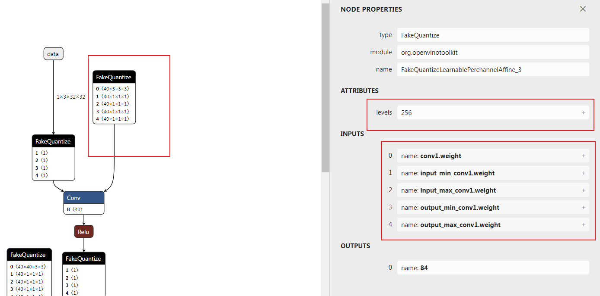

# 对模型量化框架mqbench添加openvino推理格式支持

> 本文写于2022年02月05日 16时30分

商汤开源的量化框架[mqbench](http://mqbench.tech/ "mqbench")支持QAT算法以及对多种推理框架（NNIE、TensorRT等）的部署支持，可能由于商汤内部在Intel CPU这种通用硬件下的场景不多，缺少对Intel 部署框架openvino的支持，本文将介绍采用mqbenc量化后的模型如何采用openvino去部署。
完整代码见 [https://github.com/ModelTC/MQBench](https://github.com/ModelTC/MQBench "https://github.com/ModelTC/MQBench") (没错，相关代码进过PR已经merge进官方github)

## openvino 推理格式的对齐

openvino官方实际上是有官方模型压缩框架的，叫nncf，我之前还写过一篇文章专门介绍nncf下的量化。这里给出nncf量化的文档地址：[Readme](https://github.com/openvinotoolkit/nncf/blob/1e5f506a54908a0a4256e592b2d4c881106236b2/docs/compression_algorithms/Quantization.md "Readme")。给出的文档和源码是对不上的，不推荐去看，但是用起来在显存占用上nncf的模型优于基于torch.fx的mqbench，主要原因在于nncf量化不对batchnorm进行合并。此外，由于其参数就是完全和`FakeQuantize`中的参数完全对应的，因此其和openvino的推理结果是完全对齐的。
openvino中的量化模型采用onnx，新添了一个`FakeQuantize`的op来表示`FakeQuantize`的输出所对应的算子需要在低比特下去运算。`FakeQuantize`的算子如下图所示：


可以看到`FakeQuantize`一共五个输入，一个`levels`的属性。这里需要明确输入和属性的各个含义，需要参考nncf中的导出onnx时候的源码。
地址：`nncf/torch/quantization/quantize_functions.py`
参考源码：


```python
class ExportQuantizeToFakeQuantize(torch.autograd.Function):
    @staticmethod
    def symbolic(g, input_, levels, input_low, input_high, output_low, output_high):
        return g.op(add_domain("FakeQuantize"), input_, input_low, input_high, output_low, output_high, levels_i=levels)
    @staticmethod
    def forward(ctx, input_, levels, input_low, input_high, output_low, output_high):
        return torch.clone(input_)
    @staticmethod
    def backward(ctx, grad_output):
        # backward is not used during export
        return grad_output
```


搜索`ExportQuantizeToFakeQuantize` 得到layer定义  

地址`nncf/torch/quantization/layers.py` Line 249


```python
def run_export_quantization(self, x: torch.Tensor):
        if self._export_mode == QuantizerExportMode.FAKE_QUANTIZE:
            x, levels, input_low, input_high = self._prepare_fq_export_quantization(x)
            return ExportQuantizeToFakeQuantize.apply(x, levels, input_low, input_high, input_low, input_high)
```


> 从这里可以看出
> output_low = input_low
> output_high = input_high
> 追溯`_prepare_fq_export_quantization`方法


```python
def _prepare_fq_export_quantization(self, x: torch.Tensor):
         x, level_high, level_low, input_low, input_high = self._prepare_export_quantization(x)
         with no_jit_trace():
             levels = level_high - level_low + 1
         return x, levels, input_low, input_high
```


> 追溯`_prepare_export_quantization`方法，这里以对称量化为例


```python
def _prepare_export_quantization(self, x: torch.Tensor):
         with no_jit_trace():
             input_low, input_high = self._get_input_low_input_high(self.scale,self.level_low,self.level_high,self.eps)
             level_low = self.level_low
             level_high = self.level_high
             if self._half_range:
                 x = torch.min(torch.max(x, input_low), input_high)
                 level_low = 2 * self.level_low
                 level_high = 2 * self.level_high + 1
                 input_low, input_high = self._get_input_low_input_high(level_high / self.level_high * self.scale,level_low,level_high,self.eps)
         return x, level_high, level_low, input_low, input_high
```


> 继续追溯`self.level_low`
> 找到`calculate_level_ranges`方法，这里不再贴代码，直接说结论
> `self.level_low`和`self.level_high`分别表示量化区间的最小值和最大值，跟量化到有符号数还是无符号数和量化的位数有关。
> 综合[《模型压缩框架nncf模型量化中QAT量化参数的梯度推导》](./2022年01月17日 10时47分29秒.md)这一篇文章的公式，总结各个变量含义

$$
s=\frac{level_{high}-level_{low}}{q_{range}}
$$

$$
q_{high} = q_{low} + q_{range}
$$

$$
\operatorname{fakequantize}( x,q_{low},q_{range} ) = \frac{round(s \cdot (\operatorname{clip}(x, q_{low}, q_{high}) - q_{low}))}{s} + q_{low}
$$

公式中的 $q_{low},q_{high}$ 即对应源码中的`input_low`、`input_high`
**然而，mqbench中采用的是量化的标准公式，如何对应呢？或者说两种公式如何转换呢？**
首先给出量化的标准公式

$$
\operatorname{fakequantize}( x,scale,zeropoint) = scale * (clip(round(\frac{x}{scale} + zeropoint),level_{low},level_{high}) - zeropoint)
$$

也就是需要找到 $q_{low},q_{high}$ 与 $scale,zeropoint$ 的对应关系
对openvino中`FakeQuantize`的表示公式进行变换

$$
sinv := \frac{1}{s}
$$

$$
\begin{align*}
\operatorname{fakequantize}( x,q_{low},q_{range} ) &= \frac{round(s \cdot (\operatorname{clip}(x, q_{low}, q_{high}) - q_{low}))}{s} + q_{low} \\ &= sinv \cdot round( (\operatorname{clip}(\frac{x - q_{low}}{sinv}, 0, \frac{q_{range}}{sinv}))) + q_{low} \\ &= sinv  \cdot [round( \operatorname{clip}(\frac{x - q_{low}}{sinv}, 0, \frac{q_{range}}{sinv})) + \frac{q_{low}}{sinv}] \\ &= sinv  \cdot [\operatorname{clip}(round(\frac{x - q_{low}}{sinv}), 0,level_{high}-level_{low}) + \frac{q_{low}}{sinv}] \\ &= sinv  \cdot [\operatorname{clip}(round(\frac{x}{sinv} + ( level_{low} - \frac{q_{low}}{sinv})), level_{low},level_{high}) - (level_{low}-\frac{q_{low}}{sinv})]
\end{align*}
$$

对比公式可以得到

$$
s=\frac{level_{high}-level_{low}}{q_{range}}
$$

$$
q_{high} = q_{low} + q_{range}
$$

$$
scale=1/s
$$

$$
zeropoint=level_{low}-s \cdot q_{low}
$$

通过以上化简可以得到一个二元一次方程组，解出来既可以得到两种表示方法的转换关系
下面给出转换代码


```python
scale = np.abs(np.asarray(scale, dtype=np.float64).reshape(-1))
zero_point = np.asarray(np.round(zero_point), dtype=np.int64).reshape(-1)
level_range = np.round(level_high) - np.round(level_low)

input_range = scale * level_range
input_high = (np.round(level_high).astype(np.int64) - zero_point).astype(np.float64) * input_range / level_range

input_low = input_high - input_range
```


**这里需要注意的是，zero_point 要求是一个定点数，且位于量化区间内。scale要求为大于0的值。**
zero_point的处理在mqbench的处理中也可以看到


```sql
zero_point = (zero_point.round() - zero_point).detach() + zero_point
```


下面顺便给出`qmin`,`qmax`到`scale`、`zeropoint`


```verilog
y_scale = (input_high - input_low) / (level_high - level_low)
y_zero_point = (level_low * input_high - level_high * input_low) / (input_high - input_low)
```


## 对mqbench onnx算子的替换

主要是将mqbench自定义的伪量化算子全部转换为`FakeQuantize`
公式上个小结已经讨论过，下面直接给出onnx节点的替换代码


```python
for node in graph.node:
    # code ...
    # Create a node (NodeProto)
    fakeq_inputnames = [item % tensor_name for item in ['input_min_%s', 'input_max_%s','output_min_%s','output_max_%s']]
    node_def = helper.make_node(
    'FakeQuantize', # node name
    [tensor_name, *fakeq_inputnames], # inputs
    [output_name], # outputs
    levels=levels, # Attributes
    domain="org.openvinotoolkit",
    name=node.name
    )
    node_defs.append(node_def)
    scale = np.abs(np.asarray(scale, dtype=np.float64).reshape(-1))
    zero_point = np.clip(np.asarray(np.round(zero_point), dtype=np.int64).reshape(-1), a_min=qmin, a_max=qmax)
    qrange = np.round(qmax) - np.round(qmin)

    input_range = scale * qrange
    input_high = (np.round(qmax).astype(np.int64) - zero_point).astype(np.float64) * input_range / qrange

    input_low = input_high - input_range

    input_low_size = input_low.size
    try:
        next_node = inp2node[node.output[0]][0][0]
        fake_node = out2node[next_node.input[1]]
        tensor = name2data[fake_node.input[0]]
        shape_length = len(tensor.shape)
        new_shape = [-1, ] + [1,] * (shape_length - 1)

    except:
        new_shape = [-1, ]
    if input_low_size != 1:
        input_low = input_low.reshape(*new_shape)
        input_high = input_high.reshape(*new_shape)
    input_low = input_low.astype(np.float32)
    input_high = input_high.astype(np.float32)
    for initializer_name,value_tensor in zip(fakeq_inputnames,[input_low, input_high, input_low, input_high]):
        if initializer_name in insert_initializer_names:
            continue
        initializer = numpy_helper.from_array(value_tensor)
        initializer.name = initializer_name
        insert_initializer_names.add(initializer_name)
        graph.initializer.append(initializer)
```


此处代码的`qmax,qmin`表示`level_low`,`level_high`。
删除这些节点以后，需要对整个onnx模型执行一遍拓扑排序，删除无用的`initializer`

## Relu等unsigned activation在对称量化时的特殊操作

设置量化方式为对称量化时，为了充分利用量化区间，nncf的setting是将量化区间调整为

$$
[0, 2^{numbits} - 1]
$$

对应操作代码为


```python
aqconfig_8bit = copy.deepcopy(qconfig.activation)
aq_symmetry = True if is_symmetric_quant(qconfig.activation.p.keywords['qscheme']) else False
aqconfig_8bit.p.keywords['quant_min'] = 0
aqconfig_8bit.p.keywords['quant_max'] = 2 ** 8 - 1

aqconfig_8bit.p.keywords['factory_kwargs'] = {'not_calc_quant_min_max':True}
for node in node_to_quantize_output:
    if aq_symmetry:
        if node.op == "call_module" and isinstance(modules[node.target], self.module_type_to_quant_unsigned):
            logger.info("Set {} post act quantize to 8 bit unsigned type.".format(node.name))
            fake_quantizer = aqconfig_8bit()
```


其实，这里还涉及到更为复杂的处理逻辑，比如upsample的的输入是Relu后的结果的话，upsample后面的FQ算子依然是unsigned类型的，这里我采用bfs层序遍历获得输入层的输出结果是否是unsigned的，如果有一个不是unsigned，那么当前层的FQ就是signed的。
如果输入层没有找到，那么就收集所有输入层的所有输入层，以此类推。

## weight 的 7bit量化

为了解决在AVX2 and AVX-512指令集下的8bit计算`overflow`问题，nncf中weight全部采用7bit量化。这里如果不进行处理，确实会造成openvino推理结果与torch输出结果的不一致。因此需要在量化时对weight的量化过程做特殊


```python
def _weight_quant(self, model: GraphModule, qconfig):
    logger.info("Replace module to qat module.")
    wqconfig_8bit = copy.deepcopy(qconfig)
    wq_symmetry = True if is_symmetric_quant(qconfig.weight.p.keywords['qscheme']) else False
    numbits = 8
    logger.info('Now all weight quantizers will effectively use only 7 bits out of 8 bits. This resolves the overflow issue problem on AVX2 and AVX-512 machines.')
    wqconfig_8bit.weight.p.keywords['quant_min'] = -2 ** (numbits - 2) if wq_symmetry else 0

    wqconfig_8bit.weight.p.keywords['quant_max'] = 2 ** (numbits - 2) - 1 if wq_symmetry else 2 ** (numbits - 1) - 1

    wqconfig_8bit.weight.p.keywords['factory_kwargs'] = {'not_calc_quant_min_max':True}
    flattened_qconfig_dict = get_flattened_qconfig_dict({'': wqconfig_8bit})
    propagate_qconfig_(model, flattened_qconfig_dict)
    self._qat_swap_modules(model, self.additional_qat_module_mapping)
    return model
```


还需要在ObserverBase代码中增加一点逻辑
在`__init__`初始化方法中添加


```lua
factory_kwargs = deepcopy(factory_kwargs)
self.not_calc_quant_min_max = factory_kwargs.pop('not_calc_quant_min_max', False) if isinstance(factory_kwargs,dict) else False
```


修改`_calculate_qmin_qmax`方法


```python
@torch.jit.export
def _calculate_qmin_qmax(self) -> Tuple[int, int]:
        if self.has_customized_qrange:
            # some code ...
            if self.not_calc_quant_min_max:
                quant_min, quant_max = self.quant_min, self.quant_max
```


## 写在最后

该项目好比机械行业的逆向工程，不过难度相对小一些。通过对nncf的分析，使得一般的训练框架都可以按照以上的setting实现到openvino下的转换，也算对mqbench做了点贡献。

