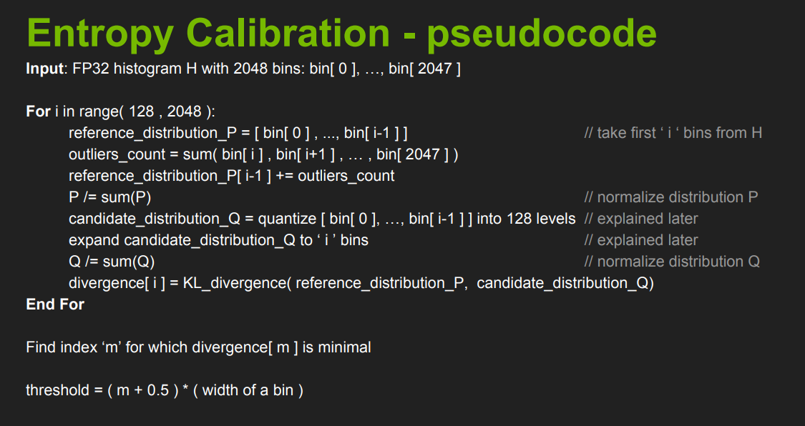
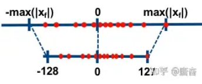
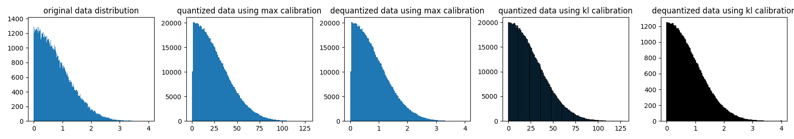
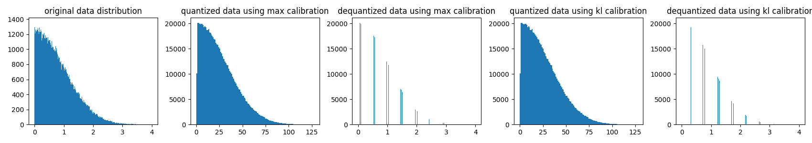

# 对基于KL散度确定量化参数方法的原理性解读

> 本文写于2024年07月14日 早上十点

## 零. 前言

在8bit模型量化中，NVIDIA提出的基于KL散度的对称8bit量化方案是主流的方案。

该方案由英伟达在2017年的一个PPT中首次提出，当时并没有开源，仅开放了部分伪代码，如下图所示。



再到后来，随着`pytorch_quantization`的开源，作为PTQ的主流方法之一，该方法源代码也随之开源。

<https://github.com/NVIDIA/TensorRT/blob/release/8.6/tools/pytorch-quantization/pytorch_quantization/calib/histogram.py>

但是网上关于该方法的原理性解读大多含糊不清，理解很浅。

本文作者经过数次思考，写下本文给出该方法原理上的解释。

## 一. 重新思考模型量化过程

模型量化是指将神经网络的浮点算法转换为定点。模型量化过程可以分为两部分：将模型从 FP32 转换为 INT8，以及使用 INT8 进行推理。

神经网络的推理由浮点运算构成。`FP32` 和 `INT8` 的值域是 [(2− $2^{23}$ )× $2^{127}$ ,( $2^{23}$  - 2)× $2^{127}$ ] 和 [−128,127] ，而取值数量大约分别为  $2^{32}$  和  $2^8$  。`FP32` 取值范围非常广，因此，将网络从 `FP32` 转换为 `INT8` 并不像数据类型转换截断那样简单。



一般，定义线性量化操作公式：

$$
X_{quant} = clip(round(\frac{X}{scale} + zero\_point), q_{min}, q_{max})
$$

反量化公式为

$$
X_{dequant} = (X_{quant} - zero\_point) * scale
$$

其中 round 表示舍入操作，clip 截断超过量化域范围，zero_point表示量化偏移零点，scale表示量化缩放系数。

从上面公式可以看出，**一个张量的量化误差来源于截断误差和舍入误差**。

根据偏移量zero_point是否为 0，可以将浮点数的线性量化分为两类-对称量化和非对称量化。

在NVIDIA提出的基于KL散度的对称8bit量化方案中，参数确定如下

$$
\begin{align*}
&q_{min} = -127 \\
&q_{max} = 127 \\
&zero\_point = 0
\end{align*}
$$

唯一需要确定就是量化缩放系数`scale`，如果采用最大区间值方式确定`scale`，则scale可以下面方式计算

$$
scale = \frac{X_{max} - X_{min}} {Q_{max} - Q_{min}}
$$

但这种方式不一定最优，比如有一个异常点值很大，引入之后导致上式分子很大，从而`scale`值很大。

缩放系数很大会导致 $X$ 中的**较大范围内**的数映射到一个整数位置上，在反量化过程中引起较大量化误差，所以计算scale时候，**上面的分子不一定非得是原来float数值的范围大小**。

由此，**NVIDIA提出通过衡量经过多个候选`scale`参数量化反量化的分布与原始分布的最小的KL散度确定采用哪个`scale`**。

**已知原始数据分布，将原始数据分布 采用 一种量化反量化方式**，**使得该方法得到的分布与原始分布KL散度最小**,**这就是KL校准的核心思想**

## 二. 原始数据分布表示

现实世界的模拟值需要经过离散化才可以在数字世界进行表示，我们常常采用累加来表示积分，采用频率直方图来表示一个概率分布。

原始数据的表示自然也采用频率直方图来表示，将原始数据划分`N`个小区间，统计落在这些个小区间上的数的个数，进而代表原始数据分布。

## 三. 如何量化一个频率直方图

再回顾数值量化过程，按照KL散度饱和量化方式量化

$$
\begin{align*}
& X_{quant} = clip(round(\frac{abs(X)}{scale}), 0, 127) \\
& X_{dequant} = X_{quant}  * scale
\end{align*}
$$

量化的过程本质上是将X上的数放到[0, 1), [1, 2), [2, 3), ... [127, 128) 共128个区间上面


```markdown
即
x / scale 属于 [0, 0.5) 放到 [0, 1)
x / scale 属于 [0.5, 1.5) 放到 [1, 2)
x / scale 属于 [1.5, 2.5) 放到 [2, 3)
...
```


> 在int8表示中，[a, a+1)仅包含一个数a

回到X的原始分布上，首先对X进行切分为若干个小区间（区间个数一般远大于量化区间个数），那么对于X中属于 小区间[a, b)的数来说，应该如何量化呢？或者说应该怎样将这些数放到128个量化区间上面呢？

首先 假设 一个合适的scale 已经存在且找到，那么 X / scale 在 [a / scale, b / scale) 区间的个数 就等于 X 在 [a, b) 上的个数，则 [a / scale, b / scale) 中的数 应该算到 哪一块量化区间中上面去呢？
这个时候需要分成两种情况讨论

1. [a / scale, b / scale) 完全属于量化分布区间[x1, x2) 区间，则毫无疑问，量化分布中[x1, x2) 区间频率数量加上[a / scale, b / scale)数量即可
2. [a / scale, b / scale) 与 [x1, x2)，[x3, x4) 都有交集，那么这个时候就需要特殊处理，考虑怎么将
   [a / scale, b / scale) 中的频数分配到[x1, x2)，[x3, x4)中去

针对第二种情况有三种方案

1. 找到原来的数据X，重新计算X / scale直接.分配（不可取，后续会讨论为什么)
2. TensorRT 强制整除方案，从原始分布区间量化到区间数量较小的量化区间， 强制要求原始分布区间中的单个区间 只对应到 量化区间中的单个区间中去（或者舍弃掉，直接不对应)，pytorch-quantification tools 中源码目前计算方式为 [a / scale, b / scale) 直接算落在量化区间的第 int(a / scale) 个中
3. ncnn 插值方案，[a / scale, b / scale)中频数为p， 假设其区间落到 [x1, x2)部分比重为0.3，落到[x3, x4)比重为0.7，则[x1, x2) 会加上 p \* 0.3的频数，[x3, x4) 会加上 p \* 0.7的频数

第一种方案需要统计并存储全部的激活值，一般来讲，多个校准输入数据会产生多个激活值。这些值占的内存是很高的，若单次校准全部激活值需要2G的存储空间，那么100次就需要200G的内存存储或者硬盘存储，这对于一般用户来讲是不可取的。

所以在数据收集环节，一般生成频率直方图之后原始X就不再保存了。

## 四. 候选待量化区间的构造

再回顾X的表示形式，X表示成一个频率分布，由若干个区间以及该区间的上的频数组成。
目标是将一个 原始数据频率分布 按照一定方式 量化反量化 使得 反量化后的频率分布 与 原始数据频率分布 KL散度较小，那么候选分布应该如何构造呢？

试着再思考下上面的 最大范围对齐校准 计算量化参数的方式，回想下还有其他计算量化参数的方法么？ 当然有，比如按照 数据中 0.99 大的当做其最大值然后按照最大值对齐校准方式计算量化参数

为什么取0.99大呢？这是因为在激活值当中可能存在一些值过大的异常点，其对于模型精度的贡献并不大，但是会影响量化精度。

那么是不是在当前区间构造中也可以基于“异常点舍去”的思路来构造候选分布呢？

**由此引出候选区间的构造方式，即从原始频率分布中从头开始截取一部分。**

## 五. 模拟异常点丢弃操作

在候选分布量化与反量化过程中不考虑假设的“异常点区间”的值，即为“丢弃”操作。

两个频率分布的KL计算，可以统一去除异常点区间后的尺度上进行计算。

原始分布将疑似“异常点”区间的频数加到新构造的候选频数分布的最后一个区间上。

这表示仅仅是怀疑，原始参考分布仍需要考虑这些点。

如果这些点很少，加到末尾也对原始分布整体影响不大，则KL散度计算结果会比较小，那么表示这些点可以去除。反之则不可以。

## 六. 反量化时区间分配的映射关系

从一个大区间到小区间量化映射操作前面已经确定了，反量化如何分配映射关系，模拟量化误差？

比如原始分布[a,b)和[c,d)区间同时映射到量化区间[x1,x2)

则反量化时， [x1, x2) 到 [a,b) 和 [c,d) 应该如何分配？

TensorRT采用的是平均分配的做法 分别给 [a,b) 和 [c,d) 分配 其 50% 的频数

ncnn采用的是计算[a,b) 和 [c,d)对于 [x1, x2)的贡献，即前面说的落在[a,b)时候的比重。

## 七. 单个候选分布的量化反量化代码解读


```python
import numpy as np
import matplotlib.pyplot as plt


np.random.seed(1)

# 模拟原始activation 数据
data = np.random.randn(1, 64, 112, 112)
data = data.reshape(-1)
data = np.abs(np.clip(data, a_min=-4, a_max=4))

figure = plt.figure(figsize=(17, 3))
plt.subplot(1, 5, 1)
# 对数据进行离散化 查看数据分布
plt.hist(data, bins=2048)
plt.title('original data distribution')


# Tensor 量化设置  对称量化 量化zero-point = 0 且 有符号量化=> 量化范围为[-127, 127] (-128会舍掉)
# 对Activation采用per-tensor 量化，即整个tensor采用一个scale值
num_bits = 8
unsigned = False
nbins = 1 << (num_bits - 1 + int(unsigned))

quant_max_int_value = nbins - 1

#  => [0 - 127]
# 采用 最大值对齐校准方式计算 量化参数
dynamic_range = np.abs(data).max()
scale = dynamic_range / quant_max_int_value
# 量化
quantized_data = np.clip(np.round(data / scale), -quant_max_int_value, quant_max_int_value)
# 反量化
dequantized_data = quantized_data * scale


# 查看量化后上述分布
plt.subplot(1, 5, 2)
plt.hist(quantized_data, bins=128)
plt.title('quantized data using max calibration')
plt.subplot(1, 5, 3)
plt.hist(dequantized_data, bins=128)
plt.title('dequantized data using max calibration')


# 直方图量化
# 模拟对整个分布的量化过程
# 直接针对直方图进行量化
ori_distribution, bin_edges = np.histogram(data, bins=2048, range=(0, dynamic_range))


# 已知原始数据分布，需要将原始数据分布 采用 一种量化反量化 方式 
# 使得该方法得到的分布与原始分布KL散度最小
# 这就是KL校准的核心思想


# 选择候选区间，表示候选区间对应原始分布中的截取区间个数
candidate_i = 2048
# 候选区间在量化区间上的坐标划分
# 候选区间中candidate_i 个的子区间应该与  128个量化子区间如何对应
# 比如 如何 [a, b) 映射到 [0, 1) ？ 答：满足int(a / scale) == 0
# 生成 [0, x1), [x1, x2), .... [x_{nbins-1}, x_{nbins}) 这些区间
# 共 nbins + 1 边缘点，表示nbins个小区间。
# 即将 [0, candidate_i] nbins等分
space = np.linspace(0, candidate_i, num=nbins + 1)
# 假设 candidate_i / scale_d = nbins
# 定义原始分布第i（i从0开始）个子区间[a, b)，单个子区间长度为d，则 [a, b) 
# 对应到 量化区间的第 int(i / scale_d) 里面，而i = a / d
# 即[a / scale, b / scale) 对应到量化区间的 第 int(a / d / scale_d) 个
# 也就是 [int(a / d / scale_d), int(a / d / scale_d) + 1)区间上
# 定义 max_i 为 candidate_i 对应的区间端点值，也就是 max_i = candidate_i * d
# 量化参数 scale = max_i / nbins = candidate_i * d / nbins = scale_d * d
# 则[a / scale, b / scale) 强制归属于 量化区间 [int(a / scale), int(a / scale) + 1)上

# range(candidate_i) 表示每个区间的起点的索引（只考虑起始点值）
# 下面这句话表示根据原始区间的起始index 查看其落在量化区间的哪一块上
# 减一用于计算最终索引（计算机世界 索引从0开始） 
digitized_space = np.digitize(range(candidate_i), space) - 1


# digitized_space是一个length为candidate_i的list index表示candidate_i中的区间索引
# digitized_space[index] 表示 ori_distribution[index] 这个区间应该映射到 量化区间中的哪一个索引
# 特殊处理，去除掉为原始分布中0的空档，不再参与计算。
digitized_space[ori_distribution[:candidate_i] == 0] = -1

new_density_counts = np.zeros(nbins, dtype=np.float64)
# 映射到量化操作
for idx, digitized in enumerate(digitized_space):
    if digitized != -1:
        new_density_counts[digitized] += ori_distribution[idx]


plt.subplot(1, 5, 4)
x_draw = np.linspace(0, nbins, num=nbins + 1)
plt.bar(x_draw[:-1], new_density_counts, width=np.diff(x_draw), edgecolor="black", align="edge")
plt.title('quantized data using kl calibration')


# 模拟 反量化过程 => x * scale之后的值应该如何分配
# digitized_space i=>val i存的是原始分布索引值 val存的是量化区间的索引值
# 原始分布索引
from collections import Counter
# 对于 digitized_space 进行统计，统计一个val 有多少个i
# 方便反量化操作
counter = Counter(digitized_space)
for key, val in counter.items():
    if key != -1:
        # 记录给每个原始区间分配多少频数
        new_density_counts[key] = new_density_counts[key] / val


# digitized_space i=>val i存的是原始分布索引值 val存的是量化区间的索引值
# 模拟 反量化过程
new_density = np.zeros(candidate_i, dtype=np.float64)
for idx, digitized in enumerate(digitized_space):
    if digitized != -1:
        new_density[idx] = new_density_counts[digitized]


plt.subplot(1, 5, 5)
x_draw = np.linspace(0, 1, num=candidate_i + 1)

plt.bar(x_draw[:-1] * dynamic_range, new_density, width=np.diff(x_draw * dynamic_range), edgecolor="black", align="edge")
plt.title('dequantized data using kl calibration')


plt.tight_layout()
plt.savefig('show.png')
```


代码中的注释应该很清晰了，下面给出输出图像



由上图可知，频率直方图的量化与反量化具有模拟原始数值维度量化与反量化的功效。

## 八. 多个候选分布确定最小KL代码解读


```python
import numpy as np
import matplotlib.pyplot as plt


def entropy(pk, qk, axis=0):
    """Calculate the entropy of a distribution for given probability values.


    compute the Kullback-Leibler divergence
    ``S = sum(pk * log(pk / qk), axis=axis)``.

    This routine will normalize `pk` and `qk` if they don't sum to 1.

    Parameters
    ----------
    pk : sequence
        Defines the (discrete) distribution. ``pk[i]`` is the (possibly
        unnormalized) probability of event ``i``.
    qk : sequence,
        Sequence against which the relative entropy is computed. Should be in
        the same format as `pk`.
    axis: int, optional
        The axis along which the entropy is calculated. Default is 0.

    Returns
    -------
    S : float
        The calculated entropy.


    """

    pk = np.asarray(pk, dtype=np.float64)
    pk = 1.0* pk / np.sum(pk, axis=axis, keepdims=True)

    qk = np.asarray(qk, dtype=np.float64)
    pk, qk = np.broadcast_arrays(pk, qk)
    eps = 1e-6
    qk += eps
    qk = 1.0* qk / np.sum(qk, axis=axis, keepdims=True)
    vec = pk * np.log(pk / qk)
    # 参考 https://docs.scipy.org/doc/scipy/reference/generated/scipy.special.rel_entr.html
    vec[np.logical_and(pk == 0,qk >= 0)] = 0
    vec[np.logical_or(pk < 0, qk < 0)] = np.nan
    S = np.sum(vec, axis=axis)
    return S


np.random.seed(1)

# 模拟原始activation 数据
data = np.random.randn(1, 64, 112, 112)
data = data.reshape(-1)
data = np.abs(np.clip(data, a_min=-4, a_max=4))

figure = plt.figure(figsize=(17, 3))
plt.subplot(1, 5, 1)
# 对数据进行离散化 查看数据分布
plt.hist(data, bins=2048)
plt.title('original data distribution')


# Tensor 量化设置  对称量化 量化zero-point = 0 且 有符号量化=> 量化范围为[-127, 127] (-128会舍掉)
# 对Activation采用per-tensor 量化，即整个tensor采用一个scale值
num_bits = 8
unsigned = False
nbins = 1 << (num_bits - 1 + int(unsigned))

quant_max_int_value = nbins - 1

# float => [0 - 127]
# 采用 最大值对齐校准方式计算 量化参数
dynamic_range = np.abs(data).max()
scale = dynamic_range / quant_max_int_value
# 量化
quantized_data = np.clip(np.round(data / scale), -quant_max_int_value, quant_max_int_value)
# 反量化
dequantized_data = quantized_data * scale


# 查看量化后上述分布
plt.subplot(1, 5, 2)
plt.hist(quantized_data, bins=128)
plt.title('quantized data using max calibration')
plt.subplot(1, 5, 3)
plt.hist(dequantized_data, bins=2048)
plt.title('dequantized data using max calibration')


# 直方图量化
# 模拟对整个分布的量化过程
# 直接针对直方图进行量化
ori_distribution, bin_edges = np.histogram(data, bins=2048, range=(0, dynamic_range))

start_i = 128
divergences = []

for i in range(start_i, 2048+1, 1):

    candidate_i = i

    space = np.linspace(0, candidate_i, num=nbins + 1)

    digitized_space = np.digitize(range(candidate_i), space) - 1


    digitized_space[ori_distribution[:candidate_i] == 0] = -1

    new_density_counts = np.zeros(nbins, dtype=np.float64)
    # 映射到量化操作
    for idx, digitized in enumerate(digitized_space):
        if digitized != -1:
            new_density_counts[digitized] += ori_distribution[idx]


    from collections import Counter
    # 对于 digitized_space 进行统计，统计一个val 有多少个i
    # 方便反量化操作
    counter = Counter(digitized_space)
    for key, val in counter.items():
        if key != -1:
            # 记录给每个原始区间分配多少频数
            new_density_counts[key] = new_density_counts[key] / val


    # digitized_space i=>val i存的是原始分布索引值 val存的是量化区间的索引值
    # 模拟 反量化过程
    new_density = np.zeros(candidate_i, dtype=np.float64)
    for idx, digitized in enumerate(digitized_space):
        if digitized != -1:
            new_density[idx] = new_density_counts[digitized]

    reference_density = np.array(ori_distribution[:candidate_i].copy())
    reference_density[-1] += np.sum(ori_distribution[candidate_i:])

    ent = entropy(reference_density, new_density)
    divergences.append(ent)


# 求出排在后面的最小值，（交叉熵同等小的情况下，候选分布区间越多包括的点也就越多，量化精度也就越高）
last_argmin = len(divergences) - 1 - np.argmin(divergences[::-1])
calib_amax = bin_edges[last_argmin + start_i]

scale = calib_amax / quant_max_int_value
# 量化
quantized_data = np.clip(np.round(data / scale), -quant_max_int_value, quant_max_int_value)
# 反量化
dequantized_data = quantized_data * scale

plt.subplot(1, 5, 4)
plt.hist(quantized_data, bins=128)
plt.title('quantized data using kl calibration')
plt.subplot(1, 5, 5)
plt.hist(dequantized_data, bins=2048)
plt.title('dequantized data using kl calibration')

plt.tight_layout()
plt.savefig('show.png')
```




由上图可以看出基于KL散度的方法会丢弃掉后面数量占比很少的区间，采用一个较小的scale表示，减小量化误差。

## 九. 对于多个activation值的频率直方图的迭代构造方案

在校准环节，测试数据会分成多份依次输出到模型当中，模型的每一层进而产生activation值。那么在每次迭代后，频率直方图应该如何**累计更新**呢？

参考pytorch_quantization实现如下：


```python
            if self._calib_bin_edges is None and self._calib_hist is None:
                # first time it uses num_bins to compute histogram.
                self._calib_hist, self._calib_bin_edges = np.histogram(x_np, bins=self._num_bins)
            else:
                temp_amax = np.max(x_np)
                if temp_amax > self._calib_bin_edges[-1]:
                    # increase the number of bins
                    width = self._calib_bin_edges[1] - self._calib_bin_edges[0]
                    # NOTE: np.arange may create an extra bin after the one containing temp_amax
                    new_bin_edges = np.arange(self._calib_bin_edges[-1] + width, temp_amax + width, width)
                    self._calib_bin_edges = np.hstack((self._calib_bin_edges, new_bin_edges))
                hist, self._calib_bin_edges = np.histogram(x_np, bins=self._calib_bin_edges)
                hist[:len(self._calib_hist)] += self._calib_hist
                self._calib_hist = hist
```


第一次时直接构造频率直方图，后续运行时步骤如下

1. 计算当前activation最大值
2. 如果最大值超过了频率直方图区间的表示范围，则超过部分重新区间按照原来的小区间宽度向右扩充
3. 按照新构造的区间统计新的频率
4. 将原来统计的频率加到新的频率直方图上面去
5. 丢弃原频率直方图，采用新的

## 十. 总结

去年就在思考这个问题，直到前一段时间才理解整个流程为什么这样做。希望能给读者一点启发，我们在用某项技术的时候，不能停留在表面，know why 比 know how更高级。

## 十一. 参考链接

* <https://github.com/NVIDIA/TensorRT/blob/release/8.6/tools/pytorch-quantization/pytorch_quantization/calib/histogram.py>
* https://zhuanlan.zhihu.com/p/72375164

