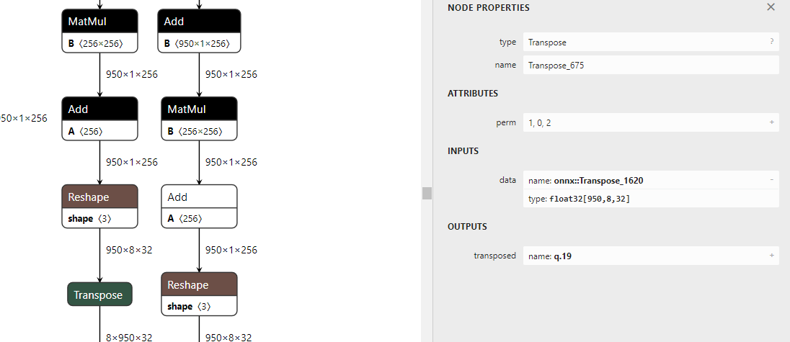
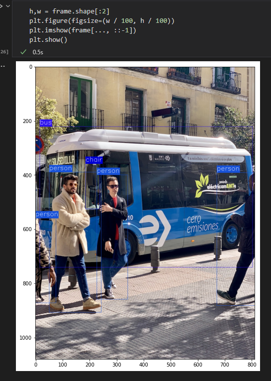

# pytorch导出onnx的原则-以SwinTransformer和DETR在trt8.0.3.4部署为例

## 一、前言

pytorch导出onnx是通过追踪forward函数构建的计算图来实现的，然而这种构建的方式往往会由于模型的设计者没有考虑导出部署时的便捷性从而生成的onnx中算子比较冗余，比如`x[x> 0.5] = 0`这种inplace操作就会生成onnx的`scatter`算子，这个算子是不被tensorrt支持的。尽管可以采用plugin方式来实现，但其并不是一个较为有好的算法。`x[x > 0.5] = 0`可以转换为`y = x * (x > 0.5).to(torch.float32)`这种形式来避免inplace操作。此外取shape操作一般用于动态shape，这种操作在部署框架中也是冗余的应该去掉，主要原因是大部分模型除了batch size可变以外，其余维度输入都是固定的，从而对于一般的取shape操作都是可以直接由常量计算得到，从而计算得到的shape实际上可以固化为一个常量。下面根据trtpy作者提出的建议，给出导出onnx时应遵守的原则。

## 二、原则

1. 对于任何用到shape、size返回值的参数时，例如：`tensor.view(tensor.size(0), -1)`，`B,C,H,W = x.shape` 这类操作，避免直接使用tensor.size的返回值，而是加上int转换，`tensor.view(int(tensor.size(0)), -1)`, `B,C,H,W = map(int, x.shape)`，断开跟踪。
2. 对于nn.Upsample或nn.functional.interpolate函数，一般使用scale_factor指定倍率，而不是使用size参数指定大小。如果源码中就是插值为固定大小，则该条忽略。
3. 对于reshape、view操作时，-1的指定请放到batch维度。其他维度计算出来即可。batch维度禁止指定为大于-1的明确数字。如果是一维，那么直接指定为-1就好。
4. torch.onnx.export指定dynamic_axes参数，并且只指定batch维度，禁止其他动态
5. 使用opset_version=11，不要低于11
6. 避免使用inplace操作，例如`y[…, 0:2] = y[…, 0:2] * 2 - 0.5`，可以采用如下代码代替 `tmp = y[…, 0:2] * 2 - 0.5; y = torch.cat((y[..., 2:], tmp), dim = -1)`
7. 尽量少的出现5个维度，例如ShuffleNet Module，可以考虑合并wh避免出现5维
8. 尽量把让后处理部分在onnx模型中实现，降低后处理复杂度。比如在目标检测网络中最终输出设置为xywh或者xyxy，而不是一个中间结果。

## 三、常见问题方法

1. onnx的修改

使用python中`onnx`库或者TensorRT携带的更为方便的`onnx_graphsurgeon`


```shell
# 安装onnx
pip install onnx
# 安装onnx_graphsurgeon https://github.com/NVIDIA/TensorRT/tree/master/tools/onnx-graphsurgeon
python3 -m pip install onnx_graphsurgeon --index-url https://pypi.ngc.nvidia.com
```


具体修改需要去官网查看相关案例，这里不再赘述。此外，onnx的本质时protobuf序列化后的二进制文件，所以其结构遵循`.proto`定义的文件，如果是使用`onnx`库修改时需要牢记这一点。

1. onnx的简化

`onnxsim`可以简化onnx graph中一些常量的折叠运算，具体见官方github https://github.com/daquexian/onnx-simplifier 。
即使在使用了以上原则以后，还是无法避免生成一些冗余的常量运算。比如`d = a + b - c`

这里a,b,c都是常量且只有在计算d的时候用到，那么onnx计算图中只需要表示d即可，但是torch的api还做不到这一点。

1. 动态shape的问题

TensorRT是支持各个维度的动态shape的，不局限于动态的batchsize，其允许用户设定多组维度供TensorRT结构优化器来选择，但是在选择最优结构的时候需要预先指定一个固定维度。此外动态shape对于一般网络而言，仅仅是batch size可变，其余模型输入的长和宽一般是固定的，因此一般情况下只考虑动态batch size的问题，也就是**原则3**。

1. 获取onnx中间输入

onnxruntime是可以获得模型中间层结果的，具体方式还请读者搜索一下。本文给出一种更为优雅的方式，即采用TensorRT附带的`polygraphy`，具体网址
https://github.com/NVIDIA/TensorRT/tree/master/tools/Polygraphy
下文在DETR案例中将给出如何采用`polygraphy`定位哪个中间层出现不一致的情况，也就是`onnxruntime`结果与`tensorrt`结果不一致。

## 四、案例1-SwinTransformer在TensorRT上的部署

### 4.1 加载预训练权重

本文采用基于pytorch的`timm`库来加载分类模型和预训练权重，采用`pip install timm`安装，作者在做本次实验时`timm`版本为`0.5.4`。
采用如下代码记载模型


```python
import timm
import torch
import os
swin_transformer_model = timm.create_model('swin_base_patch4_window7_224', pretrained=True)
```


如果下载速度较慢，请打开log中的下载网址采用浏览器下载好以后，再放到给出的`cache`文件夹中。
以上代码即完成了模型的预加载。

### 4.2 验证分类模型精度


```python
valdir = 'YourPath/ImageNet/val'
normalize = transforms.Normalize(mean=[0.485, 0.456, 0.406],std=[0.229, 0.224, 0.225])
val_loader = torch.utils.data.DataLoader(
        datasets.ImageFolder(valdir, transforms.Compose([
            transforms.Resize(256, 3),
            transforms.CenterCrop(224),
            transforms.ToTensor(),
            normalize,
        ])),batch_size=128, shuffle=False, num_workers=12, pin_memory=True)
import tqdm
def test(model, device, test_loader):
    old_training_state = model.training
    model.eval()
    test_loss = 0
    correct = 0
    lossLayer = torch.nn.CrossEntropyLoss(reduction='sum')
    for data, target in tqdm.tqdm(test_loader):
        data, target = data.to(device), target.to(device)
        with torch.no_grad():
            output = model(data)
        test_loss += lossLayer(output, target).item()
        pred = output.argmax(dim=1, keepdim=True)
        correct += pred.eq(target.view_as(pred)).sum().item()
    test_loss /= len(test_loader.dataset)
    model.train(old_training_state)
    print('
Test set: Average loss: {:.4f}, Accuracy: {:.3f}%
'.format(
        test_loss, 100. * correct / len(test_loader.dataset)

    ))
device = torch.device('cuda')
swin_transformer_model.to(device)
# Swin-B 85.2 22kto1k
test(swin_transformer_model, device, val_loader)
```


经过测试，与原论文中给出精度仅存在细微差异，差了0.1个点，主要是输入图像插值方式带来的，这不是本文重点故不再修改。

### 4.3 初步导出


```python
dummpy_input = torch.rand(1,3,224,224)
swin_transformer_model.to('cpu')
if not os.path.exists('swin-b-22kto1l.onnx'):
    torch.onnx.export(swin_transformer_model, (dummpy_input, ), 'swin-b-22kto1l.onnx',
                    input_names=['images',],
                    output_names=['output'],
                    dynamic_axes={
                        'images': {
                            0:'batch',
                        },
                        'output':{
                            0:'batch',
                        }
                    },
                    opset_version=11,
                    verbose = True)
```


由于设置了`verbose = True`，以上代码会打印出很长的log。

### 4.4 修改模型代码

按照关键词`onnx::Shape`来搜索shape操作的代码位置，找到以后按照原则1，3修改代码。
在`${PYENV}/lib/python3.9/site-packages/timm/models/layers/patch_embed.py`，修改`PatchEmbed`的`forward`函数，主要是把`flatten`转换为`view(-1, ...)`。、
**${PYENV}表示python环境所在目录**
原版为（下文不再展示原版）


```python
def forward(self, x):
        B, C, H, W = map(int, x.shape)
        _assert(H == self.img_size[0], f"Input image height ({H}) doesn't match model ({self.img_size[0]}).")
        _assert(W == self.img_size[1], f"Input image width ({W}) doesn't match model ({self.img_size[1]}).")
        x = self.proj(x)
        if self.flatten:
            x = x.flatten(2).transpose(1, 2)  # BCHW -> BNC
        x = self.norm(x)
        return x
```


修改为


```python
def forward(self, x):
        B, C, H, W = map(int,x.shape)
        _assert(H == self.img_size[0], f"Input image height ({H}) doesn't match model ({self.img_size[0]}).")
        _assert(W == self.img_size[1], f"Input image width ({W}) doesn't match model ({self.img_size[1]}).")
        x = self.proj(x)
        if self.flatten:
            _, newC, newH, newW = map(int, x.shape)
            x = x.view(-1, newC, newH * newW).transpose(1, 2)  # BCHW -> BNC
        x = self.norm(x)
        return x
```


剩下shape操作基本都在`${PYENV}/lib/python3.9/site-packages/timm/models/models/swin_transformer.py`，先以关键词`.shape`在该文件中搜索，修改完毕后再看剩余
`window_partition`和`window_reverse`修改如下


```python
def window_partition(x, window_size: int):
    """
    Args:
        x: (B, H, W, C)
        window_size (int): window size
    Returns:
        windows: (num_windows*B, window_size, window_size, C)
    """
    B, H, W, C = map(int, x.shape)
    x = x.view(-1, H // window_size, window_size, W // window_size, window_size, C)
    windows = x.permute(0, 1, 3, 2, 4, 5).contiguous().view(-1, window_size, window_size, C)
    return windows
@register_notrace_function  # reason: int argument is a Proxy
def window_reverse(windows, window_size: int, H: int, W: int):
    """
    Args:
        windows: (num_windows*B, window_size, window_size, C)
        window_size (int): Window size
        H (int): Height of image
        W (int): Width of image
    Returns:
        x: (B, H, W, C)
    """
    B = int(windows.shape[0] / (H * W / window_size / window_size))
    C = int(windows.numel() // B // window_size // window_size // (H // window_size * W // window_size))
    x = windows.view(-1, H // window_size, W // window_size, window_size, window_size, C)
    x = x.permute(0, 1, 3, 2, 4, 5).contiguous().view(B, H, W, -1)
    return x
```


`WindowAttention`类的`forward`函数修改为


```python
def forward(self, x, mask: Optional[torch.Tensor] = None):
        """
        Args:
            x: input features with shape of (num_windows*B, N, C)
            mask: (0/-inf) mask with shape of (num_windows, Wh*Ww, Wh*Ww) or None
        """
        B_, N, C = map(int,x.shape)
        qkv = self.qkv(x).reshape(B_, N, 3, self.num_heads, C // self.num_heads).permute(2, 0, 3, 1, 4)
        q, k, v = qkv.unbind(0)  # make torchscript happy (cannot use tensor as tuple)
        q = q * self.scale
        attn = (q @ k.transpose(-2, -1))
        relative_position_bias = self.relative_position_bias_table[self.relative_position_index.view(-1)].view(
            self.window_size[0] * self.window_size[1], self.window_size[0] * self.window_size[1], -1)  # Wh*Ww,Wh*Ww,nH
        relative_position_bias = relative_position_bias.permute(2, 0, 1).contiguous()  # nH, Wh*Ww, Wh*Ww
        attn = attn + relative_position_bias.unsqueeze(0)
        if mask is not None:
            nW = int(mask.shape[0])
            attn = attn.view(-1, nW, self.num_heads, N, N) + mask.unsqueeze(1).unsqueeze(0)
            attn = attn.view(-1, self.num_heads, N, N)
            attn = self.softmax(attn)
        else:
            attn = self.softmax(attn)
        attn = self.attn_drop(attn)
        x = (attn @ v).transpose(1, 2)
        last_dim = int(x.numel() // B_ // N)
        x = x.reshape(-1, N, last_dim)
        x = self.proj(x)
        x = self.proj_drop(x)
        return x
```


`SwinTransformerBlock`的`forward`函数修改如下:


```python
def forward(self, x):
        H, W = self.input_resolution
        B, L, C = map(int, x.shape)
        _assert(L == H * W, "input feature has wrong size")
        shortcut = x
        x = self.norm1(x)
        x = x.view(-1, H, W, C)
        # cyclic shift
        if self.shift_size > 0:
            shifted_x = torch.roll(x, shifts=(-self.shift_size, -self.shift_size), dims=(1, 2))
        else:
            shifted_x = x
        # partition windows
        x_windows = window_partition(shifted_x, self.window_size)  # nW*B, window_size, window_size, C
        x_windows = x_windows.view(-1, self.window_size * self.window_size, C)  # nW*B, window_size*window_size, C
        # W-MSA/SW-MSA
        attn_windows = self.attn(x_windows, mask=self.attn_mask)  # nW*B, window_size*window_size, C
        # merge windows
        attn_windows = attn_windows.view(-1, self.window_size, self.window_size, C)
        shifted_x = window_reverse(attn_windows, self.window_size, H, W)  # B H' W' C
        # reverse cyclic shift
        if self.shift_size > 0:
            x = torch.roll(shifted_x, shifts=(self.shift_size, self.shift_size), dims=(1, 2))
        else:
            x = shifted_x
        x = x.view(-1, H * W, C)
        # FFN
        x = shortcut + self.drop_path(x)
        x = x + self.drop_path(self.mlp(self.norm2(x)))
        return x
```


`PatchMerging`的`forward`函数修改如下：


```python
def forward(self, x):
        """
        x: B, H*W, C
        """
        H, W = self.input_resolution
        B, L, C = map(int, x.shape)
        _assert(L == H * W, "input feature has wrong size")
        _assert(H % 2 == 0 and W % 2 == 0, f"x size ({H}*{W}) are not even.")
        x = x.view(B, H, W, C)
        x0 = x[:, 0::2, 0::2, :]  # B H/2 W/2 C
        x1 = x[:, 1::2, 0::2, :]  # B H/2 W/2 C
        x2 = x[:, 0::2, 1::2, :]  # B H/2 W/2 C
        x3 = x[:, 1::2, 1::2, :]  # B H/2 W/2 C
        x = torch.cat([x0, x1, x2, x3], -1)  # B H/2 W/2 4*C
        x = x.view(-1, H // 2 * W // 2, 4 * C)  # B H/2*W/2 4*C
        x = self.norm(x)
        x = self.reduction(x)
        return x
```


### 4.5 重新生成onnx并检查

1. 如果是`.py`就重新执行`python xxx.py`，如果是`jupyter notebook`，则需要重启内核。
2. `pip install netron`安装`netron`
3. 运行`netron swin-b-22kto1l.onnx`查看生成的onnx，查看模型整体简洁性（主观）。

经过查看onnx结构，发现修改的onnx结构较为简洁，且支持batch size的动态shape。

### 4.6 在TensorRT上验证

这里使用tensorRT的封装版本`trtpy`，主要解决版本隔离问题和安装繁琐问题。
安装和使用详情请查看https://zhuanlan.zhihu.com/p/462980738


```python
import trtpy
import numpy as np
def replace_suffix(path_name, new_extname = '.trtmodel'):
    return os.path.splitext(path_name)[0] + new_extname
onnx_filepath = 'swin-b-22kto1l.onnx'
engine_file = replace_suffix(onnx_filepath)
if not os.path.exists(engine_file):
    trtpy.compile_onnx_to_file(128, onnx_filepath, engine_file, max_workspace_size=1 << 30) # 1 << 30 表示 1GiB
engine = trtpy.load(engine_file)
engine.print()
def test_trt(engine, model, device, test_loader):
    old_training_state = model.training
    model.eval()
    test_loss = 0
    correct = 0
    delta_max = 0
    lossLayer = torch.nn.CrossEntropyLoss(reduction='sum')
    for data, target in tqdm.tqdm(test_loader):
        data, target = data.to(device), target.to(device)
        with torch.no_grad():
            output = model(data)
        output_engine = engine(data)
        delta_max = max(delta_max, torch.abs(output_engine - output).max().item())

        test_loss += lossLayer(output, target).item()
        pred = output.argmax(dim=1, keepdim=True)
        correct += pred.eq(target.view_as(pred)).sum().item()
    print('delta_max:', delta_max)
    test_loss /= len(test_loader.dataset)
    model.train(old_training_state)
    print('
Test set: Average loss: {:.4f}, Accuracy: {:.3f}%
'.format(
        test_loss, 100. * correct / len(test_loader.dataset)

    ))
swin_transformer_model.to(device)
test_trt(engine, swin_transformer_model, device, val_loader)
```


最后输出


```
delta_max: 0.0006237030029296875
Test set: Average loss: 0.6448, Accuracy: 85.126%
```


以上实验证明了新导出的onnx支持动态batch size，并且TensorRT与torch生成结果误差很小， abs diff 可以控制在0.0006以内。

### 4.7 小结

通过对SwinTransformer模型代码的修改，使得onnx导出更为简洁。因为该模型较为简单，在导出时并没有使用`onnxsim`简化模型，下一章对`DETR`的导出将会看到所有工具的综合运用进行Debug。
此外，Transformer在CV领域已经可以很方便的落地了，**并且是支持动态batchsize的**。个人的直观感受时较为部署时采用SwinTransformer占用显存比较大，不过`85.2%`的精度也算性价比较高的模型。

## 五、案例2-DETR在TensorRT上的部署

### 5.1 下载预训练模型并验证模型效果

这里采用集成的`mmdetection`库中的DETR。github地址为https://github.com/open-mmlab/mmdetection
为了方便修改代码，`mmdetection`需要采用clone仓库，`python setup.py develop`方式安装，即


```shell
git clone https://github.com/open-mmlab/mmdetection.git
cd mmdetection
pip install -r requirements/build.txt
pip install -v -e .  # or "python setup.py develop"
```


1. 在此之前读者还请阅读 [MMDetection安装指南](https://github.com/open-mmlab/mmdetection/blob/master/docs/en/get_started.md) 了解全部安装步骤。
2. 从 https://github.com/open-mmlab/mmdetection/tree/master/configs/detr 下载预训练权重并记录path备用。
3. 安装onnxsim，polygraphy，onnxruntime库

修改`mmdetection/tools/deployment/pytorch2onnx.py`，让其支持再`skip-postprocess`条件下支持`onnxsim`
在判断语句那里加上如下代码


```python
    if skip_postprocess:
        warnings.warn('Not all models support export onnx without post '
                      'process, especially two stage detectors!')
        model.forward = model.forward_dummy
        torch.onnx.export(
            model,
            one_img,
            output_file,
            input_names=['input'],
            export_params=True,
            keep_initializers_as_inputs=True,
            do_constant_folding=True,
            verbose=show,
            opset_version=opset_version)
        print(f'Successfully exported ONNX model without '
              f'post process: {output_file}')
        # 添加的代码 开始
        # get the custom op path
        ort_custom_op_path = ''
        try:
            from mmcv.ops import get_onnxruntime_op_path
            ort_custom_op_path = get_onnxruntime_op_path()
        except (ImportError, ModuleNotFoundError):
            warnings.warn('If input model has custom op from mmcv, \\
                you may have to build mmcv with ONNXRuntime from source.')
        ort_custom_op_path = ort_custom_op_path if len(ort_custom_op_path) > 0 else None
        if do_simplify:
            import onnxsim
            from mmdet import digit_version
            min_required_version = '0.3.0'
            assert digit_version(onnxsim.__version__) >= digit_version(
                min_required_version
            ), f'Requires to install onnx-simplify>={min_required_version}'
            input_dic = {'input': img_list[0].detach().cpu().numpy()}
            model_opt, check_ok = onnxsim.simplify(
                output_file,
                input_data=input_dic,
                custom_lib=ort_custom_op_path,
                dynamic_input_shape=dynamic_export)
            if check_ok:
                onnx.save(model_opt, output_file)
                print(f'Successfully simplified ONNX model: {output_file}')
            else:
                warnings.warn('Failed to simplify ONNX model.')
            print(f'Successfully exported ONNX model: {output_file}')
            # 添加的代码结束
        return
```


新建一个bash脚本`export_detr_onnx.sh`


```shell
#!/bin/bash
python tools/deployment/pytorch2onnx.py configs/detr/detr_r50_8x2_150e_coco.py detr_r50_8x2_150e_coco_20201130_194835-2c4b8974.pth --skip-postprocess --show --simplify
```


执行如下指令：


```shell
bash export_detr_onnx.sh &> export_log.txt
```


通过以上步骤即可得到一个精简版的onnx，此处并没有修改任何模型代码，因为修改模型代码的目的是为了处理inplace操作和实现动态batchsize，在mmdetection中DETR，并没有inplace操作，且动态batchsize操作实现起来很难，下面会给出解释。
使用netron可视化onnx后发现很多冗余算子，这里需要使用`onnx_graphsurgeon`清理一下。


```python
import onnx_graphsurgeon as gs
import onnx
import numpy as np
def cleanOnnx():
    onnx_save_path = "tmp.onnx"
    graph = gs.import_onnx(onnx.load(onnx_save_path))
    graph.cleanup()
    onnx_save_path = "tmp_new.onnx"
    onnx.save(gs.export_onnx(graph), onnx_save_path)
cleanOnnx()
```


### 5.2 动态batchsize实现很难


如上图为生成的onnx，实际上这个onnx已经可以onnxruntime中运行了。但是batch size设置为动态的却很难，主要原因是后续的操作不能确定哪个维度设置为-1。
Reshape操作中如果是动态维度，给定的shape中要有一个值为-1，但是如上图所示，Reshape+Tranpose操作以后，打乱了batch size所在的维度，后续的reshape操作肯定可以修改，但是哪个维度为-1不太好设定，这个留到后续再来探索。

### 5.3 加上后续位置信息解码过程

在前面小节导出的onnx中由于`skip-postprocess`的存在，并没有对中间输出进行解码，这里通过修改检测头的`forward`函数加上它，找到`mmdetection/mmdet/models/dense_heads/detr_head.py`中`DETRHead`类的`forward`方法，
修改如下：


```python
    def forward(self, feats, img_metas):
        """Forward function.
        Args:
            feats (tuple[Tensor]): Features from the upstream network, each is
                a 4D-tensor.
            img_metas (list[dict]): List of image information.
        Returns:
            tuple[list[Tensor], list[Tensor]]: Outputs for all scale levels.
                - all_cls_scores_list (list[Tensor]): Classification scores \\

                    for each scale level. Each is a 4D-tensor with shape \\
                    [nb_dec, bs, num_query, cls_out_channels]. Note \\
                    `cls_out_channels` should includes background.
                - all_bbox_preds_list (list[Tensor]): Sigmoid regression \\

                    outputs for each scale level. Each is a 4D-tensor with \\
                    normalized coordinate format (cx, cy, w, h) and shape \\
                    [nb_dec, bs, num_query, 4].
        """
        num_levels = len(feats)
        img_metas_list = [img_metas for _ in range(num_levels)]
        # return multi_apply(self.forward_single, feats, img_metas_list)
        all_cls_scores_list, all_bbox_preds_list = multi_apply(self.forward_single, feats, img_metas_list)
        image_metas_for_onnx = img_metas_list[0:1][0]
        image_metas_for_onnx[0]['img_shape_for_onnx'] = torch.as_tensor(img_metas[0]['img_shape'])[:2]
        return self.onnx_export(all_cls_scores_list, all_bbox_preds_list, image_metas_for_onnx)
```


`Line24-Line28`是新增的，用于解码中间信息，直接输出坐标信息和分类信息。

### 5.4 使用onnxruntime验证

1. 测试图片如下：


读者可以右键存为`car.jpg`

1. 分析模型config文件，得到数据预处理步骤
2. 给出onnxruntime验证代码


```python
import onnxruntime as rt
import cv2
def get_onnx_runner(onnx_filepath):
    sess = rt.InferenceSession(onnx_filepath)
    input_names = [item.name for item in sess.get_inputs()]
    label_names = [item.name for item in sess.get_outputs()]
    def runner(input_tensors):
        nonlocal label_names
        nonlocal input_names
        pred_onnx = sess.run(label_names, dict(zip(input_names, input_tensors)))
        return dict(zip(label_names,pred_onnx))
    return runner
def _normalize(img, mean, std):
    img = img.astype(np.float32) / 255
    mean = np.array(mean, dtype=np.float32).reshape(1, 1, 3) / 255
    std = np.array(std, dtype=np.float32).reshape(1, 1, 3) / 255
    img = (img - mean) / std

    return img
def preprocess(img):
    img = cv2.resize(img, dsize=(1216,800))
    mean,std = [[103.53, 116.28, 123.675], [57.375, 57.12, 58.395]]
    img = _normalize(img, mean, std)
    img = np.transpose(img, axes=[2, 0, 1])
    img = np.expand_dims(img, 0)
    return img
runner = get_onnx_runner("./tmp_new.onnx")
ori_image = cv2.imread('../car.jpg')
img = cv2.cvtColor(ori_image, cv2.COLOR_BGR2RGB)
img = preprocess(img)
outs = runner([img, ])
print(outs.keys())
# det_bboxes[x1,y1,x2,y2,scores], det_labels[]
det_bboxes, scores = outs['3288'][:, :, :4], outs['3288'][:, :, 4:]
det_labels = outs['3209']
det_bboxes = np.round(det_bboxes).astype(np.int32)
from torchvision.ops import nms as torch_nms
import torch
det_bboxes = det_bboxes[0]
det_labels = det_labels[0]
scores = scores[0]
scores = scores[:, 0]
def nms(ori_dets):
    tmp_arr = np.array(ori_dets, dtype=np.float32)
    dets, score = tmp_arr[:,:4], tmp_arr[:,4]
    dets_tensor = torch.as_tensor(dets)
    score_tensor = torch.as_tensor(score)
    keep_index = torch_nms(dets_tensor, score_tensor, 0.4)
    new_dets = [ori_dets[index] for index in keep_index]
    return new_dets
def decode_infer(scores, det_bboxes, det_labels, score_threshold):
    ret_dict = dict()
    max_scores = scores
    nonzero_index  = np.nonzero(max_scores > score_threshold)[0].tolist()
    if nonzero_index:
        bbox_pred = det_bboxes[nonzero_index, :]
        score_indexes = max_scores[nonzero_index]
        score_indexes = score_indexes[..., None].astype(np.float32)
        label_indexes = det_labels[nonzero_index]
        print(label_indexes)
        label_indexes = label_indexes[..., None].astype(np.float32)
        max_label_indexes = label_indexes[:, 0]
        bbox = np.concatenate([bbox_pred, score_indexes, label_indexes], axis = -1)
        for i,index in enumerate(max_label_indexes):
            ret_list = ret_dict.setdefault(index, list())
            ret_list.append(bbox[i])
    for k,v in ret_dict.items():
        ret_dict[k] = nms(v)
    return ret_dict
ret_dict = decode_infer(scores, det_bboxes, det_labels, 0.5)
labels = ("person", "bicycle", "car", "motorcycle", "airplane", "bus", "train", "truck", "boat", "traffic light",
            "fire hydrant", "stop sign", "parking meter", "bench", "bird", "cat", "dog", "horse", "sheep", "cow",
            "elephant", "bear", "zebra", "giraffe", "backpack", "umbrella", "handbag", "tie", "suitcase", "frisbee",
            "skis", "snowboard", "sports ball", "kite", "baseball bat", "baseball glove", "skateboard", "surfboard",
            "tennis racket", "bottle", "wine glass", "cup", "fork", "knife", "spoon", "bowl", "banana", "apple",
            "sandwich", "orange", "broccoli", "carrot", "hot dog", "pizza", "donut", "cake", "chair", "couch",
            "potted plant", "bed", "dining table", "toilet", "tv", "laptop", "mouse", "remote", "keyboard", "cell phone",
            "microwave", "oven", "toaster", "sink", "refrigerator", "book", "clock", "vase", "scissors", "teddy bear",
            "hair drier", "toothbrush")
color_list = (
        (216 , 82 , 24),
        (236 ,176 , 31),
        (125 , 46 ,141),
        (118 ,171 , 47),
        ( 76 ,189 ,237),
        (238 , 19 , 46),
        ( 76 , 76 , 76),
        (153 ,153 ,153),
        (255 ,  0 ,  0),
        (255 ,127 ,  0),
        (190 ,190 ,  0),
        (  0 ,255 ,  0),
        (  0 ,  0 ,255),
        (170 ,  0 ,255),
        ( 84 , 84 ,  0),
        ( 84 ,170 ,  0),
        ( 84 ,255 ,  0),
        (170 , 84 ,  0),
        (170 ,170 ,  0),
        (170 ,255 ,  0),
        (255 , 84 ,  0),
        (255 ,170 ,  0),
        (255 ,255 ,  0),
        (  0 , 84 ,127),
        (  0 ,170 ,127),
        (  0 ,255 ,127),
        ( 84 ,  0 ,127),
        ( 84 , 84 ,127),
        ( 84 ,170 ,127),
        ( 84 ,255 ,127),
        (170 ,  0 ,127),
        (170 , 84 ,127),
        (170 ,170 ,127),
        (170 ,255 ,127),
        (255 ,  0 ,127),
        (255 , 84 ,127),
        (255 ,170 ,127),
        (255 ,255 ,127),
        (  0 , 84 ,255),
        (  0 ,170 ,255),
        (  0 ,255 ,255),
        ( 84 ,  0 ,255),
        ( 84 , 84 ,255),
        ( 84 ,170 ,255),
        ( 84 ,255 ,255),
        (170 ,  0 ,255),
        (170 , 84 ,255),
        (170 ,170 ,255),
        (170 ,255 ,255),
        (255 ,  0 ,255),
        (255 , 84 ,255),
        (255 ,170 ,255),
        ( 42 ,  0 ,  0),
        ( 84 ,  0 ,  0),
        (127 ,  0 ,  0),
        (170 ,  0 ,  0),
        (212 ,  0 ,  0),
        (255 ,  0 ,  0),
        (  0 , 42 ,  0),
        (  0 , 84 ,  0),
        (  0 ,127 ,  0),
        (  0 ,170 ,  0),
        (  0 ,212 ,  0),
        (  0 ,255 ,  0),
        (  0 ,  0 , 42),
        (  0 ,  0 , 84),
        (  0 ,  0 ,127),
        (  0 ,  0 ,170),
        (  0 ,  0 ,212),
        (  0 ,  0 ,255),
        (  0 ,  0 ,  0),
        ( 36 , 36 , 36),
        ( 72 , 72 , 72),
        (109 ,109 ,109),
        (145 ,145 ,145),
        (182 ,182 ,182),
        (218 ,218 ,218),
        (  0 ,113 ,188),
        ( 80 ,182 ,188),
        (127 ,127 ,  0),
    )
frame = np.copy(ori_image)
height = img.shape[2]
width = img.shape[3]
for v in ret_dict.values():
    for left, top, right, bottom, score, label_index in v:
        label_index = int(label_index)
        new_left = int(left / width * frame.shape[1])
        new_top = int(top / height * frame.shape[0])
        new_right = int(right / width * frame.shape[1])
        new_bottom = int(bottom / height * frame.shape[0])
        cv2.rectangle(frame, (new_left, new_top), (new_right, new_bottom), color = color_list[label_index])
        # 写字
        ret, baseline = cv2.getTextSize(labels[label_index], cv2.FONT_HERSHEY_SIMPLEX, 0.8, 1)
        cv2.rectangle(frame, (new_left, new_top - ret[1] - baseline),

                    (new_left + ret[0], new_top), color_list[label_index], -1)
        cv2.putText(frame, labels[label_index], (new_left, new_top - baseline),

                cv2.FONT_HERSHEY_SIMPLEX, 0.8, (255, 255, 255), 1)
import matplotlib.pyplot as plt
h,w = frame.shape[:2]
plt.figure(figsize=(w / 50, h / 50))
plt.imshow(frame[..., ::-1])
plt.show()
```


最终效果如下图：


### 5.5 TensorRT上验证

这里本文继续采用trtpy，注意由于本文的代码时放在一个`jupyter notebook`中，所以复用了上一小节的变量。
`det_labels, det_bboxes_with_scores`这两个顺序可能会反，读者需要自行调换。


```python
import trtpy
import numpy as np
import os
def replace_suffix(path_name, new_extname = '.trtmodel'):
    return os.path.splitext(path_name)[0] + new_extname
onnx_filepath = 'tmp_new.onnx'
engine_file = replace_suffix(onnx_filepath)
trtpy.compile_onnx_to_file(1, onnx_filepath, engine_file, max_workspace_size=1 << 30)
engine = trtpy.load(engine_file)
engine.print()
data = torch.as_tensor(img).to(torch.float32).cuda()
output_engine = engine(data)
print(output_engine)
det_labels, det_bboxes_with_scores = output_engine
det_bboxes, scores = det_bboxes_with_scores[:, :, :4], det_bboxes_with_scores[:, :, 4:]
det_bboxes = det_bboxes[0].round().to(torch.int32)
det_labels = det_labels[0].round().to(torch.int32)
scores = scores[0]
scores = scores[:, 0]
ret_dict_trt = decode_infer(scores.cpu().numpy(), det_bboxes.cpu().numpy(), det_labels.cpu().numpy(), 0.5)
frame = np.copy(ori_image)
height = img.shape[2]
width = img.shape[3]
for v in ret_dict_trt.values():
    for left, top, right, bottom, score, label_index in v:
        label_index = int(label_index)
        new_left = int(left / width * frame.shape[1])
        new_top = int(top / height * frame.shape[0])
        new_right = int(right / width * frame.shape[1])
        new_bottom = int(bottom / height * frame.shape[0])
        cv2.rectangle(frame, (new_left, new_top), (new_right, new_bottom), color = color_list[label_index])
        ret, baseline = cv2.getTextSize(labels[label_index], cv2.FONT_HERSHEY_SIMPLEX, 0.8, 1)
        cv2.rectangle(frame, (new_left, new_top - ret[1] - baseline),

                    (new_left + ret[0], new_top), color_list[label_index], -1)
        cv2.putText(frame, labels[label_index], (new_left, new_top - baseline),

                cv2.FONT_HERSHEY_SIMPLEX, 0.8, (255, 255, 255), 1)
h,w = frame.shape[:2]
plt.figure(figsize=(w / 50, h / 50))
plt.imshow(frame[..., ::-1])
plt.show()
```


`print(output_engine)`输出全0，会让人很头疼，怀疑是不是哪一步搞错了。这个时候就需要输出每一层的中间结果打印了。

### 5.6 调试模型中间结果

由于onnxruntime输出结果时正确的，那么我们有理由相信其中间结果也是正确的。进而可以转换为TensorRT与onnxruntime中间层不一致问题。
此时，我们可以借助`polygraphy`工具来完成对中间层输出的校对。
`polygraphy`安装命令，`polygraphy`作者安装的版本为`0.35.2`


```shell
python -m pip install colored polygraphy --extra-index-url https://pypi.ngc.nvidia.com
```


将如下代码存为`debug_detr.sh`


```shell
polygraphy run tmp_new.onnx --onnxrt --onnx-outputs mark all --save-results=onnx_out.json
polygraphy run tmp_new.onnx --trt --validate --trt-outputs mark all --save-results=trt_out.json
```


运行时你会发现报错，因为这个虚拟环境并没有安装原版的TensorRT，需要做一定修改。错误如下


```markdown
[!] Module: 'tensorrt' is required but could not be imported.
    You can try setting POLYGRAPHY_AUTOINSTALL_DEPS=1 in your environment variables to allow Polygraphy to automatically install missing modules.
    Note that this may cause existing modules to be overwritten - hence, it may be desirable to use a Python virtual environment or container.
```


打开`${PYENV}/lib/python3.9/site-packages/polygraphy/mod/importer.py`，找到`lazy_import`函数，在第一句assert语句下面
加上这句话


```python
if name == "tensorrt":
        name = "trtpy.tensorrt"
```


此外还可能碰到说tensorrt没有`__version__`，这个时候需要修改trtpy中的`tensorrt`。
找到`${PYENV}/lib/python3.9/site-packages/trtpy/tensorrt/__init__.py` 搜索`__version__`该行然后去掉注释。
经过以上过程，重新执行上面的生成脚本得到两个json文件，采用如下代码比较中间结果


```python
import numpy as np
from polygraphy.json import load_json
info_onnx = load_json('onnx_out.json')
# print(info_onnx)
info_trt = load_json('trt_out.json')
# print(info)
runners_trt = list(info_trt.keys())
runners_onnx = list(info_onnx.keys())
print('onnx:', len(info_onnx.__getitem__(runners_onnx[0])[0]))
print('tensorrt:', len(info_trt.__getitem__(runners_trt[0])[0]))
outputs_trt = info_trt['lst'][0][1][0]['outputs']
outputs_onnx = info_onnx['lst'][0][1][0]['outputs']
for layer in outputs_onnx:
    if layer in outputs_trt:    # 只分析相同名称的节点输出
        value_onnx = outputs_onnx[layer]['values']
        value_trt = outputs_trt[layer]['values']
        try:
            np.testing.assert_allclose(value_onnx, value_trt, 0.001, 0.001)
        except Exception as e:
            print('-' * 20)
            print(layer, value_onnx.shape, value_trt.shape)
            print(e)
```


经过以上步骤，会输出很多不一致的中间层，经过作者的搜索引擎大法和经验，首先定位到Gather算子，可能是TensorRT的Gather算子不支持负值索引，因此修改cleanOnnx函数修改原来的onnx。至于为什么是5，因为之前的形状是`6x?x?x?x`，6-1 = 5.


```python
import onnx_graphsurgeon as gs
import onnx
import numpy as np
def cleanOnnx():
    onnx_save_path = "tmp.onnx"
    graph = gs.import_onnx(onnx.load(onnx_save_path))
    for node in graph.nodes:
        if node.name.startswith('Gather'):
            indices = node.inputs[1]
            if isinstance(indices, gs.Constant):
                print(node.name)
                print(indices.values)
            # 去掉负索引
            if isinstance(indices, gs.Constant) and indices.values == -1:
                    node.inputs[1].values = np.int64(5)
            if isinstance(indices, gs.Constant):
                print(indices.values)
    graph.cleanup()
    onnx_save_path = "tmp_new.onnx"
    onnx.save(gs.export_onnx(graph), onnx_save_path)
```


### 5.7 trtpy的小bug

经过上面的修改，tensorRT矩形框输出正常了，但是分类结果全为0，原因在于trtpy将输出的int32类型按照float32解析了，从而造成解码错误。一个讨巧的方法是在`mmdetection/mmdet/models/dense_heads/detr_head.py`中`DETRHead`类的`onnx_export`方法的返回值加上类型转换，即将`return det_bboxes, det_labels`修改为`return det_bboxes, det_labels.to(torch.float32)`，然后重新生成`tmp.onnx`和`tmp_new.onnx`，使用原生tensorRT的用户可以自行忽略这一点。

## 六、总结

本文系统梳理了onnx导出的原则和具体调试技巧，希望能给遇到相似错误的读者给以启发。作者会继续研究DETR的动态batch size问题，欢迎有兴趣的小伙伴一起讨论。

## 七、参考链接

* <https://zhuanlan.zhihu.com/p/436017991>
* <https://github.com/DataXujing/TensorRT-DETR>

