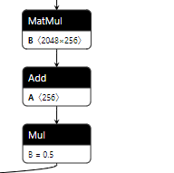
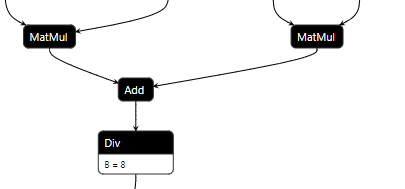
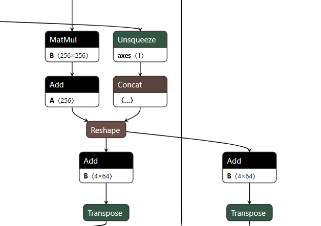
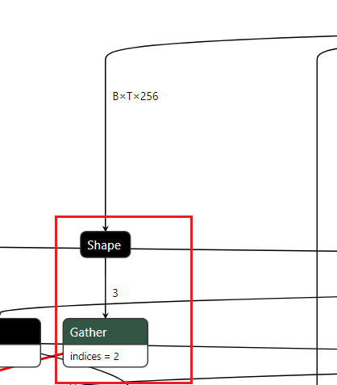
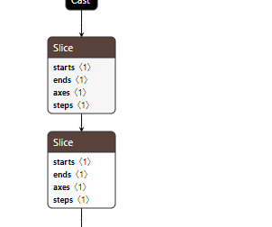
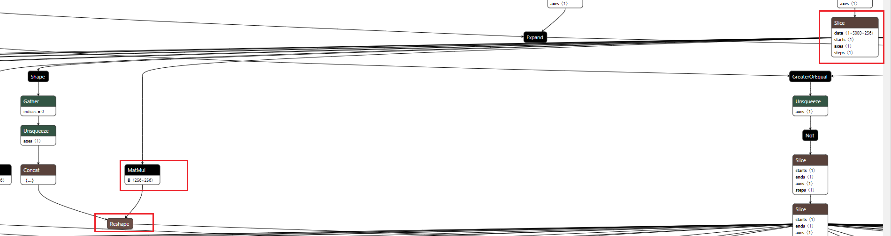
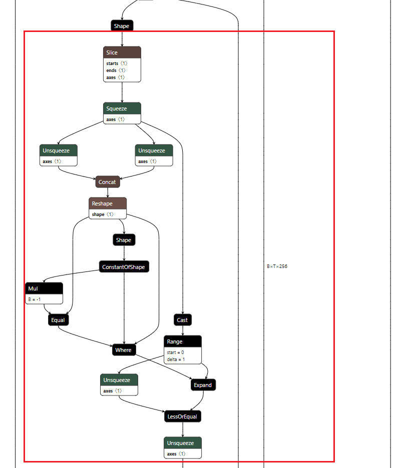

# 计算图的优化-以onnx表示形式为例

## 一、引言

模型训练好以后必然涉及到部署到各种硬件平台，针对计算图的优化不可以单单依赖于所在硬件部署工具的优化策略，这里面仍然需要一些人力来去删减合并一些算子。
在修改计算图时，有两种方式。第一个是从源头控制，即对导出时描述模型的源码（如pytorch或者tensorflow）进行更改。第二个是对导出的格式（如onnx，pb等）进行更改。
个人比较偏好大部分用第一种，然后对于更为精细的调整采用第二种方法。但是对于一个成熟的团队来说，第一种往往依赖于模型开发人员，第二个工作往往分配给模型部署人员。针对计算图的优化往往是交给部署人员去做，所以第二种方式对于模型部署人员来说应用的比较多（因为其只能得到一个onnx）。
onnx格式逐渐变成一种通用的规范来去表示计算图，尽管有些开发人员不喜欢其在算子表示上的不足，但是不可否认的是通一化的表示规范会让整个行业发展得更好，目前大部分模型部署框架都支持对onnx的解析，所以本文也采用该格式来说明对于计算图的化简。

> 对于onnx 所支持的算子参见  
> [ONNX Operators文档](https://github.com/onnx/onnx/blob/main/docs/Operators.md)

## 二、基本流程

1. 确定模型输入输出，删除不需要的输入（设置为固定输入）和输出
2. 确定输入输出维度以及哪些维度是可变的
3. 对计算图中冗余逻辑计算和代数运行进行删减，先进行简单的部分，再分析复杂的部分。
4. 清理计算图冗余部分

> 关键工具：onnx_graphsurgeon  
> <https://github.com/NVIDIA/TensorRT/tree/main/tools/onnx-graphsurgeon>  
> 英伟达出的onnx编辑工具，独立版本，不局限于tensorrt部署。

### 2.1 静态维度输入

对于静态shape的输入，一般可以采用`onnx-simplifier`过一遍就可以得到不错的效果。我们可以在使用`onnx-simplifier`以后再去观察下onnx中计算图的表示情况，采用下文中的化简技巧进行化简。

> `onnx-simplifier`:
> <https://github.com/daquexian/onnx-simplifier>

### 2.2 动态维度输入

对于动态维度输入，`onnx-simplifier`可以做的微乎其微。只能靠人工去化简，或许随着版本的升级`onnx-simplifier`在这一方面可以做的好一些。

## 三、基本逻辑化简

1. Less + Not = GreaterOrEqual  
    对应处理逻辑代码
    ```python
    graph = gs.import_onnx(onnx.load(onnx_save_path))
    for node in graph.nodes:
        if node.op == "Less":
            next_node = node.o()
            if next_node.op == "GreaterOrEqual":
                node.op = "Less"
                node.name = node.name.replace("GreaterOrEqual", "Less")
    ```
2. not ((not A) or (not B) or C) = A and B and not C  
  这里指的是Not算子和Or算子

3. bool -> Cast(to int32) + Equal( == 0) = bool -> Not  
  布尔值强制转换为int32，然后判断值是否为0，等价于对该布尔值取非。

## 四、基本代数化简

1. MatMul + Add + Mul = MatMul + Add  
    
  设 `y = Mul(Add(MatMul(x, A), B), C)`， 即y = C(Ax+B) 可以化简为 `y = ACx+BC`  
  这里需要处理的是矩阵广播的关系。  
  类似的例子还有`Add(MatMul, MatMul) + Div` 可以将Div的参数分配到两个MatMul中，这一点在`Attention`中较为常见，尽管`Attention`有更好的优化方式。  
  

2. MatMul + Add + (Add、Add) = MatMul + Add + Add  
  设 `y1 = Add(MatMul(Add(x, A), B), C1)` 和 `y2 = Add(MatMul(Add(x, A), B), C2)`，可以化简为`y1 = MatMul(Add(x, A), B + C1)` 和 `y2 = Add(MatMul(Add(x, A), B + C1), C2 - C1)`。  
  

## 五、其余算子的基本化简

1. 去掉Shape算子  
      
    这里的取Shape操作，然后取index=2的情况，这里的取Shape以及后面的Gather都可以去掉。具体操作可以采用`onnx_graphsurgeon`修改Gather的输入，然后采用`onnx-simplifier`执行下化简操作。  
    当然也可以遍历Gather所有的输出，填充"256"这个常量。

    ```python
    import onnx
    from onnxsim import simplify
    for node in model_gs.nodes:
        if node.name == "Gather_63":
            node.inputs[0] = gs.Constant("Gather_63_input_0", values=np.int64([1,10,64]))
        elif node.name == "Shape_61":
            node.outputs.clear()
    model_gs.cleanup().toposort()
    model = gs.export_onnx(model_gs)
    model_simp, check = simplify(
        model,
        check_n = 0,
        perform_optimization = True,
        skip_fuse_bn = False,
        skip_shape_inference=False,
        input_data = {
            'input': np.random.randn(4,16,256).astype(np.float32),
        },
        dynamic_input_shape = True,
    )
    ```

2. 连续Slice的化简  
    
    如上图，两个Slice操作对应numpy的操作分别为`x[:,:,0:-2:2,...]`、`x[:,:,0:-2:2,...]`，即对数据的第三个维度进行两次相同间隔下采样。
    在numpy上上述两个连续操作可以转换为`x[:,:,0:-4:4,...]`。

3. Tile后移  
    Tile后移原则即将张量沿着某一维复制的操作尽可能得后移，这样做的目的是节省计算量。
    比如 `x->Tile->Mul->Add->y` 可以转换为 `x->Mul->Add->Tile->y`。
    也有可能存在多个y对应一个x计算的情况，这时就需要将前面的Tile删除，然后再多个y的前面添加Tile。后移是有条件的，当对于张量的计算不涉及复制维度的差异操作时才可以将Tile后移。

4. 算子的等价替换  
    在有些情况下，某些算子可能不被部署平台支持，但是可以替换为已知支持的算子。比如在opencv的dnn模块中，如果部署yolov5，Focus模块中的slice算子在一开始的版本中并不支持，slice的间隔采样运算实际上可以被 depthwise 卷积代替，这里给出一种比较省事的解决方案。
    首先在pytorch上验证等价性


    ```python
    import torch
    import torch.nn as nn
    import torch.nn.functional as F
    class MyModel(nn.Module):
        def __init__(self):
            super().__init__()
        def forward(self, x):
            # x: [1,3,xxx,xxx]
            weight = torch.as_tensor([[1,0],[0,0]]).float().to(x.device).reshape(1,1,2,2)
            weight = weight.repeat(3,1,1,1)
            x1 = F.conv2d(x, weight=weight, bias=None, stride=2, groups=3)
            weight = torch.as_tensor([[0,0],[1,0]]).float().to(x.device).reshape(1,1,2,2)
            weight = weight.repeat(3,1,1,1)
            x2 = F.conv2d(x, weight=weight, bias=None, stride=2, groups=3)
            weight = torch.as_tensor([[0,1],[0,0]]).float().to(x.device).reshape(1,1,2,2)
            weight = weight.repeat(3,1,1,1)
            x3 = F.conv2d(x, weight=weight, bias=None, stride=2, groups=3)
            weight = torch.as_tensor([[0,0],[0,1]]).float().to(x.device).reshape(1,1,2,2)
            weight = weight.repeat(3,1,1,1)
            x4 = F.conv2d(x, weight=weight, bias=None, stride=2, groups=3)
            return torch.cat([x1, x2, x3, x4], dim=1)
    if __name__ == "__main__":
        model = MyModel()
        x = torch.rand(1, 3, 224, 224).float()
        y = torch.cat([x[:,:,0::2,0::2], x[:,:, 1::2, 0::2], x[:,:,0::2,1::2], x[:,:,1::2,1::2]], dim=1)
        model.eval()
        out = model(x)
        input_dummpy = torch.rand(1,3,224,224)
        torch.onnx.export(model, input_dummpy, 'focus.onnx')
    ```


    然后替换原来的onnx


    ```python
    import onnx_graphsurgeon as gs
    import onnx
    import numpy as np
    def get_conv_node(onnx_filepath):
        onnx_model = onnx.load(onnx_filepath)
        model_gs = gs.import_onnx(onnx_model)
        node_list = list()
        for node in model_gs.nodes:
            if node.op == "Conv":
                node_list.append(node)
        node_list.sort(key=lambda x:x.name)
        return node_list
    def replaceSliceNodes(onnx_filepath, conv_filepath):
        conv_nodes = get_conv_node(conv_filepath)
        onnx_model = onnx.load(onnx_filepath)
        model_gs = gs.import_onnx(onnx_model)
        slices_nodes = list()
        for node in model_gs.nodes:
            if len(node.inputs) > 0 and node.inputs[0].name == "input":
                slices_nodes.append(node)
        input_var = slices_nodes[0].inputs[0]
        next_slices_nodes = [item.o() for item in slices_nodes]
        output_vars = [node.outputs[0] for node in next_slices_nodes]
        # concat_node = next_slices_nodes[0].o()
        output_vars.sort(key = lambda x: x.name)
        # print(input_var.name)
        for output_var, conv_node in zip(output_vars, conv_nodes):
            conv_node.outputs[0] = output_var
            conv_node.inputs[0] = input_var
            const = conv_node.inputs[1].inputs[0].attrs['value']
            name = conv_node.inputs[1].name
            const.name = name
            conv_node.inputs[1] = const
            # print(.name)
            model_gs.nodes.append(conv_node)
        for item in next_slices_nodes:
            item.outputs.clear()
        for node in model_gs.nodes:
            if node.name == "Concat_153":
                resize_node = node.o()
                node.outputs.clear()
                resize_node.inputs[2] = gs.Constant(name = resize_node.inputs[2].name + "_new", values = np.array([1.0, 1.0, 4.0, 4.0], dtype=np.float32) )
                resize_node.inputs.pop(-1)
        model_gs.cleanup().toposort()
        model = gs.export_onnx(model_gs)
        onnx.checker.check_model(model)
        onnx.save(model, 'rm_slice_'+onnx_filepath)
    replaceSliceNodes('yolov5.onnx', 'focus.onnx')
    ```


## 六、高阶部分-复杂计算的模型与化简

高阶部分实际上很难覆盖完全，个人心得就是从onnxsim化简的静态输入下的onnx获得灵感，对比化简前后的不同。

1. slice+matmul 的预先计算

    
    如上图所示，Slice操作中表示data的pos_embedding是一个常量，这里操作为`pos_index->slice->matmul->y`，由于slice是对前面的维度进行slice,对于`mxk @ kxn`的运算，k并没有遭到破坏，所以可以先将matmul预算计算出来，然后在进行slice，即转换为`pos_index->slice->y`。

2. key_padding_mask 部分的处理

    
    对Shape进行的Slice操作是取得最后一维，最后一维是静态的，这里假设为63。那么concat输出为`[63,63]`,Reshape的输出也为`[63,63]`，`ConstantOfShape`的的value属性为1，输出为形状为`[2]`的全为1的Tensor，`Mul`的输出为形状为`[2]`的全为-1的Tensor，Equal的输出必然为形状为`[2]`的全为False的Tensor。Where的输出为Reshape的输出即`[63,63]`，Cast+Range的输出为`np.range(0,63)`的输出，即`[0...62]`,Expand的输出为形状为`[63,63]`且每行为`[0...62]`的Tensor。Unsqueeze的输出为`[63,1]`的Tensor，每列元素依次为`[0...62]`，LessOrEqual输出为`[63,63]`的Tensor，格式为


    ```
    [
    [True, False,..., False],
    [True, True, ..., False],
    ...
    [True, True, ..., True]
    ]
    ```


    Unsqueeze的输出为1x63x63的Tensor。所以直到Unsqueeze输出都是静态可以被计算出来的，这里可以替换为常量，画出的矩形计算图都可以删掉。

## 七、面向特定硬件上的优化

这里以NV GPU部署TensorRT为例

1. 二维矩阵乘法加速

    如`x->MatMul->Add->y`，如果x是三维的，可以先将`x` reshape为[-1, E1]，然后进行计算，最后得到的y,再reshape为[B,S,E2]，这里需要记录下x的第一个维度或者第二个维度（如果前两个维度有已知的就不需要）给reshape节点使用，比如reshape的中填充的shape为[B,-1, E2]。其中E2是已知的，B是从x的`Shape->Gather[0]->Unsquueze->Concat`组合而来。
    这样可以带来加速的原因是，二维矩阵乘相比于高维矩阵乘在trt内部实现时可供选择的算法更多，加速效果更明显。

2. 共享shape

    如果onnx的输入有两个`x1，x2`，`x1`的shape为`[B,S,E]`，`x2`的shape为`[B]`，那么再引用`x2`的B时最好将其替换为`x1`的B，这样可以表示x2的B于x1的B相同。

3. 常见部分plugin的实现

    plugin常用于一些零碎算子的整合，比如attn。现在trt的算子融合已经做的很好，实现plugin的目的是为了加速，但是想超过trt的实现绝非易事。plugin会破坏算子的融合，所以plugin实现前后要对比是否带来了优化效果。此外对于显存的复用对于plugin来说是一个优势，这个在plugin内部是可控的，也是plugin可以起到加速效果的原因之一。后面的文章将逐步介绍plugin的编写于实现。

## 八、总结

计算图的优化内容不局限于计算图的化简，针对特定平台下的优化同样不可以忽略，同时算子之间的可替代性可以为为解决算子不支持的问题提供可能的解决方案。在化简计算图时，一定是按照先简单后复杂的办法一步步分析，尽可能的去删除冗余。此外对照静态输入下onnxsim的化简可以带来一些思路。零碎算子整合为plugin也是很重要的优化手段，这对cuda或者mpi等使用并线编程的能力有了一定的要求。

