# TOOD论文和源码解读：目标检测中定位和分类任务一致性问题

## 一、前言

> 论文链接： <https://arxiv.org/abs/2108.07755>
> 代码链接：<https://github.com/fcjian/TOOD>

TOOD这篇文章出自**ICCV 2021 Oral**，全称为“Task-aligned One-stage Object Detection”，


Yolov8、Yolov6、PP-YOLOE、PicoDet等模型都选择TOOD作为训练时的标签分配策略，可见TOOD的有效性得到了众多工作的借鉴和认可，那么TOOD到底解决了什么问题呢？以及解决方案是什么？本文就带这读者深挖论文与对应代码，以通俗易懂的语言为读者解读下这篇论文，并谈一下自己的理解。

## 二、问题引入

目标检测旨在从图中定位和识别出感兴趣的物体的类别和位置，是CV中的一项基础任务。目标检测可以看做一个多任务学习问题，分类任务专注于目标的适用于分类的显著特征，定位任务致力于精确定位物体的边界。由于两种任务学习机制不同，两种任务学习到的特征空间分布也可能不同，当采用两个独立任务分支进行预测时，会导致一定程度的错位。

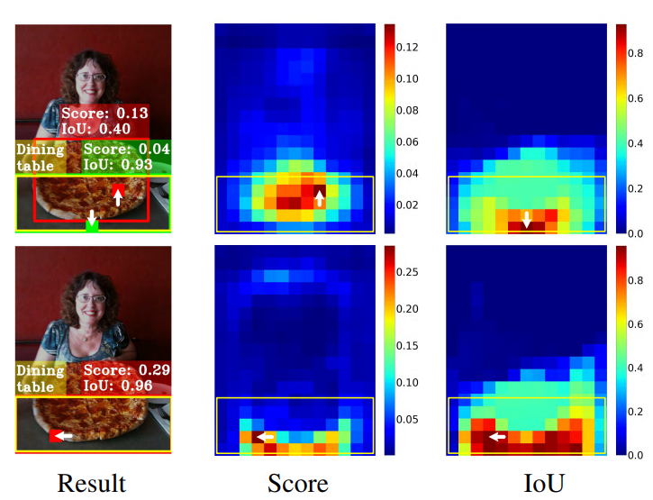

如上图所示，第一行表示使用ATSS(一种动态标签分配策略)模型预测的结果，下面一行表示TOOD预测的结果。

黄色矩形框表示GT，从图中第一列可以看出GT的分类结果为餐桌。两行中第一列的红色矩形框都表示相应模型预测结果，第一行第一列中的绿色矩形框也表示ATSS的一个预测结果。第二行第一列其实也有绿色框，但是与红色框重合，所以没有展示。

第二列(Score)中表示模型在GT区域内预测为餐桌的概率分布，这里详细解释一下，在一张图中每个坐标点都会有若干个网格(无论是基于anchor-box还是anchor-point)，网格所对应的的分类概率记为p，网格中心点记为(x,y)，那么有S(x,y) = p，从而就可以得到一个二维单通道矩阵，对该矩阵进行可视化即可得到上述概率分布。

第三列(IoU)表示预测框与GT的IOU分布，在一张图中每个坐标点都会有若干个网格，这些网格一定对应一个或者多个anchor(无论是基于anchor-box还是anchor-point)，也就是说一个网格对应一个或者多个预测框，将这些预测框与GT进行IOU计算，得出的结果即可绘制出上图第三列中的分布。

**TOOD将上图中表现出的问题概述为两点：**

1. **分类任务与定位任务之间过于独立缺乏交互：**常见的一阶段检测器基本都是采用双分支独立结构的head来实现定位和分类任务，这样一种双分支结构可能会导致预测和定位结果的不一致。比如上图第一行第一列的ATSS预测结果，黄色框表示预测为“餐桌”的最佳匹配结果（分类为餐桌），但是其更适合作为“披萨”的定位（定位为披萨）。
2. **任务无关的样本分配策略：**首先要解释一下任务无关的含义表示样本的分配没有考虑分类和定位的综合因素。大多数ahchor-free检测器采用基于几何分布的分配策略，即选择位于物体中心附近的anchor-point用于回归和定位任务。同时anchor-based的检测器一般采用计算GT与anchor-box的IOU的形式实现anchor-box负责哪个GT的预测。但是适合定位和适合分类的anchor往往不一致，这就导致上述两种与任务无关的样本分配策略很难去引导模型去学习出定位和分类得分一致高的预测框。上图中第一行中Score列与IoU列就说明了该问题。在第一行Result列中绿色框即为IOU得分最高的框，但是其分类得分较低，最终会被NMS后处理算法过滤掉。

## 三、TOOD给出的解决思路

TOOD面向上述问题，分别给出两个解决方案：

1. 设计一种Head结构增强两个任务之间的特征交互
2. 设计一种任务对齐的标签分配机制，综合考虑分类与定位因素，尝试引导模型给出找到一个分类和定位得分都较高的位置。

### 3.1 任务对齐Head：T-Head(Task-aligned head)

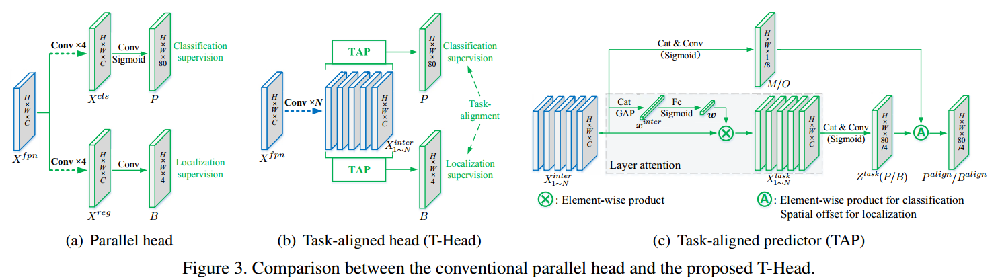

TAL的设计有两个目的：

1. 增强定位于分类任务之间的特征交互
2. 提升检测器的任务对齐学习能力

常规检测器Head如上图(a)所示，分类任务与定位任务采用两个并行独立分支完成。T-Head的整体结构图如图(b)所示，其由一个特征提取器和两个TAP（Task-aligned predictor）组成。TAP结构如图©所示，一会给出具体公式。

T-Head与常规检测不同的是，为增强两类任务之间的特征交互，T-Head采用多层串联的的卷积层来提取多层特征图，多层特征图对应不同感受野信息，公式如下：其中 $X^{fpn}$ 为FPN单层输出的信息， $conv_k$  and  $\delta$  分别表示 k-th 卷积层个Relu激活函数。

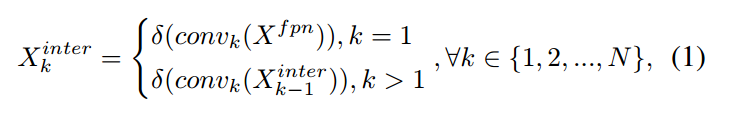

N个 $X_{k}^{inter}$ 特征将会级联起来，送入TAP中，最终产生分类和定位预测信息。

由于定位与分类的目标不同，两类任务共用一种特征不可避免会带来特征冲突，各自关注的特征也不相同。因此，作者在论文中提出对k个 $X_{k}^{inter}$ 特征采用Layer Attention的方式进行处理，让模型自动为每个Layer学习得到一种适配于当前任务的权重系数 $w_k$ （是一个标量），然后将 $w_k$ 与 $X_{k}^{inter}$ 相乘得到 $X_k^{task}$ 。如图©所示， $\omega$ 由N个 $X_{k}^{inter}$ 共同计算得到，可以捕获跨层特征之间的交互关系，其中 $f_{c1}$ 与 $f_{c2}$ 表示两个全连接层， $\sigma$ 代表sigmoid函数， $x^{inter}$ 是对 $X^{inter}$ （N个 $X_{k}^{inter}$ 拼接）做全局平均池化得到。

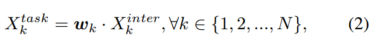

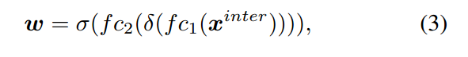

最后，由 $X^{task}$ （N个 $X_{k}^{task}$ 拼接）得到 $Z^{task}$ ，计算公式如下：

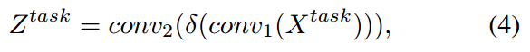

 $Z^{task}$ 经过sigmoid函数转换为分类预测图 $P \in R^{H \times W \times 80}$ 或者`distance-to-bbox`函数转换为 $B \in R^{H \times W \times 4}$ 。

**预测对齐步骤：**

如上图中图©所示，TOOD采用跨层任务交互特征 $X^{inter}$ 生成特征图M和O，采用跨层特征实现对P和B的进一步矫正，公式如下：

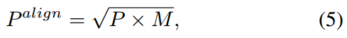

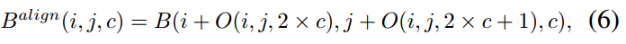

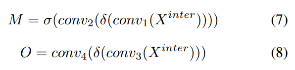

其中，公式(5)中的乘法就是元素乘法，公式(6)的公式可以参考可变性卷积的公式，以B为基础O为坐标来生成一个新的 $B^{align}$ ，其中新的位置坐标比如 $i + O(i, j, 2 \times c)$ 是一个连续值，采用float表示，对应连续值位置的值采用双插值算法计算得到。公式(7)(8)表示M和O的生成过程，其中 $M \in \text{R}^{H \times W \times 4}$ ， $O \in \text{R}^{H \times W \times 8}$ ， $M$ 可以看做空间中每个位置的任务对齐程度，用于衡量两类任务的一致性。

这里需要说明的是，即使没有TAL，T-Head也可以作为一种Head以即插即用的方式给其他模型提供一种带有任务间交互特征的Head。

**代码解析**

基于mmdet2.28.1版本

<https://github.com/open-mmlab/mmdetection/blob/v2.28.1/mmdet/models/dense_heads/tood_head.py>

参考代码，这里一步步拆解，先说 $X^{inter}$ 的生成：

卷积层的定义在Line145-160，在`_init_layers`函数里面：


```python
        self.inter_convs = nn.ModuleList()
        for i in range(self.stacked_convs):
            if i < self.num_dcn:
                conv_cfg = dict(type='DCNv2', deform_groups=4)
            else:
                conv_cfg = self.conv_cfg
            chn = self.in_channels if i == 0 else self.feat_channels
            self.inter_convs.append(
                ConvModule(
                    chn,
                    self.feat_channels,
                    3,
                    stride=1,
                    padding=1,
                    conv_cfg=conv_cfg,
                    norm_cfg=self.norm_cfg))
```


这里`self.inter_convs`即表示生成 $X^{inter}$ 所用卷积。

TAP模块中 $Z^{task}$ 的生成过程由类`TaskDecomposition`来描述，对应Line162-169


```python
self.cls_decomp = TaskDecomposition(self.feat_channels,
                                    self.stacked_convs,
                                    self.stacked_convs * 8,
                                    self.conv_cfg, self.norm_cfg)
self.reg_decomp = TaskDecomposition(self.feat_channels,
                                    self.stacked_convs,
                                    self.stacked_convs * 8,
                                    self.conv_cfg, self.norm_cfg)
```


后续的 $P^{align}$ 与 $B^{align}$ 见下面的代码和注释（Line171-189）：


```python
        # 生成P所需卷积层 对应公式(4)中的 conv2
        self.tood_cls = nn.Conv2d(
            self.feat_channels,
            self.num_base_priors * self.cls_out_channels,
            3,
            padding=1)
        # 生成B所需卷积层 对应公式(4)中的 conv2
        self.tood_reg = nn.Conv2d(
            self.feat_channels, self.num_base_priors * 4, 3, padding=1)

        # 生成M所需卷积层
        self.cls_prob_module = nn.Sequential(
            nn.Conv2d(self.feat_channels * self.stacked_convs,
                      self.feat_channels // 4, 1), nn.ReLU(inplace=True),
            nn.Conv2d(self.feat_channels // 4, 1, 3, padding=1))

        # 生成O所需卷积层
        self.reg_offset_module = nn.Sequential(
            nn.Conv2d(self.feat_channels * self.stacked_convs,
                      self.feat_channels // 4, 1), nn.ReLU(inplace=True),
            nn.Conv2d(self.feat_channels // 4, 4 * 2, 3, padding=1))

        # reg head 所需可学习的缩放系数
        self.scales = nn.ModuleList(
            [Scale(1.0) for _ in self.prior_generator.strides])
```


下面再看一下`TaskDecomposition`做了什么，对应Line17-86，我删减了一部分


```python
class TaskDecomposition(nn.Module):
    """Task decomposition module in task-aligned predictor of TOOD.
    Args:
        feat_channels (int): 表示X_{k}^{inter}的通道数
        stacked_convs (int): TOOD head中公式(1)的N，表示有多少个X_{k}^{inter}
        la_down_rate (int): Downsample rate of layer attention.
        conv_cfg (dict): Config dict for convolution layer.
        norm_cfg (dict): Config dict for normalization layer.
    """

    def __init__(self,
                 feat_channels,
                 stacked_convs,
                 la_down_rate=8,
                 conv_cfg=None,
                 norm_cfg=None):
        super(TaskDecomposition, self).__init__()
        # 表示X_{k}^{inter}的通道数
        self.feat_channels = feat_channels
        # TOOD head中公式(1)的N，表示有多少个X_{k}^{inter}
        self.stacked_convs = stacked_convs
        self.in_channels = self.feat_channels * self.stacked_convs
        self.norm_cfg = norm_cfg
        # 对应公式3中的两个fc层和激活函数
        self.layer_attention = nn.Sequential(
            nn.Conv2d(self.in_channels, self.in_channels // la_down_rate, 1),
            nn.ReLU(inplace=True),
            nn.Conv2d(
                self.in_channels // la_down_rate,
                self.stacked_convs,
                1,
                padding=0), nn.Sigmoid())

        # 对应公式4中的conv1
        self.reduction_conv = ConvModule(
            self.in_channels,
            self.feat_channels,
            1,
            stride=1,
            padding=0,
            conv_cfg=conv_cfg,
            norm_cfg=norm_cfg,
            bias=norm_cfg is None)

    def forward(self, feat, avg_feat=None):
        b, c, h, w = feat.shape
        if avg_feat is None:
            # 对应图C中的GAP(global average pooling)
            avg_feat = F.adaptive_avg_pool2d(feat, (1, 1))
        # 对应公式3计算过程
        weight = self.layer_attention(avg_feat)

        # 这里源码作者为了加速计算将 公式三中的结果 omega 与 conv1 中的权重进行了合并
        # here we first compute the product between layer attention weight and
        # conv weight, and then compute the convolution between new conv weight
        # and feature map, in order to save memory and FLOPs.
        conv_weight = weight.reshape(
            b, 1, self.stacked_convs,
            1) * self.reduction_conv.conv.weight.reshape(
                1, self.feat_channels, self.stacked_convs, self.feat_channels)
        conv_weight = conv_weight.reshape(b, self.feat_channels,
                                          self.in_channels)
        feat = feat.reshape(b, self.in_channels, h * w)
        # 1x1 conv 可以看成全连接层，全连接层的实现就是矩阵乘法，这里即conv1的计算
        feat = torch.bmm(conv_weight, feat).reshape(b, self.feat_channels, h,
                                                    w)
        if self.norm_cfg is not None:
            feat = self.reduction_conv.norm(feat)
        feat = self.reduction_conv.activate(feat)

        return 
```


读者可能会疑惑，`TaskDecomposition`类中为什么没有公式(4)中的conv2。我认为conv2是用来做转换的，即生成P或者B的，也就是说 $Z^{task}$ 泛指P或者B的一种，公式(4)就包含了P和B的生成过程，这也解释了图©中 $Z^{task}(P/B)$ 中括号的含义，这里读者可以看一下前面代码的注释。

解释清楚`TaskDecomposition`类后，我们再看一下整个T-Head的计算过程，对应代码Line210-282


```python
    def forward(self, feats):
        """Forward features from the upstream network.
        Args:
            feats (tuple[Tensor]): Features from the upstream network, each is
                a 4D-tensor. fpn输出的特征
        Returns:
            tuple: Usually a tuple of classification scores and bbox prediction
                cls_scores (list[Tensor]): Classification scores for all scale
                    levels, each is a 4D-tensor, the channels number is
                    num_anchors * num_classes.
                bbox_preds (list[Tensor]): Decoded box for all scale levels,
                    each is a 4D-tensor, the channels number is
                    num_anchors * 4. In [tl_x, tl_y, br_x, br_y] format.
        """
        cls_scores = []
        bbox_preds = []
        # 遍历所有的FPN输出map
        for idx, (x, scale, stride) in enumerate(
                zip(feats, self.scales, self.prior_generator.strides)):
            b, c, h, w = x.shape
            # 得到anchor point 或者 anchor box
            anchor = self.prior_generator.single_level_grid_priors(
                (h, w), idx, device=x.device)
            anchor = torch.cat([anchor for _ in range(b)])
            # extract task interactive features
            inter_feats = []
            # 计算得到 X^{inter}_k
            for inter_conv in self.inter_convs:
                x = inter_conv(x)
                inter_feats.append(x)
            # concat 得到 X^{inter}
            feat = torch.cat(inter_feats, 1)

            # task decomposition
            # TAP中LayerAttention过程
            avg_feat = F.adaptive_avg_pool2d(feat, (1, 1))
            # 得到 公式4中conv1的输出 用于分类
            cls_feat = self.cls_decomp(feat, avg_feat)
            # 得到 公式4中conv1的输出 用于定位
            reg_feat = self.reg_decomp(feat, avg_feat)


            # cls prediction and alignment
            # 对应公式4中conv2 
            cls_logits = self.tood_cls(cls_feat)
            # 生成M
            cls_prob = self.cls_prob_module(feat)
            # 生成P^{align} = sqrt(sigmoid(M) x sigmoid(P))
            # 这里假设M和P表示未接入激活函数之前的特征
            cls_score = sigmoid_geometric_mean(cls_logits, cls_prob)

            # reg prediction and alignment
            if self.anchor_type == 'anchor_free':
                # 计算中心点到四个边的距离 对应 FCOS论文中的 lrtb
                reg_dist = scale(self.tood_reg(reg_feat).exp()).float()
                reg_dist = reg_dist.permute(0, 2, 3, 1).reshape(-1, 4)
                # 生成 B
                # 对anchor进行归一化 然后转换为 b, 4, h, w
                reg_bbox = distance2bbox(
                    self.anchor_center(anchor) / stride[0],
                    reg_dist).reshape(b, h, w, 4).permute(0, 3, 1,
                                                          2)  # (b, c, h, w)
            elif self.anchor_type == 'anchor_based':
                reg_dist = scale(self.tood_reg(reg_feat)).float()
                reg_dist = reg_dist.permute(0, 2, 3, 1).reshape(-1, 4)
                reg_bbox = self.bbox_coder.decode(anchor, reg_dist).reshape(
                    b, h, w, 4).permute(0, 3, 1, 2) / stride[0]
            else:
                raise NotImplementedError(
                    f'Unknown anchor type: {self.anchor_type}.'
                    f'Please use `anchor_free` or `anchor_based`.')
            # 生成O
            reg_offset = self.reg_offset_module(feat)
            # 生成B^{align}，这里即采用可变性卷积来实现，O当做偏移坐标
            bbox_pred = self.deform_sampling(reg_bbox.contiguous(),
                                             reg_offset.contiguous())

            # 经过可变性卷积计算后，可能有些框有不符合矩形条件, 求GIOULoss时会导致小于0
            # 这个时候转而用原来的 B 来代替 B^{align}
            # After deform_sampling, some boxes will become invalid (The
            # left-top point is at the right or bottom of the right-bottom
            # point), which will make the GIoULoss negative.
            invalid_bbox_idx = (bbox_pred[:, [0]] > bbox_pred[:, [2]]) | \
                               (bbox_pred[:, [1]] > bbox_pred[:, [3]])
            invalid_bbox_idx = invalid_bbox_idx.expand_as(bbox_pred)
            bbox_pred = torch.where(invalid_bbox_idx, reg_bbox, bbox_pred)

            cls_scores.append(cls_score)
            bbox_preds.append(bbox_pred)
        return tuple(cls_scores), tuple(bbox_preds)
```


下面给出的源码，[源码地址](https://github.com/open-mmlab/mmdetection/blob/v2.28.1/mmdet/models/utils/misc.py)


```python
# 为了解决torch原生实现两个sigmoid连续相乘后梯度容易为None的问题，化简了梯度计算过程用于缓解该类问题。
class SigmoidGeometricMean(Function):
    """Forward and backward function of geometric mean of two sigmoid
    functions.
    This implementation with analytical gradient function substitutes
    the autograd function of (x.sigmoid() * y.sigmoid()).sqrt(). The
    original implementation incurs none during gradient backprapagation
    if both x and y are very small values.
    """

    @staticmethod
    def forward(ctx, x, y):
        x_sigmoid = x.sigmoid()
        y_sigmoid = y.sigmoid()
        z = (x_sigmoid * y_sigmoid).sqrt()
        ctx.save_for_backward(x_sigmoid, y_sigmoid, z)
        return z

    @staticmethod
    def backward(ctx, grad_output):
        x_sigmoid, y_sigmoid, z = ctx.saved_tensors
        grad_x = grad_output * z * (1 - x_sigmoid) / 2
        grad_y = grad_output * z * (1 - y_sigmoid) / 2
        return grad_x, grad_y


sigmoid_geometric_mean = SigmoidGeometricMean.apply
```


`distance2bbox`函数


```python
def distance2bbox(points, distance, max_shape=None):
    """Decode distance prediction to bounding box.

    Args:
        points (Tensor): Shape (B, N, 2) or (N, 2).
        distance (Tensor): Distance from the given point to 4
            boundaries (left, top, right, bottom). Shape (B, N, 4) or (N, 4)
        max_shape (Sequence[int] or torch.Tensor or Sequence[
            Sequence[int]],optional): Maximum bounds for boxes, specifies
            (H, W, C) or (H, W). If priors shape is (B, N, 4), then
            the max_shape should be a Sequence[Sequence[int]]
            and the length of max_shape should also be B.

    Returns:
        Tensor: Boxes with shape (N, 4) or (B, N, 4)
    """
    x1 = points[..., 0] - distance[..., 0]
    y1 = points[..., 1] - distance[..., 1]
    x2 = points[..., 0] + distance[..., 2]
    y2 = points[..., 1] + distance[..., 3]

    bboxes = torch.stack([x1, y1, x2, y2], -1)

    # 将 bboxes限制在max_shape
    if max_shape is not None:
        if not isinstance(max_shape, torch.Tensor):
            max_shape = x1.new_tensor(max_shape)
        max_shape = max_shape[..., :2].type_as(x1)
        if max_shape.ndim == 2:
            assert bboxes.ndim == 3
            assert max_shape.size(0) == bboxes.size(0)

        min_xy = x1.new_tensor(0)
        max_xy = torch.cat([max_shape, max_shape],
                           dim=-1).flip(-1).unsqueeze(-2)
        bboxes = torch.where(bboxes < min_xy, min_xy, bboxes)
        bboxes = torch.where(bboxes > max_xy, max_xy, bboxes)

    return bboxes
```


**以上就是T-Head的源码解析，mmdet中的实现与原文相符，一些工程上的细节值得我们学习**。

### 3.2 任务对齐学习机制：TAL(Task alignment learning)

为了让T-Head能够任务对齐的预测框，TOOD作者提出一种新的样本分配策略和Loss，并将其命名为TAL（任务对齐学习）。

#### 3.2.1 任务对齐的样本分配策略

首先再回顾下TOOD的目标，TOOD希望模型的预测框具有如下特征：

1. 分类得分高的一定具有比较好的定位精度
2. 定位精度高的一定具有比较高的分类得分
3. 反之，分类得分低伴随着定位精度低

这样才可以方便被nms后处理，使得分类高且定位准确的框保留下来。

有了以上目标，TOOD根据上面的目标设计了一种新的对齐度量方式来明确测量anchor level的任务对齐程度，这种新的对齐度量用以样本分配与Loss的设计中。

**锚框对齐度量：**

衡量分类和定位的精度标准的分别是预测框对应的分类Score以及其与GT之间的IOU。

记 $s$ 为分类得分（是感兴趣物体且分类为某一个类别的得分）， $\mu$ 为IoU值，那么

$$
t = s^{\alpha} \times \mu^{\beta}
$$

 $\alpha$ 和 $\beta$ 作为一个超参数用于控制两类任务的anchor对齐程度。t值可以使得网络从联合优化的角度动态关注任务对齐的anchor。

> 我这里有个疑问：IoU的好理解，为什么s可以作为分类得分的质量评估标准呢？

有了t值以后，TOOD在anchor筛选时可以专注于任务对齐的anchor（t值比较高的），对于单个GT框，选择m个t值最大的anchor作为正样本，使用剩余的anchor作为负样本，m这里是一个超参数。

#### 3.2.2 任务对齐损失

为增加对齐anchor的分类Score，同时降低未对齐anchor的分类得分（t值较低的），作者采用归一化的$\hat t$来代替t来作为正样本anchor的分类Score得分，其中$\hat t$通过一下两个属性进行归一化：

1. 确保困难实例的有效学习
2. 根据预测边界框的精度保持实例之间的排名

因此，TOOD采用最大最小值归一化来调整t得到 $\hat t$ ，每个GT框的$\hat t$的最大值为其与anchor的最大IoU值，并采用Focus Loss进行分类用以减轻训练期间正负样本的不平衡问题，此时Loss应该写为：

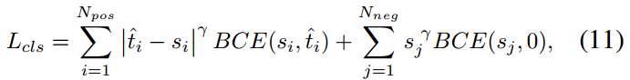

由良好对齐的anchor（具有较大t值）预测的边界框通常具有较大的分类的分和较高的定位精度，在NMS过程中更大概率保留这些边界框。与分类任务类似，定位回归Loss为带有加权值$ \hat t $的边界框回归损失，加权后GIoU损失可以表示如下：

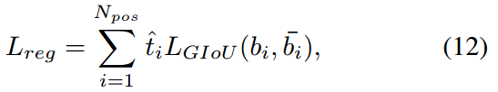

其中 $b_i$ 和 $\hat b_i$ 表示预测的边界框和相应的GT框，通过 $\hat t$ 的加权可以实现模型更关注对齐良好的anchor，同时减少边界框回归期间未对齐anchor（具有小t）的影响。

#### 3.2.3 源码解读环节

首先看一下t值的计算与标签分类策略，这里需要说明的是，在刚开始的若干个epoch,mmdet版本的TOOD采用的是ATSS标签分配和loss，然后再切换为TOOD。我认为主要原因在于，模型刚开始训练的时候，权重随机初始化的的分类输出得分不能很好的评估分类质量，因此先采用其他的训练模式先让模型可以初步输出一个较为可靠地分类得分。

这里给出t的计算过程与TOOD的标签分配策略，[对应代码链接](https://github.com/open-mmlab/mmdetection/blob/v2.28.1/mmdet/core/bbox/assigners/task_aligned_assigner.py)

在mmdet中，标签分类通过Assigner类中的assign方法实现，下面就来解读`BaseAssigner`下的`assign`方法


```coffeescript
def assign(self,
               pred_scores,
               decode_bboxes,
               anchors,
               gt_bboxes,
               gt_bboxes_ignore=None,
               gt_labels=None,
               alpha=1,
               beta=6):
        """Assign gt to bboxes.
        The assignment is done in following steps
        1. compute alignment metric between all bbox (bbox of all pyramid
           levels) and gt
        2. select top-k bbox as candidates for each gt
        3. limit the positive sample's center in gt (because the anchor-free
           detector only can predict positive distance)
        Args:
            pred_scores (Tensor): predicted class probability,
                shape(n, num_classes)
            decode_bboxes (Tensor): predicted bounding boxes, shape(n, 4)
            anchors (Tensor): pre-defined anchors, shape(n, 4).
            gt_bboxes (Tensor): Groundtruth boxes, shape (k, 4).
            gt_bboxes_ignore (Tensor, optional): Ground truth bboxes that are
                labelled as `ignored`, e.g., crowd boxes in COCO.
            gt_labels (Tensor, optional): Label of gt_bboxes, shape (k, ).
        Returns:
            :obj:`TaskAlignedAssignResult`: The assign result.
        """
        anchors = anchors[:, :4]
        num_gt, num_bboxes = gt_bboxes.size(0), anchors.size(0)
        # compute alignment metric between all bbox and gt
        # 计算预测框与GT框之间的IoU，形状为 [num_bboxes, num_gt]
        overlaps = self.iou_calculator(decode_bboxes, gt_bboxes).detach()
        # 计算每个预测框预测为GT的得分，形状为 [num_bboxes, num_gt]
        bbox_scores = pred_scores[:, gt_labels].detach()
        # 每个anchor分类一个GT，这里先默认为0
        # assign 0 by default
        assigned_gt_inds = anchors.new_full((num_bboxes, ),
                                            0,
                                            dtype=torch.long)
        # 每个anchor的预测值t
        assign_metrics = anchors.new_zeros((num_bboxes, ))

        if num_gt == 0 or num_bboxes == 0:
            # No ground truth or boxes, return empty assignment
            max_overlaps = anchors.new_zeros((num_bboxes, ))
            if num_gt == 0:
                # No gt boxes, assign everything to background
                assigned_gt_inds[:] = 0
            if gt_labels is None:
                assigned_labels = None
            else:
                assigned_labels = anchors.new_full((num_bboxes, ),
                                                   -1,
                                                   dtype=torch.long)
            assign_result = AssignResult(
                num_gt, assigned_gt_inds, max_overlaps, labels=assigned_labels)
            assign_result.assign_metrics = assign_metrics
            return assign_result

        # select top-k bboxes as candidates for each gt
        # 对每个GT 选择top-k的anchor作为候选anchor
        # 计算 t, shape = [ num_bboxes, num_gt ]
        alignment_metrics = bbox_scores**alpha * overlaps**beta
        topk = min(self.topk, alignment_metrics.size(0))
        # candidate_idxs: [top_k, num_gt]
        _, candidate_idxs = alignment_metrics.topk(topk, dim=0, largest=True)
        # candidate_metrics: [top_k, num_gt] top_k的对齐指标
        candidate_metrics = alignment_metrics[candidate_idxs,torch.arange(num_gt)]
        # 是否是有效的GT框标志，要求对应t值不为0
        is_pos = candidate_metrics > 0


        # shape [num_bboxes, ]
        # limit the positive sample's center in gt
        anchors_cx = (anchors[:, 0] + anchors[:, 2]) / 2.0
        anchors_cy = (anchors[:, 1] + anchors[:, 3]) / 2.0
        # candidate_idxs: [top_k, num_gt] 
        # 将 gt_index 按照 一维展开，并按照一维array进行索引，下面是转换，加的是每一行的起始index
        for gt_idx in range(num_gt):
            candidate_idxs[:, gt_idx] += gt_idx * num_bboxes
        # shape: [ num_gt \times num_bboxes ]
        ep_anchors_cx = anchors_cx.view(1, -1).expand(
            num_gt, num_bboxes).contiguous().view(-1)
        ep_anchors_cy = anchors_cy.view(1, -1).expand(
            num_gt, num_bboxes).contiguous().view(-1)
        candidate_idxs = candidate_idxs.view(-1)

        # calculate the left, top, right, bottom distance between positive
        # bbox center and gt side
        # 挑出top_k预测框所对应的anchor_center
        l_ = ep_anchors_cx[candidate_idxs].view(-1, num_gt) - gt_bboxes[:, 0]
        t_ = ep_anchors_cy[candidate_idxs].view(-1, num_gt) - gt_bboxes[:, 1]
        r_ = gt_bboxes[:, 2] - ep_anchors_cx[candidate_idxs].view(-1, num_gt)
        b_ = gt_bboxes[:, 3] - ep_anchors_cy[candidate_idxs].view(-1, num_gt)
        # [topk,4,num_gt] 保证nchor中心需要位于GT内部才可以，否则对于anchor-free来说
        # center到四个边的距离显得不合理
        is_in_gts = torch.stack([l_, t_, r_, b_], dim=1).min(dim=1)[0] > 0.01
        # [topk, num_gt]
        is_pos = is_pos & is_in_gts

        # 保证一个anchor只能对应一个GT框
        # 如果一个anchor box只能负责一个gt的回归 与之对应最高iou的GT才会选择
        # if an anchor box is assigned to multiple gts,
        # the one with the highest iou will be selected.
        # [num_gt, num_bboxes]
        overlaps_inf = torch.full_like(overlaps, -INF).t().contiguous().view(-1)
        # [top_k X num_gt] 然后根据 is_pos 筛选
        index = candidate_idxs.view(-1)[is_pos.view(-1)]
        # 挑选出有效的候选框，并将有效的候选框记录到overlaps_inf中，overlaps_inf其余为-inf
        # [num_gt X top_k] -> index
        overlaps_inf[index] = overlaps.t().contiguous().view(-1)[index]
        # [top_k X num_gt]
        overlaps_inf = overlaps_inf.view(num_gt, -1).t()

        # [num_bboxes] 表示 每个预测框与GT的最大IoU值
        max_overlaps, argmax_overlaps = overlaps_inf.max(dim=1)
        # num_bboxes个预测框分配哪个GT框
        assigned_gt_inds[
            max_overlaps != -INF] = argmax_overlaps[max_overlaps != -INF] + 1
        # assign_metrics 即对 alignment_metrics 中的每一列取最大值的结果，需要过滤掉无效框
        # 给每个预测框的t赋值， 其t值为与之最大IOU的GT计算得到的t值
        # alignment_metrics:[top_k, num_gt]
        # 第一个max_overlaps != -INF表示对行索引
        # 第二个argmax_overlaps[max_overlaps != -INF]表示num_gt中哪一个gt与当前行所对应的pred iou最大
        assign_metrics[max_overlaps != -INF] = alignment_metrics[
            max_overlaps != -INF, argmax_overlaps[max_overlaps != -INF]]

        if gt_labels is not None:
            # 取出 可以分配为正样本的预测框的GT类别
            assigned_labels = assigned_gt_inds.new_full((num_bboxes, ), -1)
            pos_inds = torch.nonzero(
                assigned_gt_inds > 0, as_tuple=False).squeeze()
            if pos_inds.numel() > 0:
                assigned_labels[pos_inds] = gt_labels[
                    assigned_gt_inds[pos_inds] - 1]
        else:
            assigned_labels = None
        assign_result = AssignResult(
            num_gt, assigned_gt_inds, max_overlaps, labels=assigned_labels)
        assign_result.assign_metrics = assign_metrics
        return assign_result
```


下面在看损失函数的实现，[对应源码https://github.com/open-mmlab/mmdetection/blob/v2.28.1/mmdet/models/dense_heads/tood_head.py#L757](https://github.com/open-mmlab/mmdetection/blob/v2.28.1/mmdet/models/dense_heads/tood_head.py#L757)


```ruby
for gt_inds in class_assigned_gt_inds:
    gt_class_inds = pos_inds[sampling_result.pos_assigned_gt_inds == gt_inds]
    pos_alignment_metrics = assign_metrics[gt_class_inds]
    pos_ious = assign_ious[gt_class_inds]
    # 将 t 归一化为 t^{hat}，并且最大值限制为当前GT与所有预测框的iou的最大值
    pos_norm_alignment_metrics = pos_alignment_metrics / (
        pos_alignment_metrics.max() + 10e-8) * pos_ious.max()
    norm_alignment_metrics[gt_class_inds] = pos_norm_alignment_metrics
```


<https://github.com/open-mmlab/mmdetection/blob/v2.28.1/mmdet/models/dense_heads/tood_head.py#L340>


```python
          labels = labels.reshape(-1)
        alignment_metrics = alignment_metrics.reshape(-1)
        label_weights = label_weights.reshape(-1)
        # 分类的标签一开始设置为label 后面设置为\hat t
        targets = labels if self.epoch < self.initial_epoch else (
            labels, alignment_metrics)
        cls_loss_func = self.initial_loss_cls \
            if self.epoch < self.initial_epoch else self.loss_cls

        loss_cls = cls_loss_func(
            cls_score, targets, label_weights, avg_factor=1.0)

        # FG cat_id: [0, num_classes -1], BG cat_id: num_classes
        bg_class_ind = self.num_classes
        pos_inds = ((labels >= 0)
                    & (labels < bg_class_ind)).nonzero().squeeze(1)

        if len(pos_inds) > 0:
            pos_bbox_targets = bbox_targets[pos_inds]
            pos_bbox_pred = bbox_pred[pos_inds]
            pos_anchors = anchors[pos_inds]

            pos_decode_bbox_pred = pos_bbox_pred
            pos_decode_bbox_targets = pos_bbox_targets / stride[0]

            # 设置回归的loss权重为\hat t
            # regression loss
            pos_bbox_weight = self.centerness_target(
                pos_anchors, pos_bbox_targets
            ) if self.epoch < self.initial_epoch else alignment_metrics[
                pos_inds]

            loss_bbox = self.loss_bbox(
                pos_decode_bbox_pred,
                pos_decode_bbox_targets,
                weight=pos_bbox_weight,
                avg_factor=1.0)
        else:
            loss_bbox = bbox_pred.sum() * 0
            pos_bbox_weight = bbox_targets.new_tensor(0.)
```


具体的loss 配置可以看TOOD的配置文件，可以清晰地看到是Focal Loss和GIoU Loss。

### 3.3 拓展：DAMO-YOLO中的AlignedOTA

最近也在关注的另外一项工具，为动态标签分配提供了另外一种思路。TOOD不是说分类任务与回归任务的对齐存在问题么，那么是不是将SimOTA中的metric改成既考虑定位又考虑分类的metric就可以了呢。

DAMO-YOLO就做了这样一件事，其将Cost矩阵定义为reg与cls共同组成的东西。

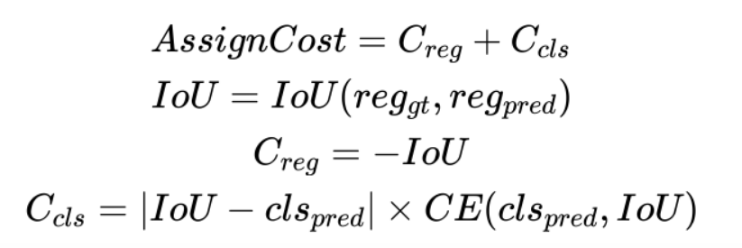

并通过实验证明，比TOOD好一点点

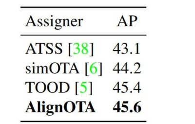

这说明了什么呢？我个人感觉这说明以下两点：

1. 考虑了定位与分类对齐后，SimOTA的dynamic k策略不是很重要
2. TOOD中t的设定不局限某一种方式，需要同时考虑分类和定位因素即可

## 四、实验证明

### 4.1 实验设置

在coco2017 训练集上训练，消融实验采用验证集，与SOTA模型的比较采用验证集

### 4.2 head结构的有效性

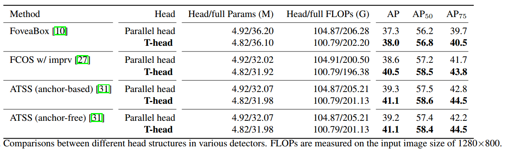

### 4.3 TAL的有效性

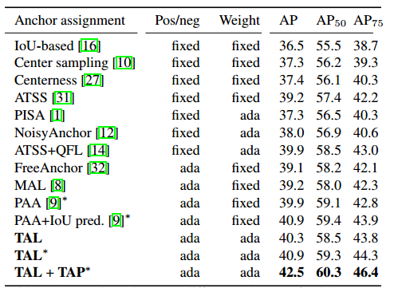

### 4.4 T-head与TAL联合作用的有效性

下图证明了TAL与TAP联合后的有效性

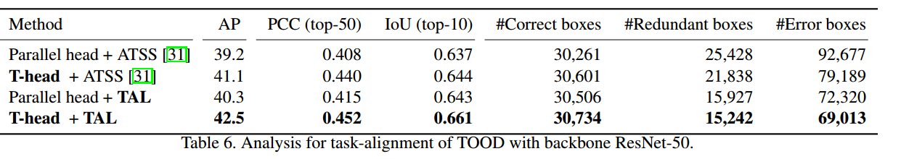

下图证明了TOOD的有效性，涨了整整四3个点还是比较明显的

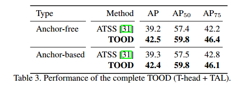

### 4.5 超参搜索

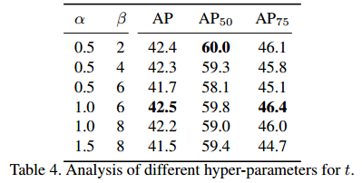

 $\alpha$ 与 $\beta$ 分别取1和6时较为合适

### 4.6 与SOTA模型的比较

在coco-test上的比较

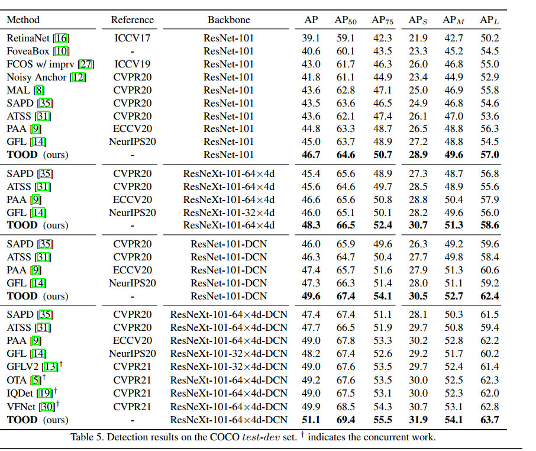

## 五、总结

本文详细介绍了TOOD需要解决的问题以及提出的解决方案，通过TOOD可以看出，检测模型的最优预测不仅应该是具有较高的分类得分而且还应该具有准确的定位，这意味着在模型训练时分类头与回归头具有较高一致性的Anchor尤为重要。

