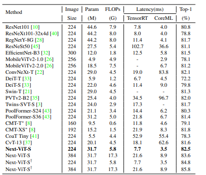
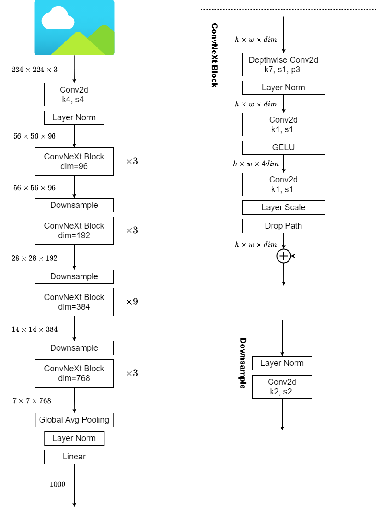
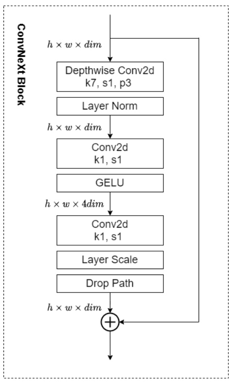
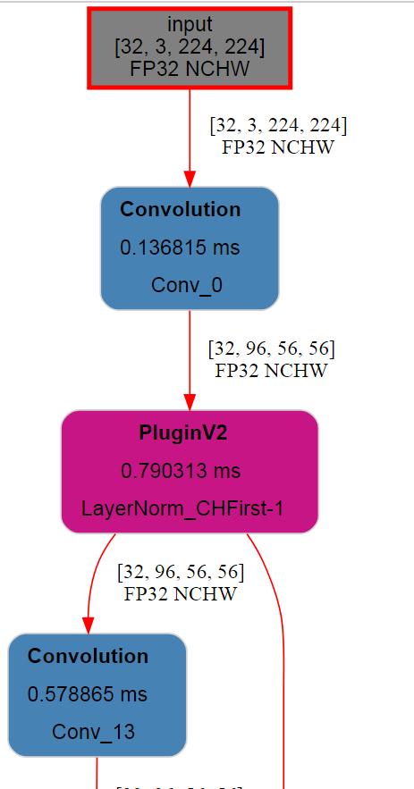
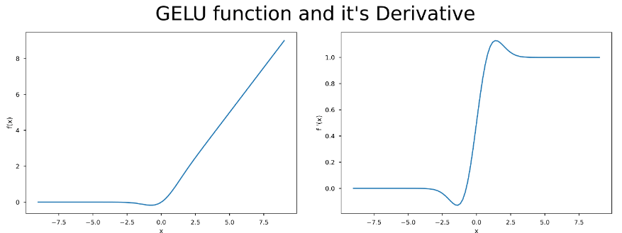
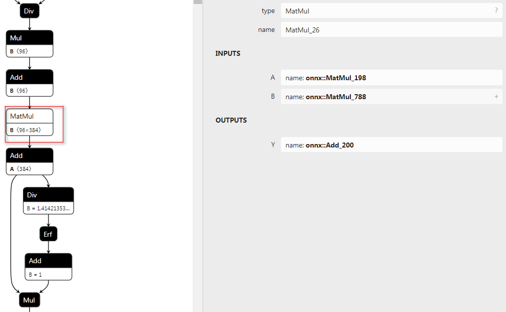
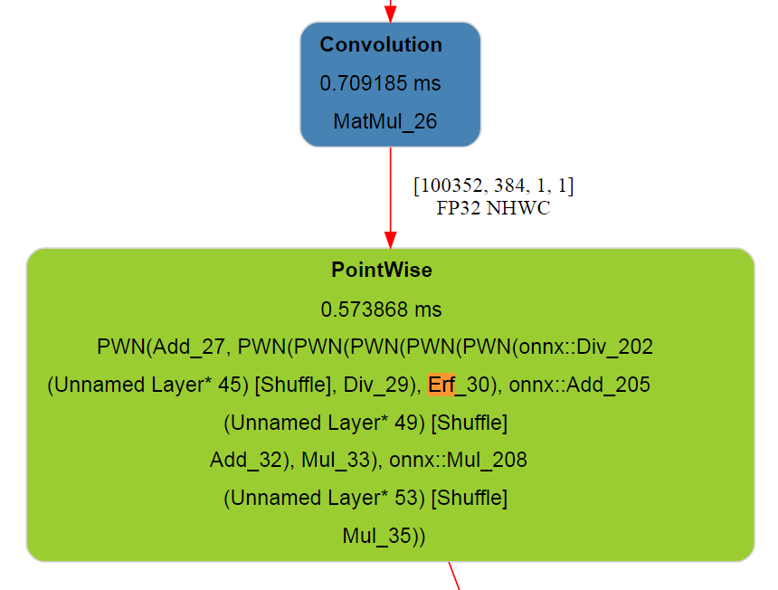

# 关于ConvNext若干细节的解读与讨论

## 一、前言

> 文章链接： <https://arxiv.org/abs/2201.03545>
> ConvNext code地址： <https://github.com/facebookresearch/ConvNeXt>

为了研究ConvNext和后续的模型，走出校园的我两周之前组装了自己的GPU主机，一张RTX 2080Ti + AMD3600X + 一个32寸的4k显示屏 + 各种免费的远程桌面软件+各种免费的内网穿透服务 恰好满足的我的折腾需求和观影相关的娱乐需求，又可以开开心心做cv相关研究了。

关于ConvNext的研究我采用的是打破砂锅问到底的方式，从论文拓展到相关论文再到模型运行时间上的评估和部署优化，极力地去弄明白每一处细节，加上国庆假期耗时两周左右。这两周的时间看别人的源码也学到了很多东西。顺便以需求代替空想，把自己配的GPU环境完善一下。

本文涉及的所有源码参见如下git地址

**<https://github.com/thb1314/convnext-depoly>**

环境配置还请查阅github地址中的README

## 二、ConvNext的初步认识

个人对于ConvNext是既喜欢又有一点不满意。

对其喜欢体现在其采用魔法打败魔法的方式，“怒怼”了热度不减的transformer，大声的告诉了VIT阵营，卷积用了VIT采用的那些trick也可以work，并且精度和速度取舍后的性价比更高。由此也引出来一个问题，模型精度的提升到底是归功于训练trick还是结构本身呢？ 论文作者自然是倾向于证明模型结构上的优越性，并讲了通篇的故事来说服自己和读者，可是实验的完备性和公平性真的可以保证么？我们到底是根据实验结果反推原理还是根据原理或者假设来做实验证明我们的研究呢？

本文并不是想批评transformer，而是借此机会怼一下蹭transformer热度的行为，几乎所有cv的方向都想着往transformer的方向去思考，感觉这反而对cv中单个方向的发展形成一种限制，限制了解决问题时思维的发散性。

ConvNext的出现在告诉同行们，配备了这些模型设计上的方法和训练方法，“我上我也行”。

关于ConvNext的不足之处主要还是体现在在衡量模型运行速度上没有将实际运行时间考虑进去，而是采用FLOPs。当然这也是设计上的技巧，因为相同参数情况下的Depthwise Convolution与Plain Convolution相比FLOPs很低，但是其运行速度真的快么？据我所知的是，在GPU上这种设计是没有优势的，实际测试的时候会很慢。

此外，ConvNext过于模仿VIT，采用LayerNorm和Gelu激活函数，阻碍了Conv+BN+Relu这种经典算子的合并。或许我有点鸡蛋里挑骨头吧，还是希望真的存在一种更完美的模型，在实际推理时latency更小。

## 三、ConvNext真的性价比很高么

在研究本章内容时，我是带着怀疑的态度去做实验的，尝试去找到一个模型比ConvNext实际运行时间更短并且精度相当。这类模型我找到了，但是却没有说服力，请看下面的关键代码：


```python
import torch

from ConvNeXt.models.convnext import convnext_tiny
model = convnext_tiny(pretrained=False, in_22k=False)

state_dict = torch.load('./convnext_tiny_1k_224_ema.pth', map_location='cpu')['model']
model.load_state_dict(state_dict)
model = model.eval()
device = torch.device('cuda:0')
convnext_tiny = model.to(device)

del output
del image
torch.cuda.empty_cache()

import time
import numpy as np


def benchmark(model, input_shape=(512, 3, 224, 224), dtype='fp32', nwarmup=50, nruns=100):
    torch.cuda.empty_cache()
    old_value = torch.backends.cudnn.benchmark
    torch.backends.cudnn.benchmark = True
    input_data = torch.randn(input_shape)
    input_data = input_data.to("cuda")
    if dtype=='fp16':
        input_data = input_data.half()

    print("Warm up ...")
    with torch.no_grad():
        for _ in range(nwarmup):
            features = model(input_data)
    torch.cuda.synchronize()
    print("Start timing ...")
    timings = []
    with torch.no_grad():
        for i in range(1, nruns+1):
            start_time = time.time()
            pred_loc  = model(input_data)
            torch.cuda.synchronize()
            end_time = time.time()
            timings.append(end_time - start_time)
            if i%10==0:
                print('Iteration %d/%d, avg batch time %.2f ms'%(i, nruns, np.mean(timings)*1000))
    input_size = tuple(input_data.size())
    del input_data
    del features
    torch.cuda.empty_cache()
    torch.backends.cudnn.benchmark = old_value
    print("Input shape:", input_size)
    print('Average throughput: %.2f images/second'%(input_shape[0]/np.mean(timings)))

convnext_tiny = convnext_tiny.to(device)
# 82.1 82.9
benchmark(convnext_tiny, input_shape=(384, 3, 224, 224))
"""
Warm up ...
Start timing ...
Iteration 10/100, avg batch time 577.78 ms
Iteration 20/100, avg batch time 578.72 ms
Iteration 30/100, avg batch time 579.25 ms
Iteration 40/100, avg batch time 579.74 ms
Iteration 50/100, avg batch time 580.26 ms
Iteration 60/100, avg batch time 580.65 ms
Iteration 70/100, avg batch time 581.08 ms
Iteration 80/100, avg batch time 581.53 ms
Iteration 90/100, avg batch time 581.93 ms
Iteration 100/100, avg batch time 582.35 ms
Input shape: (384, 3, 224, 224)
Average throughput: 659.40 images/second
"""


resnetv2_50_distilled = timm.create_model('resnetv2_50x1_bit_distilled', pretrained=False)
resnetv2_50_distilled = resnetv2_50_distilled.eval()
resnetv2_50_distilled = resnetv2_50_distilled.to(device)
# 82.822
benchmark(resnetv2_50_distilled, input_shape=(384, 3, 224, 224))
"""
Warm up ...
Start timing ...
Iteration 10/100, avg batch time 422.06 ms
Iteration 20/100, avg batch time 422.22 ms
Iteration 30/100, avg batch time 422.29 ms
Iteration 40/100, avg batch time 422.41 ms
Iteration 50/100, avg batch time 422.45 ms
Iteration 60/100, avg batch time 422.54 ms
Iteration 70/100, avg batch time 422.62 ms
Iteration 80/100, avg batch time 422.71 ms
Iteration 90/100, avg batch time 422.85 ms
Iteration 100/100, avg batch time 422.98 ms
Input shape: (384, 3, 224, 224)
Average throughput: 907.84 images/second
"""


resnet50d = timm.create_model('resnet50d', pretrained=False)
resnet50d = resnet50d.eval()
resnet50d = resnet50d.to(device)
# 80.528
benchmark(resnet50d, input_shape=(384, 3, 224, 224))
"""
Warm up ...
Start timing ...
Iteration 10/100, avg batch time 411.29 ms
Iteration 20/100, avg batch time 411.80 ms
Iteration 30/100, avg batch time 412.04 ms
Iteration 40/100, avg batch time 412.22 ms
Iteration 50/100, avg batch time 412.38 ms
Iteration 60/100, avg batch time 412.51 ms
Iteration 70/100, avg batch time 412.64 ms
Iteration 80/100, avg batch time 412.76 ms
Iteration 90/100, avg batch time 412.86 ms
Iteration 100/100, avg batch time 413.02 ms
Input shape: (384, 3, 224, 224)
Average throughput: 929.73 images/second
"""


## 测试FLOPs

import thop

x = torch.randn(1,3,224,224)
convnext_tiny = convnext_tiny.to('cpu')
flops, params = thop.profile(convnext_tiny,inputs=(x,))
flops, params = thop.clever_format((flops, params))
print(flops, params) # 4.46G 28.57M


from thop.vision.calc_func import calculate_parameters, calculate_zero_ops, calculate_conv2d_flops
def count_your_model(model, x, y):
    x = x[0]
    model.total_params[0] = calculate_parameters(model.parameters())
    model.total_ops += calculate_conv2d_flops(input_size = list(x.shape),
        output_size = list(y.shape),
        kernel_size = list(model.weight.shape),
        groups = model.groups,
        bias = model.bias)

x = torch.randn(1,3,224,224)
resnetv2_50_distilled = resnetv2_50_distilled.to('cpu')
std_conv_type = type(resnetv2_50_distilled.stem[0])
flops, params = thop.profile(resnetv2_50_distilled, inputs=(x,), custom_ops={std_conv_type: count_your_model})
flops, params = thop.clever_format((flops, params))
print(flops, params) # 4.09M 25.50M

x = torch.randn(1,3,224,224)
resnet50d = resnet50d.to('cpu')
flops, params = thop.profile(resnet50d,inputs=(x,))
flops, params = thop.clever_format((flops, params))
print(flops, params) # 4.38G 25.58M
```


> 结论：
> FLOPs并不能反映实际运行时间，实际运行时间还与内存访问开销、算子的具体实现和硬件等因素相关联，但是对于同一类模型可以采用FLOPs的方式来衡量实际运行速度。

我采用timm库中的模型作为模型来源，采用pytorch作推理并测速，保证输入分辨率可以达到复现承诺精度的情况下，相同batch的推理时间作为比较结果，整合上面的实验结果，制表如下：

| 模型名称 | 输入分辨率 | batch_size | Param(M) | FLOPs(G) | throughput(images/second) | top-1 acc |
| --- | --- | --- | --- | --- | --- | --- |
| convnext_tiny | 224x224 | 384 | 28.57 | 4.46 | 659.40 | 82.1/82.9(imagenet21K) |
| resnetv2_50_distilled | 224x224 | 384 | 25.50 | 4.09 | 907.84 | 82.8 |
| resnet50d | 224x224 | 384 | 25.58 | 4.38 | 929.73 | 80.5 |

从上面实验可以看出：

1. FLOPs相同情况下，convnext_tiny的吞吐量比其他模型要小
2. 与resnetv2_50_distilled相比，精度相同情况下，resnetv2_50_distilled推理速度更快
3. 与resnetv2_50_distilled相比较，实验条件是不同的，resnetv2_50_distilled是采用在imagenet21k预训练的模型作为教师模型知识蒸馏得到的，而convnext_tiny的82.9的精度是在imagenet21k上预训练然后在imagenet1k上训练得到的，相同点是两者都采用了imagenet21k数据集。
4. 各自采用各自trick的情况下，显然resnetv2_50_distilled性价比更高一些，但是迁移学习情况未知。

进行上面实验时，我是有带着对convnext的偏见去进行的，可随着实验的进行，发现找到一个比convnext模型更好的选择的实在不好找，进而纠正了我对convnext的看法。

那么，convnext的实际部署环境下的速度怎么样呢？这里引用两个表格

| **Accelerator** | **R50** | **MV2** | **MV3** | **SV2** | **Sq** | **SwV2** | **De** | **Ef0** | **CNext** | **RN4X** | **RN64X** |
| --- | --- | --- | --- | --- | --- | --- | --- | --- | --- | --- | --- |
| CPU | 29,840 | 11,870 | 6,498 | 6,607 | 8,717 | 52,120 | 14,952 | 14,089 | 33,182 | 11,068 | 41,301 |
| CPU + ONNXRuntime | 10,666 | 2,564 | 4,484 | 2,479 | 3,136 | 50,094 | 10,484 | 8,356 | 28,055 | 1,990 | 14,358 |
| GPU | 1,982 | 4,781 | 3,689 | 4,135 | 1,741 | 6,963 | 3,526 | 5,817 | 3,588 | 5,886 | 6,050 |
| GPU + ONNXRuntime | 2,715 | 1,107 | 1,128 | 1,392 | 851 | 3,731 | 1,650 | 2,175 | 2,789 | 1,525 | 3,280 |
| GPU + ONNX + TensorRT | 1,881 | 670 | 570 | 404 | 443 | 3,327 | 1,170 | 1,250 | 2,630 | 1,137 | 2,283 |

R50 - `resnet50`, MV2 - `mobilenet_v2`, MV3 - `mobilenet_v3_small`, SV2 - `shufflenet_v2_x0_5`, Sq - `squeezenet1_0`, SwV2 - `swinv2_cr_tiny_ns_224`, De - `deit_tiny_patch16_224`, Ef0 - `efficientnet_b0` , CNext - `convnext_tiny`, RN4X - `regnetx_004` , RN64X - `regnetx_064`

| **Model** | **Parameters (M)** | **GFLOPS** | **Top1 (%)** | **Top5 (%)** |
| --- | --- | --- | --- | --- |
| `resnet18` | 11.7 | 1.8 | 69.76 | 89.08 |
| `resnet50` | 25.6 | 4.1 | 80.11 | 94.49 |
| `mobilenet_v2` | 3.5 | 0.3 | 71.87 | 90.29 |
| `mobilenet_v3_small` | 2.5 | 0.06 | 67.67 | 87.41 |
| `shufflenet_v2_x0_5` | 1.4 | 0.04 | 60.55 | 81.74 |
| `squeezenet1_0` | 1.2 | 0.8 | 58.10 | 80.42 |
| `swinv2_cr_tiny_ns_224` | 28.3 | 4.7 | 81.54 | 95.77 |
| `deit_tiny_patch16_224` | 5.7 | 1.3 | 72.02 | 91.10 |
| `efficientnet_b0` | 5.3 | 0.4 | 77.67 | 93.58 |
| `convnext_tiny` | 28.6 | 4.5 | 82.13 | 95.95 |
| `regnetx_004` | 5.2 | 0.4 | 72.30 | 90.59 |
| `regnetx_064` | 26.2 | 6.5 | 78.90 | 94.44 |

上述表格引用自 https://github.com/roatienza/benchmark/tree/main#other-models

可以看到`convnext_tiny`相比于`swinv2_cr_tiny_ns_224`推理时间更少，且精度更高。我想这是`convnext`想表达的，即VIT模型的优越性，并非transformer可以构造长距离联系的特性的优越，而是训练技巧和模型设计上的优越，卷积本身并不差。

可是，7x7的DW卷积、Gelu、LayerNorm这些对部署不是很友好的算子的存在对于部署始终是一个阻碍，有没有更好的呢？答案是有的。



上图节选自[Next-VIT](https://arxiv.org/pdf/2207.05501.pdf)，可以看到Next-VIT的实际推理速度和精度都更优。

Next-VIT讲了好长的故事来说明其所设计的模型更利于实际落地场景，我个人感觉模型设计原理那里写的还是太过于花哨，还是不太相信作者是根据这样的原理来设计模型的，关于Next-VIT的讲解后期文章会计划专门来做。

## 四、ConvNext模型结构设计

### 1. 整体结构



以Convnext-Tiny为例，上图左侧为其整体结构，右侧为ConvNeXt Block的的组件构成。

相对应代码也很简单，先看ConvNeXt Block：


```python
class Block(nn.Module):
    r""" ConvNeXt Block. There are two equivalent implementations:
    (1) DwConv -> LayerNorm (channels_first) -> 1x1 Conv -> GELU -> 1x1 Conv; all in (N, C, H, W)
    (2) DwConv -> Permute to (N, H, W, C); LayerNorm (channels_last) -> Linear -> GELU -> Linear; Permute back
    We use (2) as we find it slightly faster in PyTorch

    Args:
        dim (int): Number of input channels.
        drop_path (float): Stochastic depth rate. Default: 0.0
        layer_scale_init_value (float): Init value for Layer Scale. Default: 1e-6.
    """
    def __init__(self, dim, drop_path=0., layer_scale_init_value=1e-6):
        super().__init__()
        self.dwconv = nn.Conv2d(dim, dim, kernel_size=7, padding=3, groups=dim) # depthwise conv
        self.norm = LayerNorm(dim, eps=1e-6)
        self.pwconv1 = nn.Linear(dim, 4 * dim) # pointwise/1x1 convs, implemented with linear layers
        self.act = nn.GELU()
        self.pwconv2 = nn.Linear(4 * dim, dim)
        self.gamma = nn.Parameter(layer_scale_init_value * torch.ones((dim)), 
                                    requires_grad=True) if layer_scale_init_value > 0 else None
        self.drop_path = DropPath(drop_path) if drop_path > 0. else nn.Identity()

    def forward(self, x):
        input = x
        x = self.dwconv(x)
        x = x.permute(0, 2, 3, 1) # (N, C, H, W) -> (N, H, W, C)
        x = self.norm(x)
        x = self.pwconv1(x)
        x = self.act(x)
        x = self.pwconv2(x)
        if self.gamma is not None:
            x = self.gamma * x
        x = x.permute(0, 3, 1, 2) # (N, H, W, C) -> (N, C, H, W)

        x = input + self.drop_path(x)
        return x


class LayerNorm(nn.Module):
    r""" LayerNorm that supports two data formats: channels_last (default) or channels_first. 
    The ordering of the dimensions in the inputs. channels_last corresponds to inputs with 
    shape (batch_size, height, width, channels) while channels_first corresponds to inputs 
    with shape (batch_size, channels, height, width).
    """
    def __init__(self, normalized_shape, eps=1e-6, data_format="channels_last"):
        super().__init__()
        self.weight = nn.Parameter(torch.ones(normalized_shape))
        self.bias = nn.Parameter(torch.zeros(normalized_shape))
        self.eps = eps
        self.data_format = data_format
        if self.data_format not in ["channels_last", "channels_first"]:
            raise NotImplementedError 
        self.normalized_shape = (normalized_shape, )

    def forward(self, x):
        if self.data_format == "channels_last":
            return F.layer_norm(x, self.normalized_shape, self.weight, self.bias, self.eps)
        elif self.data_format == "channels_first":
            u = x.mean(1, keepdim=True)
            s = (x - u).pow(2).mean(1, keepdim=True)
            x = (x - u) / torch.sqrt(s + self.eps)
            x = self.weight[:, None, None] * x + self.bias[:, None, None]
            return x
```


关于ConvNeXt Block的引入论文说明的思路如下：


```shell
Although Swin Transformers reintroduced the local window to the self-attention block, the window size is at least 7×7, significantly larger than the ResNe(X)t kernel size of 3×3. Here we revisit the use of large kernel-sized convolutions for ConvNets.
```


1. 引入DWConv降低FLOPs，方便提升参数量提升性能
2. 引入MobileNetV2中的Inverted bottlenecks（Transformer Block设计亦是如此，Attention层与FeedForward层总体来看也是先升维后降维）
3. DWConv类比Transformer Block中的多头注意力模块，将DWConv放到最前面。借鉴Swin transformer设计，将kernel size调整到 $7 \times 7$ 。

模型整体结构代码如下：


```python
class ConvNeXt(nn.Module):
    r""" ConvNeXt
        A PyTorch impl of : `A ConvNet for the 2020s`  -
          https://arxiv.org/pdf/2201.03545.pdf
    Args:
        in_chans (int): Number of input image channels. Default: 3
        num_classes (int): Number of classes for classification head. Default: 1000
        depths (tuple(int)): Number of blocks at each stage. Default: [3, 3, 9, 3]
        dims (int): Feature dimension at each stage. Default: [96, 192, 384, 768]
        drop_path_rate (float): Stochastic depth rate. Default: 0.
        layer_scale_init_value (float): Init value for Layer Scale. Default: 1e-6.
        head_init_scale (float): Init scaling value for classifier weights and biases. Default: 1.
    """
    def __init__(self, in_chans=3, num_classes=1000, 
                 depths=[3, 3, 9, 3], dims=[96, 192, 384, 768], drop_path_rate=0., 
                 layer_scale_init_value=1e-6, head_init_scale=1.,
                 ):
        super().__init__()

        self.downsample_layers = nn.ModuleList() # stem and 3 intermediate downsampling conv layers
        stem = nn.Sequential(
            nn.Conv2d(in_chans, dims[0], kernel_size=4, stride=4),
            LayerNorm(dims[0], eps=1e-6, data_format="channels_first")
        )
        self.downsample_layers.append(stem)
        for i in range(3):
            downsample_layer = nn.Sequential(
                    LayerNorm(dims[i], eps=1e-6, data_format="channels_first"),
                    nn.Conv2d(dims[i], dims[i+1], kernel_size=2, stride=2),
            )
            self.downsample_layers.append(downsample_layer)

        self.stages = nn.ModuleList() # 4 feature resolution stages, each consisting of multiple residual blocks
        dp_rates=[x.item() for x in torch.linspace(0, drop_path_rate, sum(depths))] 
        cur = 0
        for i in range(4):
            stage = nn.Sequential(
                *[Block(dim=dims[i], drop_path=dp_rates[cur + j], 
                layer_scale_init_value=layer_scale_init_value) for j in range(depths[i])]
            )
            self.stages.append(stage)
            cur += depths[i]

        self.norm = nn.LayerNorm(dims[-1], eps=1e-6) # final norm layer
        self.head = nn.Linear(dims[-1], num_classes)

        self.apply(self._init_weights)
        self.head.weight.data.mul_(head_init_scale)
        self.head.bias.data.mul_(head_init_scale)

    def _init_weights(self, m):
        if isinstance(m, (nn.Conv2d, nn.Linear)):
            trunc_normal_(m.weight, std=.02)
            nn.init.constant_(m.bias, 0)

    def forward_features(self, x):
        for i in range(4):
            x = self.downsample_layers[i](x)
            x = self.stages[i](x)
        return self.norm(x.mean([-2, -1])) # global average pooling, (N, C, H, W) -> (N, C)

    def forward(self, x):
        x = self.forward_features(x)
        x = self.head(x)
        return x
```


### 2. gamma的来源

回顾ConvNeXt Block的结构，我们可以看到有一个可学习参数gamma的存在，并取名为LayerScale。



gamma会被初始化为一个很小的值


```sql
self.gamma = nn.Parameter(layer_scale_init_value * torch.ones((dim)), requires_grad=True) if layer_scale_init_value > 0 else None
```


gamma参与的运算如下所示


```python
x = self.pwconv2(x)
if self.gamma is not None:
    x = self.gamma * x
x = x.permute(0, 3, 1, 2) # (N, H, W, C) -> (N, C, H, W)
x = input + self.drop_path(x)
```


LayerScale（gamma）的使用是为了加速模型的优化过程，该技巧在Cait，[Going deeper with Image Transformers](https://arxiv.org/pdf/2103.17239.pdf)，主要目的是为了解决加深VIT模型后的带来的优化困难问题。可能敏锐的同学已经察觉到，gamma前面只要接的是线性层，就有合并的可能性。

### 3. Droppath

Droppath的使用时借鉴的SwinTransformer，是一种防止过拟合的手段。最早被DenseNet的作者HuangGao提出，论文名字为[Deep Networks with Stochastic Depth](https://arxiv.org/pdf/1603.09382.pdf)，用在带有残差块的模型中，对多分支结构的连接进行随机删除，仅保留一个Identity Function，从而使原模型可以看做多种深度不同的模型的Ensemble，提高模型的泛化性。后来被Timm库和SwinTransformer中使用，进一步证明其有效性。相关实现代码如下


```python
def drop_path(x, drop_prob: float = 0., training: bool = False):
    if drop_prob == 0. or not training:
        return x
    keep_prob = 1 - drop_prob
    shape = (x.shape[0],) + (1,) * (x.ndim - 1)  
    random_tensor = keep_prob + torch.rand(shape, dtype=x.dtype, device=x.device)
    random_tensor.floor_()  # binarize
    output = x.div(keep_prob) * random_tensor
    return output


class DropPath(nn.Module):
    def __init__(self, drop_prob=None):
        super(DropPath, self).__init__()
        self.drop_prob = drop_prob

    def forward(self, x):
        return drop_path(x, self.drop_prob, self.training)
```


对`drop_path`函数进行分析可知，对于一个batch内的所有数据按照`drop_prob`的概率删除batch维度上的单个数据。也就是说，对于每一个样本的数据，`drop_path`按照一定概率来决定当前样本是否执行残差函数（置0就意味着不执行），从而达到随机网络深度的目的。同时为了保证一个batch的数据的期望不变，又对置零处理后的数据除以`keep_prob`。

## 五、ConvNext的参数初始化技巧

### 1. truncate_normal_


```python
def _init_weights(self, m):
    if isinstance(m, (nn.Conv2d, nn.Linear)):
        trunc_normal_(m.weight, std=.02)
        nn.init.constant_(m.bias, 0)
```


ConvNeXt中卷积和全连接层，采用`truncate_normal_`的初始化方式。

`truncate_normal`是一种带截断的正态分布，目的是限制正太分布的最大最小值都落在一定范围内。

其从截断的正态分布中输出随机值. 生成的值遵循具有指定平均值和标准偏差的正态分布,不同之处在于其平均值大于 2 个标准差的值将被丢弃并重新选择。

相关实现代码和注释如下


```python
def _trunc_normal_(tensor, mean, std, a, b):
    # 从截断的正态分布中输出随机值. 生成的值遵循具有指定平均值和标准偏差的正态分布,不同之处在于其平均值大于 2 个标准差的值将被丢弃并重新选择.
    # 要求
    # mean + 2 * std >= a
    # mean - 2 * std <= b

    # 整体思路：根据a，b取值计算出分布函数取值区间，然后生成该区间的均匀分布，然后根据以均匀分布当做y，运用反函数计算出对应的x。

    # Method based on https://people.sc.fsu.edu/~jburkardt/presentations/truncated_normal.pdf
    def norm_cdf(x):
        # 给定x，计算正太分布的分布函数得到的值，该项可以采用代入积分消元得到证明
        # Computes standard normal cumulative distribution function
        return (1. + math.erf(x / math.sqrt(2.))) / 2.

    if (mean < a - 2 * std) or (mean > b + 2 * std):
        warnings.warn("mean is more than 2 std from [a, b] in nn.init.trunc_normal_. "
                      "The distribution of values may be incorrect.",
                      stacklevel=2)

    # 求出标准正太分布下的分布函数的区间值
    # Values are generated by using a truncated uniform distribution and
    # then using the inverse CDF for the normal distribution.
    # Get upper and lower cdf values
    l = norm_cdf((a - mean) / std)
    u = norm_cdf((b - mean) / std)

    # 在[2l-1, 2u-1]中均匀采集， 标准正态分布 分布函数f(t) = (1 + (erf(t))) / 2，t = x/srqt(2)
    # erf(x / sqrt(2)) = (2 * f(x) - 1)
    # Uniformly fill tensor with values from [l, u], then translate to
    # [2l-1, 2u-1].
    tensor.uniform_(2 * l - 1, 2 * u - 1)

    # 计算出根据误差函数的反函数计算出t, t = x / sqrt(2)
    # Use inverse cdf transform for normal distribution to get truncated
    # standard normal
    tensor.erfinv_()

    # 由标准正太分布转换为目标正太分布，因为t = x / sqrt(2)，所以t的mean与x相同，std(t) = std(x) / srqt(2)
    # 估 std(y) = std(x) * std = std(t) * sqrt(2) * std
    # Transform to proper mean, std
    tensor.mul_(std * math.sqrt(2.))
    tensor.add_(mean)

    # 确保不会溢出
    # Clamp to ensure it's in the proper range
    tensor.clamp_(min=a, max=b)
    return tensor


def trunc_normal_(tensor, mean=0., std=1., a=-2., b=2.):
    # type: (Tensor, float, float, float, float) -> Tensor
    r"""Fills the input Tensor with values drawn from a truncated
    normal distribution. The values are effectively drawn from the
    normal distribution :math:`\mathcal{N}(\text{mean}, \text{std}^2)`
    with values outside :math:`[a, b]` redrawn until they are within
    the bounds. The method used for generating the random values works
    best when :math:`a \leq \text{mean} \leq b`.
    NOTE: this impl is similar to the PyTorch trunc_normal_, the bounds [a, b] are
    applied while sampling the normal with mean/std applied, therefore a, b args
    should be adjusted to match the range of mean, std args.
    Args:
        tensor: an n-dimensional `torch.Tensor`
        mean: the mean of the normal distribution
        std: the standard deviation of the normal distribution
        a: the minimum cutoff value
        b: the maximum cutoff value
    Examples:
        >>> w = torch.empty(3, 5)
        >>> nn.init.trunc_normal_(w)
    """
    with torch.no_grad():
        return _trunc_normal_(tensor, mean, std, a, b)
```


### 2. droppath的初始化

droppath中drop_rate的初始化是采用其原论文（[Deep Networks with Stochastic Depth](https://arxiv.org/pdf/1603.09382.pdf)，见公式4）提出的 linear decay rule，drop_rate随着模型深度增加而线性增加。这一设计与swin transformer相同，体现在代码中如下：


```python
self.stages = nn.ModuleList() # 4 feature resolution stages, each consisting of multiple residual blocks
dp_rates=[x.item() for x in torch.linspace(0, drop_path_rate, sum(depths))] 
cur = 0
for i in range(4):
    stage = nn.Sequential(
        *[Block(dim=dims[i], drop_path=dp_rates[cur + j], 
        layer_scale_init_value=layer_scale_init_value) for j in range(depths[i])]
    )
    self.stages.append(stage)
    cur += depths[i]
```


需要注意的是上面代码中的`drop_path`指的就是DropPath中的droprate。

那么为什么这么设置？参见原文回答


```sql
The linearly decaying survival probability originates from our intuition that the earlier layers extract low-level features that will be used by later layers and should therefore be more reliably present.
```


此外原论文作者也做了实验，说明了这种设置方式比统一设置为一个常量要好

## 六、ConvNext是如何训练的

### 1. 数据增强

关键代码体现在论文官方code连接中的dataset.py中的`build_dataset`函数中


```python
transform = create_transform(
            input_size=args.input_size,
            is_training=True,
            color_jitter=args.color_jitter,
            auto_augment=args.aa,
            interpolation=args.train_interpolation,
            re_prob=args.reprob,
            re_mode=args.remode,
            re_count=args.recount,
            mean=mean,
            std=std,
        )
```


分别采用如下数据增强

a. Mixup

b. Cutmix

c. RandAugment

d. Random Erasing

### 2. 优化设置

a. 采用AdamW优化器，20epoch的warmup+随后的余弦学习率衰减

b. Stochastic Depth （DropPath

c. Label Smoothing

d. Layer Scale (gamma)

e. Model EMA

f. Pretrained on Imagenet-22K finetuned on Imagenet-1K

上述优化与swintransformer中的设置基本相同，采用相同的优化设置，为后期比较增加了一些公平性。

## 七、ConvNext在TensorRT上的部署优化

### 0. 非常好用的trex可视化工具

> 仓库地址: <https://github.com/NVIDIA/TensorRT/tree/main/tools/experimental/trt-engine-explorer>
> `trex` is useful for initial model performance debugging, visualization of plan graphs, and for understanding the characteristics of an engine plan. **For in-depth performance analysis, [Nvidia ® Nsight Systems ™](https://developer.nvidia.com/nsight-systems) is the recommended performance analysis tool.**

TensorRT会对计算图中的算子做一些融合，融合后的算子有哪些，计算速度多少，这些都会在日志中体现。trex可以将这些信息串联起来，化成一幅计算图，进而可以让使用者更加方便的分析优化计算图。trex的呈现结果如下图所示，可以将算子的每个运行时间都给展现出来，并且运算后的形状和类型都可以直观的展示。



`trex`相比较于`nsys`可以更加简单的呈现算子的信息，`nsys`适合更为专业的分析，比如cuda graph、cuda stream上的分析。

在安装的时候需要对依赖库版本做一些限定，否则会报错，修改的`requirements.txt`如下：


```ini
setuptools # for qgrid
wheel # for qgrid
protobuf==3.16.0
onnx==1.11.0
numpy
pandas==1.1.5
plotly
qgrid==1.3.1
graphviz
jupyter
netron
openpyxl # for excel reporting
ipywidgets==7.6.0
ipyfilechooser
pytest
dtale==2.2.0
xlsxwriter
```


### 1. 去掉gamma

上文中提到LayerScale方法中的gamma是可以和前面的或者后面的线性层合并的，再重新看下gamma参与的计算


```python
x = self.pwconv2(x)
if self.gamma is not None:
    x = self.gamma * x
x = x.permute(0, 3, 1, 2) # (N, H, W, C) -> (N, C, H, W)

x = input + self.drop_path(x)
```


可以看到gamma前面是PointWise Conv（官方repo用Linear层替换），gamma是可以融合进前面的算子中的。

对于TensorRT上的部署，本文采用导出onnx的方式，融合gamma有两种方式，第一个是采用`torch.fx`修改模型，第二个是导出onnx后修改onnx。下面对这两种方法都进行一个介绍。

`torch.fx`是一个用于捕获和转换PyTorch程序的纯Python系统。主要分为三个结构块:符号追踪器（symbolic tracer），中间表示（intermediate representation）， Python代码生成（Python code generation）。

这三个组件可以做什么？直观看起来，torch.fx做的就是将一个Module转换为静态图。首先，通过追踪器获取到模型的graph，从而产生中间表示，对于中间表示我们做一系列变化，再通过python代码生成来生成python代码。

下面给出通过`torch.fx`融合gamma的例子


```python
from ConvNeXt.models.convnext import Block
from torch.fx import symbolic_trace, GraphModule, Graph
import copy
import torch.nn as nn
from torch.fx.experimental.optimization import replace_node_module

fx_model = symbolic_trace(copy.deepcopy(model))
graph = copy.deepcopy(fx_model.graph)
modules = dict(fx_model.named_modules())
state_dict = model.state_dict()

for node in graph.nodes:
    if 'get_attr' == node.op and 'gamma' in node.target:
        prev_node = node.prev
        prev_conv1x1_module = modules[prev_node.target]
        gamma = state_dict[node.target]
        # gamma(Ax+B)
        prev_conv1x1_module.weight.data.mul_(gamma.unsqueeze(-1))
        prev_conv1x1_module.bias.data.mul_(gamma)
        # 将mul_node删除替换为prev_node
        next_node = node.next
        # 将用到mul_node的所有节点中的输入替换为prev_node
        next_node.replace_all_uses_with(prev_node)
        graph.erase_node(next_node)
        graph.erase_node(node)

new_model = GraphModule(fx_model, graph)
dummpy_input = torch.rand(1,3,224,224)
torch.onnx.export(new_model, dummpy_input, 'convnext_tiny_fuse_gamma.onnx', input_names=['input'], output_names=['output'], opset_version=13, dynamic_axes={
    'input':{
        0:'batch_size'
    },
    'output': {
        0:'batch_size'
    }
})
```


首先通过`torch.fx`得到model的中间计算表示，然后操作node，更改其表示，最后重新打包为Module导出onnx，这就是采用`torch.fx`更改计算图的流程。

接下来给出一种更加通用的方法，直接修改onnx，修改onnx也有多种方式，最直接也是最麻烦的是通过onnx库直接操作属性，这种方式需要考虑的依赖很多。较为简单的方式是采用TensorRT中带的`onnx-graphsurgeon`库

> onnx-graphsurgeon库地址：<https://github.com/NVIDIA/TensorRT/tree/main/tools/onnx-graphsurgeon>

下面直接给出通过`onnx-graphsurgeon`修改的代码


```python
import onnx_graphsurgeon as gs
import onnx
import numpy as np

onnx_graph = onnx.load('convnext_tiny.onnx')
onnx_gs_graph = gs.import_onnx(onnx_graph)

for node in onnx_gs_graph.nodes:

    # 替换gamma
    if node.op != 'Mul':
        continue
    try:
        add_node = node.i(1)
    except:
        continue
    if add_node.op != 'Add':
        continue
    try:
        matmul_node = add_node.i(1)
    except:
        continue
    if matmul_node.op != 'MatMul':
        continue
    gamma = node.inputs[0].values
    weight = matmul_node.inputs[1].values
    bias = add_node.inputs[0].values
    print(weight.shape, bias.shape)
    new_bias = bias * gamma
    new_weight = weight * gamma[np.newaxis, ...]
#     print(gamma)
    add_node.inputs[0].values = new_bias
    matmul_node.inputs[1].values = new_weight
    # 去除gamma算子
    add_node.outputs[0] = node.outputs[0]
    node.outputs.clear()

onnx_gs_graph = onnx_gs_graph.cleanup().toposort()
onnx.save(gs.export_onnx(onnx_gs_graph), "convnext_tiny_rm_gamma.onnx")
```


### 2. LayerNorm的合并

LayerNorm被onnx分解为单个算子表示，我们可以将其合并为单个算子用写插件的形式来加速运算，这里需要注意的是TensorRT最新版已经开始支持识别LayerNorm算子的合并，写的插件要保证足够的高效，否则可能会适得其反。

接下来给出替换LayerNorm的两种方式的具体代码

首先是封装一个为onnx导出准备的类，实现`symbolic`方法来实现自定义算子，然后将该类实例化的对象替换原来的`LayerNorm`对象。


```python
from torch.autograd import Function
import torch.nn.functional as F
import torchvision

class LayerNormFunction(Function):

    @staticmethod
    def forward(ctx, x, normalized_shape, weight, bias, eps, data_format, method):
        return method(x)

    @staticmethod
    def symbolic(g, x, normalized_shape, weight, bias, eps, data_format, method):
        return g.op("LayerNorm", x, weight, bias, eps_f = eps, data_format_s = data_format) 

class ExportLayerNrom(LayerNorm):

    def forward(self, x):
        return LayerNormFunction.apply(x, self.normalized_shape, self.weight, self.bias, self.eps, self.data_format, super().forward)

class MyTracer(torch.fx.Tracer):

    def is_leaf_module(self, m, module_qualified_name):
        return super().is_leaf_module(m, module_qualified_name) or isinstance(m, ExportLayerNrom)

new_model = copy.deepcopy(model)
modules = dict(new_model.named_modules())

for name, module in new_model.named_modules():
    if 'norm' in name or isinstance(module, (nn.LayerNorm, LayerNorm)):
        weight = module.weight.data
        bias = module.bias.data
        names = name.split(".")
        parent_model = modules[".".join(names[:-1])]
        data_format = "channels_last"
        if hasattr(module, 'data_format'):
            data_format = module.data_format
        normalized_shape = bias.nelement()
        if hasattr(module, 'normalized_shape'):
            normalized_shape = module.normalized_shape[0]
        new_module = ExportLayerNrom(normalized_shape = normalized_shape, data_format=data_format, eps=module.eps).to(weight.device)
        new_module.weight.data.copy_(weight)
        new_module.bias.data.copy_(bias)
        setattr(parent_model, names[-1], new_module)

graph = MyTracer().trace(copy.deepcopy(new_model))
modules = dict(new_model.named_modules())
state_dict = new_model.state_dict()

for node in graph.nodes:
    if 'get_attr' == node.op and 'gamma' in node.target:
        prev_node = node.prev
        prev_conv1x1_module = modules[prev_node.target]
        gamma = state_dict[node.target]
        # gamma(Ax+B)
        prev_conv1x1_module.weight.data.mul_(gamma.unsqueeze(-1))
        prev_conv1x1_module.bias.data.mul_(gamma)
        # 将mul_node删除替换为prev_node
#         print(node, node.format_node(), node.next)
        next_node = node.next
        next_node.replace_all_uses_with(prev_node)
        graph.erase_node(next_node)
        graph.erase_node(node)


dummpy_input = torch.rand(1,3,224,224)
try:
    torch.onnx.export(new_model, dummpy_input, 'convnext_tiny_fuse_gamma_rep_layernorm.onnx', 
                  input_names=['input'], output_names=['output'], 
                  opset_version=13, dynamic_axes={
                    'input':{
                        0:'batch_size'
                    },
                    'output': {
                        0:'batch_size'
                  }},
    )
except torch.onnx.CheckerError:
    pass # ignore error
```


上面的代码针对`LayerNorm`并没有采用`torch.fx`更改，而是直接采用找到其双亲结点直接替换子节点的方式，然而在融合gamma的时候为了避免`torch.fx`对修改后的LayerNorm进行追踪，需要自定义`Tracer`来避免对自定义`LayerNorm`的追踪。

第二种方式自然是直接修改onnx


```python
# 合并LayeNorm
layernorm_idx = 0
for node in onnx_gs_graph.nodes:

    if node.op != 'ReduceMean':
        continue
    try:
        sub_nodes = list()
        for i in range(2):
            sub_nodes.append(node.o(i))
    except:
        pass
    if not sub_nodes or sub_nodes[0].op != 'Sub':
        continue

    div_node = None
    pow_node = None
    for sub_node in sub_nodes:
        if sub_node.op != 'Sub':
            continue
        try:
            for i in range(2):
                tmp_node = sub_node.o(i)
                if tmp_node.op == "Div":
                    div_node = tmp_node
                elif tmp_node.op == "Pow":
                    pow_node = tmp_node
        except:
            pass

    if div_node is None or pow_node is None:
        continue

    try:
        mul_node = div_node.o(0)
    except:
        continue
    if mul_node.op != 'Mul':
        continue

    try:
        add_node = mul_node.o(0)
    except:
        continue
    if add_node.op != 'Add':
        continue


    eps_node = pow_node.o(0).o(0)
    eps = eps_node.inputs[1].inputs[0].attrs['value'].values
    try:
        weight = mul_node.inputs[1].values
    except:
        weight = mul_node.inputs[0].values

    try:
        bias = add_node.inputs[0].values
    except:
        bias = add_node.inputs[1].values

    data_format = "channels_last" if int(node.attrs['axes'][0]) == -1 else "channels_first"
    if data_format != "channels_last":
        continue
    attrs = {
        'data_format':data_format,
        'eps':float(eps)
    }
    layernorm_idx += 1
    layernorm_name = 'LayerNorm-%d' % layernorm_idx
    print('layernorm_name', layernorm_name)
    weight_const = gs.Constant(name=layernorm_name+ "_weight", values=weight.reshape(-1))
    bias_const = gs.Constant(name=layernorm_name+ "_bias", values=bias.reshape(-1))
    new_layernorm_node = gs.Node('LayerNorm', name=layernorm_name, attrs=attrs, inputs = [node.inputs[0:1][0], weight_const, bias_const], outputs = add_node.outputs[0:1])

    add_node.outputs.clear()
    node.inputs.clear()
    sub_node.inputs.clear()
    onnx_gs_graph.nodes.append(new_layernorm_node)
```


上面代码没有对`data_format==channels_first`的进行处理，原因是后面会针对该类型单独处理。

回顾LayerNorm的运算方式，其实在前面模型的整体结构中已经给出


```python
def forward(self, x):
    if self.data_format == "channels_last":
        return F.layer_norm(x, self.normalized_shape, self.weight, self.bias, self.eps)
    elif self.data_format == "channels_first":
        u = x.mean(1, keepdim=True)
        tmp = (x - u)
        s = tmp.pow(2).mean(1, keepdim=True)
        x = tmp / torch.sqrt(s + self.eps)
        x = self.weight[:, None, None] * x + self.bias[:, None, None]
        return x
```


对于`channels_first`的选项，作者直接采用原生方式实现了LayerNorm。

这里重新审视一下数据`mean`和`var`的过程，正常情况下对数据进行遍历需要我们先求出`mean`再用`x-mean`求出`var`

$$
\begin{align*}
\operatorname{mean}(\textrm X) &= \frac{\sum_{i=1}^{n} \textrm X_i}{n} \\
\operatorname{var}(\textrm X) &= \frac{\sum_{i=1}^{n} (\textrm X_i - \operatorname{mean}(\textrm X))^2}{n} \\
                            &= \frac{\sum_{i=1}^{n} ((\textrm X_i)^2 + \operatorname{mean}^2(\textrm X) - 2 \textrm X_i \operatorname{mean}(\textrm X))}{n} \\
                            &= \frac{\sum_{i=1}^{n} (\textrm X_i)^2}{n} + \frac{n * \operatorname{mean}^2(\textrm X)}{n} - 2*\operatorname{mean}(\textrm X)*\frac{\sum_{i=1}^{n} \textrm X_i}{n} \\
                            &= \frac{\sum_{i=1}^{n} (\textrm X_i)^2}{n} + \operatorname{mean}^2(\textrm X) - 2*\operatorname{mean}^2(\textrm X) \\
                            &= \operatorname{mean}(\textrm X^2) - \operatorname{mean}^2(\textrm X)
\end{align*}
$$

从上面的处理可知，我们没必要分为两步求出mean和var，只需要在一次循环中分别求出`mean(X)`和`mean(X^2)`就可以直接计算出`mean`和`var`。这也是目前最常用的LayerNorm的实现方式。

在具体cuda实现上，为了防止数据溢出问题，有时候可以采用如下技巧：


```makefile
tmp = X_i / n
mean += tmp
mean_x_2 += tmp * X_i
```


我们依然采用oneflow极度优化的LayerNorm实现，后面的消融实验也证明了其有效性。

### 3. Gelu算子

> Gelu原文地址： <https://arxiv.org/abs/1606.08415>

激活函数GELU的灵感来源于 relu 和 dropout，在激活中引入了**随机正则**的思想。Gelu通过输入自身的概率分布情况，决定抛弃还是保留当前的神经元。

$$
\operatorname{GELU}(x)=x P(X \leq x)=x \Phi(x)=x \cdot \frac{1}{2}[1+\operatorname{erf}(x / \sqrt{2})] .
$$

其中 $\Phi(x)$ 表示标准正态分布的分布函数，`erf`即误差函数，在`truncate_normal`小节中也有提到



有关激活函数的表示可以参考 <https://wuli.wiki/online/Erf.html>

对GELU求导可得

$$
\frac{d}{dx}GELU(x) = \phi(x) \frac{dx}{dx} + x\phi'(x) = \phi(x) + xP(X=x)
$$

Gelu算子在onnx中依然是采用误差函数组合表示的，但是在tensorrt中会被融合，咋加上对应的erf函数没有fp16版本，所以无需再实现对应的插件，像这种ElementWise的操作想超过TensorRT自带融合优化很难。





从上图可以看到，TensorRT已经把Gelu融合为一个大的算子，不需要我们再单独写插件进行融合，后续的实验也可以看到我们写的插件效率不是很高。

### 4. 优化后的速度对比

本文对ConvNeXt在TensorRT上的部署做了丰富的实验，下面一一介绍各个实验的setting

a. convnext_tiny: 原版模型导出

b. convnext_tiny_fuse_gamma: 融合gamma

c. convnext_tiny_rm_gamma_rep_layernorm_gs: 融合gamma+LayerNorm插件（未对channels_first进行处理）

d. convnext_tiny_rm_gamma_rep_layernorm_gelu_gs:融合gamma+LayerNorm插件（未对channels_first进行处理）+Gelu插件

e. convnext_tiny_rm_gamma_rep_layernorm_gs_2: 融合gamma+LayerNorm插件（对channels_first进行处理transpose+LayerNorm替换为channels_last）+Gelu插件

f. convnext_tiny_rm_gamma_rep_layernorm_gs_2: 融合gamma+LayerNorm插件（加上对channels_first原生支持的插件）+Gelu插件

测试代码如下：


```python
trt_cls_object = TRTClassify('./convnext_tiny.trt')
for i in range(100):
    trt_cls_object(inputs)
%timeit trt_cls_object(inputs)
del trt_cls_object

trt_cls_object = TRTClassify('./convnext_tiny_fuse_gamma.trt')
for i in range(100):
    trt_cls_object(inputs)
%timeit trt_cls_object(inputs)
del trt_cls_object

trt_cls_object = TRTClassify('./convnext_tiny_rm_gamma_rep_layernorm_gs.engine')
for i in range(100):
    trt_cls_object(inputs)
%timeit trt_cls_object(inputs)
del trt_cls_object

trt_cls_object = TRTClassify('./convnext_tiny_rm_gamma_rep_layernorm_gelu_gs.trt')
for i in range(100):
    trt_cls_object(inputs)
%timeit trt_cls_object(inputs)
del trt_cls_object


inputs = np.random.rand(256,3,224,224).astype(np.float32)
trt_cls_object = TRTClassify('./convnext_tiny_rm_gamma_rep_layernorm_gs_2.engine')
for i in range(100):
    trt_cls_object(inputs)
%timeit trt_cls_object(inputs)
del trt_cls_object

trt_cls_object = TRTClassify('./convnext_tiny_rm_gamma_rep_layernorm_gs_3.engine')
for i in range(100):
    trt_cls_object(inputs)
%timeit trt_cls_object(inputs)
del trt_cls_object
```


结果如下：


```ocaml
402 ms ± 1.01 ms per loop (mean ± std. dev. of 7 runs, 1 loop each)
407 ms ± 691 µs per loop (mean ± std. dev. of 7 runs, 1 loop each)
375 ms ± 312 µs per loop (mean ± std. dev. of 7 runs, 1 loop each)
396 ms ± 697 µs per loop (mean ± std. dev. of 7 runs, 1 loop each)
398 ms ± 531 µs per loop (mean ± std. dev. of 7 runs, 1 loop each)
492 ms ± 3.45 ms per loop (mean ± std. dev. of 7 runs, 1 loop each)
```


| setting | latency(ms) |
| --- | --- |
| a. convnext_tiny: 原版模型导出 | 402 |
| b. convnext_tiny_fuse_gamma: 融合gamma | 407 |
| c. convnext_tiny_rm_gamma_rep_layernorm_gs: 融合gamma+LayerNorm插件（未对channels_first进行处理） | 375 |
| d. convnext_tiny_rm_gamma_rep_layernorm_gelu_gs:融合gamma+LayerNorm插件（未对channels_first进行处理）+Gelu插件 | 396 |
| e. convnext_tiny_rm_gamma_rep_layernorm_gs_2: 融合gamma+LayerNorm插件（对channels_first进行处理transpose+LayerNorm替换为channels_last）+Gelu插件 | 398 |
| f. convnext_tiny_rm_gamma_rep_layernorm_gs_2: 融合gamma+LayerNorm插件（加上对channels_first原生支持的插件）+Gelu插件 | 492 |

从上面结果可以看出，Gelu插件是多余的，LayerNorm插件只需要实现`channels_last`版本即可，`channels_first`由于内存不是连续的，优化后的效果还没有TensorRT融合后的效果好。

## 八、结语

本文系统研究了ConvNeXt的模型设计的若干细节和部署优化，论文中前面部分仅代表个人观点，不喜勿喷。

## 九、参考论文

1. [ConvNeXt](https://arxiv.org/pdf/2201.03545.pdf)
2. [GELU](https://arxiv.org/pdf/1606.08415.pdf)
3. [Stochastic Depth](https://arxiv.org/pdf/1603.09382.pdf)
4. [Going deeper with Image Transformers](https://arxiv.org/pdf/2103.17239.pdf)

