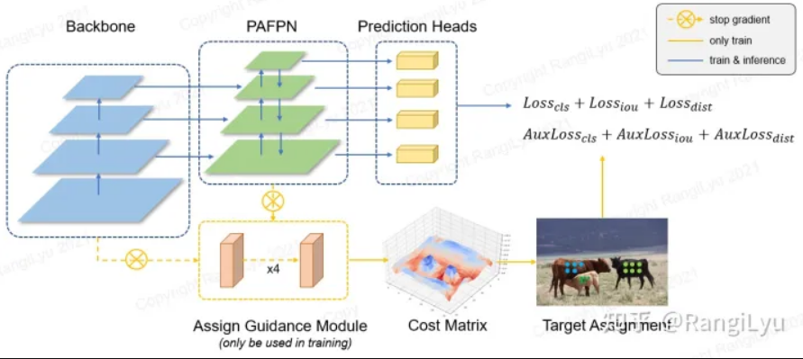
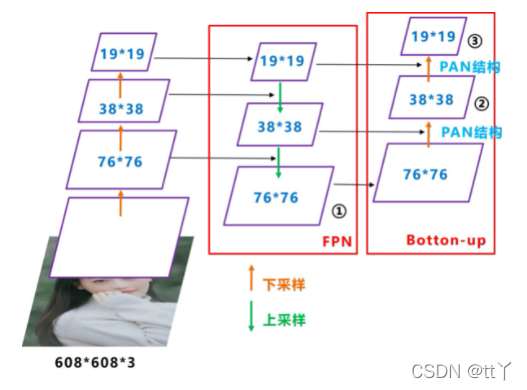
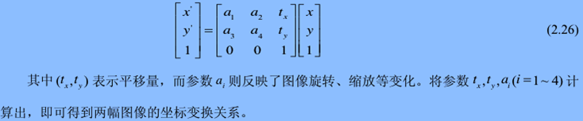
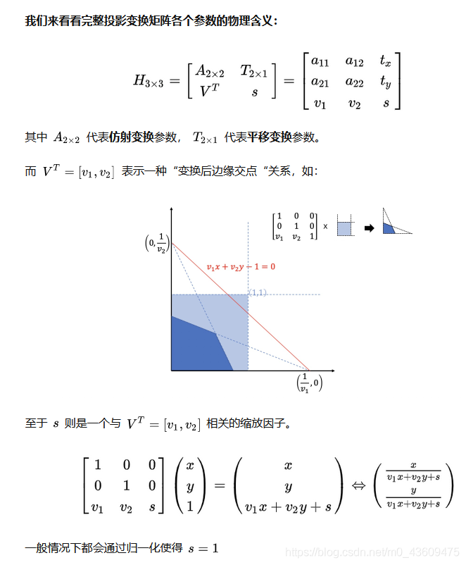
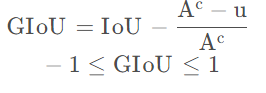

# Nanodet-Plus 从数据集、模型搭建到训练全流程解读

## 零. 前言

一直想给自己安排个解读nanodet的任务，来熟悉下`nanodet`的设计和源码。谁知道`nanodet-plus`在`2021`年就已经出现了，恰好前一阵刚看完`nanodet-plus`的源码，借着2023年这个清明节的假期，花上一下午时间梳理一下。

之前看到过以为哈工大的一位学生解读了模型框架和Loss部分，但是一年没有更新了。这么好的作品解读怎么可以烂尾，于是我决定借鉴一下其内容，为其补上一个开头和收尾。

本文相关资料：

1. 解读源码版本获取

    ```shell
    git clone -b 'v1.0.0' https://github.com/RangiLyu/nanodet.git --single-branch nanodet-plus
    ```

2. 作者知乎解读

    <https://zhuanlan.zhihu.com/p/449912627>


## 一. 模型整体结构解读和训练trick

NanoDet-Plus是一个单阶段的anchor-free模型，其整体架构设计基于FCOS模型,并将分类头和回归头改为GFL版本，去除了centerness分支，并加入了动态标签分配策略、GFL loss和辅助训练模块。

由于NanoDet-Plus轻量化的设计和非常小的参数量，在边缘设备和CPU设备上拥有可观的推理速度。

若读者读过mmdet代码后就知道，其代码可以看做mmdet的精简版本，可读性强扩展性高，是目标检测实践进阶到深入的不二选择。

Nanodet-Plus整体结构图如下：



打开`config/nanodet-plus-m_320.yaml`，其内容如下(仅展示模型部分)：


```yaml
# nanodet-plus-m_320
# COCO mAP(0.5:0.95) = 0.270
#             AP_50  = 0.418
#             AP_75  = 0.281
#           AP_small = 0.083
#               AP_m = 0.278
#               AP_l = 0.451
save_dir: workspace/nanodet-plus-m_320
model:
  weight_averager:
    name: ExpMovingAverager
    decay: 0.9998
  arch:
    name: NanoDetPlus
    detach_epoch: 10
    backbone:
      name: ShuffleNetV2
      model_size: 1.0x
      out_stages: [2,3,4]
      activation: LeakyReLU
    fpn:
      name: GhostPAN
      in_channels: [116, 232, 464]
      out_channels: 96
      kernel_size: 5
      num_extra_level: 1
      use_depthwise: True
      activation: LeakyReLU
    head:
      name: NanoDetPlusHead
      num_classes: 80
      input_channel: 96
      feat_channels: 96
      stacked_convs: 2
      kernel_size: 5
      strides: [8, 16, 32, 64]
      activation: LeakyReLU
      reg_max: 7
      norm_cfg:
        type: BN
      loss:
        loss_qfl:
          name: QualityFocalLoss
          use_sigmoid: True
          beta: 2.0
          loss_weight: 1.0
        loss_dfl:
          name: DistributionFocalLoss
          loss_weight: 0.25
        loss_bbox:
          name: GIoULoss
          loss_weight: 2.0
    # Auxiliary head, only use in training time.
    aux_head:
      name: SimpleConvHead
      num_classes: 80
      input_channel: 192
      feat_channels: 192
      stacked_convs: 4
      strides: [8, 16, 32, 64]
      activation: LeakyReLU
      reg_max: 7
```


首先整体框架依然是FCOS，下面分开解读

1. backbone：默认采用ShuffleNetV2 ，对移动端友好，作者给出的框架中也提供了其他backbone的接口
2. neck: neck部分采用PAFPN，简称PAN，这里需要注意的是默认采用Ghost Block组成的GhostPAN

相较于之前版本`nanodet`中neck在做特征融合时仅仅做加法，不采用任何卷积融合的激进做法，作者在`nanodet-plus`版本中加入轻量级的`GhostBlock`做特征融合。

1. head: 作者借鉴ThunderNet和PicoDet做法，采用如下改进
2. 检测头的depthwise卷积的卷积核大小也改成了5x5
3. 在`NanoDet`的3层特征基础上增加一层下采样特征
4. 辅助训练neck和head
5. 为模拟知识蒸馏，作者设计了**Assign Guidance Module**（可以看成辅助head），将其作为教师模型帮助本身head获得更好的训练。在模型训练前期，其产生的`cost matrix`作为模型真正head部分的标签分配器的输入。这里需要注意的是教师模型和学生模型共享backbone。AGM仅由**4个3x3的卷积**组成，使用GN作为Normalize层，并在不同尺度的Feature Map间**共享参数**（其实就是大模型的检测头）。
6. 辅助训练neck与模型本身neck相同，采用`self.aux_fpn = copy.deepcopy(self.fpn)`实现。
7. 辅助head采用比本身head相对复杂的检测头，目的是为了获取更加强大的表征能力，方便更好的引导学生模型。
8. 动态的软标签分配策略Dynamic Soft Label Assigner(DSLA)

使用AGM预测的分类概率和检测框会送入DSLA模块计算**Matching Cost**。Cost函数由三部分组成：classification cost，regression cost以及distance cost。cost矩阵会作为模型真正head部分标签分配时的参考，Dynamic Soft Label Assigner跟yolox中用的dynamic-k一样，仅仅是cost矩阵定义不一样。

个人解决哈工大学生画的结构图更为清晰，这里贴一下：



Backbone输出的feature送入两个Ghost PAN，其中一个是为AGM专门搭建的，另一个PAN和Head连接。

AGM会将两个PAN的输出拼接在一起作为输入(这样一方面可以在训练AGM的时候也对Head的PAN做了梯度回传参与训练，同时concat会增加特征的丰富度)。 AGM有两个分支，分别负责生成用作标签分配的cls_pred和reg_pred。

对于Ghost PAN中的不同层特征，AGM采用share head方式实现共享参数，大大减小了训练时的参数量。

AGM的输出在训练初期将会作为Head标签分配的参考，并且AGM的loss也会进行回传，帮助网络更快地收敛。 经过数个epoch(默认是10个)的训练后Head的预测已经有较好的准确度，此时将AGM模块分离，直接由Head的输出自行完成标签分配的任务。

下面给出模型整体搭建的代码`nanodet/model/arch/nanodet_plus.py`


```python
class NanoDetPlus(OneStageDetector):
    def __init__(
        self,
        backbone,
        fpn,
        aux_head,
        head,
        detach_epoch=0,
    ):
        super(NanoDetPlus, self).__init__(
            backbone_cfg=backbone, fpn_cfg=fpn, head_cfg=head
        )
        # 构造辅助训练fpn和AGM（即Head）
        self.aux_fpn = copy.deepcopy(self.fpn)
        self.aux_head = build_head(aux_head)
        # 指定多少epoch后不再采用aux head
        self.detach_epoch = detach_epoch

    def forward_train(self, gt_meta):
        img = gt_meta["img"]
        feat = self.backbone(img)
        fpn_feat = self.fpn(feat)
        # 当当前epoch大于等于detach_epoch时，采用detach方式，将aux_fpn与（backbone和fpn产生的feature）梯度回传隔离
        # 即此时对AGM的优化不会再影响backbone和fpn
        if self.epoch >= self.detach_epoch:
            aux_fpn_feat = self.aux_fpn([f.detach() for f in feat])
            dual_fpn_feat = (
                torch.cat([f.detach(), aux_f], dim=1)
                for f, aux_f in zip(fpn_feat, aux_fpn_feat)
            )
        else:
            aux_fpn_feat = self.aux_fpn(feat)
            dual_fpn_feat = (
                torch.cat([f, aux_f], dim=1) for f, aux_f in zip(fpn_feat, aux_fpn_feat)
            )
        head_out = self.head(fpn_feat)
        aux_head_out = self.aux_head(dual_fpn_feat)
        loss, loss_states = self.head.loss(head_out, gt_meta, aux_preds=aux_head_out)
        return head_out, loss, loss_states
```


在训练完成进行推理时，直接去除AGM和aux_fpn，得到非常精简的网络结构。

由于NanoDet是一个开源项目，而非刷点的论文，最终目的还是希望这个项目能够**对使用者更加友好**。上一代的NanoDet使用传统的SGD+momentum+MultiStepLr的方法训练模型。对老炼丹师来说，肯定还是觉得SGD比较香，配合MultiStepLr在第一阶段使用大学习率长时间训练后进行学习率衰减能有很大的涨幅。但是这种方法**对新手来说还是太难调了**！没有老炼丹师的经验，很容易导致模型不收敛或收敛不好。

因此，为了提升使用体验，NanoDet-Plus**全面改进了训练策略**：

* 优化器从SGD+momentum改成了对超参数更不敏感且收敛更快的**AdamW；**
* 学习率下降策略从MultiStepLr修改为了**CosineAnnealingLR；**
* 并且在反向传播计算梯度时加上了**梯度裁剪，**避免新手不会调参导致loss NAN；
* 除此之外，还加上了目前比较流行的模型平滑策略EMA。

## 二. 数据集代码解读

模型相关的`config/nanodet-plus-m_320.yaml`配置代码如下：


```yaml
data:
  train:
    name: CocoDataset
    img_path: coco/train2017
    ann_path: coco/annotations/instances_train2017.json
    input_size: [320,320] #[w,h]
    # 不保留长宽比
    keep_ratio: False
    pipeline:
      perspective: 0.0
      scale: [0.6, 1.4]
      # 错切
      stretch: [[0.8, 1.2], [0.8, 1.2]]
      rotation: 0
      shear: 0
      translate: 0.2
      flip: 0.5
      brightness: 0.2
      contrast: [0.6, 1.4]
      saturation: [0.5, 1.2]
      normalize: [[103.53, 116.28, 123.675], [57.375, 57.12, 58.395]]
  val:
    name: CocoDataset
    img_path: coco/val2017
    ann_path: coco/annotations/instances_val2017.json
    input_size: [320,320] #[w,h]
    keep_ratio: False
    pipeline:
      normalize: [[103.53, 116.28, 123.675], [57.375, 57.12, 58.395]]
```


数据处理的代码都在`nanodet/data`文件夹下面，首先基类`BaseDataset`的定义，在`BaseDataset`中


```python
class BaseDataset(Dataset, metaclass=ABCMeta):
    """
    A base class of detection dataset. Referring from MMDetection.
    A dataset should have images, annotations and preprocessing pipelines
    NanoDet use [xmin, ymin, xmax, ymax] format for box and
     [[x0,y0], [x1,y1] ... [xn,yn]] format for key points.
    instance masks should decode into binary masks for each instance like
    {
        'bbox': [xmin,ymin,xmax,ymax],
        'mask': mask
     }
    segmentation mask should decode into binary masks for each class.
    Args:
        img_path (str): image data folder
        ann_path (str): annotation file path or folder
        use_instance_mask (bool): load instance segmentation data
        use_seg_mask (bool): load semantic segmentation data
        use_keypoint (bool): load pose keypoint data
        load_mosaic (bool): using mosaic data augmentation from yolov4
        mode (str): 'train' or 'val' or 'test'
        multi_scale (Tuple[float, float]): Multi-scale factor range.
    """

    def __init__(
        self,
        img_path: str,
        ann_path: str,
        input_size: Tuple[int, int],
        pipeline: Dict,
        keep_ratio: bool = True,
        use_instance_mask: bool = False,
        use_seg_mask: bool = False,
        use_keypoint: bool = False,
        load_mosaic: bool = False,
        mode: str = "train",
        multi_scale: Optional[Tuple[float, float]] = None,
    ):
        assert mode in ["train", "val", "test"]
        self.img_path = img_path
        self.ann_path = ann_path
        self.input_size = input_size
        self.pipeline = Pipeline(pipeline, keep_ratio)
        self.keep_ratio = keep_ratio
        self.use_instance_mask = use_instance_mask
        self.use_seg_mask = use_seg_mask
        self.use_keypoint = use_keypoint
        self.load_mosaic = load_mosaic
        self.multi_scale = multi_scale
        self.mode = mode

        self.data_info = self.get_data_info(ann_path)

    def __len__(self):
        return len(self.data_info)

    def __getitem__(self, idx):
        if self.mode == "val" or self.mode == "test":
            return self.get_val_data(idx)
        else:
            while True:
                data = self.get_train_data(idx)
                if data is None:
                    idx = self.get_another_id()
                    continue
                return data

    @staticmethod
    def get_random_size(
        scale_range: Tuple[float, float], image_size: Tuple[int, int]
    ) -> Tuple[int, int]:
        """
        Get random image shape by multi-scale factor and image_size.
        Args:
            scale_range (Tuple[float, float]): Multi-scale factor range.
                Format in [(width, height), (width, height)]
            image_size (Tuple[int, int]): Image size. Format in (width, height).

        Returns:
            Tuple[int, int]
        """
        assert len(scale_range) == 2
        scale_factor = random.uniform(*scale_range)
        width = int(image_size[0] * scale_factor)
        height = int(image_size[1] * scale_factor)
        return width, height

    @abstractmethod
    def get_data_info(self, ann_path):
        pass

    @abstractmethod
    def get_train_data(self, idx):
        pass

    @abstractmethod
    def get_val_data(self, idx):
        pass

    def get_another_id(self):
        # 返回 [low,high] 之间的整数
        return np.random.random_integers(0, len(self.data_info) - 1)
```


定义`BaseDataset`基类，并定义一些抽象方法让子类去实现，同时定义三种模式，对于`train`模型下有如下逻辑


```python
while True:
    data = self.get_train_data(idx)
    if data is None:
        idx = self.get_another_id()
    continue
    return data
```


接下来，我们再看下`CocoDataset`中的具体实现


```python
class CocoDataset(BaseDataset):
    # 获取数据信息，在__init__中被调用，用于初始化数据标注信息，返回一个list，代表数据集
    def get_data_info(self, ann_path):
        """
        Load basic information of dataset such as image path, label and so on.
        :param ann_path: coco json file path
        :return: image info:
        [{'license': 2,
          'file_name': '000000000139.jpg',
          'coco_url': 'http://images.cocodataset.org/val2017/000000000139.jpg',
          'height': 426,
          'width': 640,
          'date_captured': '2013-11-21 01:34:01',
          'flickr_url':
              'http://farm9.staticflickr.com/8035/8024364858_9c41dc1666_z.jpg',
          'id': 139},
         ...
        ]
        """
        # 调用pycocotools中的COCO
        self.coco_api = COCO(ann_path)
        # 保证id顺序
        self.cat_ids = sorted(self.coco_api.getCatIds())
        # catid到label的转换（index）
        self.cat2label = {cat_id: i for i, cat_id in enumerate(self.cat_ids)}
        # 对一个catid对应的标注信息
        self.cats = self.coco_api.loadCats(self.cat_ids)
        self.class_names = [cat["name"] for cat in self.cats]
        # 加载图像id
        self.img_ids = sorted(self.coco_api.imgs.keys())
        # 加载全部图像标注信息（不会读取图像）
        img_info = self.coco_api.loadImgs(self.img_ids)
        # Note：self.img_ids中的idx与img_info中的index指向的元素信息是对齐的
        # 也就是self.data_info和self.img_ids长度一致，且指向元素信息对齐
        # 即 img_id为self.img_ids[i]的元素信息就在self.data_info[i]里面
        return img_info

    def get_per_img_info(self, idx):
        # 得到图像相关信息
        img_info = self.data_info[idx]
        file_name = img_info["file_name"]
        height = img_info["height"]
        width = img_info["width"]
        # 这里用id不好，会与id()函数冲突，读者可以理解为image_id
        id = img_info["id"]
        if not isinstance(id, int):
            raise TypeError("Image id must be int.")
        info = {"file_name": file_name, "height": height, "width": width, "id": id}
        return info

    def get_img_annotation(self, idx):
        """
        load per image annotation
        :param idx: index in dataloader
        :return: annotation dict
        """
        img_id = self.img_ids[idx]
        ann_ids = self.coco_api.getAnnIds([img_id])
        anns = self.coco_api.loadAnns(ann_ids)
        gt_bboxes = []
        gt_labels = []
        gt_bboxes_ignore = []
        if self.use_instance_mask:
            gt_masks = []
        if self.use_keypoint:
            gt_keypoints = []
        for ann in anns:
            # coco标注格式 left, top, width, height
            x1, y1, w, h = ann["bbox"]
            # 过滤无效框
            if ann["area"] <= 0 or w < 1 or h < 1:
                continue
            if ann["category_id"] not in self.cat_ids:
                continue
            # 转换为[left, top, right, bottom]格式
            bbox = [x1, y1, x1 + w, y1 + h]
            # 如果标注信息中`iscrowd`或者`ignore`为True，那么放入gt_bboxes_ignore
            if ann.get("iscrowd", False) or ann.get("ignore", False):
                gt_bboxes_ignore.append(bbox)
            else:
                gt_bboxes.append(bbox)
                # 将catid转换为需要分类的index
                gt_labels.append(self.cat2label[ann["category_id"]])
                if self.use_instance_mask:
                    gt_masks.append(self.coco_api.annToMask(ann))
                if self.use_keypoint:
                    gt_keypoints.append(ann["keypoints"])
        # 将gt_bboxes转换为np.array格式
        if gt_bboxes:
            gt_bboxes = np.array(gt_bboxes, dtype=np.float32)
            gt_labels = np.array(gt_labels, dtype=np.int64)
        else:
            gt_bboxes = np.zeros((0, 4), dtype=np.float32)
            gt_labels = np.array([], dtype=np.int64)
        if gt_bboxes_ignore:
            gt_bboxes_ignore = np.array(gt_bboxes_ignore, dtype=np.float32)
        else:
            gt_bboxes_ignore = np.zeros((0, 4), dtype=np.float32)
        annotation = dict(
            bboxes=gt_bboxes, labels=gt_labels, bboxes_ignore=gt_bboxes_ignore
        )
        if self.use_instance_mask:
            annotation["masks"] = gt_masks
        if self.use_keypoint:
            if gt_keypoints:
                annotation["keypoints"] = np.array(gt_keypoints, dtype=np.float32)
            else:
                annotation["keypoints"] = np.zeros((0, 51), dtype=np.float32)
        return annotation

    def get_train_data(self, idx):
        """
        Load image and annotation
        :param idx:
        :return: meta-data (a dict containing image, annotation and other information)
        """
        # 得到index=idx的相关图像信息和标注信息
        img_info = self.get_per_img_info(idx)
        file_name = img_info["file_name"]
        image_path = os.path.join(self.img_path, file_name)
        img = cv2.imread(image_path)
        if img is None:
            print("image {} read failed.".format(image_path))
            raise FileNotFoundError("Cant load image! Please check image path!")
        ann = self.get_img_annotation(idx)
        meta = dict(
            img=img,
            img_info=img_info,
            gt_bboxes=ann["bboxes"],
            gt_labels=ann["labels"],
            gt_bboxes_ignore=ann["bboxes_ignore"],
        )
        if self.use_instance_mask:
            meta["gt_masks"] = ann["masks"]
        if self.use_keypoint:
            meta["gt_keypoints"] = ann["keypoints"]

        input_size = self.input_size
        # 如果开启了multi_scale 就采样一次
        if self.multi_scale:
            input_size = self.get_random_size(self.multi_scale, input_size)

        # 注意：这也就是说数据预处理过程是在Dataset的的__getitem__方法中完成的
        # 这样做粒度更细
        meta = self.pipeline(self, meta, input_size)

        meta["img"] = torch.from_numpy(meta["img"].transpose(2, 0, 1))
        return meta

    def get_val_data(self, idx):
        """
        Currently no difference from get_train_data.
        Not support TTA(testing time augmentation) yet.
        :param idx:
        :return:
        """
        # TODO: support TTA
        return self.get_train_data(idx)
```


然后再看下`pipeline`是怎么做的，文件地址`nanodet\data\transform\pipeline.py`


```python
class Pipeline:
    """Data process pipeline. Apply augmentation and pre-processing on
    meta_data from dataset.

    Args:
        cfg (Dict): Data pipeline config.
        keep_ratio (bool): Whether to keep aspect ratio when resizing image.

    """

    def __init__(self, cfg: Dict, keep_ratio: bool):
        # 从cfg字典中构造`ShapeTransform`和`color_aug_and_norm`
        self.shape_transform = ShapeTransform(keep_ratio, **cfg)
        self.color = functools.partial(color_aug_and_norm, kwargs=cfg)

    def __call__(self, dataset: Dataset, meta: Dict, dst_shape: Tuple[int, int]):
        meta = self.shape_transform(meta, dst_shape=dst_shape)
        meta = self.color(meta=meta)
        return meta
```


然后看下`ShapeTransform`和`color_aug_and_norm`这两个类和函数：

`ShapeTransform`主要做一些形状上的变换，主要通过仿射变换实现。

仿射变换可以通过一系列的原子变换的复合来实现，包括：平移（Translation）、缩放（Scale）、翻转（Flip）、旋转（Rotation）和剪切（Shear）。

仿射变换可以实现平移缩放和旋转，如果用到第三列的话还可以实现透视变换(也叫投影变换)。

如果对这块不懂得同学可以看下矩阵论和数字图像处理。

仿射变换可以用下面公式表示：



投影变换公式如下：




```python
# Copyright 2021 RangiLyu.
#
# Licensed under the Apache License, Version 2.0 (the "License");
# you may not use this file except in compliance with the License.
# You may obtain a copy of the License at
#
#     http://www.apache.org/licenses/LICENSE-2.0
#
# Unless required by applicable law or agreed to in writing, software
# distributed under the License is distributed on an "AS IS" BASIS,
# WITHOUT WARRANTIES OR CONDITIONS OF ANY KIND, either express or implied.
# See the License for the specific language governing permissions and
# limitations under the License.

import math
import random
from typing import Dict, Optional, Tuple

import cv2
import numpy as np


def get_flip_matrix(prob=0.5):
    # 建立3x3的单位数组
    # 注意坐标变化
    # x_new = a1 * x + a2 * y + t_x
    #       = a1 * x （其余都是0）
    # 这里把a1变成了负一就代表
    # x_new = -x
    # 即沿着y轴对称翻转
    """
    array([[1., 0., 0.],
           [0., 1., 0.],
           [0., 0., 1.]])
    """
    F = np.eye(3)
    if random.random() < prob:
        F[0, 0] = -1
    return F


def get_perspective_matrix(perspective=0.0):
    """

    :param perspective:
    :return:
    """
    P = np.eye(3)
    # 建立3x3的单位数组
    # 注意坐标变化
    # 第三行的第一二列不是0时，做透视变换
    P[2, 0] = random.uniform(-perspective, perspective)  # x perspective (about y)
    P[2, 1] = random.uniform(-perspective, perspective)  # y perspective (about x)
    return P


def get_rotation_matrix(degree=0.0):
    """

    :param degree:
    :return:
    """
    # 建立3x3的单位数组
    # 注意坐标变化
    # 得到角度a后，采用opencv计算旋转矩阵
    # 如何得到旋转矩阵可以参考
    # https://zhuanlan.zhihu.com/p/533911656
    R = np.eye(3)
    a = random.uniform(-degree, degree)
    R[:2] = cv2.getRotationMatrix2D(angle=a, center=(0, 0), scale=1)
    return R


def get_scale_matrix(ratio=(1, 1)):
    """

    :param ratio:
    """
    # 建立3x3的单位数组
    # 对对角线上元素进行更改即可得到缩放后的变换
    Scl = np.eye(3)
    scale = random.uniform(*ratio)
    Scl[0, 0] *= scale
    Scl[1, 1] *= scale
    return Scl


def get_stretch_matrix(width_ratio=(1, 1), height_ratio=(1, 1)):
    """

    :param width_ratio:
    :param height_ratio:
    """
    # 非等比例缩放
    Str = np.eye(3)
    Str[0, 0] *= random.uniform(*width_ratio)
    Str[1, 1] *= random.uniform(*height_ratio)
    return Str


def get_shear_matrix(degree):
    """

    :param degree:
    :return:
    """
    # 错切矩阵
    # 参考资料
    # https://blog.csdn.net/weixin_44878336/article/details/124902173
    Sh = np.eye(3)
    Sh[0, 1] = math.tan(
        random.uniform(-degree, degree) * math.pi / 180
    )  # x shear (deg)
    Sh[1, 0] = math.tan(
        random.uniform(-degree, degree) * math.pi / 180
    )  # y shear (deg)
    return Sh


def get_translate_matrix(translate, width, height):
    """

    :param translate:
    :return:
    """
    # 平移变换
    T = np.eye(3)
    T[0, 2] = random.uniform(0.5 - translate, 0.5 + translate) * width  # x translation
    T[1, 2] = random.uniform(0.5 - translate, 0.5 + translate) * height  # y translation
    return T


def get_resize_matrix(raw_shape, dst_shape, keep_ratio):
    """
    Get resize matrix for resizing raw img to input size
    :param raw_shape: (width, height) of raw image
    :param dst_shape: (width, height) of input image
    :param keep_ratio: whether keep original ratio
    :return: 3x3 Matrix
    """
    # 获取resize matrix 用于将原图缩放到所需要的大小
    r_w, r_h = raw_shape
    d_w, d_h = dst_shape
    Rs = np.eye(3)
    if keep_ratio:
        C = np.eye(3)
        C[0, 2] = -r_w / 2
        C[1, 2] = -r_h / 2

        if r_w / r_h < d_w / d_h:
            ratio = d_h / r_h
        else:
            ratio = d_w / r_w
        Rs[0, 0] *= ratio
        Rs[1, 1] *= ratio

        T = np.eye(3)
        T[0, 2] = 0.5 * d_w
        T[1, 2] = 0.5 * d_h
        # 拆解动作：先对原图平移 然后 缩放 最后平移回去
        return T @ Rs @ C
    else:
        Rs[0, 0] *= d_w / r_w
        Rs[1, 1] *= d_h / r_h
        return Rs


def warp_boxes(boxes, M, width, height):
    n = len(boxes)
    # 针对bboxes做相同的变化
    if n:
        # warp points 每一行元素包括 x y 1
        xy = np.ones((n * 4, 3))

        xy[:, :2] = boxes[:, [0, 1, 2, 3, 0, 3, 2, 1]].reshape(
            n * 4, 2
        )  # x1y1, x2y2, x1y2, x2y1
        # 按理说应该是 M @ xy
        # 要求xy形状为(3,N) 但是这里xy转置了，故M也转置
        xy = xy @ M.T  # transform
        # 归一化
        xy = (xy[:, :2] / xy[:, 2:3]).reshape(n, 8)  # rescale
        # create new boxes
        x = xy[:, [0, 2, 4, 6]]
        y = xy[:, [1, 3, 5, 7]]
        xy = np.concatenate((x.min(1), y.min(1), x.max(1), y.max(1))).reshape(4, n).T
        # clip boxes
        xy[:, [0, 2]] = xy[:, [0, 2]].clip(0, width)
        xy[:, [1, 3]] = xy[:, [1, 3]].clip(0, height)
        return xy.astype(np.float32)
    else:
        return boxes


def get_minimum_dst_shape(
    src_shape: Tuple[int, int],
    dst_shape: Tuple[int, int],
    divisible: Optional[int] = None,
) -> Tuple[int, int]:
    """Calculate minimum dst shape"""
    src_w, src_h = src_shape
    dst_w, dst_h = dst_shape

    if src_w / src_h < dst_w / dst_h:
        ratio = dst_h / src_h
    else:
        ratio = dst_w / src_w

    dst_w = int(ratio * src_w)
    dst_h = int(ratio * src_h)

    if divisible and divisible > 0:
        dst_w = max(divisible, int((dst_w + divisible - 1) // divisible * divisible))
        dst_h = max(divisible, int((dst_h + divisible - 1) // divisible * divisible))
    return dst_w, dst_h


class ShapeTransform:
    """Shape transforms including resize, random perspective, random scale,
    random stretch, random rotation, random shear, random translate,
    and random flip.

    Args:
        keep_ratio: Whether to keep aspect ratio of the image.
        divisible: Make image height and width is divisible by a number.
        perspective: Random perspective factor.
        scale: Random scale ratio.
        stretch: Width and height stretch ratio range.
        rotation: Random rotate degree.
        shear: Random shear degree.
        translate: Random translate ratio.
        flip: Random flip probability.
    """

    def __init__(
        self,
        keep_ratio: bool,
        divisible: int = 0,
        perspective: float = 0.0,
        scale: Tuple[int, int] = (1, 1),
        stretch: Tuple = ((1, 1), (1, 1)),
        rotation: float = 0.0,
        shear: float = 0.0,
        translate: float = 0.0,
        flip: float = 0.0,
        **kwargs
    ):
        self.keep_ratio = keep_ratio
        self.divisible = divisible
        self.perspective = perspective
        self.scale_ratio = scale
        self.stretch_ratio = stretch
        self.rotation_degree = rotation
        self.shear_degree = shear
        self.flip_prob = flip
        self.translate_ratio = translate

    def __call__(self, meta_data, dst_shape):
        raw_img = meta_data["img"]
        height = raw_img.shape[0]  # shape(h,w,c)
        width = raw_img.shape[1]

        # center
        # 将图像中心移动到坐标原点
        C = np.eye(3)
        C[0, 2] = -width / 2
        C[1, 2] = -height / 2

        P = get_perspective_matrix(self.perspective)
        C = P @ C

        Scl = get_scale_matrix(self.scale_ratio)
        C = Scl @ C

        Str = get_stretch_matrix(*self.stretch_ratio)
        C = Str @ C

        R = get_rotation_matrix(self.rotation_degree)
        C = R @ C

        Sh = get_shear_matrix(self.shear_degree)
        C = Sh @ C

        F = get_flip_matrix(self.flip_prob)
        C = F @ C

        T = get_translate_matrix(self.translate_ratio, width, height)
        M = T @ C

        if self.keep_ratio:
            dst_shape = get_minimum_dst_shape(
                (width, height), dst_shape, self.divisible
            )

        ResizeM = get_resize_matrix((width, height), dst_shape, self.keep_ratio)
        M = ResizeM @ M
        img = cv2.warpPerspective(raw_img, M, dsize=tuple(dst_shape))
        meta_data["img"] = img
        meta_data["warp_matrix"] = M
        if "gt_bboxes" in meta_data:
            boxes = meta_data["gt_bboxes"]
            meta_data["gt_bboxes"] = warp_boxes(boxes, M, dst_shape[0], dst_shape[1])
        if "gt_bboxes_ignore" in meta_data:
            bboxes_ignore = meta_data["gt_bboxes_ignore"]
            meta_data["gt_bboxes_ignore"] = warp_boxes(
                bboxes_ignore, M, dst_shape[0], dst_shape[1]
            )
        if "gt_masks" in meta_data:
            for i, mask in enumerate(meta_data["gt_masks"]):
                meta_data["gt_masks"][i] = cv2.warpPerspective(
                    mask, M, dsize=tuple(dst_shape)
                )

        return meta_data
```


通过对变化矩阵的计算，作者将一系列形状上的变换转换为变换矩阵的乘法形式。同时将变换矩阵存下来，通过求逆的形式就可以得到逆变换。

下面讲解颜色变化`color_aug_and_norm`函数(在`nanodet\data\transform\color.py`)


```python
def random_brightness(img, delta):
    # 整体加上某个值即为增加亮度
    img += random.uniform(-delta, delta)
    return img


def random_contrast(img, alpha_low, alpha_up):
    # 对比度
    img *= random.uniform(alpha_low, alpha_up)
    return img


def random_saturation(img, alpha_low, alpha_up):
    hsv_img = cv2.cvtColor(img.astype(np.float32), cv2.COLOR_BGR2HSV)
    # S 通道即为饱和度
    hsv_img[..., 1] *= random.uniform(alpha_low, alpha_up)
    img = cv2.cvtColor(hsv_img, cv2.COLOR_HSV2BGR)
    return img


def _normalize(img, mean, std):
    mean = np.array(mean, dtype=np.float32).reshape(1, 1, 3) / 255
    std = np.array(std, dtype=np.float32).reshape(1, 1, 3) / 255
    img = (img - mean) / std
    return img


def color_aug_and_norm(meta, kwargs):
    img = meta["img"].astype(np.float32) / 255

    if "brightness" in kwargs and random.randint(0, 1):
        img = random_brightness(img, kwargs["brightness"])

    if "contrast" in kwargs and random.randint(0, 1):
        img = random_contrast(img, *kwargs["contrast"])

    if "saturation" in kwargs and random.randint(0, 1):
        img = random_saturation(img, *kwargs["saturation"])
    # cv2.imshow('trans', img)
    # cv2.waitKey(0)
    # 归一化
    img = _normalize(img, *kwargs["normalize"])
    meta["img"] = img
    return meta
```


我们可以看到在`nanodet\data`下面还有`batch_process.py`和`collate.py`这两个文件，看名字应该是服务于Dataloader的，这个将在训练与评估环节进行解读。

## 三. 模型构建代码解读

再看模型定义yaml相关内容


```yaml
# nanodet-plus-m_320
# COCO mAP(0.5:0.95) = 0.270
#             AP_50  = 0.418
#             AP_75  = 0.281
#           AP_small = 0.083
#               AP_m = 0.278
#               AP_l = 0.451
save_dir: workspace/nanodet-plus-m_320
model:
  weight_averager:
    name: ExpMovingAverager
    decay: 0.9998
  arch:
    name: NanoDetPlus
    detach_epoch: 10
    backbone:
      name: ShuffleNetV2
      model_size: 1.0x
      out_stages: [2,3,4]
      activation: LeakyReLU
    fpn:
      name: GhostPAN
      in_channels: [116, 232, 464]
      out_channels: 96
      kernel_size: 5
      num_extra_level: 1
      use_depthwise: True
      activation: LeakyReLU
    head:
      name: NanoDetPlusHead
      num_classes: 80
      input_channel: 96
      feat_channels: 96
      stacked_convs: 2
      kernel_size: 5
      strides: [8, 16, 32, 64]
      activation: LeakyReLU
      reg_max: 7
      norm_cfg:
        type: BN
      loss:
        loss_qfl:
          name: QualityFocalLoss
          use_sigmoid: True
          beta: 2.0
          loss_weight: 1.0
        loss_dfl:
          name: DistributionFocalLoss
          loss_weight: 0.25
        loss_bbox:
          name: GIoULoss
          loss_weight: 2.0
    # Auxiliary head, only use in training time.
    aux_head:
      name: SimpleConvHead
      num_classes: 80
      input_channel: 192
      feat_channels: 192
      stacked_convs: 4
      strides: [8, 16, 32, 64]
      activation: LeakyReLU
      reg_max: 7
```


`NanoDetPlusHead`的代码解读已经在前面介绍过了，下面看一下`ShuffleNetV2`部分（`nanodet\model\backbone\shufflenetv2.py`）：


```python
def channel_shuffle(x, groups):
    # type: (torch.Tensor, int) -> torch.Tensor
    # B, C, H, W 
    batchsize, num_channels, height, width = x.data.size()
    # 将C 通道拆分为 groups 组，每一组有channels_per_group个元素
    channels_per_group = num_channels // groups

    # reshape
    x = x.view(batchsize, groups, channels_per_group, height, width)

    # 行列互换
    x = torch.transpose(x, 1, 2).contiguous()

    # flatten 打平处理
    x = x.view(batchsize, -1, height, width)

    # 之前是 
    # X1 X2 X3 X4 X5 X6
    # 假设分成了两组
    # 两行三列表示为
    # X1 X2 X3
    # X4 X5 X6
    # 转置后为
    # X1 X4
    # X2 X5
    # X3 X6
    # 打平处理后为
    # X1 X4 X2 X5 X3 X6    
    return x


class ShuffleNetV2(nn.Module):
    # 省略部分函数
    # ...
    def forward(self, x):
        x = self.conv1(x)
        x = self.maxpool(x)
        output = []
        for i in range(2, 5):
            stage = getattr(self, "stage{}".format(i))
            x = stage(x)
            if i in self.out_stages:
                output.append(x)
        # 返回 stage3 - stage5的特征
        return tuple(output)
```


先给出`GhostBottleneck`的定义（`nanodet/model/backbone/ghostnet.py`）


```python
class GhostModule(nn.Module):
    def __init__(
        self, inp, oup, kernel_size=1, ratio=2, dw_size=3, stride=1, activation="ReLU"
    ):
        super(GhostModule, self).__init__()
        self.oup = oup
        # 预先生成 init_channels 个
        init_channels = math.ceil(oup / ratio)
        new_channels = init_channels * (ratio - 1)

        self.primary_conv = nn.Sequential(
            nn.Conv2d(
                inp, init_channels, kernel_size, stride, kernel_size // 2, bias=False
            ),
            nn.BatchNorm2d(init_channels),
            act_layers(activation) if activation else nn.Sequential(),
        )

        # groups = init_channels 表示
        # 对于init_channels个通道，每个通道都有 new_channels / init_channels 个计算而来的特征
        self.cheap_operation = nn.Sequential(
            nn.Conv2d(
                init_channels,
                new_channels,
                dw_size,
                1,
                dw_size // 2,
                groups=init_channels,
                bias=False,
            ),
            nn.BatchNorm2d(new_channels),
            act_layers(activation) if activation else nn.Sequential(),
        )

    def forward(self, x):
        x1 = self.primary_conv(x)
        x2 = self.cheap_operation(x1)
        # out 有 primary_conv 和 cheap_operation计算而来
        out = torch.cat([x1, x2], dim=1)
        return out


class GhostBottleneck(nn.Module):
    """Ghost bottleneck w/ optional SE"""

    def __init__(
        self,
        in_chs,
        mid_chs,
        out_chs,
        dw_kernel_size=3,
        stride=1,
        activation="ReLU",
        se_ratio=0.0,
    ):
        super(GhostBottleneck, self).__init__()
        has_se = se_ratio is not None and se_ratio > 0.0
        self.stride = stride

        # Point-wise expansion
        self.ghost1 = GhostModule(in_chs, mid_chs, activation=activation)

        # Depth-wise convolution
        if self.stride > 1:
            self.conv_dw = nn.Conv2d(
                mid_chs,
                mid_chs,
                dw_kernel_size,
                stride=stride,
                padding=(dw_kernel_size - 1) // 2,
                groups=mid_chs,
                bias=False,
            )
            self.bn_dw = nn.BatchNorm2d(mid_chs)

        # Squeeze-and-excitation
        if has_se:
            self.se = SqueezeExcite(mid_chs, se_ratio=se_ratio)
        else:
            self.se = None

        # Point-wise linear projection
        self.ghost2 = GhostModule(mid_chs, out_chs, activation=None)

        # shortcut
        if in_chs == out_chs and self.stride == 1:
            self.shortcut = nn.Sequential()
        else:
            self.shortcut = nn.Sequential(
                nn.Conv2d(
                    in_chs,
                    in_chs,
                    dw_kernel_size,
                    stride=stride,
                    padding=(dw_kernel_size - 1) // 2,
                    groups=in_chs,
                    bias=False,
                ),
                nn.BatchNorm2d(in_chs),
                nn.Conv2d(in_chs, out_chs, 1, stride=1, padding=0, bias=False),
                nn.BatchNorm2d(out_chs),
            )

    def forward(self, x):
        residual = x

        # 1st ghost bottleneck
        x = self.ghost1(x)

        # Depth-wise convolution
        if self.stride > 1:
            x = self.conv_dw(x)
            x = self.bn_dw(x)

        # Squeeze-and-excitation
        if self.se is not None:
            x = self.se(x)

        # 2nd ghost bottleneck
        x = self.ghost2(x)

        x += self.shortcut(residual)
        return x
```


在`GhostModule`中需要注意的是感受野的增大是由`cheap_operation`完成的，实际上其并不`cheap`。

`primary_conv`采用1x1卷积，并不改变感受野，仅仅提供一个通道间信息融合的作用。

下面看一下`GhostPAN`(`nanodet\model\fpn\ghost_pan.py`)

先给出PAN的结构图


```python
class GhostBlocks(nn.Module):
    """Stack of GhostBottleneck used in GhostPAN.

    Args:
        in_channels (int): Number of input channels.
        out_channels (int): Number of output channels.
        expand (int): Expand ratio of GhostBottleneck. Default: 1.
        kernel_size (int): Kernel size of depthwise convolution. Default: 5.
        num_blocks (int): Number of GhostBottlecneck blocks. Default: 1.
        use_res (bool): Whether to use residual connection. Default: False.
        activation (str): Name of activation function. Default: LeakyReLU.
    """

    def __init__(
        self,
        in_channels,
        out_channels,
        expand=1,
        kernel_size=5,
        num_blocks=1,
        use_res=False,
        activation="LeakyReLU",
    ):
        super(GhostBlocks, self).__init__()
        self.use_res = use_res
        if use_res:
            self.reduce_conv = ConvModule(
                in_channels,
                out_channels,
                kernel_size=1,
                stride=1,
                padding=0,
                activation=activation,
            )
        blocks = []
        for _ in range(num_blocks):
            blocks.append(
                # in_chs, mid_chs, out_chs,
                # 这里需要注意的是 dw_kernel_size 仅仅控制 shortcut DW卷积的卷积核的大小
                GhostBottleneck(
                    in_channels,
                    int(out_channels * expand),
                    out_channels,
                    dw_kernel_size=kernel_size,
                    activation=activation,
                )
            )
        self.blocks = nn.Sequential(*blocks)

    def forward(self, x):
        out = self.blocks(x)
        if self.use_res:
            out = out + self.reduce_conv(x)
        return out


class GhostPAN(nn.Module):
    """Path Aggregation Network with Ghost block.

    Args:
        in_channels (List[int]): Number of input channels per scale.
        out_channels (int): Number of output channels (used at each scale)
        num_csp_blocks (int): Number of bottlenecks in CSPLayer. Default: 3
        use_depthwise (bool): Whether to depthwise separable convolution in
            blocks. Default: False
        kernel_size (int): Kernel size of depthwise convolution. Default: 5.
        expand (int): Expand ratio of GhostBottleneck. Default: 1.
        num_blocks (int): Number of GhostBottlecneck blocks. Default: 1.
        use_res (bool): Whether to use residual connection. Default: False.
        num_extra_level (int): Number of extra conv layers for more feature levels.
            Default: 0.
        upsample_cfg (dict): Config dict for interpolate layer.
            Default: `dict(scale_factor=2, mode='nearest')`
        norm_cfg (dict): Config dict for normalization layer.
            Default: dict(type='BN')
        activation (str): Activation layer name.
            Default: LeakyReLU.
    """

    def __init__(
        self,
        in_channels,
        out_channels,
        use_depthwise=False,
        kernel_size=5,
        expand=1,
        num_blocks=1,
        use_res=False,
        num_extra_level=0,
        upsample_cfg=dict(scale_factor=2, mode="bilinear"),
        norm_cfg=dict(type="BN"),
        activation="LeakyReLU",
    ):
        super(GhostPAN, self).__init__()
        assert num_extra_level >= 0
        assert num_blocks >= 1
        self.in_channels = in_channels
        self.out_channels = out_channels

        conv = DepthwiseConvModule if use_depthwise else ConvModule

        # build top-down blocks
        self.upsample = nn.Upsample(**upsample_cfg)
        self.reduce_layers = nn.ModuleList()
        for idx in range(len(in_channels)):
            self.reduce_layers.append(
                ConvModule(
                    in_channels[idx],
                    out_channels,
                    1,
                    norm_cfg=norm_cfg,
                    activation=activation,
                )
            )
        self.top_down_blocks = nn.ModuleList()
        for idx in range(len(in_channels) - 1, 0, -1):
            self.top_down_blocks.append(
                GhostBlocks(
                    out_channels * 2,
                    out_channels,
                    expand,
                    kernel_size=kernel_size,
                    num_blocks=num_blocks,
                    use_res=use_res,
                    activation=activation,
                )
            )

        # build bottom-up blocks
        self.downsamples = nn.ModuleList()
        self.bottom_up_blocks = nn.ModuleList()
        for idx in range(len(in_channels) - 1):
            self.downsamples.append(
                conv(
                    out_channels,
                    out_channels,
                    kernel_size,
                    stride=2,
                    padding=kernel_size // 2,
                    norm_cfg=norm_cfg,
                    activation=activation,
                )
            )
            self.bottom_up_blocks.append(
                GhostBlocks(
                    out_channels * 2,
                    out_channels,
                    expand,
                    kernel_size=kernel_size,
                    num_blocks=num_blocks,
                    use_res=use_res,
                    activation=activation,
                )
            )

        # extra layers
        self.extra_lvl_in_conv = nn.ModuleList()
        self.extra_lvl_out_conv = nn.ModuleList()
        for i in range(num_extra_level):
            self.extra_lvl_in_conv.append(
                conv(
                    out_channels,
                    out_channels,
                    kernel_size,
                    stride=2,
                    padding=kernel_size // 2,
                    norm_cfg=norm_cfg,
                    activation=activation,
                )
            )
            self.extra_lvl_out_conv.append(
                conv(
                    out_channels,
                    out_channels,
                    kernel_size,
                    stride=2,
                    padding=kernel_size // 2,
                    norm_cfg=norm_cfg,
                    activation=activation,
                )
            )

    def forward(self, inputs):
        """
        Args:
            inputs (tuple[Tensor]): input features.
        Returns:
            tuple[Tensor]: multi level features.
        """
        assert len(inputs) == len(self.in_channels)
        inputs = [
            reduce(input_x) for input_x, reduce in zip(inputs, self.reduce_layers)
        ]
        # inputs 分别代表 P3-P5
        # 分辨率依次减小

        # top-down path
        inner_outs = [inputs[-1]]
        for idx in range(len(self.in_channels) - 1, 0, -1):
            feat_heigh = inner_outs[0]
            feat_low = inputs[idx - 1]

            inner_outs[0] = feat_heigh

            # 对低分辨率特征图进行线性插值
            upsample_feat = self.upsample(feat_heigh)

            # 在高分辨率level上对特征concat然后送入GhostBlocks进行融合
            inner_out = self.top_down_blocks[len(self.in_channels) - 1 - idx](
                torch.cat([upsample_feat, feat_low], 1)
            )
            # 保持高分辨率靠前，低分辨率靠后
            inner_outs.insert(0, inner_out)

        # bottom-up path
        outs = [inner_outs[0]]
        for idx in range(len(self.in_channels) - 1):
            feat_low = outs[-1]
            feat_height = inner_outs[idx + 1]
            # 对高分辨率图像进行下采样
            downsample_feat = self.downsamples[idx](feat_low)
            out = self.bottom_up_blocks[idx](
                torch.cat([downsample_feat, feat_height], 1)
            )
            # 始终维持高分辨率靠前，低分率靠后
            outs.append(out)

        # extra layers
        for extra_in_layer, extra_out_layer in zip(
            self.extra_lvl_in_conv, self.extra_lvl_out_conv
        ):
            # 对 最后一个低分辨率进行下采样后得到更低的分辨率特征用于计算
            # 从Picodet得到的经验
            outs.append(extra_in_layer(inputs[-1]) + extra_out_layer(outs[-1]))

        return tuple(outs)
```


从源码可以看出PAFPN的输出一共有四层，即原来的三层外加对之前三层中最低分辨率下采样得到的特征。

下面再看下Head部分，首先介绍`NanoDetPlusHead`(`nanodet/model/head/nanodet_plus_head.py`)

这里仅给出模型的搭建和前向传播部分，loss计算等功能下小结在给出。


```python
class NanoDetPlusHead(nn.Module):
    """Detection head used in NanoDet-Plus.

    Args:
        num_classes (int): Number of categories excluding the background
            category.
        loss (dict): Loss config.
        input_channel (int): Number of channels of the input feature.
        feat_channels (int): Number of channels of the feature.
            Default: 96.
        stacked_convs (int): Number of conv layers in the stacked convs.
            Default: 2.
        kernel_size (int): Size of the convolving kernel. Default: 5.
        strides (list[int]): Strides of input multi-level feature maps.
            Default: [8, 16, 32].
        conv_type (str): Type of the convolution.
            Default: "DWConv".
        norm_cfg (dict): Dictionary to construct and config norm layer.
            Default: dict(type='BN').
        reg_max (int): The maximal value of the discrete set. Default: 7.
        activation (str): Type of activation function. Default: "LeakyReLU".
        assigner_cfg (dict): Config dict of the assigner. Default: dict(topk=13).
    """

    def __init__(
        self,
        num_classes,
        loss,
        input_channel,
        feat_channels=96,
        stacked_convs=2,
        kernel_size=5,
        strides=[8, 16, 32],
        conv_type="DWConv",
        norm_cfg=dict(type="BN"),
        reg_max=7,
        activation="LeakyReLU",
        assigner_cfg=dict(topk=13),
        **kwargs
    ):
        super(NanoDetPlusHead, self).__init__()
        self.num_classes = num_classes
        self.in_channels = input_channel
        self.feat_channels = feat_channels
        self.stacked_convs = stacked_convs
        self.kernel_size = kernel_size
        self.strides = strides
        self.reg_max = reg_max
        self.activation = activation
        # 默认使用DepthwiseConvModule
        self.ConvModule = ConvModule if conv_type == "Conv" else DepthwiseConvModule

        self.loss_cfg = loss
        self.norm_cfg = norm_cfg

        self.assigner = DynamicSoftLabelAssigner(**assigner_cfg)
        # 根据输出的框分布进行积分,得到最终的位置值
        self.distribution_project = Integral(self.reg_max)

        # 联合了分类和框的质量估计表示
        self.loss_qfl = QualityFocalLoss(
            beta=self.loss_cfg.loss_qfl.beta,
            loss_weight=self.loss_cfg.loss_qfl.loss_weight,
        )
        # 初始化参数中reg_max的由来,在对应模块中进行了详细的介绍
        self.loss_dfl = DistributionFocalLoss(
            loss_weight=self.loss_cfg.loss_dfl.loss_weight
        )
        self.loss_bbox = GIoULoss(loss_weight=self.loss_cfg.loss_bbox.loss_weight)
        self._init_layers()
        self.init_weights()

    def _init_layers(self):
        self.cls_convs = nn.ModuleList()
        for _ in self.strides:
            # 为每个stride的创建一个head head参数之间不共享
            cls_convs = self._buid_not_shared_head()
            self.cls_convs.append(cls_convs)

        self.gfl_cls = nn.ModuleList(
            [
                nn.Conv2d(
                    self.feat_channels,
                    # 分类输出 + bbox回归输出 4 代表4 个距离，
                    # (self.reg_max + 1)代表 GFL中 对 box表示的坐标的值的概率分布
                    self.num_classes + 4 * (self.reg_max + 1),
                    1,
                    padding=0,
                )
                for _ in self.strides
            ]
        )

    def _buid_not_shared_head(self):
        cls_convs = nn.ModuleList()
        for i in range(self.stacked_convs):
            # 第一层要和PAN的输出对齐通道
            chn = self.in_channels if i == 0 else self.feat_channels
            cls_convs.append(
                self.ConvModule(
                    chn,
                    self.feat_channels,
                    self.kernel_size,
                    stride=1,
                    padding=self.kernel_size // 2,
                    norm_cfg=self.norm_cfg,
                    bias=self.norm_cfg is None,
                    activation=self.activation,
                )
            )
        return cls_convs

    def init_weights(self):
        for m in self.cls_convs.modules():
            if isinstance(m, nn.Conv2d):
                normal_init(m, std=0.01)
        # init cls head with confidence = 0.01
        bias_cls = -4.595
        for i in range(len(self.strides)):
            normal_init(self.gfl_cls[i], std=0.01, bias=bias_cls)
        print("Finish initialize NanoDet-Plus Head.")

    def forward(self, feats):
        if torch.onnx.is_in_onnx_export():
            return self._forward_onnx(feats)
        outputs = []
        for feat, cls_convs, gfl_cls in zip(
            feats,
            self.cls_convs,
            self.gfl_cls,
        ):
            for conv in cls_convs:
                feat = conv(feat)
            output = gfl_cls(feat)
            outputs.append(output.flatten(start_dim=2))
        # 输出 B, number of bboxes, (num_classes + 4 * (self.reg_max + 1))
        outputs = torch.cat(outputs, dim=2).permute(0, 2, 1)
        return outputs
```


这里要注意的是head的strides是四个，在配置文件中可以看到如下，这一点也和PAFAN输出相吻合。


```ini
strides: [8, 16, 32, 64]
```


下面来看`SimpleConvHead`的构造代码（`nanodet/model/head/simple_conv_head.py`）


```python
class SimpleConvHead(nn.Module):
    def __init__(
        self,
        num_classes,
        input_channel,
        feat_channels=256,
        stacked_convs=4,
        strides=[8, 16, 32],
        conv_cfg=None,
        norm_cfg=dict(type="GN", num_groups=32, requires_grad=True),
        activation="LeakyReLU",
        reg_max=16,
        **kwargs
    ):
        super(SimpleConvHead, self).__init__()
        self.num_classes = num_classes
        self.in_channels = input_channel
        self.feat_channels = feat_channels
        self.stacked_convs = stacked_convs
        self.strides = strides
        self.reg_max = reg_max

        self.conv_cfg = conv_cfg
        self.norm_cfg = norm_cfg
        self.activation = activation
        self.cls_out_channels = num_classes

        self._init_layers()
        self.init_weights()

    def _init_layers(self):
        self.relu = nn.ReLU(inplace=True)
        self.cls_convs = nn.ModuleList()
        self.reg_convs = nn.ModuleList()
        for i in range(self.stacked_convs):
            chn = self.in_channels if i == 0 else self.feat_channels
            self.cls_convs.append(
                ConvModule(
                    chn,
                    self.feat_channels,
                    3,
                    stride=1,
                    padding=1,
                    conv_cfg=self.conv_cfg,
                    norm_cfg=self.norm_cfg,
                    activation=self.activation,
                )
            )
            self.reg_convs.append(
                ConvModule(
                    chn,
                    self.feat_channels,
                    3,
                    stride=1,
                    padding=1,
                    conv_cfg=self.conv_cfg,
                    norm_cfg=self.norm_cfg,
                    activation=self.activation,
                )
            )
        # 共享的分类头与回归头
        self.gfl_cls = nn.Conv2d(
            self.feat_channels, self.cls_out_channels, 3, padding=1
        )
        self.gfl_reg = nn.Conv2d(
            self.feat_channels, 4 * (self.reg_max + 1), 3, padding=1
        )
        # 回归头前面加上一个可学习的参数
        self.scales = nn.ModuleList([Scale(1.0) for _ in self.strides])

    def init_weights(self):
        for m in self.cls_convs:
            normal_init(m.conv, std=0.01)
        for m in self.reg_convs:
            normal_init(m.conv, std=0.01)
        bias_cls = -4.595
        normal_init(self.gfl_cls, std=0.01, bias=bias_cls)
        normal_init(self.gfl_reg, std=0.01)

    def forward(self, feats):
        outputs = []
        for x, scale in zip(feats, self.scales):
            cls_feat = x
            reg_feat = x
            for cls_conv in self.cls_convs:
                cls_feat = cls_conv(cls_feat)
            for reg_conv in self.reg_convs:
                reg_feat = reg_conv(reg_feat)
            cls_score = self.gfl_cls(cls_feat)
            bbox_pred = scale(self.gfl_reg(reg_feat)).float()
            output = torch.cat([cls_score, bbox_pred], dim=1)
            outputs.append(output.flatten(start_dim=2))
        outputs = torch.cat(outputs, dim=2).permute(0, 2, 1)
        return outputs
```


至此，模型构建代码解读完毕。其实还有好多细节，比如bbox解码与编码，loss回归，标签分类等细节还没有解读。还请读者耐心的读完，下面才是精彩的部分。

## 四. 标签分配代码解读

### 4.1 box的解码与编码

box的编码与解码在`loss`计算时被提起，我们先看下loss计算的整体流程（`nanodet/model/head/nanodet_plus_head.py`）：


```python
def loss(self, preds, gt_meta, aux_preds=None):
    """Compute losses.
    Args:
        preds (Tensor): Prediction output.
        gt_meta (dict): Ground truth information.
        aux_preds (tuple[Tensor], optional): Auxiliary head prediction output.

    Returns:
        loss (Tensor): Loss tensor.
        loss_states (dict): State dict of each loss.
    """
    device = preds.device
    batch_size = preds.shape[0]
    gt_bboxes = gt_meta["gt_bboxes"]
    gt_labels = gt_meta["gt_labels"]

    gt_bboxes_ignore = gt_meta["gt_bboxes_ignore"]
    if gt_bboxes_ignore is None:
        gt_bboxes_ignore = [None for _ in range(batch_size)]

    input_height, input_width = gt_meta["img"].shape[2:]
    featmap_sizes = [
        (math.ceil(input_height / stride), math.ceil(input_width) / stride)
        for stride in self.strides
    ]
    # 获取 每一个level的anchor point
    # 即 划分网格后的先验中心点
    # get grid cells of one image
    mlvl_center_priors = [
        self.get_single_level_center_priors(
            batch_size,
            featmap_sizes[i],
            stride,
            dtype=torch.float32,
            device=device,
        )
        for i, stride in enumerate(self.strides)
    ]
    # 将中心点进行concat
    # mlvl_center_priors 返回值为 [B,N,4]
    # 列元素表示分别为： left, top, width, height
    # 其中 width=height=当前stride长度
    center_priors = torch.cat(mlvl_center_priors, dim=1)

    cls_preds, reg_preds = preds.split(
        [self.num_classes, 4 * (self.reg_max + 1)], dim=-1
    )
    # 解码 bbox 
    # self.distribution_project(reg_preds) 输出 中心点到 四个边的距离
    # center_priors[..., 2, None] 表示获取当前stride 
    dis_preds = self.distribution_project(reg_preds) * center_priors[..., 2, None]
    # 将FCOS表示的中心点到四个边的距离 转换为 [x1 y1 x2 y2] 格式
    decoded_bboxes = distance2bbox(center_priors[..., :2], dis_preds)

    # 如果 aux_preds 不为空 就采用aux_cls_preds计算 标签分配结果，然后采用该结果对cls_preds和dis_preds求loss
    if aux_preds is not None:
        # use auxiliary head to assign
        aux_cls_preds, aux_reg_preds = aux_preds.split(
            [self.num_classes, 4 * (self.reg_max + 1)], dim=-1
        )

        aux_dis_preds = (
            self.distribution_project(aux_reg_preds) * center_priors[..., 2, None]
        )
        aux_decoded_bboxes = distance2bbox(center_priors[..., :2], aux_dis_preds)
        batch_assign_res = multi_apply(
            self.target_assign_single_img,
            aux_cls_preds.detach(),
            center_priors,
            aux_decoded_bboxes.detach(),
            gt_bboxes,
            gt_labels,
            gt_bboxes_ignore,
        )
    else:
        # use self prediction to assign
        batch_assign_res = multi_apply(
            self.target_assign_single_img,
            cls_preds.detach(),
            center_priors,
            decoded_bboxes.detach(),
            gt_bboxes,
            gt_labels,
            gt_bboxes_ignore,
        )

    loss, loss_states = self._get_loss_from_assign(
        cls_preds, reg_preds, decoded_bboxes, batch_assign_res
    )

    if aux_preds is not None:
        aux_loss, aux_loss_states = self._get_loss_from_assign(
            aux_cls_preds, aux_reg_preds, aux_decoded_bboxes, batch_assign_res
        )
        loss = loss + aux_loss
        for k, v in aux_loss_states.items():
            loss_states["aux_" + k] = v
    return loss, loss_states
```


下面看下`self.get_single_level_center_priors`做了什么


```python
def get_single_level_center_priors(
        self, batch_size, featmap_size, stride, dtype, device
    ):
    """Generate centers of a single stage feature map.
    Args:
        batch_size (int): Number of images in one batch.
        featmap_size (tuple[int]): height and width of the feature map
        stride (int): down sample stride of the feature map
        dtype (obj:`torch.dtype`): data type of the tensors
        device (obj:`torch.device`): device of the tensors
    Return:
        priors (Tensor): center priors of a single level feature map.
    """
    # h,w 表示 feature map的大小
    h, w = featmap_size
    # 生成网格
    x_range = (torch.arange(w, dtype=dtype, device=device)) * stride
    y_range = (torch.arange(h, dtype=dtype, device=device)) * stride
    y, x = torch.meshgrid(y_range, x_range)
    y = y.flatten()
    x = x.flatten()
    # 这里假设 len(x) = len(y)
    strides = x.new_full((x.shape[0],), stride)
    # 构造 [x, y, width, height] 返回结果
    proiors = torch.stack([x, y, strides, strides], dim=-1)
    # 
    return proiors.unsqueeze(0).repeat(batch_size, 1, 1)
```


通过以上代码可以看出`nanodet`不支持长和宽不相等的情况，如果需要支持最起码这里的代码是需要改造的。

再看`distance2bbox`(`nanodet/util/box_transform.py`)：


```python
import torch


def distance2bbox(points, distance, max_shape=None):
    # 将lrtb距离和中心点 解码为 x1y1x2y2格式
    """Decode distance prediction to bounding box.

    Args:
        points (Tensor): Shape (n, 2), [x, y].
        distance (Tensor): Distance from the given point to 4
            boundaries (left, top, right, bottom).
        max_shape (tuple): Shape of the image.

    Returns:
        Tensor: Decoded bboxes.
    """
    x1 = points[..., 0] - distance[..., 0]
    y1 = points[..., 1] - distance[..., 1]
    x2 = points[..., 0] + distance[..., 2]
    y2 = points[..., 1] + distance[..., 3]
    if max_shape is not None:
        x1 = x1.clamp(min=0, max=max_shape[1])
        y1 = y1.clamp(min=0, max=max_shape[0])
        x2 = x2.clamp(min=0, max=max_shape[1])
        y2 = y2.clamp(min=0, max=max_shape[0])
    return torch.stack([x1, y1, x2, y2], -1)


def bbox2distance(points, bbox, max_dis=None, eps=0.1):
    # 根据x1y1x2y2 + center点 计算 lrtb
    """Decode bounding box based on distances.

    Args:
        points (Tensor): Shape (n, 2), [x, y].
        bbox (Tensor): Shape (n, 4), "xyxy" format
        max_dis (float): Upper bound of the distance.
        eps (float): a small value to ensure target < max_dis, instead <=

    Returns:
        Tensor: Decoded distances.
    """
    left = points[:, 0] - bbox[:, 0]
    top = points[:, 1] - bbox[:, 1]
    right = bbox[:, 2] - points[:, 0]
    bottom = bbox[:, 3] - points[:, 1]
    if max_dis is not None:
        left = left.clamp(min=0, max=max_dis - eps)
        top = top.clamp(min=0, max=max_dis - eps)
        right = right.clamp(min=0, max=max_dis - eps)
        bottom = bottom.clamp(min=0, max=max_dis - eps)
    return torch.stack([left, top, right, bottom], -1)
```


然后再看下`self.distribution_project`所属类的forward函数(`nanodet/model/head/gfl_head.py`)：


```python
class Integral(nn.Module):
    """A fixed layer for calculating integral result from distribution.
    This layer calculates the target location by :math: `sum{P(y_i) * y_i}`,
    P(y_i) denotes the softmax vector that represents the discrete distribution
    y_i denotes the discrete set, usually {0, 1, 2, ..., reg_max}
    Args:
        reg_max (int): The maximal value of the discrete set. Default: 16. You
            may want to reset it according to your new dataset or related
            settings.
    """

    def __init__(self, reg_max=16):
        super(Integral, self).__init__()
        self.reg_max = reg_max
        # [0,1,...,self.reg_max]
        self.register_buffer(
            "project", torch.linspace(0, self.reg_max, self.reg_max + 1)
        )

    def forward(self, x):
        """Forward feature from the regression head to get integral result of
        bounding box location.
        Args:
            x (Tensor): Features of the regression head, shape (N, 4*(n+1)),
                n is self.reg_max.
        Returns:
            x (Tensor): Integral result of box locations, i.e., distance
                offsets from the box center in four directions, shape (N, 4).
        """
        shape = x.size()
        x = F.softmax(x.reshape(*shape[:-1], 4, self.reg_max + 1), dim=-1)
        # 每一个距离都可以看出一个分布，
        # [0,1,2,...,regmax] 中 1 就表示当前距离为1的概率是多少
        # 矩阵乘的含义实际上就是求期望，更多解释还请阅读GFL原文
        x = F.linear(x, self.project.type_as(x)).reshape(*shape[:-1], 4)
        return x
```


### 4.2 cost matrix的求取

Loss计算过程中，box编码与解码的过程我们已经了解了，接下来就是标签分配。我们找到`target_assign_single_img`函数进行解析（该函数依然在`NanoDetPlusHead`中）


```python
@torch.no_grad()
def target_assign_single_img(
    self,
    cls_preds,
    center_priors,
    decoded_bboxes,
    gt_bboxes,
    gt_labels,
    gt_bboxes_ignore=None,
):
    """Compute classification, regression, and objectness targets for
    priors in a single image.
    Args:
        cls_preds (Tensor): Classification predictions of one image,
            a 2D-Tensor with shape [num_priors, num_classes]
        center_priors (Tensor): All priors of one image, a 2D-Tensor with
            shape [num_priors, 4] in [cx, xy, stride_w, stride_y] format.
        decoded_bboxes (Tensor): Decoded bboxes predictions of one image,
            a 2D-Tensor with shape [num_priors, 4] in [tl_x, tl_y,
            br_x, br_y] format.
        gt_bboxes (Tensor): Ground truth bboxes of one image, a 2D-Tensor
            with shape [num_gts, 4] in [tl_x, tl_y, br_x, br_y] format.
        gt_labels (Tensor): Ground truth labels of one image, a Tensor
            with shape [num_gts].
        gt_bboxes_ignore (Tensor, optional): Ground truth bboxes that are
            labelled as `ignored`, e.g., crowd boxes in COCO.
    """

    device = center_priors.device
    gt_bboxes = torch.from_numpy(gt_bboxes).to(device)
    gt_labels = torch.from_numpy(gt_labels).to(device)
    gt_bboxes = gt_bboxes.to(decoded_bboxes.dtype)

    if gt_bboxes_ignore is not None:
        gt_bboxes_ignore = torch.from_numpy(gt_bboxes_ignore).to(device)
        gt_bboxes_ignore = gt_bboxes_ignore.to(decoded_bboxes.dtype)

    # 通过 self.assigner.assign 获取 标签分配结果
    assign_result = self.assigner.assign(
        cls_preds,
        center_priors,
        decoded_bboxes,
        gt_bboxes,
        gt_labels,
        gt_bboxes_ignore,
    )
    # 针对标签分配结果进行采样
    pos_inds, neg_inds, pos_gt_bboxes, pos_assigned_gt_inds = self.sample(
        assign_result, gt_bboxes
    )

    num_priors = center_priors.size(0)
    bbox_targets = torch.zeros_like(center_priors)
    dist_targets = torch.zeros_like(center_priors)
    labels = center_priors.new_full(
        (num_priors,), self.num_classes, dtype=torch.long
    )
    label_weights = center_priors.new_zeros(num_priors, dtype=torch.float)
    label_scores = center_priors.new_zeros(labels.shape, dtype=torch.float)

    num_pos_per_img = pos_inds.size(0)
    pos_ious = assign_result.max_overlaps[pos_inds]

    # pos_inds 表示正标签的个数
    if len(pos_inds) > 0:
        bbox_targets[pos_inds, :] = pos_gt_bboxes
        # center_priors[pos_inds, None, 2]  表示 stride
        # 求取 dist_targets
        dist_targets[pos_inds, :] = (
            bbox2distance(center_priors[pos_inds, :2], pos_gt_bboxes)
            / center_priors[pos_inds, None, 2]
        )
        # dist_targets 取值范围应该在 [0, self.reg_max]
        # -0.1 估计是为了留有余量
        dist_targets = dist_targets.clamp(min=0, max=self.reg_max - 0.1)
        # 分类标签 
        labels[pos_inds] = gt_labels[pos_assigned_gt_inds]
        # 按照GFL要求，label_scores中的数值即为pred与gt box之间的iou，用于表示分类与定位联合后的质量
        label_scores[pos_inds] = pos_ious
        label_weights[pos_inds] = 1.0
    if len(neg_inds) > 0:
        label_weights[neg_inds] = 1.0
    return (
        labels,
        label_scores,
        label_weights,
        bbox_targets,
        dist_targets,
        num_pos_per_img,
    )
```


还是要回到`self.assigner`的定义找到`assign`函数


```ini
# nanodetplushead init 函数中的定义
self.assigner = DynamicSoftLabelAssigner(**assigner_cfg)
```


下面看`DynamicSoftLabelAssigner`的定义(`nanodet/model/head/assigner/dsl_assigner.py`)


```python
class DynamicSoftLabelAssigner(BaseAssigner):
    """Computes matching between predictions and ground truth with
    dynamic soft label assignment.

    Args:
        topk (int): Select top-k predictions to calculate dynamic k
            best matchs for each gt. Default 13.
        iou_factor (float): The scale factor of iou cost. Default 3.0.
        ignore_iof_thr (int): whether ignore max overlaps or not.
            Default -1 (1 or -1).
    """

    def __init__(self, topk=13, iou_factor=3.0, ignore_iof_thr=-1):
        self.topk = topk
        self.iou_factor = iou_factor
        self.ignore_iof_thr = ignore_iof_thr

    def assign(
        self,
        pred_scores,
        priors,
        decoded_bboxes,
        gt_bboxes,
        gt_labels,
        gt_bboxes_ignore=None,
    ):
        """Assign gt to priors with dynamic soft label assignment.
        Args:
            pred_scores (Tensor): Classification scores of one image,
                a 2D-Tensor with shape [num_priors, num_classes]
            priors (Tensor): All priors of one image, a 2D-Tensor with shape
                [num_priors, 4] in [cx, xy, stride_w, stride_y] format.
            decoded_bboxes (Tensor): Predicted bboxes, a 2D-Tensor with shape
                [num_priors, 4] in [tl_x, tl_y, br_x, br_y] format.
            gt_bboxes (Tensor): Ground truth bboxes of one image, a 2D-Tensor
                with shape [num_gts, 4] in [tl_x, tl_y, br_x, br_y] format.
            gt_bboxes_ignore (Tensor, optional): Ground truth bboxes that are
                labelled as `ignored`, e.g., crowd boxes in COCO.
            gt_labels (Tensor): Ground truth labels of one image, a Tensor
                with shape [num_gts].

        Returns:
            :obj:`AssignResult`: The assigned result.
        """
        INF = 100000000
        # GT 个数
        num_gt = gt_bboxes.size(0)
        # 多少个框
        num_bboxes = decoded_bboxes.size(0)

        # assign函数要解决的问题即
        # 为每一个num_bboxes 分配一个GT，或者背景
        # 刨去分为背景的，每一个 num_bboxes 有且仅有一个GT box 
        # 一个GT可以被多个num_bboxes预测

        # gt_inds (LongTensor): for each predicted box indicates the 1-based
        #    index of the assigned truth box. 0 means unassigned and -1 means
        #    ignore.
        # assign 0 by default 0 代表 未分配 -1 代表已分配但忽略
        # 在使用过程中assigned_gt_inds[assigned_gt_inds != 0 && assigned_gt_inds != -1] - 1
        # 才是真正可以用的
        assigned_gt_inds = decoded_bboxes.new_full((num_bboxes,), 0, dtype=torch.long)

        # 先验中心点
        # [num_priors, 2]
        prior_center = priors[:, :2]
        # [num_priors, num_gt, 2]
        lt_ = prior_center[:, None] - gt_bboxes[:, :2]
        rb_ = gt_bboxes[:, 2:] - prior_center[:, None]

        # deltas[i,j] 表示 第i个prior point到第j个gt之间的距离ltrb [num_priors, num_gt, 4]
        deltas = torch.cat([lt_, rb_], dim=-1)
        # is_in_gts[i,j] 表示 第i个prior point是否在第j个gt内部 [num_priors, num_gt]
        is_in_gts = deltas.min(dim=-1).values > 0
        # 这里的sum实际上是一个或的关系
        # 计算每一个priors是否至少有一个gt能让其表示
        valid_mask = is_in_gts.sum(dim=1) > 0

        valid_decoded_bbox = decoded_bboxes[valid_mask]
        valid_pred_scores = pred_scores[valid_mask]
        num_valid = valid_decoded_bbox.size(0)

        # 特殊情况处理
        if num_gt == 0 or num_bboxes == 0 or num_valid == 0:
            # No ground truth or boxes, return empty assignment
            max_overlaps = decoded_bboxes.new_zeros((num_bboxes,))
            if num_gt == 0:
                # No truth, assign everything to background
                assigned_gt_inds[:] = 0
            if gt_labels is None:
                assigned_labels = None
            else:
                assigned_labels = decoded_bboxes.new_full(
                    (num_bboxes,), -1, dtype=torch.long
                )
            return AssignResult(
                num_gt, assigned_gt_inds, max_overlaps, labels=assigned_labels
            )

        # 计算 valid_decoded_bbox 与 gt_bboxes 之间的iou
        # [num_valid_box, num_gt]
        pairwise_ious = bbox_overlaps(valid_decoded_bbox, gt_bboxes)
        # 计算iou cost [num_valid_box, num_gt]
        iou_cost = -torch.log(pairwise_ious + 1e-7)

        # gt_onehot_label [num_valid, num_gt, num_classes]
        # 在第一个维度上重复
        gt_onehot_label = (
            F.one_hot(gt_labels.to(torch.int64), pred_scores.shape[-1])
            .float()
            .unsqueeze(0)
            .repeat(num_valid, 1, 1)
        )
        # valid_pred_scores [num_valid, num_gt, num_classes]
        valid_pred_scores = valid_pred_scores.unsqueeze(1).repeat(1, num_gt, 1)

        # soft_label [num_valid, num_gt, num_classes]
        # 由于gt_onehot_label ,所以在num_classes维度上，仅有 i == gt_labels的才有值，其余都是0
        soft_label = gt_onehot_label * pairwise_ious[..., None]
        # |gt - pred| focal loss的权重计算
        scale_factor = soft_label - valid_pred_scores.sigmoid()

        # 计算分类损失 [num_valid, num_gt, num_classes]
        cls_cost = F.binary_cross_entropy_with_logits(
            valid_pred_scores, soft_label, reduction="none"
        ) * scale_factor.abs().pow(2.0)

        # [num_valid, num_gt]
        cls_cost = cls_cost.sum(dim=-1)

        # cost matrix 计算 同时考虑分类和定位因素
        cost_matrix = cls_cost + iou_cost * self.iou_factor

        # some code ....
```


这一小节讲了cost matrix的计算，下一个小结看一下dynamic-k的计算

### 4.3 dynamic-k的计算与标签分配

下面看`dynamic_k_matching`的定义(`nanodet/model/head/assigner/dsl_assigner.py`)


```python
def dynamic_k_matching(self, cost, pairwise_ious, num_gt, valid_mask):
    """Use sum of topk pred iou as dynamic k. Refer from OTA and YOLOX.

    Args:
        cost (Tensor): Cost matrix.
        pairwise_ious (Tensor): Pairwise iou matrix.
        num_gt (int): Number of gt.
        valid_mask (Tensor): Mask for valid bboxes.
    """
    # 匹配矩阵，用于标记第i个框是否与第j的gt框匹配
    # [num_valid, num_gt]
    matching_matrix = torch.zeros_like(cost)
    # select candidate topk ious for dynamic-k calculation
    # candidate_topk = min(self.topk, num_valid)
    candidate_topk = min(self.topk, pairwise_ious.size(0))
    # 为每个计算candidate_topk个候选框
    # shape: [candidate_topk, num_gt]
    topk_ious, _ = torch.topk(pairwise_ious, candidate_topk, dim=0)
    # calculate dynamic k for each gt
    # 将gt与其匹配的每个框的iou计算得到总的iou，然后将其值取整作为每个GT对应多少pred box
    # shape: [num_gt]
    dynamic_ks = torch.clamp(topk_ious.sum(0).int(), min=1)
    # 遍历gt 取其对应的 cost matrix 较小 topk=dynamic_ks[gt_idx] 的候选框标记为选中状态
    for gt_idx in range(num_gt):
        _, pos_idx = torch.topk(
            cost[:, gt_idx], k=dynamic_ks[gt_idx].item(), largest=False
        )
        matching_matrix[:, gt_idx][pos_idx] = 1.0

    del topk_ious, dynamic_ks, pos_idx

    # 由于一个候选框只能对应的一个GT，所以当一个pred对应多个GT的时候选择cost最小的
    # shape: [num_valid]
    prior_match_gt_mask = matching_matrix.sum(1) > 1
    if prior_match_gt_mask.sum() > 0:
        # [num_prior_match]
        cost_min, cost_argmin = torch.min(cost[prior_match_gt_mask, :], dim=1)
        matching_matrix[prior_match_gt_mask, :] *= 0.0
        matching_matrix[prior_match_gt_mask, cost_argmin] = 1.0
    # get foreground mask inside box and center prior
    # 获取哪些pred被分配了GT
    # [num_valid]
    fg_mask_inboxes = matching_matrix.sum(1) > 0.0
    # 仅仅是为了原地更改
    # valid_mask shape [num_box]
    # valid_mask[valid_mask.clone()] shape： [num_valid]
    # 即在之前的valid_mask基础上又加了一层限制
    valid_mask[valid_mask.clone()] = fg_mask_inboxes

    # 获取每一个box匹配的GT的index
    matched_gt_inds = matching_matrix[fg_mask_inboxes, :].argmax(1)
    # 获取每一个box匹配的GT的iou
    matched_pred_ious = (matching_matrix * pairwise_ious).sum(1)[fg_mask_inboxes]
    return matched_pred_ious, matched_gt_inds
```


下面重新回到`DynamicSoftLabelAssigner`的`assign`函数，来看下`dynamic_k_matching`是怎么发挥作用的


```ruby
    def assign(
        self,
        pred_scores,
        priors,
        decoded_bboxes,
        gt_bboxes,
        gt_labels,
        gt_bboxes_ignore=None,
    ):  
        # 接上一小结的内容
        # some code ...

        # dynamic_k_matching 根据iou和cost_matrix 计算匹配的gt的index
        # matched_pred_ious shape: num_fg_mask
        # valid_mask: 仅有valid_mask个True了
        # matched_gt_inds: num_fg_mask
        matched_pred_ious, matched_gt_inds = self.dynamic_k_matching(
            cost_matrix, pairwise_ious, num_gt, valid_mask
        )

        # 转换为AssignResult结果
        # convert to AssignResult format
        # 标记当前box被分配到哪些gt
        assigned_gt_inds[valid_mask] = matched_gt_inds + 1

        # 标记当前box被分配的类别是啥
        assigned_labels = assigned_gt_inds.new_full((num_bboxes,), -1)
        assigned_labels[valid_mask] = gt_labels[matched_gt_inds].long()
        # 表示当前box与分配的GT之间的iou是多少
        max_overlaps = assigned_gt_inds.new_full(
            (num_bboxes,), -INF, dtype=torch.float32
        )
        max_overlaps[valid_mask] = matched_pred_ious

        # 设置ignore框的标签分配
        if (
            self.ignore_iof_thr > 0
            and gt_bboxes_ignore is not None
            and gt_bboxes_ignore.numel() > 0
            and num_bboxes > 0
        ):
            ignore_overlaps = bbox_overlaps(
                valid_decoded_bbox, gt_bboxes_ignore, mode="iof"
            )
            ignore_max_overlaps, _ = ignore_overlaps.max(dim=1)
            ignore_idxs = ignore_max_overlaps > self.ignore_iof_thr
            assigned_gt_inds[ignore_idxs] = -1

        return AssignResult(
            num_gt, assigned_gt_inds, max_overlaps, labels=assigned_labels
        )
```


我们以出栈的方式再去看下标签分配是怎么做的


```python
@torch.no_grad()
def target_assign_single_img(
    self,
    cls_preds,
    center_priors,
    decoded_bboxes,
    gt_bboxes,
    gt_labels,
    gt_bboxes_ignore=None,
):
    """Compute classification, regression, and objectness targets for
    priors in a single image.
    Args:
        cls_preds (Tensor): Classification predictions of one image,
            a 2D-Tensor with shape [num_priors, num_classes]
        center_priors (Tensor): All priors of one image, a 2D-Tensor with
            shape [num_priors, 4] in [cx, xy, stride_w, stride_y] format.
        decoded_bboxes (Tensor): Decoded bboxes predictions of one image,
            a 2D-Tensor with shape [num_priors, 4] in [tl_x, tl_y,
            br_x, br_y] format.
        gt_bboxes (Tensor): Ground truth bboxes of one image, a 2D-Tensor
            with shape [num_gts, 4] in [tl_x, tl_y, br_x, br_y] format.
        gt_labels (Tensor): Ground truth labels of one image, a Tensor
            with shape [num_gts].
        gt_bboxes_ignore (Tensor, optional): Ground truth bboxes that are
            labelled as `ignored`, e.g., crowd boxes in COCO.
    """

    device = center_priors.device
    gt_bboxes = torch.from_numpy(gt_bboxes).to(device)
    gt_labels = torch.from_numpy(gt_labels).to(device)
    gt_bboxes = gt_bboxes.to(decoded_bboxes.dtype)

    if gt_bboxes_ignore is not None:
        gt_bboxes_ignore = torch.from_numpy(gt_bboxes_ignore).to(device)
        gt_bboxes_ignore = gt_bboxes_ignore.to(decoded_bboxes.dtype)

    # 通过 self.assigner.assign 获取 标签分配结果
    assign_result = self.assigner.assign(
        cls_preds,
        center_priors,
        decoded_bboxes,
        gt_bboxes,
        gt_labels,
        gt_bboxes_ignore,
    )
    # 针对标签分配结果进行采样 这里可以跳转到下面的sample函数
    # pos_inds 表示哪些框有GT
    # neg_inds 表示哪些框划分为了背景
    # pos_gt_bboxes 表示pos_inds对应的这些框对应的GT坐标是啥
    # pos_assigned_gt_inds 匹配的框的真实index
    pos_inds, neg_inds, pos_gt_bboxes, pos_assigned_gt_inds = self.sample(
        assign_result, gt_bboxes
    )

    num_priors = center_priors.size(0)
    bbox_targets = torch.zeros_like(center_priors)
    dist_targets = torch.zeros_like(center_priors)
    labels = center_priors.new_full(
        (num_priors,), self.num_classes, dtype=torch.long
    )
    label_weights = center_priors.new_zeros(num_priors, dtype=torch.float)
    label_scores = center_priors.new_zeros(labels.shape, dtype=torch.float)

    num_pos_per_img = pos_inds.size(0)
    # 提取出匹配GT的框的iou
    pos_ious = assign_result.max_overlaps[pos_inds]

    # pos_inds 表示正标签的个数
    if len(pos_inds) > 0:
        bbox_targets[pos_inds, :] = pos_gt_bboxes
        # center_priors[pos_inds, None, 2]  表示 stride
        # 求取 dist_targets shape: [num_priors, 4]
        dist_targets[pos_inds, :] = (
            bbox2distance(center_priors[pos_inds, :2], pos_gt_bboxes)
            / center_priors[pos_inds, None, 2]
        )
        # dist_targets 取值范围应该在 [0, self.reg_max]
        # -0.1 估计是为了留有余量
        dist_targets = dist_targets.clamp(min=0, max=self.reg_max - 0.1)
        # 分类标签 
        labels[pos_inds] = gt_labels[pos_assigned_gt_inds]
        # 按照GFL要求，label_scores中的数值即为pred与gt box之间的iou，用于表示分类与定位联合后的质量
        label_scores[pos_inds] = pos_ious
        label_weights[pos_inds] = 1.0
    if len(neg_inds) > 0:
        label_weights[neg_inds] = 1.0
    # labels [num_priors]：表示每个框的类别GT
    # label_scores [num_priors]: 每个框的得分
    # label_weights [num_priors]: 每个框的权重
    # bbox_targets [num_priors, 4]: 每个框对应的gt
    # dist_targets [num_priors, 4]:  每个框对应的dist
    # num_pos_per_img  [1]: 单个img对应的正样本个数
    return (
        labels,
        label_scores,
        label_weights,
        bbox_targets,
        dist_targets,
        num_pos_per_img,
    )


def sample(self, assign_result, gt_bboxes):
    """Sample positive and negative bboxes."""
    # 获取到哪些框被分配给GT，哪些框被标记为了背景
    # assign_result.gt_inds 1-based 0表示未分配框 -1表示忽略
    pos_inds = (
        torch.nonzero(assign_result.gt_inds > 0, as_tuple=False)
        .squeeze(-1)
        .unique()
    )
    neg_inds = (
        torch.nonzero(assign_result.gt_inds == 0, as_tuple=False)
        .squeeze(-1)
        .unique()
    )
    # 由于gt_inds是1-based所以真实的idx减去1
    pos_assigned_gt_inds = assign_result.gt_inds[pos_inds] - 1

    if gt_bboxes.numel() == 0:
        # hack for index error case
        assert pos_assigned_gt_inds.numel() == 0
        pos_gt_bboxes = torch.empty_like(gt_bboxes).view(-1, 4)
    else:
        if len(gt_bboxes.shape) < 2:
            gt_bboxes = gt_bboxes.view(-1, 4)
        # 生成每一个pos_assigned_gt_inds所对应的框
        pos_gt_bboxes = gt_bboxes[pos_assigned_gt_inds, :]
    # pos_inds 表示哪些框有GT
    # neg_inds 表示哪些框划分为了背景
    # pos_gt_bboxes 表示pos_inds对应的这些框对应的GT坐标是啥
    # pos_assigned_gt_inds 匹配的框的真实index
    return pos_inds, neg_inds, pos_gt_bboxes, pos_assigned_gt_inds
```


以上就是整个标签分配过程，与YoloX中的基本相同。下面是Loss函数的定义与调用的实现环节。

## 五. Loss函数代码解读

先看Loss函数`nanodet/model/head/nanodet_plus_head.py`

在上一章我们解读了`self.target_assign_single_img`函数，这里先将返回值的解释重新附上


```python
# 如果 aux_preds 不为空 就采用aux_cls_preds计算 标签分配结果，然后采用该结果对cls_preds和dis_preds求loss
if aux_preds is not None:
    # use auxiliary head to assign
    aux_cls_preds, aux_reg_preds = aux_preds.split(
        [self.num_classes, 4 * (self.reg_max + 1)], dim=-1
    )

    aux_dis_preds = (
        self.distribution_project(aux_reg_preds) * center_priors[..., 2, None]
    )
    aux_decoded_bboxes = distance2bbox(center_priors[..., :2], aux_dis_preds)
    batch_assign_res = multi_apply(
        self.target_assign_single_img,
        aux_cls_preds.detach(),
        center_priors,
        aux_decoded_bboxes.detach(),
        gt_bboxes,
        gt_labels,
        gt_bboxes_ignore,
    )
else:
    # use self prediction to assign
    batch_assign_res = multi_apply(
        self.target_assign_single_img,
        cls_preds.detach(),
        center_priors,
        decoded_bboxes.detach(),
        gt_bboxes,
        gt_labels,
        gt_bboxes_ignore,
    )

# batch_assign_res是一个元祖 包含如下元素
# labels [num_priors]：表示每个框的类别GT
# label_scores [num_priors]: 每个框的得分
# label_weights [num_priors]: 每个框的权重
# bbox_targets [num_priors, 4]: 每个框对应的gt
# dist_targets [num_priors, 4]:  每个框对应的dist
# num_pos_per_img  [1]: 单个img对应的正样本个数

loss, loss_states = self._get_loss_from_assign(
    cls_preds, reg_preds, decoded_bboxes, batch_assign_res
)

if aux_preds is not None:
    aux_loss, aux_loss_states = self._get_loss_from_assign(
        aux_cls_preds, aux_reg_preds, aux_decoded_bboxes, batch_assign_res
    )
    loss = loss + aux_loss
    for k, v in aux_loss_states.items():
        loss_states["aux_" + k] = v
return loss, loss_states
```


下面重点看下`self.`


```python
def _get_loss_from_assign(self, cls_preds, reg_preds, decoded_bboxes, assign):
    device = cls_preds.device
    # labels [num_priors]：表示每个框的类别GT
    # label_scores [num_priors]: 每个框的得分
    # label_weights [num_priors]: 每个框的权重
    # bbox_targets [num_priors, 4]: 每个框对应的gt
    # dist_targets [num_priors, 4]:  每个框对应的dist
    # num_pos_per_img  [1]: 单个img对应的正样本个数
    (
        labels,
        label_scores,
        label_weights,
        bbox_targets,
        dist_targets,
        num_pos,
    ) = assign
    # 各个机器上的num_pos进行reduce_mean
    num_total_samples = max(
        reduce_mean(torch.tensor(sum(num_pos)).to(device)).item(), 1.0
    )

    # [num_box]
    labels = torch.cat(labels, dim=0)
    # [num_box]
    label_scores = torch.cat(label_scores, dim=0)
    # [num_box] 默认为1
    label_weights = torch.cat(label_weights, dim=0)
    # [num_box, 4]
    bbox_targets = torch.cat(bbox_targets, dim=0)
    # [num_box, num_classes]
    cls_preds = cls_preds.reshape(-1, self.num_classes)
    # [num_box, 4 * (self.reg_max + 1)]
    reg_preds = reg_preds.reshape(-1, 4 * (self.reg_max + 1))
    # [num_box, 4]
    decoded_bboxes = decoded_bboxes.reshape(-1, 4)
    # 计算 分类loss
    loss_qfl = self.loss_qfl(
        cls_preds,
        (labels, label_scores),
        weight=label_weights,
        avg_factor=num_total_samples,
    )

    # 过滤掉背景label
    pos_inds = torch.nonzero(
        (labels >= 0) & (labels < self.num_classes), as_tuple=False
    ).squeeze(1)

    if len(pos_inds) > 0:
        # 权重设置为分类得分 使得分类得分高的权重大
        weight_targets = cls_preds[pos_inds].detach().sigmoid().max(dim=1)[0]
        # bbox_avg_factor 配合 weight_targets 可以看做是对weight_targets的归一化
        bbox_avg_factor = max(reduce_mean(weight_targets.sum()).item(), 1.0)

        # 计算 giou loss
        loss_bbox = self.loss_bbox(
            decoded_bboxes[pos_inds],
            bbox_targets[pos_inds],
            weight=weight_targets,
            avg_factor=bbox_avg_factor,
        )

        # 计算dfl loss
        dist_targets = torch.cat(dist_targets, dim=0)
        loss_dfl = self.loss_dfl(
            reg_preds[pos_inds].reshape(-1, self.reg_max + 1),
            dist_targets[pos_inds].reshape(-1),
            weight=weight_targets[:, None].expand(-1, 4).reshape(-1),
            avg_factor=4.0 * bbox_avg_factor,
        )
    else:
        loss_bbox = reg_preds.sum() * 0
        loss_dfl = reg_preds.sum() * 0

    loss = loss_qfl + loss_bbox + loss_dfl
    loss_states = dict(loss_qfl=loss_qfl, loss_bbox=loss_bbox, loss_dfl=loss_dfl)
    return loss, loss_states
```


下面再分别看`self.loss_qfl`，`self.loss_bbox`，`self.loss_dfl`。

### 5.1 weighted loss

给Loss函数添加一个可传入权重参数的装饰器


```python
def weighted_loss(loss_func):
    """Create a weighted version of a given loss function.

    To use this decorator, the loss function must have the signature like
    `loss_func(pred, target, **kwargs)`. The function only needs to compute
    element-wise loss without any reduction. This decorator will add weight
    and reduction arguments to the function. The decorated function will have
    the signature like `loss_func(pred, target, weight=None, reduction='mean',
    avg_factor=None, **kwargs)`.

    :Example:

    >>> import torch
    >>> @weighted_loss
    >>> def l1_loss(pred, target):
    >>     return (pred - target).abs()

    >>> pred = torch.Tensor([0, 2, 3])
    >>> target = torch.Tensor([1, 1, 1])
    >>> weight = torch.Tensor([1, 0, 1])

    >>> l1_loss(pred, target)
    tensor(1.3333)
    >>> l1_loss(pred, target, weight)
    tensor(1.)
    >>> l1_loss(pred, target, reduction='none')
    tensor([1., 1., 2.])
    >>> l1_loss(pred, target, weight, avg_factor=2)
    tensor(1.5000)
    """

    @functools.wraps(loss_func)
    def wrapper(pred, target, weight=None, reduction="mean", avg_factor=None, **kwargs):
        # get element-wise loss
        loss = loss_func(pred, target, **kwargs)
        loss = weight_reduce_loss(loss, weight, reduction, avg_factor)
        return loss

    return wrapper


def weight_reduce_loss(loss, weight=None, reduction="mean", avg_factor=None):
    """Apply element-wise weight and reduce loss.

    Args:
        loss (Tensor): Element-wise loss.
        weight (Tensor): Element-wise weights.
        reduction (str): Same as built-in losses of PyTorch.
        avg_factor (float): Avarage factor when computing the mean of losses.

    Returns:
        Tensor: Processed loss values.
    """
    # if weight is specified, apply element-wise weight
    if weight is not None:
        loss = loss * weight

    # if avg_factor is not specified, just reduce the loss
    if avg_factor is None:
        loss = reduce_loss(loss, reduction)
    else:
        # if reduction is mean, then average the loss by avg_factor
        if reduction == "mean":
            loss = loss.sum() / avg_factor
        # if reduction is 'none', then do nothing, otherwise raise an error
        elif reduction != "none":
            raise ValueError('avg_factor can not be used with reduction="sum"')
    return loss


def reduce_loss(loss, reduction):
    """Reduce loss as specified.

    Args:
        loss (Tensor): Elementwise loss tensor.
        reduction (str): Options are "none", "mean" and "sum".

    Return:
        Tensor: Reduced loss tensor.
    """
    reduction_enum = F._Reduction.get_enum(reduction)
    # none: 0, elementwise_mean:1, sum: 2
    if reduction_enum == 0:
        return loss
    elif reduction_enum == 1:
        return loss.mean()
    elif reduction_enum == 2:
        return loss.sum()
```


### 5.2 giou loss

IoU loss不可以解决一个问题，当两个框不重合时以1 − I o U 1 - IoU1−IoU公式为例，其Loss值为1。但我们发现当两个不重合时，无论两个框距离多远其loss值均为1，不会发生改变，这显然是不合理的。 所以提出了GIoU这个概念去弥补IoU的不足，同时用GIoU loss 去弥补IoU loss的缺陷。

giou公式如下：



代码相对比较简单读者自行观看吧


```python
def bbox_overlaps(bboxes1, bboxes2, mode="iou", is_aligned=False, eps=1e-6):
    # iof表示 inter over foreground
    assert mode in ["iou", "iof", "giou"], f"Unsupported mode {mode}"
    # Either the boxes are empty or the length of boxes's last dimenstion is 4
    assert bboxes1.size(-1) == 4 or bboxes1.size(0) == 0
    assert bboxes2.size(-1) == 4 or bboxes2.size(0) == 0

    # Batch dim must be the same
    # Batch dim: (B1, B2, ... Bn)
    assert bboxes1.shape[:-2] == bboxes2.shape[:-2]
    batch_shape = bboxes1.shape[:-2]

    rows = bboxes1.size(-2)
    cols = bboxes2.size(-2)
    if is_aligned:
        assert rows == cols

    if rows * cols == 0:
        if is_aligned:
            return bboxes1.new(batch_shape + (rows,))
        else:
            return bboxes1.new(batch_shape + (rows, cols))

    area1 = (bboxes1[..., 2] - bboxes1[..., 0]) * (bboxes1[..., 3] - bboxes1[..., 1])
    area2 = (bboxes2[..., 2] - bboxes2[..., 0]) * (bboxes2[..., 3] - bboxes2[..., 1])

    if is_aligned:
        lt = torch.max(bboxes1[..., :2], bboxes2[..., :2])  # [B, rows, 2]
        rb = torch.min(bboxes1[..., 2:], bboxes2[..., 2:])  # [B, rows, 2]

        wh = (rb - lt).clamp(min=0)  # [B, rows, 2]
        overlap = wh[..., 0] * wh[..., 1]

        if mode in ["iou", "giou"]:
            union = area1 + area2 - overlap
        else:
            union = area1
        if mode == "giou":
            enclosed_lt = torch.min(bboxes1[..., :2], bboxes2[..., :2])
            enclosed_rb = torch.max(bboxes1[..., 2:], bboxes2[..., 2:])
    else:
        lt = torch.max(
            bboxes1[..., :, None, :2], bboxes2[..., None, :, :2]
        )  # [B, rows, cols, 2]
        rb = torch.min(
            bboxes1[..., :, None, 2:], bboxes2[..., None, :, 2:]
        )  # [B, rows, cols, 2]

        wh = (rb - lt).clamp(min=0)  # [B, rows, cols, 2]
        overlap = wh[..., 0] * wh[..., 1]

        if mode in ["iou", "giou"]:
            union = area1[..., None] + area2[..., None, :] - overlap
        else:
            union = area1[..., None]
        if mode == "giou":
            enclosed_lt = torch.min(
                bboxes1[..., :, None, :2], bboxes2[..., None, :, :2]
            )
            enclosed_rb = torch.max(
                bboxes1[..., :, None, 2:], bboxes2[..., None, :, 2:]
            )

    eps = union.new_tensor([eps])
    union = torch.max(union, eps)
    ious = overlap / union
    if mode in ["iou", "iof"]:
        return ious
    # calculate gious
    enclose_wh = (enclosed_rb - enclosed_lt).clamp(min=0)
    enclose_area = enclose_wh[..., 0] * enclose_wh[..., 1]
    enclose_area = torch.max(enclose_area, eps)
    gious = ious - (enclose_area - union) / enclose_area
    return gious


@weighted_loss
def giou_loss(pred, target, eps=1e-7):
    r"""`Generalized Intersection over Union: A Metric and A Loss for Bounding
    Box Regression <https://arxiv.org/abs/1902.09630>`_.

    Args:
        pred (torch.Tensor): Predicted bboxes of format (x1, y1, x2, y2),
            shape (n, 4).
        target (torch.Tensor): Corresponding gt bboxes, shape (n, 4).
        eps (float): Eps to avoid log(0).

    Return:
        Tensor: Loss tensor.
    """
    gious = bbox_overlaps(pred, target, mode="giou", is_aligned=True, eps=eps)
    loss = 1 - gious
    return loss
```


### 5.3 GFL Loss

源码地址:(`nanodet/model/loss/gfocal_loss.py`)


```python
@weighted_loss
def quality_focal_loss(pred, target, beta=2.0):
    r"""Quality Focal Loss (QFL) is from `Generalized Focal Loss: Learning
    Qualified and Distributed Bounding Boxes for Dense Object Detection
    <https://arxiv.org/abs/2006.04388>`_.

    Args:
        pred (torch.Tensor): Predicted joint representation of classification
            and quality (IoU) estimation with shape (N, C), C is the number of
            classes.
        target (tuple([torch.Tensor])): Target category label with shape (N,)
            and target quality label with shape (N,).
        beta (float): The beta parameter for calculating the modulating factor.
            Defaults to 2.0.

    Returns:
        torch.Tensor: Loss tensor with shape (N,).
    """
    assert (
        len(target) == 2
    ), """target for QFL must be a tuple of two elements,
        including category label and quality label, respectively"""
    # label denotes the category id, score denotes the quality score
    label, score = target

    # 计算背景的focal loss
    # negatives are supervised by 0 quality score
    pred_sigmoid = pred.sigmoid()
    scale_factor = pred_sigmoid
    zerolabel = scale_factor.new_zeros(pred.shape)
    loss = F.binary_cross_entropy_with_logits(
        pred, zerolabel, reduction="none"
    ) * scale_factor.pow(beta)

    # 计算前景的focal loss
    # FG cat_id: [0, num_classes -1], BG cat_id: num_classes
    bg_class_ind = pred.size(1)
    # 获取前景mask
    pos = torch.nonzero((label >= 0) & (label < bg_class_ind), as_tuple=False).squeeze(
        1
    )
    pos_label = label[pos].long()
    # positives are supervised by bbox quality (IoU) score
    scale_factor = score[pos] - pred_sigmoid[pos, pos_label]
    # 计算前景Loss
    loss[pos, pos_label] = F.binary_cross_entropy_with_logits(
        pred[pos, pos_label], score[pos], reduction="none"
    ) * scale_factor.abs().pow(beta)
    # [N,C] -> [N]
    loss = loss.sum(dim=1, keepdim=False)
    return loss


@weighted_loss
def distribution_focal_loss(pred, label):
    r"""Distribution Focal Loss (DFL) is from `Generalized Focal Loss: Learning
    Qualified and Distributed Bounding Boxes for Dense Object Detection
    <https://arxiv.org/abs/2006.04388>`_.

    Args:
        pred (torch.Tensor): Predicted general distribution of bounding boxes
            (before softmax) with shape (N, n+1), n is the max value of the
            integral set `{0, ..., n}` in paper.
        label (torch.Tensor): Target distance label for bounding boxes with
            shape (N,).

    Returns:
        torch.Tensor: Loss tensor with shape (N,).
    """
    # DFL loss
    # 如果x位于[a,b] 之间 那么其分给a的概率的权重为((b - a) - (x - a)) / (b - a)，同理分配给b也一样
    dis_left = label.long()
    dis_right = dis_left + 1
    weight_left = dis_right.float() - label
    weight_right = label - dis_left.float()
    loss = (
        F.cross_entropy(pred, dis_left, reduction="none") * weight_left
        + F.cross_entropy(pred, dis_right, reduction="none") * weight_right
    )
    return loss


class QualityFocalLoss(nn.Module):
    r"""Quality Focal Loss (QFL) is a variant of `Generalized Focal Loss:
    Learning Qualified and Distributed Bounding Boxes for Dense Object
    Detection <https://arxiv.org/abs/2006.04388>`_.

    Args:
        use_sigmoid (bool): Whether sigmoid operation is conducted in QFL.
            Defaults to True.
        beta (float): The beta parameter for calculating the modulating factor.
            Defaults to 2.0.
        reduction (str): Options are "none", "mean" and "sum".
        loss_weight (float): Loss weight of current loss.
    """

    def __init__(self, use_sigmoid=True, beta=2.0, reduction="mean", loss_weight=1.0):
        super(QualityFocalLoss, self).__init__()
        assert use_sigmoid is True, "Only sigmoid in QFL supported now."
        self.use_sigmoid = use_sigmoid
        self.beta = beta
        self.reduction = reduction
        self.loss_weight = loss_weight

    def forward(
        self, pred, target, weight=None, avg_factor=None, reduction_override=None
    ):
        """Forward function.

        Args:
            pred (torch.Tensor): Predicted joint representation of
                classification and quality (IoU) estimation with shape (N, C),
                C is the number of classes.
            target (tuple([torch.Tensor])): Target category label with shape
                (N,) and target quality label with shape (N,).
            weight (torch.Tensor, optional): The weight of loss for each
                prediction. Defaults to None.
            avg_factor (int, optional): Average factor that is used to average
                the loss. Defaults to None.
            reduction_override (str, optional): The reduction method used to
                override the original reduction method of the loss.
                Defaults to None.
        """
        assert reduction_override in (None, "none", "mean", "sum")
        reduction = reduction_override if reduction_override else self.reduction
        if self.use_sigmoid:
            loss_cls = self.loss_weight * quality_focal_loss(
                pred,
                target,
                weight,
                beta=self.beta,
                reduction=reduction,
                avg_factor=avg_factor,
            )
        else:
            raise NotImplementedError
        return loss_cls


class DistributionFocalLoss(nn.Module):
    r"""Distribution Focal Loss (DFL) is a variant of `Generalized Focal Loss:
    Learning Qualified and Distributed Bounding Boxes for Dense Object
    Detection <https://arxiv.org/abs/2006.04388>`_.

    Args:
        reduction (str): Options are `'none'`, `'mean'` and `'sum'`.
        loss_weight (float): Loss weight of current loss.
    """

    def __init__(self, reduction="mean", loss_weight=1.0):
        super(DistributionFocalLoss, self).__init__()
        self.reduction = reduction
        self.loss_weight = loss_weight

    def forward(
        self, pred, target, weight=None, avg_factor=None, reduction_override=None
    ):
        """Forward function.

        Args:
            pred (torch.Tensor): Predicted general distribution of bounding
                boxes (before softmax) with shape (N, n+1), n is the max value
                of the integral set `{0, ..., n}` in paper.
            target (torch.Tensor): Target distance label for bounding boxes
                with shape (N,).
            weight (torch.Tensor, optional): The weight of loss for each
                prediction. Defaults to None.
            avg_factor (int, optional): Average factor that is used to average
                the loss. Defaults to None.
            reduction_override (str, optional): The reduction method used to
                override the original reduction method of the loss.
                Defaults to None.
        """
        assert reduction_override in (None, "none", "mean", "sum")
        reduction = reduction_override if reduction_override else self.reduction
        loss_cls = self.loss_weight * distribution_focal_loss(
            pred, target, weight, reduction=reduction, avg_factor=avg_factor
        )
        return loss_cls
```


## 六. 训练与评估部分代码解读

nanodet-plus的训练完全基于 [pytorch-lightning](https://lightning.ai/)

由于`LightningModule`定义的钩子函数很规范，导致作者一时也不知道该解读什么。

所以多卡封装，checkpoint保存之类的基本不用管。训练与评估一个类搞定，下面请看源码(`nanodet/trainer/task.py`)


```python
class TrainingTask(LightningModule):
    """
    Pytorch Lightning module of a general training task.
    Including training, evaluating and testing.
    Args:
        cfg: Training configurations
        evaluator: Evaluator for evaluating the model performance.
    """

    def __init__(self, cfg, evaluator=None):
        super(TrainingTask, self).__init__()
        self.cfg = cfg
        self.model = build_model(cfg.model)
        self.evaluator = evaluator
        self.save_flag = -10
        self.log_style = "NanoDet"
        self.weight_averager = None
        if "weight_averager" in cfg.model:
            self.weight_averager = build_weight_averager(
                cfg.model.weight_averager, device=self.device
            )
            self.avg_model = copy.deepcopy(self.model)

    def _preprocess_batch_input(self, batch):
        # 将batch 中 img list 构造为Tensor
        batch_imgs = batch["img"]
        if isinstance(batch_imgs, list):
            batch_imgs = [img.to(self.device) for img in batch_imgs]
            # stack_batch_img 主要做的事情就是向右下角添加padding，使其放到一个batch中
            # 因为padding在右下，所以不需要处理结果坐标，只需要clip即可
            batch_img_tensor = stack_batch_img(batch_imgs, divisible=32)
            batch["img"] = batch_img_tensor
        return batch

    def forward(self, x):
        x = self.model(x)
        return x

    @torch.no_grad()
    def predict(self, batch, batch_idx=None, dataloader_idx=None):
        batch = self._preprocess_batch_input(batch)
        preds = self.forward(batch["img"])
        results = self.model.head.post_process(preds, batch)
        return results

    def training_step(self, batch, batch_idx):
        batch = self._preprocess_batch_input(batch)
        preds, loss, loss_states = self.model.forward_train(batch)

        # log train losses
        if self.global_step % self.cfg.log.interval == 0:
            memory = (
                torch.cuda.memory_reserved() / 1e9 if torch.cuda.is_available() else 0
            )
            lr = self.trainer.optimizers[0].param_groups[0]["lr"]
            log_msg = "Train|Epoch{}/{}|Iter{}({}/{})| mem:{:.3g}G| lr:{:.2e}| ".format(
                self.current_epoch + 1,
                self.cfg.schedule.total_epochs,
                self.global_step,
                batch_idx + 1,
                self.trainer.num_training_batches,
                memory,
                lr,
            )
            self.scalar_summary("Train_loss/lr", "Train", lr, self.global_step)
            for loss_name in loss_states:
                log_msg += "{}:{:.4f}| ".format(
                    loss_name, loss_states[loss_name].mean().item()
                )
                self.scalar_summary(
                    "Train_loss/" + loss_name,
                    "Train",
                    loss_states[loss_name].mean().item(),
                    self.global_step,
                )
            self.logger.info(log_msg)

        return loss

    def training_epoch_end(self, outputs: List[Any]) -> None:
        self.trainer.save_checkpoint(os.path.join(self.cfg.save_dir, "model_last.ckpt"))

    def validation_step(self, batch, batch_idx):
        batch = self._preprocess_batch_input(batch)
        if self.weight_averager is not None:
            preds, loss, loss_states = self.avg_model.forward_train(batch)
        else:
            preds, loss, loss_states = self.model.forward_train(batch)

        if batch_idx % self.cfg.log.interval == 0:
            memory = (
                torch.cuda.memory_reserved() / 1e9 if torch.cuda.is_available() else 0
            )
            lr = self.trainer.optimizers[0].param_groups[0]["lr"]
            log_msg = "Val|Epoch{}/{}|Iter{}({}/{})| mem:{:.3g}G| lr:{:.2e}| ".format(
                self.current_epoch + 1,
                self.cfg.schedule.total_epochs,
                self.global_step,
                batch_idx + 1,
                sum(self.trainer.num_val_batches),
                memory,
                lr,
            )
            for loss_name in loss_states:
                log_msg += "{}:{:.4f}| ".format(
                    loss_name, loss_states[loss_name].mean().item()
                )
            self.logger.info(log_msg)

        dets = self.model.head.post_process(preds, batch)
        return dets

    def validation_epoch_end(self, validation_step_outputs):
        """
        Called at the end of the validation epoch with the
        outputs of all validation steps.Evaluating results
        and save best model.
        Args:
            validation_step_outputs: A list of val outputs

        """
        results = {}
        for res in validation_step_outputs:
            results.update(res)
        all_results = (
            gather_results(results)
            if dist.is_available() and dist.is_initialized()
            else results
        )
        if all_results:
            eval_results = self.evaluator.evaluate(
                all_results, self.cfg.save_dir, rank=self.local_rank
            )
            metric = eval_results[self.cfg.evaluator.save_key]
            # save best model
            if metric > self.save_flag:
                self.save_flag = metric
                best_save_path = os.path.join(self.cfg.save_dir, "model_best")
                mkdir(self.local_rank, best_save_path)
                self.trainer.save_checkpoint(
                    os.path.join(best_save_path, "model_best.ckpt")
                )
                self.save_model_state(
                    os.path.join(best_save_path, "nanodet_model_best.pth")
                )
                txt_path = os.path.join(best_save_path, "eval_results.txt")
                if self.local_rank < 1:
                    with open(txt_path, "a") as f:
                        f.write("Epoch:{}
".format(self.current_epoch + 1))
                        for k, v in eval_results.items():
                            f.write("{}: {}
".format(k, v))
            else:
                warnings.warn(
                    "Warning! Save_key is not in eval results! Only save model last!"
                )
            self.logger.log_metrics(eval_results, self.current_epoch + 1)
        else:
            self.logger.info("Skip val on rank {}".format(self.local_rank))

    def test_step(self, batch, batch_idx):
        dets = self.predict(batch, batch_idx)
        return dets

    def test_epoch_end(self, test_step_outputs):
        results = {}
        for res in test_step_outputs:
            results.update(res)
        all_results = (
            gather_results(results)
            if dist.is_available() and dist.is_initialized()
            else results
        )
        if all_results:
            res_json = self.evaluator.results2json(all_results)
            json_path = os.path.join(self.cfg.save_dir, "results.json")
            json.dump(res_json, open(json_path, "w"))

            if self.cfg.test_mode == "val":
                eval_results = self.evaluator.evaluate(
                    all_results, self.cfg.save_dir, rank=self.local_rank
                )
                txt_path = os.path.join(self.cfg.save_dir, "eval_results.txt")
                with open(txt_path, "a") as f:
                    for k, v in eval_results.items():
                        f.write("{}: {}
".format(k, v))
        else:
            self.logger.info("Skip test on rank {}".format(self.local_rank))

    def configure_optimizers(self):
        """
        Prepare optimizer and learning-rate scheduler
        to use in optimization.

        Returns:
            optimizer
        """
        optimizer_cfg = copy.deepcopy(self.cfg.schedule.optimizer)
        optimizer = build_optimizer(self.model, optimizer_cfg)

        schedule_cfg = copy.deepcopy(self.cfg.schedule.lr_schedule)
        name = schedule_cfg.pop("name")
        build_scheduler = getattr(torch.optim.lr_scheduler, name)
        scheduler = {
            "scheduler": build_scheduler(optimizer=optimizer, **schedule_cfg),
            "interval": "epoch",
            "frequency": 1,
        }
        return dict(optimizer=optimizer, lr_scheduler=scheduler)

    def optimizer_step(
        self,
        epoch=None,
        batch_idx=None,
        optimizer=None,
        optimizer_idx=None,
        optimizer_closure=None,
        on_tpu=None,
        using_lbfgs=None,
    ):
        """
        Performs a single optimization step (parameter update).
        Args:
            epoch: Current epoch
            batch_idx: Index of current batch
            optimizer: A PyTorch optimizer
            optimizer_idx: If you used multiple optimizers this indexes into that list.
            optimizer_closure: closure for all optimizers
            on_tpu: true if TPU backward is required
            using_lbfgs: True if the matching optimizer is lbfgs
        """
        # warm up lr
        if self.trainer.global_step <= self.cfg.schedule.warmup.steps:
            if self.cfg.schedule.warmup.name == "constant":
                k = self.cfg.schedule.warmup.ratio
            elif self.cfg.schedule.warmup.name == "linear":
                k = 1 - (
                    1 - self.trainer.global_step / self.cfg.schedule.warmup.steps
                ) * (1 - self.cfg.schedule.warmup.ratio)
            elif self.cfg.schedule.warmup.name == "exp":
                k = self.cfg.schedule.warmup.ratio ** (
                    1 - self.trainer.global_step / self.cfg.schedule.warmup.steps
                )
            else:
                raise Exception("Unsupported warm up type!")
            for pg in optimizer.param_groups:
                pg["lr"] = pg["initial_lr"] * k

        # update params
        optimizer.step(closure=optimizer_closure)
        optimizer.zero_grad()

    def scalar_summary(self, tag, phase, value, step):
        """
        Write Tensorboard scalar summary log.
        Args:
            tag: Name for the tag
            phase: 'Train' or 'Val'
            value: Value to record
            step: Step value to record

        """
        if self.local_rank < 1:
            self.logger.experiment.add_scalars(tag, {phase: value}, step)

    def info(self, string):
        self.logger.info(string)

    @rank_zero_only
    def save_model_state(self, path):
        self.logger.info("Saving model to {}".format(path))
        state_dict = (
            self.weight_averager.state_dict()
            if self.weight_averager
            else self.model.state_dict()
        )
        torch.save({"state_dict": state_dict}, path)

    # ------------Hooks-----------------
    def on_fit_start(self) -> None:
        if "weight_averager" in self.cfg.model:
            self.logger.info("Weight Averaging is enabled")
            if self.weight_averager and self.weight_averager.has_inited():
                self.weight_averager.to(self.weight_averager.device)
                return
            self.weight_averager = build_weight_averager(
                self.cfg.model.weight_averager, device=self.device
            )
            self.weight_averager.load_from(self.model)

    def on_train_epoch_start(self):
        # 传递epoch参数控制AGM是否发挥作用，set_epoch在`nanodet/model/arch/one_stage_detector.py`中定义
        self.model.set_epoch(self.current_epoch)

    def on_train_batch_end(self, outputs, batch, batch_idx) -> None:
        if self.weight_averager:
            # ema
            self.weight_averager.update(self.model, self.global_step)

    def on_validation_epoch_start(self):
        if self.weight_averager:
            self.weight_averager.apply_to(self.avg_model)

    def on_test_epoch_start(self) -> None:
        if self.weight_averager:
            self.on_load_checkpoint({"state_dict": self.state_dict()})
            self.weight_averager.apply_to(self.model)

    def on_load_checkpoint(self, checkpointed_state: Dict[str, Any]) -> None:
        if self.weight_averager:
            avg_params = convert_avg_params(checkpointed_state)
            if len(avg_params) != len(self.model.state_dict()):
                self.logger.info(
                    "Weight averaging is enabled but average state does not"
                    "match the model"
                )
            else:
                self.weight_averager = build_weight_averager(
                    self.cfg.model.weight_averager, device=self.device
                )
                self.weight_averager.load_state_dict(avg_params)
                self.logger.info("Loaded average state from checkpoint.")
```


模型评估也是借用`pycocotools`:


```python
class CocoDetectionEvaluator:
    def __init__(self, dataset):
        assert hasattr(dataset, "coco_api")
        self.class_names = dataset.class_names
        self.coco_api = dataset.coco_api
        self.cat_ids = dataset.cat_ids
        self.metric_names = ["mAP", "AP_50", "AP_75", "AP_small", "AP_m", "AP_l"]

    def results2json(self, results):
        """
        results: {image_id: {label: [bboxes...] } }
        :return coco json format: {image_id:
                                   category_id:
                                   bbox:
                                   score: }
        """
        json_results = []
        for image_id, dets in results.items():
            for label, bboxes in dets.items():
                category_id = self.cat_ids[label]
                for bbox in bboxes:
                    score = float(bbox[4])
                    detection = dict(
                        image_id=int(image_id),
                        category_id=int(category_id),
                        bbox=xyxy2xywh(bbox),
                        score=score,
                    )
                    json_results.append(detection)
        return json_results

    def evaluate(self, results, save_dir, rank=-1):
        results_json = self.results2json(results)
        if len(results_json) == 0:
            warnings.warn(
                "Detection result is empty! Please check whether "
                "training set is too small (need to increase val_interval "
                "in config and train more epochs). Or check annotation "
                "correctness."
            )
            empty_eval_results = {}
            for key in self.metric_names:
                empty_eval_results[key] = 0
            return empty_eval_results
        json_path = os.path.join(save_dir, "results{}.json".format(rank))
        json.dump(results_json, open(json_path, "w"))
        coco_dets = self.coco_api.loadRes(json_path)
        coco_eval = COCOeval(
            copy.deepcopy(self.coco_api), copy.deepcopy(coco_dets), "bbox"
        )
        coco_eval.evaluate()
        coco_eval.accumulate()

        # use logger to log coco eval results
        redirect_string = io.StringIO()
        with contextlib.redirect_stdout(redirect_string):
            coco_eval.summarize()
        logger.info("
" + redirect_string.getvalue())

        # print per class AP
        headers = ["class", "AP50", "mAP"]
        colums = 6
        per_class_ap50s = []
        per_class_maps = []
        precisions = coco_eval.eval["precision"]
        # dimension of precisions: [TxRxKxAxM]
        # precision has dims (iou, recall, cls, area range, max dets)
        assert len(self.class_names) == precisions.shape[2]

        for idx, name in enumerate(self.class_names):
            # area range index 0: all area ranges
            # max dets index -1: typically 100 per image
            precision_50 = precisions[0, :, idx, 0, -1]
            precision_50 = precision_50[precision_50 > -1]
            ap50 = np.mean(precision_50) if precision_50.size else float("nan")
            per_class_ap50s.append(float(ap50 * 100))

            precision = precisions[:, :, idx, 0, -1]
            precision = precision[precision > -1]
            ap = np.mean(precision) if precision.size else float("nan")
            per_class_maps.append(float(ap * 100))

        num_cols = min(colums, len(self.class_names) * len(headers))
        flatten_results = []
        for name, ap50, mAP in zip(self.class_names, per_class_ap50s, per_class_maps):
            flatten_results += [name, ap50, mAP]

        row_pair = itertools.zip_longest(
            *[flatten_results[i::num_cols] for i in range(num_cols)]
        )
        table_headers = headers * (num_cols // len(headers))
        table = tabulate(
            row_pair,
            tablefmt="pipe",
            floatfmt=".1f",
            headers=table_headers,
            numalign="left",
        )
        logger.info("
" + table)

        aps = coco_eval.stats[:6]
        eval_results = {}
        for k, v in zip(self.metric_names, aps):
            eval_results[k] = v
        return eval_results
```


这里我们省略了对EMA的解读和Dataloader相关函数的解读，读者可以练习自行观看。

## 七. 总结

清明节小假期的一下午+晚上的时间，我完成了对nanodet-plus的解读，终于能从TODO List中删除这件事了。写的不好，读者还请多提意见。有问题可以在评论区讨论或者给我发邮件`haibintian@foxmail.com`。

给一些参考文献吧

1. [YOLOX](https://arxiv.org/abs/2107.08430)
2. [GFL Loss](https://arxiv.org/pdf/2006.04388.pdf)
3. [GIOU Loss](https://arxiv.org/pdf/1902.09630.pdf)

至于其他的还请阅读nanodet-plus作者知乎吧。

