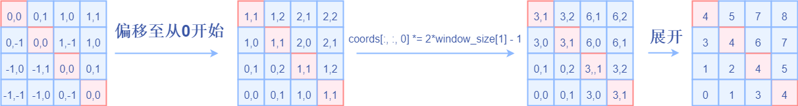
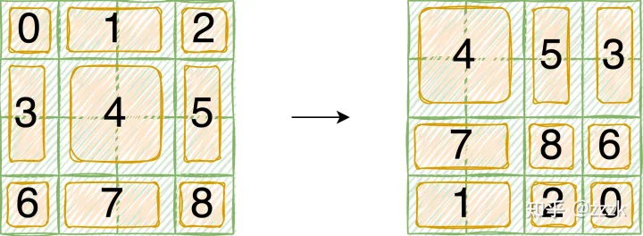
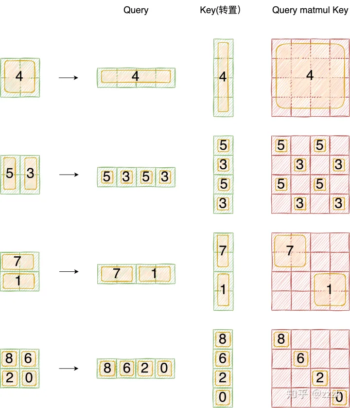

# 对Swin Transformer中的相对位置编码与attention mask的理解

## 一、前言

前一阵系统看了下swin transformer的论文和源码，反复咀嚼后对让我曾经头疼的两点内容谈一下自己的理解，其中包括window内部的用于self attention的相对位置编码和Shifted Window Attention中的attention mask。

本文不会介绍swin transformer的主要思路，主要聚焦于上面说的两个问题，没有看过原文的读者还请仔细读一下原文

> 论文地址：<https://arxiv.org/pdf/2103.14030.pdf>
> 代码地址：<https://github.com/microsoft/Swin-Transformer>

## 二、Window Attention的相对位置编码

论文中提到Swin Transformer中的Attention采用relative postition的方式，不同于最初版本的VIT，relative position bias 会加到每一层的attention层。论文中有关相关位置编码的叙述如下

**Relative position bias**. In computing self-attention, we follow $\text{ }^{[49,1,32,33]}$  by including a relative position bias  $B \in \mathbb{R}^{M^2 \times M^2}$  to each head in computing similarity:

$$
\operatorname{Attention}(Q, K, V)=\operatorname{SoftMax}\left(Q K^T / \sqrt{d}+B\right) V
$$

where  $Q, K, V \in \mathbb{R}^{M^2 \times d}$  are the query, key and value matrices;  $d$  is the query/key dimension, and  $M^2$  is the number of patches in a window. Since the relative position along each axis lies in the range  $[-M+1, M-1]$ , we parameterize a smaller-sized bias matrix  $\hat{B} \in \mathbb{R}^{(2 M-1) \times(2 M-1)}$ , and values in  $B$  are taken from  $\hat{B}$ .

> 假设矩阵A是n\*m,矩阵B是m\*p,矩阵A和B相乘得到矩阵C是n\*p，矩阵乘的时间复杂度为m\*n\*p

假设输入张量形状为`[B, numWindows, window_size * window_size, C]`，上文中说 $\text{M}^{2}$ 表示一个窗口中元素的个数，Q/K的形状为`[B*numWindows, num_heads, window_size*window_size, C//num_heads]`，M即window_size， d=C//num_heads。在生成Q、K、V的时候，可以理解为`B * numWindows * num_heads`个形状为`[window_size * window_size, C // num_heads]`矩阵乘以`[C // num_heads, C // num_heads * 3]`的转换矩阵，这里转换矩阵是共享的。相比较与传统VIT的`[B, C, H, W]->[B, num_heads, H*W, C // num_heads]`（`B*num_heads`），`SwinTransformer`的共享矩阵个数多`numWindows`倍，矩阵乘法由`[H*W, C // num_heads] @ [C // num_heads, C // num_heads * 3]`变为`[H // win_num * W // win_num, C //num_heads] @ [C // num_heads, C // num_heads * 3]` ，这里定义`win_num * win_num = numWindows`。所以传统VIT矩阵乘法时间复杂度为`B * num_heads * H * W * C // num_heads * C // num_heads * 3`，即`B * H * W * C // num_heads * C * 3`。SwinTransformer的时间复杂度为`B * numWindows * window_size * window_size * C * C // num_heads * 3`。相比较而言**在计算QKV矩阵的时候，Swin Transformer并没有节省计算量，节省计算量的部分发生在与V矩阵交互的过程中**。

通过上述过程熟悉一下计算过程中的tensor的形状变化，方便我们更好的理解相对位置B，`Q@K`的形状应该是`[B*numWindows, num_heads, window_size * window_size, window_size * window_size]`，B的形状也可以是`[1, num_heads, window_size * window_size, window_size * window_size]`或者`[1, 1, window_size * window_size, window_size * window_size]`，文中采用的是前者，**那么为什么不是后者呢？**这个问题我一时半会也没想明白，两者的区别在于不同注意力头之间的相对位置编码是否可以共享，个人感觉从简单角度考虑是可以共享的。

下面说一下B是如何生成的，先考虑单头注意力，假设window中的H与W都是2，遍历窗口中每一个元素，求出遍历元素当做原点`[0,0]`时其余元素的坐标，可以分为以下4种情况：

**B矩阵可以理解为一个一个的行向量，将上述窗口按照行展开成一维向量，B矩阵每一行的行坐标x表示以x元素为坐标原点，每一个行向量表示以x为坐标原点时的相对位置坐标。**由于展开成一维以后需要从存储表中查找对应元素，所以需要调整只一维坐标且从0开始，故采用如下策略进行变换，为什么乘以(2\*windows_size - 1)可以按照将一个N进制数转换为10进制数的算法来理解：

## 三、Shifted Window Attention中的attention mask

### 3.1 为什么需要attention mask

为了满足不同windows之间的信息交互

### 3.2 具体过程

1. 先看左图roll之前的结果，针对如下特征进行按照做图进行窗口划分，虚线表示原来的窗口，为了表示roll之前和roll之后的变化，在左边预先设置划分好划分后的块数。实际上一开始仅有四块。

1. 再看右图roll之后的结果，还是按照2x2的窗口大小进行划分，由于空间上连续的像素点之间的特征加上相对位置编码后计算self-attention才有意义，所以需要对`5，3`，`7,1`，`8,6,2,0`加上attention mask，将注意力控制在每个子模块内部。
2. mask生成过程如下图所示

采用右边的向量乘以左边的向量，然后找到满足条件`结果矩阵M中的元素值 等于其中一个x*x（x为向量中的所有元素）的值`设置为true，其余设置为false，从而对`Q@K`矩阵加上一个mask，在计算softmax的时候不再考虑这个元素的贡献，至此attention mask讲解完毕。

