# 工业缺陷检测项目经验总结

> 本文写于2025年9月26日晚十点和2025年9月27日上午十一点

## 零、前言

最近看了一个工业检测领域项目经验的课程，尽管内容相对简单，但作者总结的挺系统的，所以想把该教程整理为文字，起到一个抛砖引玉的作用；

我希望的是，读者看到这篇文章后，能够按照本文（视频作者）给出的问题划分方式与对应的解决方案，在需求评审与沟通、项目立项、算法POC等阶段起到参考性作用。

本文涉及的算法不是最新的，但足够经典，且工作足够solid，建议读者在方案选取时可以选择本文说的算法作为baseline，之后逐步对比优化；

## 一、视觉缺陷检测概述

### 1.1 应用背景

**为什么需要视觉缺陷检测？**

1. 提升产品品质，反馈改善工艺流程  
  通过自动检测发现缺陷，有助于提高最终产品质量，并将缺陷数据反馈回生产环节，用于优化和改进制造工艺。
2. 降低人工成本（降本增效）  
  自动化检测可以替代部分人工检查工作，从而减少人力投入，实现降低成本、提高效率的目标。
3. 提升安全性  
  特别适用于高温冶炼、有毒化学品生产等危险环境，用机器代替人工检测，可有效保障人员安全。
4. 提高生产效率、保证产品质量  
  自动化检测速度快、精度高，能在不中断生产的情况下实时监控质量，确保生产效率与产品合格率。
5. 适应大规模生产  
  视觉缺陷检测系统具备高吞吐量和一致性，非常适合现代工业中大批量、高速度的生产需求。
  
  
**缺陷检测有行业应用？**

目前缺陷检测广泛应用于工业领域，包括如下几类：  

1. 半导体行业  
    - 检测对象：晶圆  
    - 常见缺陷：划伤、颗粒污染、脏污等  
2. 3C电子行业（计算机、通信、消费电子）  
    - 检测对象：PCB板（印刷电路板）  
    - 常见缺陷：破损、氧化、污染、孔破、孔偏、漏打孔等  
3. 新能源行业（锂电池、光伏行业）  
    - 检测对象：锂电池表面  
    - 常见缺陷：褶皱、开裂、气泡、凹凸、折痕、掉料等  
4. 交通行业  
    - 检测对象：新能源汽车内外饰件  
    - 应用目的：外观缺陷检测，确保产品美观与装配质量  
5. 医疗行业  
    - 检测对象：医学影像（如脑部MRI/CT图像）  
    - 应用场景：脑肿瘤分割（辅助诊断），属于医学图像分析中的“缺陷”或异常区域识别  
6. 食品行业  
    - 检测对象：各类食品  
    - 应用目的：外观分拣（如按大小、颜色、瑕疵等进行分级或剔除不合格品）  

### 1.2 相关定义与分类

1. **任务定义**：工业缺陷检测是指在工业生产过程中使用各种技术和方法来检测产品中的缺陷或异常。  
2. **任务目的**：缺陷检测旨在确保产品质量，减少次品率，并提高生产效率。    
3. **成像方式**：根据检测目标是产品“表面”还是“内部”，成像方式分为两类，    
    1. 外观缺陷检测  
        - 这是最常见的检测形式。它使用工业相机对产品表面进行成像，获取的是清晰、有纹理和语义信息的图像（比如颜色、形状、划痕等），因此特征非常丰富，便于后续分析。   
        - 处理方式：一般使用常规的图像处理算法，比如图像分类、图像分割、缺陷定位等通用计算机视觉方法，这些算法成熟、适用范围广。   
    2. 内部探伤  
        - 针对产品内部结构或隐藏缺陷的检测，常用的技术包括核磁成像、CT成像、X光成像、热成像等。这类成像方式虽然也能提供一定的语义信息（如病变区域、裂纹位置），但通常图像分辨率较低、特征不够明显，且成像结果会略显模糊，不如外观图像直观。  
        - 处理方式：由于数据更复杂、特征更抽象，通常需要使用特定行业定制化的算法。例如，在医疗影像领域（如CT或MRI图像分析）中，常使用UNet系列深度学习网络来实现高精度的病灶或缺陷分割。  
4. **外观检测分类**：  
    - 自然光成像检测： 这是一种使用常见相机和图像处理算法来捕捉和分析产品图像的方法。通过采集产品图像并应用图像处理算法，可以检测出各种缺陷，如表面瑕疵、裂纹、错位、缺失等。常见的技术包括边缘检测、颜色分析、形状识别和纹理分析等。  
    - X射线检测： 这种方法利用X射线的穿透特性，对产品进行检测。通过将产品暴露于X射线源下，然后使用探测器来接收通过产品的X射线，可以检测出产品内部的缺陷或异物。这种方法通常用于金属或其他密度较高的材料的缺陷检测。  
    - 热成像检测： 这种方法使用红外热像仪来检测产品表面的温度分布。通过分析温度分布图像，可以发现可能存在的缺陷，如热漏、热裂等。热成像检测在电子、电力、建筑等领域广泛应用。  
      
    这些工业缺陷检测方法结合了传感器技术、图像处理、信号处理和机器学习等技术，以实现高效准确的缺陷检测，并帮助企业提高产品质量。

## 二、缺陷检测难点

### 2.1 没有缺陷数据

在缺乏标注缺陷数据的情况下，如何应对工业检测需求。分为两类：  

1. 完全未知型 —— 不仅没有缺陷样本，也不知道未来可能出现什么类型的缺陷 → 需采用“新颖检测”（Novelty Detection）方法，即通过正常样本学习“什么是正常”，从而识别出所有“异常”。  
2. 经验预知型 —— 虽然没有现成缺陷数据，但工程师凭借经验清楚可能产生的缺陷种类 → 可通过合成数据、模拟或迁移学习等方式构建训练集，进行有针对性的缺陷检测模型开发。

怎么解决？

1. 从数据层面解决  
    - 根据实际项目需求，人为制造一些缺陷类型
    - 根据实际项目需求，人为PS一些缺陷类型  
2. 从算法层面解决
    - 传统算法  
      指不依赖深度学习、基于图像处理规则或手工特征的传统机器视觉方法，例如边缘检测、纹理分析、阈值分割等。
    - 深度学习半监督、无监督学习算法  
        指在缺乏标注数据的情况下，利用未标注数据进行模型训练的方法，如自编码器（AutoEncoder）、生成对抗网络（GAN）、对比学习（Contrastive Learning）等，适用于“新颖检测”或“异常检测”场景。

### 2.2 少量缺陷数据

少量缺陷分两种情况讨论：

1. 少量缺陷数据，且对生产过程中产生缺陷类型未知，也就是 Novelty Detection，需要异常检测算法  
2. 少量缺陷数据，但是生成过程中生成的缺陷类型固定，可以尝试小样本学习

解决方案：  
1. 从数据层面解决  
    - 根据实际项目需求，人为制造一些缺陷类型  
    - 根据实际项目需求，人为PS一些缺陷类型
    - 根据已有缺陷数据进行扩增
2. 从算法层面解决  
    - 未知新缺陷，使用异常检测算法
    - 缺陷类型固定，使用小样本学习算法

### 2.3 缺陷太小

小缺陷的定义：小缺陷是相对于原图尺寸来定义的。  

| 原图Size       | 大缺陷Size (/8)     | 中缺陷Size(/16)           | 小缺陷Size (/32)          | 微小缺陷Size         |
|----------------|----------------------|----------------------------|----------------------------|-----------------------|
| 2500W (5000\*5000) | 大于625\*625          | 大于317\*317 小于625\*625    | 小于156\*156 大于78\*78      | 大于3\*3 小于78\*78     |
| 50W(640\*640)     | 大于80\*80            | 大于40\*40 小于80\*80        | 小于20\*20 大于10\*10        | 大于3\*3 小于10\*10     |

解决方案1（算法层面解决）：  

- 超分
- 多级特征融合
- 稠密的anchor
- GAN 先生成放大小缺陷再检测
- 注意力机制
- 上下文信息

可以在一定程度上解决小图片上的小缺陷甚至微小缺陷，但是解决不了大图小缺陷（需要缩放到网络size训练）。  

解决方案2（策略层面解决）：  

- 图片切块  
- 小缺陷上采样

综合方案1、2，可以解决大图小缺陷，甚至微小缺陷，但是会增加推理时间。

### 2.4 缺陷对比度差

对比度差的定义：缺陷和背景的像素差小于10，并且中间是过渡像素。
- “像素差小于10”指缺陷区域与周围背景在灰度或颜色值上的差异非常小（通常在0~255范围内），导致人眼或算法难以分辨。  
- “中间是过渡像素”表示缺陷边缘不是突变的，而是存在模糊、渐变的过渡区域，进一步加剧了检测难度。

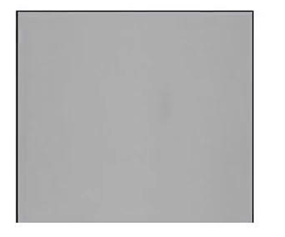

解决方案1：

1. 传统算法的图像增强  
    使用经典图像处理技术（如直方图均衡化、锐化、对比度拉伸等）提升图像质量，使缺陷更易被检测。  
2. 深度学习算法的增强  
    利用深度学习模型（如CNN、U-Net等）对图像进行特征增强或预处理，以强化缺陷区域与背景的区分度。  
3. 直接使用深度学习算法检测  
    伪装物体检测方向，专门解决前景和背景像素几乎一致的算法

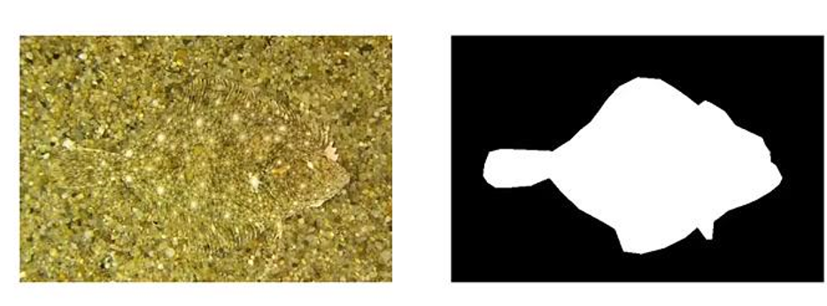

深度学习算法的增强进一步细分为两种具体方向：

1. 超分算法
    即“超分辨率算法”，通过深度学习模型将低分辨率图像重建为高分辨率图像，从而提升缺陷细节的可见性，辅助后续检测。  
2. 特定领域的增强：比如水下增强，雨雾天增强  
    针对特殊环境或应用场景（如水下拍摄、雨雾天气成像），使用专门设计的深度学习模型对图像进行去模糊、去噪、对比度恢复等处理，以改善图像质量，适应复杂工况下的缺陷检测需求。
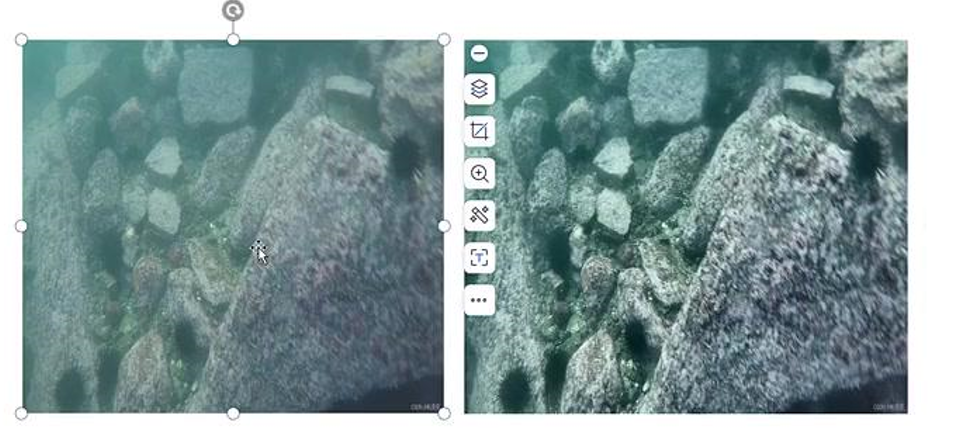

解决方案2：

该方案从“策略层面”出发，提出两种图像处理策略来提升缺陷检测效果：

1. 转换到不同颜色空间检测（HSV, LAB等等）  
    不直接在原始RGB色彩空间中处理图像，而是将其转换为其他颜色空间（如HSV、LAB等），这些空间能更好地分离亮度、色度、饱和度等信息，有助于突出缺陷与背景之间的差异。
2. 不同通道的融合  
    利用多个颜色通道（如H、S、V、L、A、B等）分别提取特征，再将各通道的信息进行融合，综合判断缺陷区域，从而提高检测鲁棒性和准确性。

### 2.5 分辨率大要求时延段

假设有这样一个项目需求：  
（1）检测微小缺陷  
（2）为使得缺陷明显，需要大尺寸图像，比如2500w像素的图  
（3）客户要求整体检测系统是500ms，请问你怎么解决？  

首先：明确硬件性能（CPU,GPU，处理器等）（边缘设备、本地主机、服务器？）；  
其次：明确缺陷类型和缺陷大小，选择合适算法（原则上：能用分类不用检测，能用检测不用分割）；  
最后：选择合适的部署框架，CPU 选择openvino量化压缩部署，GPU选择tensorrt量化压缩部署，原生的pytorch框架肯定满足不了时延要求；  

> 这里推荐看一下本文作者的其他文章：[表面缺陷检测项目的方法论](表面缺陷检测项目的方法论.md)

### 2.6 缺陷标准难以量化

**缺陷没量化统一标准弊端：**  
(1) 标注无从下手，造成数据混乱，模型学习能力差。  
(2) 千人千面，每个人看缺陷的角度和方法不同，结果不同，和客户天天扯皮。  
  
**缺陷数据4大难点**  
1. 难分
    - 界限难定
    - 类间差异小
    - 类内差异大
2. 多样性
    - 形态、颜色
    - 纹理、位置不固定
3. 不均衡
    - 样本层面
    - 缺陷层面
4. 数据脏
    - 异常数据混入
    - OK数据混入

**如何把缺陷归纳量化统一？**

做好缺陷的归类，才容易下手，这里给出两种归纳方法。 
方案1：  
(1) 纹理缺陷：替代原始样本纹路，特点是位置、大小、形态不固定，比如划痕、脏污等；  
(2) 结构缺陷：与目标结构有关，特点是其位置、形态较固定，可能不存在量化的概念；  
(3) 其他缺陷：例如医学图像、一些红外热成像、超声波成像等，可能无法靠肉眼建立精准的对应关系。  

方案二（形态上）：  
(1) 加法：脏污、异物、附着  
(2) 减法：残缺、划痕、破损  
(3) 替换：混色、异色、杂质、混淆  
(4) 变形：扭曲、尺寸、褶皱  

> 在缺陷类型划分上，不要被客户影响，在满足客户的基础上，按照有利于缺陷算法设计的分类看；原则是保证类内相似，类间差异大；

## 三、常用缺陷检测算法

### 3.1 常规分类算法

1.什么样的工业场景适合图像分类算法？  

① 不需要知道具体异常位置信息，只判断具体类别  
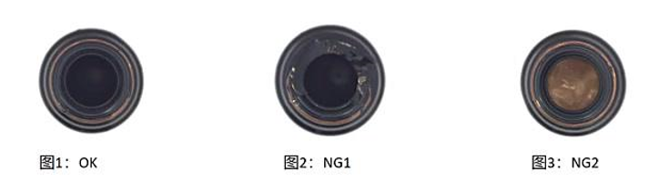  
② 异常的信息占据整个图片30%以上  
下图的划痕不适合分类算法，特征区域太小且不明显  
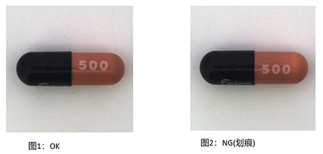
③ 作为异常检测算法pipeline 后处理模块，精细判断缺陷类别
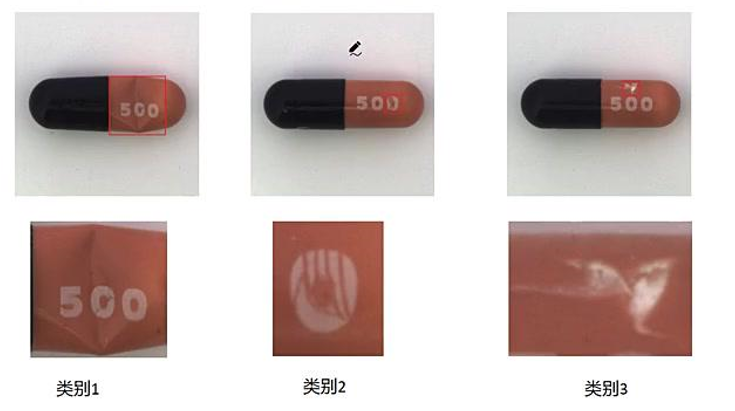

2.如何选择合适的算法？

分类算法从CNN的lenet、vgg、resnet……到现在transformer系列mobilevit等，选择合适算法标准是什么？  
  
① 检测指标（准确率和召回率）越高越好（工业场景相对自然场景简单，一般差异不大）  
② 客户对CT的需求，选择推理时间越短越好  
③ 方便部署（算子支持tensorrt、openvino、nnfc等等推理框架）  
④ 根据原始图像尺寸选择合适的算法（比如你的图像是48*48，没有必要选择大输入尺寸模型）  
⑤ 基于什么硬件部署？嵌入式、主机、服务器

### 3.2 少样本分类算法

1. 什么是小样本分类？  
    只有少数训练样本和监督数据的情况下对新数据进行分类，只需少量的训练样本，我们创建的模型就可以相当好地执行。  

    考虑以下场景：  
    ① 在医疗领域，对于一些不常见的疾病，可能没有足够的x光图像用于训练，对于这样的场景，构建一个小样本学习分类器是完美的解决方案。  
    ② 对于工业领域，前期产线生产没有足够的缺陷数据用于训练，对于这样的场景可以使用小样本分类。  

    小样本分四类：  
    - N-Shot Learning (NSL)  
    - Few-Shot Learning (FSL)  
    - One-Shot Learning (OSL)  
    - Zero-Shot Learning (ZSL)  

    小样本学习主流方法：  
    ① 基于度量的学习：度量学习也指相似度学习，衡量在嵌入空间中两个目标特征或者多个相似度或者距离，相同的类特征距离较近，反之不同的类特征距离较远，最终根据相似度得分获得分类结果  
    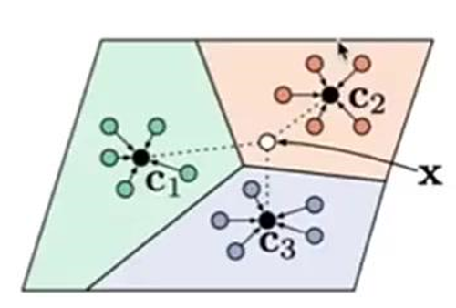  
    ② 基于Pretraining+Fine Tuning的方法：基本想法是在大规模数据集D_base上预训练模型，然后在小规模的支持集D_support上做Fine Tuning  
    ③ 基于元学习的小样本学习：元学习指利用以往的知识经验指导新任务的学习，当学习了很多这样的任务之后，元学习模型便学会了举一反三，之后用这个分类任务来测试元学习模型，从而完成任务  

2. 什么样的工业场景适合小样本分类算法？  
    ① 当数据集中的样本数量非常有限，无法支持传统深度学习模型进行训练时，可以考虑使用少样本图像分类算法。  
    ② 在一些特定领域或任务中，获取大量标记数据成本较高或困难，这时少样本图像分类算法可以发挥作用。  
    ③ 需要快速部署模型并进行预测，但数据采集和标注时间有限的情况下，少样本图像分类算法可以提供一种有效的解决方案。  
    ④ 对于一些小规模数据集，少样本图像分类算法可以在保持良好性能的同时减少过拟合的风险

3. 如何选择合适的算法？
选择合适算法标准是什么？  
① 少量训练数据的模型，检测指标（准确率和召回率）越高越好  
② 客户对CT的需求，选择推理时间越短越好  
③ 方便部署（算子支持tensorrt、openvino，nncf等等推理框架）  
④ 基于什么硬件部署？嵌入式、主机、服务器  
推荐般使用孪生网络。

### 3.3 常规目标检测算法

1. 什么样的工业场景适合目标检测算法？  
① 一张图上有一个或者多个目标  
② 只需要输出每个目标的大概位置信息，不需要精确位置、角度等信息。  
③ 检测目标尺寸不能太小  
说明：图1待检测目标大小适中可以使用普通目标检测算法；但是图2图像尺寸比较大而待检测目标比较小，所以不适合普通目标检测，需要特殊的目标检测算法或者特殊处理之后使用普通目标检测。  
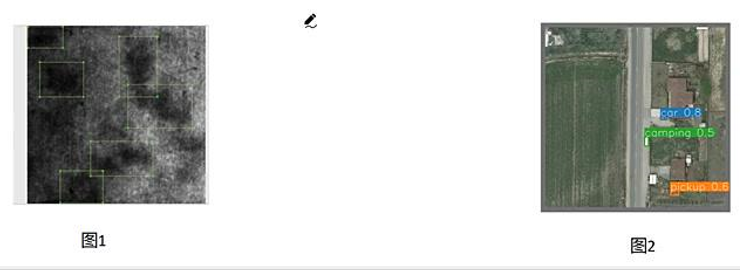  
④ 检测目标特征明显  
说明：图1待检测目标特征明显可以使用普通目标检测算法；但是图2图像待检测目标对比度很低，所以不适合普通目标检测，需要特殊的目标检测算法或者特殊处理之后使用普通目标检测。
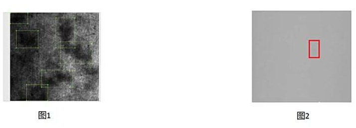  
⑤ 数据集丰富  
    单一场景下：  
    (1) 在使用预训练权重的条件下，每一类缺陷的数据量要在300+，且每一类数据尽量均衡。  
    (2) 在不使用预训练权重的条件下，每一类的缺陷数据要在500+，且每一类数据尽量均衡  
    复杂自然场景下：  
    (1) 在使用预训练权重的条件下，每一类缺陷的数据量要在1000+，且每一类数据尽量均衡。  
    (2) 在不使用预训练权重的条件下，每一类的缺陷数据要在2000+，且每一类数据量尽量均衡  
    普通目标检测算法适用80%以上的工业缺陷检测应用场景。  

2. 如何选择合适的算法？  
目标检测算法从CNN的ssd、yolo系列……到现在transformer系列detr等，选择合适算法标准是什么？  
① 客户检测指标需求（准确率和召回率）越高越好  
② 客户对时延的需求，选择推理时间越短越好  
③ 方便部署（算子支持tensorrt、openvino、nncf等等推理框架）  
④ 基于什么硬件部署？嵌入式、主机、服务器  

### 3.4 小目标检测算法

1. 小目标检测分为普通图片尺寸的小目标和超大尺寸图片的小目标检测  
    （1）大和小都是相对的关系，不同的图像尺寸大小缺陷有不同的定义。  
    （2）目标检测算法的卷积算法通常是下采样 2, 4, 8, 16, 32 倍，然后进行特征融合。  

    | 图像尺寸       | 大缺陷     | 中等缺陷   | 小缺陷     | 超小缺陷         |
    |----------------|------------|------------|------------|------------------|
    | 512\*512       | 64\*64     | 32\*32     | 16\*16     | 8\*8 以下        |
    | 1024\*1024     | 128\*128   | 64\*64     | 32\*32     | 16\*16 以下      |
    | 2048\*2048     | 256\*256   | 128\*128   | 64\*64     | 32\*32 以下      |
    | 4096\*4096     | 512\*512   | 256\*256   | 128\*128   | 64\*64 以下      |  

2. 什么样的工业场景适合普通图像尺寸的小目标检测算法？  
    ① 图片尺寸一般不超 1024×1024  
    ② 小目标一般尺寸需大于 16×16，检测不了超小目标，比如 5×5、3×3 的目标  
3. 什么样的工业场景适合大尺寸图像的小目标检测算法？  
    ① 图片尺寸一般超1024×1024大小，比如500W像素，1000W像素，2000W像素，等等  
    ② 超小目标，比如5×5、3×3的目标，低于3×3误漏回比较高；  
    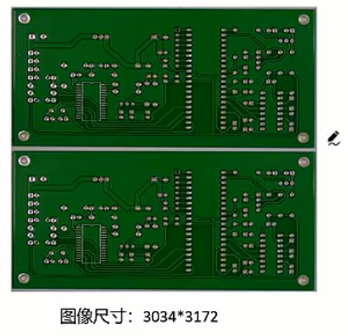  
    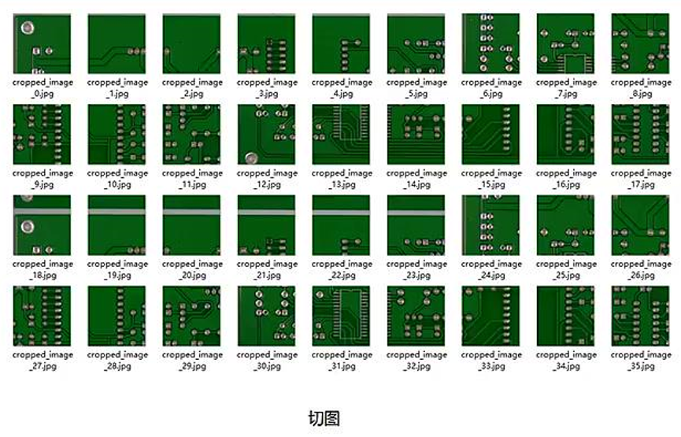
4. 解决方案？  
    所以工业领域通常是对大图切块，比如把4096×4096切成10×10=100块，每块640×640，中间有overlap区域，基于小图检测微小缺陷，基本可以解决此类问题。  
5. 切块之后引申两个问题：
    1. 大缺陷切碎了，怎么解决？
        小图标小缺陷，大缺陷不标注；大图标大缺陷，小缺陷不标注；
    2. 推理时间 N×N 倍增长，怎么解决？
        GPU：tensorrt、多线程推理、batch推理、模型量化、压缩等等方案；  
        CPU：Openvino、多线程推理、batch推理、模型量化、压缩等方案；  
        并行多卡推理（堆算力）：推荐 [表面缺陷检测项目的方法论](表面缺陷检测项目的方法论.md)
6.  如何选择合适的算法？  
    基于大图切块可以解决小图小缺陷，选择合适算法标准是什么？  
    ① 客户检测指标需求（准确率和召回率）越高越好  
    ② 客户对时延的需求，选择推理时间越短越好  
    ③ 方便部署（算子支持tensorrt、openvino，nncl等等推理框架）  
    ④ 基于什么硬件部署？嵌入式、主机、服务器  
7. 小目标检测，发论文可以参考：  [https://zhuanlan.zhihu.com/p/656916355](https://zhuanlan.zhihu.com/p/656916355)

小图小目标推荐论文：[Super-Yolo](https://arxiv.org/pdf/2209.13351)

### 3.5 对比度低目标检测算法

1. 什么样的工业场景适合低对比度目标检测算法？  
    ① 待检测物体和背景几乎一致，像素是渐变，并且变化范围很小，对比度很差  
    ② 待检测对象与其背景之间的高度内在相似性  
2. 解决方案？
    1. 针对场景1可以尝试使用传统的增强算法做预处理，之后再送到深度学习检测算法中训练模型；  
        - 受限对比度阈值
        - 直方图均衡化
        - gamma增强
        - log增强
        - 卷积增强
        - ...
    2. 针对场景2可以尝试使用基于深度学习的伪装目标检测算法
3. 如何选择合适的算法？  
    低对比度检测算法可以通过传统增强算法然后按深度学习算法，也可以通过深度学习算法端到端的算法，选择合适算法标准是什么？  
    ① 客户检测指标需求（准确率和召回率）越高越好  
    ② 客户对CT的需求，选择推理时间越短越好  
    ③ 方便部署（算子支持tensorrt、openvino、nncf等等推理框架）  
    ④ 基于什么硬件部署？嵌入式、主机、服务器  

### 3.6 常规语义分割算法

1. 什么样的工业场景适合常规语义分割算法？  
    1. 需要知道缺陷位置信息
    2. 需要知道精细的语义信息（每一个像素所属类别）
    3. 需要精确的计算缺陷面积
    4. 一张图上有一个或者多个目标
    5. 检测缺陷特征明显
    6. 相对于原图尺寸待检测物体的缺陷不能太小
    7. 可以作为整个算法pipeline中的一环
    8. 数据集丰富  
        单一场景下：  
        (1) 在使用预训练权重的条件下，每一类缺陷的数据量要在300+，且每一类数据尽量均衡。  
        (2) 在不使用预训练权重的条件下，每一类的缺陷数据要在500+，且每一类数据量尽量均衡  
        复杂自然场景下：  
        (1) 在使用预训练权重的条件下，每一类缺陷的数据量要在1000+，且每一类数据尽量均衡。  
        (2) 在不使用预训练权重的条件下，每一类的缺陷数据要在2000+，且每一类数据量尽量均衡  
        普通语义分割算法适用80%以上的工业缺陷检测应用场景。  

2. 如何选择合适的算法？    
    语义分割算法从CNN的FCN、SeNet、Unet系列……到现在transformer系列，选择合适算法标准是什么？  
    ① 客户检测指标需求（准确率和召回率）越高越好  
    ② 客户对CT的需求，选择推理时间越短越好  
    ③ 方便部署（算子支持tensorrt、openvino、nncf等等推理框架）  
    ④ 基于什么硬件部署？嵌入式、主机、服务器  

### 3.7 常规实例分割算法

1. 语义分割和实例分割的区别和联系：
    1. 语义分割旨在将图像中的每个像素分配到预定义的语义类别中，对于同一类别的物体，语义分割无法区分它们之间的个体差异。
    2. 实例分割则更进一步，不仅要求对图像进行像素级的语义分割，还需要将属于同一类别的不同个体进行区分。
2. 什么样的工业场景适合常规实例分割算法？
    1. 需要知道缺陷位置信息
    2. 需要知道精细的语义信息和类别信息
    3. 需要精确的计算缺陷面积
    4. 一张图上有一个或者多个目标
    5. 待检测缺陷特征明显
    6. 相对于原图尺寸待检测物体的缺陷不能太小
    7. 可以作为整个算法pipeline中的一环
    8. 数据集丰富  
        单一场景下：  
        1. 在使用预训练权重的条件下，每一类缺陷的数据量要在300+，且每一类数据尽量均衡。  
        2. 在不使用预训练权重的条件下，每一类的缺陷数据要在500+，且每一类数据量尽量均衡  
        复杂自然场景下：  
        1. 在使用预训练权重的条件下，每一类缺陷的数据量要在1000+，且每一类数据尽量均衡。  
        2. 在不使用预训练权重的条件下，每一类的缺陷数据要在2000+，且每一类数据量尽量均衡  
        普通实例分割算法适用80%以上的工业缺陷检测应用场景。
3. 如何选择合适的算法？  
    实例分割算法从CNN的mask rcnn、solo、yolo系列……到现在transformer系列，选择合适算法标准是什么？  
    ① 客户检测指标需求（准确率和召回率）越高越好  
    ② 客户对CT的需求，选择推理时间越短越好  
    ③ 方便部署（算子支持tensorrt、openvino、nncf等等推理框架）  
    ⑤ 基于什么硬件部署？嵌入式、主机、服务器  

### 3.8 异常检测算法

异常检测，是一种用于识别不符合预期行为的异常模式的技术，称为异常值。通常为无监督学习问题，其中先验未知异常样本，并且假定大多数训练数据集由“正常”数据组成。

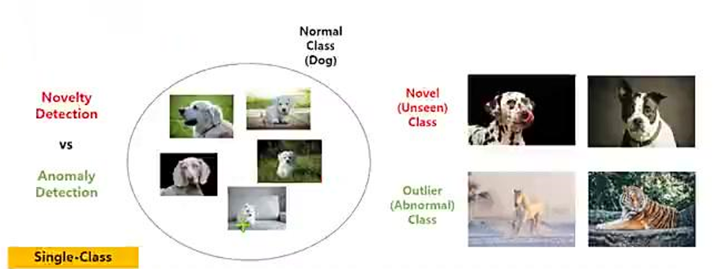   

**异常检测分哪些算法方向？**  

1. 基于图像重建的方法：这是最早出现的方法，也非常直观，期待AE自动编码器能够对异常图像重建成正常图像，然后重建图像和正常图像作差，得到定位结果。主要的改进包括网络结构、隐空间和损失函数的改进。该方法的问题在于难以保证异常图像中的异常区域被很好重建为正常，同时图像中的正常区域重建的效果和输入一致，这样两者作差的结果并不能完全代表异常区域。
2. 基于生成网络的方法：代表的方法就是VAE、GAN和Normalizing Flow (NF)。VAE中引入了类似CAM这种求梯度方式来判断异常位置的方法。GAN主要是通过多个生成器和判别器的设置，来提升生成或重建的图像效果。然而，GAN和VAE都缺乏对概率分布的精确评估和推理，这往往导致VAE中的模糊结果质量不高，GAN训练也面临着如模式崩溃和后置崩溃等挑战。NF能够较好的解决上述问题，同时NF会和后面的基于特征的方法进行结合，也是目前在MVTec AD上取得效果最好的方法。
3. 基于深度特征建模的方法：主要包括知识蒸馏和特征建模两大类。特别是特征建模，可以细分为很多小类，例如：KNN，高斯建模等。
4. 基于自监督的方法：主要分为代理任务和对比学习。代理任务包括常见的重建、补全、相对关系预测和属性修护等。
5. 基于one-class分类的方法：这个方法主要是异常检测AD采用的，如果将图像划分为滑动窗口，所有的AD方法也适用于AL。此外，它也可以与前面4种方法相结合。

**什么样的工业场景适合异常检测分类算法？**  

1. 不需要知道缺陷位置信息
2. 不需要知道类别信息，客户只关心OK 或 NG
3. 几乎没有缺陷数据集或者生产过程中缺陷类型不确定（有监督算法不可用）

**什么样的工业场景适合异常检测分割算法？**  

1. 需要知道缺陷位置信息
2. 不需要知道类别信息
3. 几乎没有缺陷数据集或者生产过程中缺陷类型不确定（有监督算法不可用）
4. 客户需要知道缺陷的面积大小信息
5. 如果客户需要知道具体缺陷类别信息，可以作为整体pipeline的一环，检测出缺陷crop之后，做小样本分类

**什么样的工业场景适合异常位置检测算法？**  

1. 标准位置是固定的，也就是正常的数据前景背景都是固定位置
2. 不需要知道类别信息，只需要知道位置是否做了改变
3. 客户需要知道改变的位置信息

**如何选择合适的算法？**  

① 客户检测指标需求（准确率和召回率）越高越好  
② 客户对CT的需求，选择推理时间越短越好  
③ 方便部署（算子支持tensorrt、openvino、nncf等等推理框架）  
⑤ 基于什么硬件部署？嵌入式、主机、服务器  

**异常分类推荐**：[differnet算法](https://arxiv.org/abs/2008.12577)  
**异常检测推荐**：[fastflow](https://arxiv.org/abs/2111.07677)、[patchcore](https://arxiv.org/abs/2106.08265) 算法  
**异常位置改变推荐**：[Change detect 算法](https://link.springer.com/article/10.1007/s00521-022-08122-3)

## 四、算法评估指标

### 4.1 准确率 (Accuracy)

准确率的定义是：对于给定的测试集，分类模型正确分类的样本数与总样本数之比。举个例子来讲，有一个简单的二分类模型（暂时叫做Classifier_A），专门用于分类苹果和梨，在某个测试集中，有30个苹果+70个梨，这个二分类模型在对这个测试集进行分类的时候，得出该数据集有40个苹果（包括正确分类的25个苹果和错误分类的15个梨）和60个梨（包括正确分类的55个梨和错误分类的5个苹果）。画成矩阵图为：

|                  | 预测类别 1-苹果 | 预测类别 2-梨 |
|------------------|-----------------|---------------|
| 实际类别 1-苹果   | 25              | 5             |
| 实际类别 2-梨     | 15              | 55            |

从图中可以看出，行表示该测试集中实际的类别，比如苹果类一共有25+5=30个，梨类有15+55=70个。其中被分类模型正确分类的是该表格的对角线所在的数字。在sklearn中，这样一个表格被命名为混淆矩阵（Confusion Matrix），所以，按照准确率的定义，可以计算出该分类模型在测试集上的准确率为：

$$
Accuracy = \frac{25 + 55}{25 + 5 + 55 + 15} \times 100
$$

即，该分类模型在测试集上的准确率为80%。

但是，准确率指标并不总是能够评估一个模型的好坏，比如对于下面的情况，假如有一个数据集，含有98个苹果，2个梨，而分类器（暂时叫做Classifier_B）是一个很差劲的分类器，它把数据集的所有样本都划分为苹果，也就是不管输入什么样的样本，该模型都认为该样本是苹果。那么这个表格会是什么样的了？

|                  | 预测类别 1-苹果 | 预测类别 2-梨 |
|------------------|-----------------|---------------|
| 实际类别 1-苹果   | 98              | 0             |
| 实际类别 2-梨     | 2               | 0             |

则该模型的准确率为98%，因为它正确地识别出来了测试集中的98个苹果，只是错误的把2个梨也当做苹果，所以按照准确率的计算公式，该模型有高达98%的准确率。

可是，这样的模型有意义吗？一个把所有样本都预测为苹果的模型，反而得到了非常高的准确率，那么问题出在哪儿了？只能说准确率不可信。特别是对于这种样品数量偏差比较大的问题，准确率的“准确度”会极大的下降。所以，这时就需要引入其他评估指标评价模型的好坏了。

### 4.2 精确率 (Precision)

精确率的定义是：对于给定测试集的某一个类别，分类模型预测正确的比例，或者说：分类模型预测的正样本中有多少是真正的正样本，其计算公式是：

$$
Precision = \frac{TruePositive}{TruePositive + FalsePositive} = \frac{TP}{TP + FP}
$$

所以，根据定义，精确率要区分不同的类别，比如上面我们讨论有两个类别，所以要分类来计算各自的精确率。对于上面提到的Classifier_A和Classifier_B分类模型，我们可以分别计算出其精确率：

| 精确率计算       | Classifier_A     | Classifier_B     |
|------------------|------------------|------------------|
| 类别 1-苹果      | 25/(25+15)=62.5% | 98/(98+2)=98%    |
| 类别 2-梨        | 55/(55+5)=91.7%  | 0/(0+0)          |

### 4.3 召回率 (Recall)

召回率的定义为：对于给定测试集的某一个类别，样本中的正类有多少被分类模型预测正确，其计算公式为：

$$
Recall = \frac{TruePositive}{TruePositive + FalseNegative} = \frac{TP}{TP + FN}
$$

同样的，召回率也要考虑某一个类别，比如，下面我们将苹果作为正类，在Classifier_A模型下得到的表格为：

|                  | 预测类别 1-苹果 Positive | 预测类别 2-梨 Negative |
|------------------|---------------------------|-------------------------|
| 实际类别 1-苹果   | TP=25                     | FN=5                    |
| 实际类别 2-梨     | FP=15                     | TN=55                   |

计算出上面两个模型对给定测试集的召回率，如下表所示：

| 召回率计算       | Classifier_A     | Classifier_B     |
|------------------|------------------|------------------|
| 类别 1-苹果      | 25/(25+5)=83.3%  | 98/(98+0)=100%   |
| 类别 2-梨        | 55/(55+15)=78.6% | 0/(0+2)=0%       |

### 4.4 混淆矩阵（confusion matrix）

称为可能性表格或是错误矩阵。它是一种特定的矩阵用来呈现算法性能的可视化效果，通常是监督学习（非监督学习，通常用匹配矩阵：matching matrix）。其每一列代表预测值，每一行代表的是实际的类别，对角线表示正确的预测结果。

|                  | 预测类别 1-苹果 | 预测类别 2-梨 |
|------------------|-----------------|---------------|
| 实际类别 1-苹果   | 25              | 5             |
| 实际类别 2-梨     | 15              | 55            |

### 4.5 mAP

mAP 即 Mean Average Precision 即平均AP值，是对多个验证集个体求平均AP值，作为目标检测或者分割算法中衡量检测精度的指标。

**PR曲线**

以Recall值为横轴，Precision值为纵轴，我们就可以得到PR曲线，PR曲线越往右上角越好。

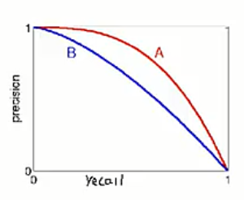 

**AP(Average Precision)**

AP就是平均精准度，简单来说就是对PR曲线上的Precision值求均值，对于PR曲线来说，我们使用积分来进行计算。

$$
AP = \int_0^1 p(r)dr
$$

在分类任务中，预测的正样本是true positive还是false positive很好确定。  
而在检测任务中，什么叫检测到的结果是true positive还是false positive？这里需要一个评判标准：  
如果检测框与groud-truth框的IOU区域大于某个阈值，我们就可以认为是true positive了  
如果IoU阈值=0.5，则为AP@50，  
如果IoU阈值=0.75，则为AP@75，以此类推

**mAP**

mAP是针对多类来说的  
mAP：多个物体类别的AP的平均  
mAP的对象是所有类的所有图片，衡量的是学出的模型在所有类别上的好坏。  
计算如下所示，其中C为类别数目：

$$
mAP = \frac{\sum_{i=1}^{C} AP_i}{C}
$$

### 4.6 AUC

定义：AUC(Area under Curve) Roc曲线下面积。

什么是ROC曲线：接收者操作特征(receiver operating characteristic)，roc曲线上每个点反映着对同一信号刺激的感受性

横轴：负正率(false positive rate FPR)特异度，划分实例中所有负例占所有负例的比例：(1-Specificity)

纵轴：真正率(true positive rate TPR)灵敏度，Sensitivity(正类覆盖率)

**针对一个二分类问题，将实例分成正类(positive)或者负类(negative)。但是实际中分类时，会出现四种情况：**

(1) 若一个实例是正类并且被预测为正类，即为真阳性(True Positive TP)  
(2) 若一个实例是正类，但是被预测成为负类，即为假负类(False Negative FN)  
(3) 若一个实例是负类，但是被预测成为正类，即为假正类(False Positive FP)  
(4) 若一个实例是负类，但是被预测成为负类，即为真负类(True Negative TN)

TP: 正确的肯定数目  
FN: 漏报，没有找到正确匹配的数目

列表如下，1代表正类，0代表负类：

|       |       | 预测     |          | 合计               |
|-------|-------|----------|----------|--------------------|
|       |       | 1        | 0        |                    |
| 实际  | 1     | True Positive TP | False Negative FN | Actual Positive (TP+FN) |
|       | 0     | False Positive FP | True Negative TN | Actual Negative (FP+TN) |
| 合计  |       | Predicted Positive (TP+FP) | Predicted Negative (FN+TN) | TP+FN+FP+TN         |

由上表可得出横、纵轴的计算公式：

(1) 真正率(True Positive Rate) TPR: TP/(TP+FN)，代表分类器预测的正类中实际正实例占所有正实例的比例。Sensitivity

(2) 负正率(False Positive Rate) FPR: FP/(FP+TN)，代表分类器预测的正类中实际负实例占所有负实例的比例。1-Specificity

(3) 真负率(True Negative Rate) TNR: TN/(FP+TN)，代表分类器预测的负类中实际负实例占所有负实例的比例，TNR=1-FPR。Specificity

假设采用逻辑回归分类器，给出针对每个实例为正类的概率，那么通过设定一个阈值如0.6，概率大于等于0.6的为正类，小于0.6的为负类。对应的就可以算出一组(FPR, TPR)，在平面中得到对应坐标点。随着阈值的逐渐减小，越来越多的实例被划分为正类，但是这些正类中同样也掺杂着真正的负实例，即TPR和FPR会同时增大。阈值最大时，对应坐标点为(0,0)，阈值最小时，对应坐标点(1,1)

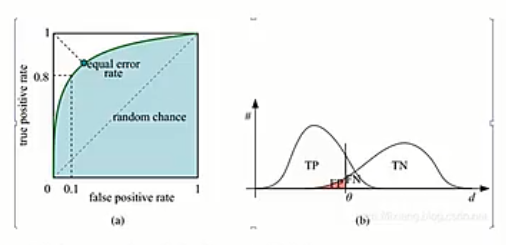 

横轴FPR: 1-TNR, 1-Specificity，FPR越大，预测正类中实际负类越多。

纵轴TPR：Sensitivity(正类覆盖率), TPR越大，预测正类中实际正类越多。

理想目标：TPR=1，FPR=0，即图中(0,1)点，故ROC曲线越靠拢(0,1)点，越偏离45度对角线越好，Sensitivity、Specificity越大效果越好

## 五、新项目如何选择合适算法

总的纲领：  
1. 明确客户需求，检测哪些缺陷类型  
    包括缺陷大小、缺陷位置、缺陷色彩信息、缺陷对比度等信息
2. 明确客户总的时延需求  
    拆解时延包括数据采集时间、数据传输时间、算法运行时间、软件运行时间

### 5.1 视觉系统基础硬件组成

1. 相机(工业相机、监控相机、线扫相机、x光)
2. 镜头
3. 光源  
4. 光源控制器  
5. 主控计算设备(本地计算、边缘计算、云端计算)。

### 5.2 成像硬件选择

举例说明如何选择成像硬件：  

假设待检测物体尺寸`200mm x 200mm`,，保证拍摄的稳定性，拍摄视野在`250mm x 250mm`(预留20%~30%的余量), 基于最小待检测缺陷`0.15mm x 0.15mm`,算法能够稳定检测的最小像素尺寸`3x3`, 每个像素负责`0.15/3=0.05mm`的长度,则图像分辨率在`(250/0.05) x (250/0.05)`=`5000 x 5000`=2500W像素, 也就是我们选择的相机成像尺寸不能低于2500W, 并且搭配合适的镜头, 理论上分辨率越高缺陷面积越明显, 但是需要考虑检测时延问题。  

相机和镜头尺寸确定之后, 选择合适的光源和打光角度使得缺陷明显(需要专业打光工程师配合), 能否稳定检出缺陷三分靠算法七分靠成像。

### 5.3 改善成像质量

**如何改善成像质量？**

① 白平衡矫正  
② 做平场以及平场矫正  
③ 颜色矫正  
通常一二功能工业相机软件会自带此算法，三需要自己开发  

颜色矫正（Color Correction）具体做法：  
1. 采集标准色卡图像：在目标光照条件下，用相机拍摄一张包含已知标准颜色的色卡（如X-Rite ColorChecker Classic），获取图像中每个色块的实际RGB值。  
2. 建立颜色映射模型：将图像中测得的RGB值（或RAW值）与色卡对应的标准参考值（如CIE XYZ或sRGB）进行对比，通过数学方法（如3×3 矩阵变换、多项式回归、查表法LUT等）建立从相机原始颜色到目标颜色空间的转换关系。  
3. 应用校正矩阵/模型：将计算出的颜色校正矩阵（Color Correction Matrix, CCM）或查找表应用于后续图像，使输出颜色更接近真实或符合特定标准。  
4. 优化与验证：通过计算校正后图像的平均色差（如ΔE*ab）评估效果，并根据实际需求微调模型（例如加入伽马校正、白点调整等）。  

> 提示：在工业场景中，若光源和相机固定，可预先标定一次CCM；若环境多变，则需结合白平衡和平场一起动态调整。
  
   

**如何评估成像质量？**  
  
① 色彩还原度的检测：通过拍摄标准色卡（如ColorChecker），对比图像中颜色与标准值的差异，常用ΔE等色差指标衡量。还原度越高，颜色越真实。  
② 图像噪声（成像稳定性）检测：在均匀或暗场条件下采集图像，计算像素值的标准差或信噪比（SNR）。噪声越低，成像越稳定、画质越干净。  
③ 图像清晰度（SFR）：利用边缘或斜边图像计算空间频率响应（SFR）或MTF，反映系统对细节的分辨能力。SFR越高，图像越清晰锐利。  
④ 连续采集稳定性：长时间连续拍摄多帧图像，分析亮度、色彩、噪声等参数的波动情况。稳定性好意味着成像性能一致，适合视频或工业检测等场景。

### 5.4 综合考虑检测缺陷类型

基于前面讲解的内容把缺陷进行归纳分类，合理的量化缺陷类型可以有效提升检测能力，原则上是（类内差异小，类间差异大）

### 5.5 检测速度的要求

影响整体检测速度的条件比较多：

1. 硬件条件：  
    1. 相机采集时间
    2. 数据传输(万兆网、千兆网、光纤、无线等等)  
    3.  主控硬件：CPU处理器性能、GPU性能、PCIE传输瓶颈(根据经验大部分条件是cpu性能不够导致的数据瓶颈问题)  
2. 算法条件：
    1. 分类>目标检测>分割  
    2. python 部署（pytorch、onnxruntime、tensorrt、openvino）还是c++ 部署（libtorch、onnxruntime、tensorrt、openvino），根据实际需求选择合适的推理框架,选择是否量化加速。  
    3. 满足检测需求条件下，选择轻量化的网络模型(mobilenet、rtmdet等)

### 5.6 pepleline多算法组合

当单一算法不能解决时应该怎么办？pepleline多算法组合

举例说明，假设需要检测电网绝缘子上是否有磕碰缺陷？

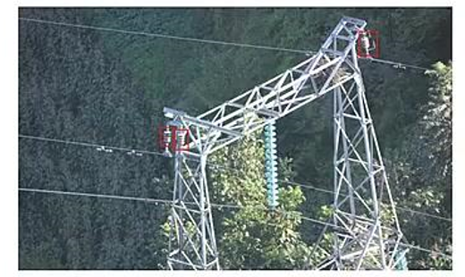

首先选择合适的算法做粗定位，找到绝缘子大概位置，crop 绝缘子图像进行二次判断是否有磕碰缺陷，此列是最简单的pipeline多算法组合。

## 六、算法部署

1. 不同语言的部署  
    - python 部署适合快速开发，客户对时间性能要求不高的条件  
    - c++ 部署适合要求稳定且检测时间性能比较高的条件。  
    - c++ 调用python 部署(某些算子不支持c++调用)  
    - python 调用c++部署，算法比较耗时使用c++，其他使用python  
    现在很多算法也支持C#部署调用  
2. 不同框架部署  
    - pytorch 原始框架部署最方便快速
    - onnxruntime 是通用的部署框架，可以把pytorch、TensorFlow、Caffe 等模型转换成onnx 调用(性能方面一般)
    - tensorrt 可以使用在客户对检测延迟比较低并且吞吐量比较大的场景，使用gpu加速推理，在模型量化之后一般速度可以提升5倍以上（相对于pytorch）
    - openvino可以使用在客户没有显卡（有英特尔cpu），但是又要求检测速度比较快的条件下  
3. 不同硬件部署
    - GPU端：tensorrt>onnxruntime≈pytorch
    - CPU端：openvino（英特尔cpu）>onnxruntime≈pytorch
    - 嵌入式：
        - nvidia: tensorrt
        - 手机（arm）: ncnn
        - 海思：NNIE
        - 高通：snpe、QNN
        - 苹果：coreml
        - 瑞芯微：rknntoolkit2
        - Xilinx：Vitis

## 七、总结

本文梳理了一位经验丰富的算法工程师对工业视觉缺陷检测项目的系统性总结。从实际项目出发，梳理了缺陷检测的典型应用场景（如半导体、3C电子、新能源等）、核心难点（比如没缺陷数据、缺陷太小、对比度差、大图高精度低延迟等），并针对不同问题给出了数据和算法层面的解决方案。

文章还详细对比了分类、检测、分割、小样本学习、异常检测等各类算法的适用场景，并强调“能用分类不用检测，能用检测不用分割”的实用原则。

最后，还覆盖了硬件选型、成像质量优化、评估指标和部署策略，特别提醒“三分靠算法，七分靠成像”。整体非常接地气，适合工业AI项目落地参考。

